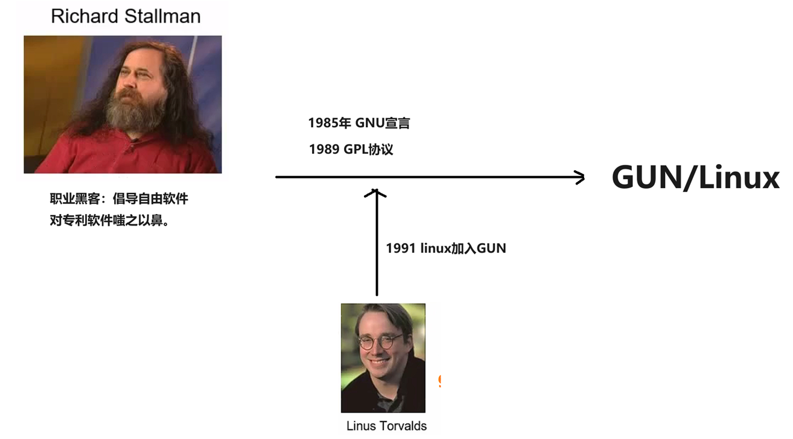
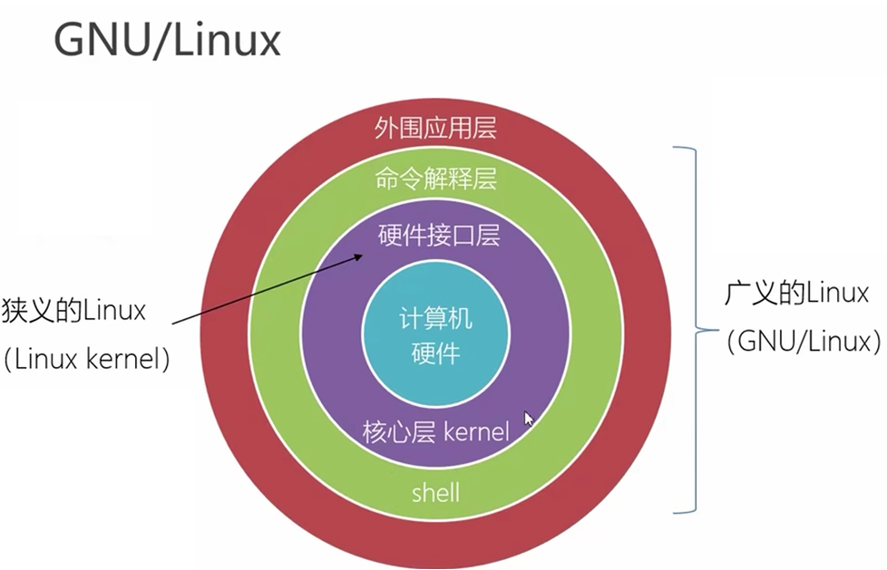

### **1. GNU 的起源与核心理念**

- **全称**：**G**NU's **N**ot **U**nix（递归缩写，强调其与Unix的兼容性但非Unix）。
- **发起人**：**Richard Stallman**（RMS）于1983年宣布启动，1984年正式开发。
- **目标**：  
  创建一个完全**自由**（而非“免费”）的类Unix操作系统，使用户可以自由使用、修改和分发软件。
- **自由软件四大自由**（GNU宣言）：  
  1. 自由运行程序。  
  2. 自由研究和修改源代码。  
  3. 自由分发副本。  
  4. 自由分发修改后的版本。

---

### **2. GNU 项目的关键组件**
#### **2.1 操作系统工具链**
- **GNU Compiler Collection (GCC)**：  
  支持多语言的编译器（C/C++/Fortran等），成为开源世界的编译标准。
- **GNU C Library (glibc)**：  
  C语言标准库，为Linux和其他系统提供核心API。
- **Bash Shell**：  
  Unix shell的增强版，现为Linux默认命令行解释器。
- **Coreutils**：  
  基础工具集（如`ls`, `cp`, `cat`），替代Unix的专有实现。

#### **2.2 编辑器与开发工具**
- **GNU Emacs**：  
  可扩展的文本编辑器，支持编程、邮件、文档撰写等多种功能。
- **GNU Debugger (GDB)**：  
  强大的代码调试工具。

#### **2.3 未完成的核心：Hurd 内核**
- **目标**：开发一个基于微内核架构的替代Unix内核。  
- **现状**：开发缓慢，未成为主流，导致GNU系统依赖Linux内核。

---

### **3. GNU 与 Linux 的关系**
- **互补性**：  
  - **GNU** 提供了操作系统的工具链（编译器、库、Shell等）。  
  - **Linux** 由 Linus Torvalds 开发，提供了内核功能。  
- **GNU/Linux 系统**：  
  两者结合形成完整的操作系统，但通常被简称为“Linux”。Stallman 强调应称其为 **GNU/Linux** 以承认GNU的贡献。

---

### **4. GNU 的许可证：GPL**
- **GNU通用公共许可证（GPL）**：  
  - **核心原则**：确保软件及其衍生作品始终保持自由。  
  - **“传染性”**：基于GPL代码的修改版本必须同样开源。  
- **影响**：  
  GPL推动了开源运动，成为Linux、WordPress等项目的基石。

---

### **5. GNU 的生态影响**
#### **5.1 自由软件运动**
- **自由软件基金会（FSF）**：  
  由 Stallman 创立，维护GNU项目并推广自由软件理念。
- **与开源的区别**：  
  - **自由软件**：强调用户权利（哲学导向）。  
  - **开源软件**：侧重协作开发模式（技术导向）。

#### **5.2 现代开源技术的基石**
- **工具链的普及**：  
  GCC、glibc、Bash等工具被几乎所有Linux发行版和嵌入式系统使用。
- **文化影响**：  
  GNU项目证明了社区协作开发复杂系统的可行性，激励了Apache、Mozilla等后续项目。

---

### **6. GNU 的现状**
- **工具链的统治地位**：  
  GNU组件仍是Linux生态的核心（如90%的Linux命令来自GNU Coreutils）。  
- **Hurd内核的困境**：  
  开发进展有限，主要作为学术研究项目存在。  
- **持续维护**：  
  GNU工具仍在积极更新，例如2023年发布的GCC 13支持新语言特性。

---

### 
- **GNU 的遗产**：  
  - 创造了自由软件的法律与技术框架（GPL + 工具链）。  
  - 奠定了现代开源操作系统的基础。  
- **历史意义**：  
  GNU不仅是技术项目，更是一场挑战软件私有化的社会运动，其理念深刻影响了互联网时代的协作创新。

