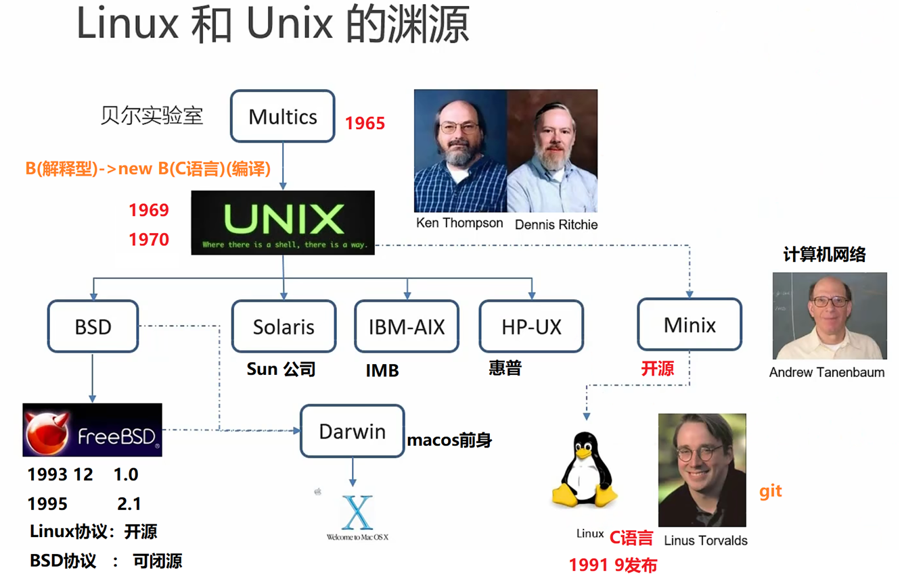

### **1. Multics：分时系统的先驱（1960s）**

- **背景**：  
  20世纪60年代，计算机主要用于批处理任务，无法实现多用户交互。MIT、通用电气（GE）和贝尔实验室（Bell Labs）联合开发了 **Multics**（**Mult**iplexed **I**nformation and **C**omputing **S**ervice），目标是构建一个 **多用户、分时操作** 的系统。
- **特点**：
  - **分时共享**：允许多用户同时访问计算机资源。
  - **虚拟内存**：首次实现内存管理的抽象。
  - **高安全性**：分层权限控制。
- **问题**：
  - 系统过于复杂，开发周期长，硬件需求高。
  - 贝尔实验室因项目进展缓慢于1969年退出。

---

### **2. Unix的诞生（1969-1970s）**

- **从Multics到Unix**：  
  贝尔实验室的 **Ken Thompson** 和 **Dennis Ritchie** 退出Multics后，基于其经验开发了更轻量的系统，最初称为 **Unics**（取“**Un**iplexed **I**nformation and **C**omputing **S**ervice”），后缩写为 **Unix**。
- **关键创新**：
  - **KISS原则**（Keep It Simple, Stupid）：简化设计，强调模块化。
  - **C语言**：Dennis Ritchie开发了C语言，重写Unix内核（1973年），使Unix具备跨平台移植性。
  - **“一切皆文件”**：统一接口管理设备、进程和文件。
- **传播与开源**：
  - 1970年代，AT&T（贝尔实验室母公司）以极低成本向大学提供Unix源码，推动了其在学术界的普及。
  - 加州大学伯克利分校开发了 **BSD Unix**（Berkeley Software Distribution），加入TCP/IP协议栈和虚拟内存改进。

---

### **3. Unix的分裂与商业化（1980s）**

- **商业Unix的崛起**：  
  AT&T开始将Unix商业化，导致版权纠纷。与此同时，BSD衍生出SunOS（Solaris前身）、AIX（IBM）、HP-UX（惠普）等商业版本。
- **GNU项目的诞生**：  
  1983年，Richard Stallman发起 **GNU**（GNU's Not Unix）项目，目标是创建完全自由的类Unix系统。GNU开发了关键工具（如GCC、Glibc、Bash），但缺少核心的 **内核**。
- **Minix：教学用的微型Unix**：  
  1987年，Andrew Tanenbaum开发了 **Minix**，用于操作系统教学。其源码公开但不允许修改，激发了后续开源社区的创新。

---

### **4. Linux的诞生（1991）**

- **Linus Torvalds的灵感**：  
  芬兰学生 **Linus Torvalds** 在使用Minix时，对其功能限制不满，决定开发一个自由的内核。1991年，他在Usenet上宣布了 **Linux** 项目（最初称为“Freax”）。
- **关键特点**：
  - **开源协作**：通过互联网吸引全球开发者贡献代码。
  - **兼容POSIX标准**：确保与Unix工具链兼容。
  - **模块化设计**：支持动态加载内核模块。
- **GNU/Linux系统**：  
  Linux内核与GNU工具链结合，形成完整的操作系统（严格应称为 **GNU/Linux**）。自由软件基金会（FSF）的GPL协议保障了其开源性。

---

### **5. Linux的崛起与开源革命（1990s-2000s）**

- **发行版的繁荣**：  
  - 1993年：Debian发布，强调社区驱动。
  - 1994年：Red Hat诞生，推动企业级应用。
  - 1996年：Slackware成为最早的流行发行版之一。
- **服务器领域的统治**：  
  Linux凭借稳定性、低成本和开源生态，逐步取代商业Unix，成为服务器和超级计算机的主流系统（如90%的云计算服务器运行Linux）。
- **桌面与移动端的渗透**：  
  - **Android**：基于Linux内核的移动操作系统（2008年发布），占据全球80%智能手机市场。
  - **Ubuntu**（2004年）：推动Linux桌面普及。

---

### **6. 技术理念的传承**

- **从Multics到Linux的哲学演变**：

  | 特性              | Multics               | Unix/Linux            |
  |-------------------|-----------------------|-----------------------|
  | **设计目标**      | 功能全面、高度集成    | 简洁、模块化          |
  | **复杂性**        | 庞大而复杂            | 轻量灵活              |
  | **开发模式**      | 封闭、商业主导        | 开源、社区协作        |
  | **硬件需求**      | 需要大型机            | 适配从嵌入式到超级计算机 |

- **核心遗产**：
  - **分时与多用户**：现代操作系统的基石。
  - **文件系统抽象**：一切皆文件的理念延续至今。
  - **开源文化**：Linux的成功证明了协作开发的力量。

---

