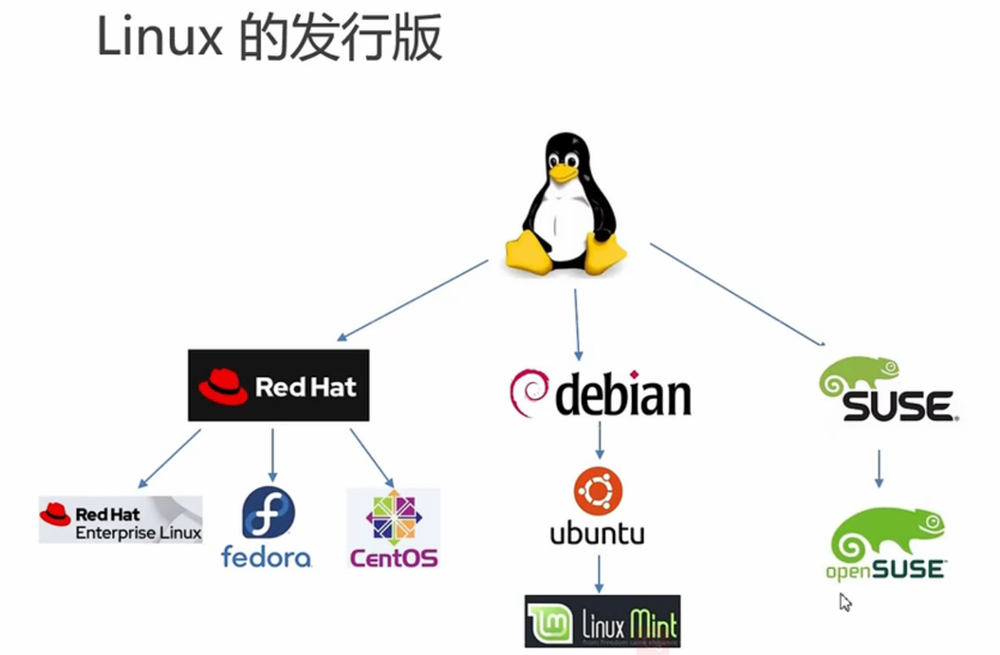

 

                      

 Linux发行版（Distribution，简称Distro）是基于Linux内核的操作系统套件，通常包含内核、软件包管理系统、桌面环境、应用软件及社区支持。不同发行版针对不同用户需求设计，以下是主要分类和常见发行版介绍：

---

### **一、主流发行版分类**
1. **Debian系**
   - **Debian**：以稳定性和自由软件理念著称，适合服务器和高级用户。
   - **Ubuntu**：基于Debian，用户友好，适合新手，提供LTS（长期支持）版本。
   - **Linux Mint**：基于Ubuntu，强调易用性和传统桌面体验。
   - **Pop!_OS**：针对开发者优化，集成硬件支持（System76开发）。

2. **Red Hat系**
   - **RHEL（Red Hat Enterprise Linux）**：企业级付费系统，以稳定性优先。
   - **Fedora**：前沿技术试验场，适合开发者和技术爱好者。
   - **CentOS**：曾是RHEL的免费克隆，现转向CentOS Stream（滚动更新）。
   - **AlmaLinux/Rocky Linux**：替代CentOS的社区驱动RHEL克隆。

3. **Arch系**
   - **Arch Linux**：极简主义，滚动更新，适合自定义需求高的用户。
   - **Manjaro**：基于Arch，提供更友好的安装和预配置环境。
   - **EndeavourOS**：简化Arch安装流程，保留Arch的核心特性。

4. **独立发行版**
   - **openSUSE**：提供稳定版（Leap）和滚动版（Tumbleweed），适合企业和桌面用户。
   - **Gentoo**：源码编译安装，高度优化，适合极客。
   - **Slackware**：历史最悠久的发行版之一，以简洁和稳定著称。

5. **轻量级/专用发行版**
   - **Alpine Linux**：面向容器和嵌入式系统，体积小巧。
   - **Kali Linux**：渗透测试专用，预装安全工具。
   - **CoreOS/Flatcar**：为容器化云环境设计，自动更新。

---

### **二、如何选择发行版？**
1. **用户类型**
   - **新手**：Ubuntu、Linux Mint、Manjaro（图形化工具丰富）。
   - **开发者**：Fedora（支持新技术）、Debian（稳定）、Arch（自定义灵活）。
   - **企业/服务器**：RHEL、Ubuntu Server、AlmaLinux。

2. **硬件需求**
   - **老旧设备**：Lubuntu（LXQt桌面）、Xubuntu（XFCE）、Puppy Linux。
   - **高性能设备**：Fedora Workstation、openSUSE Tumbleweed。

3. **使用场景**
   - **桌面日常使用**：Ubuntu、Pop!_OS、Zorin OS。
   - **隐私安全**：Tails（匿名操作系统）、Qubes OS（隔离安全）。
   - **服务器/云**：CentOS Stream、Debian、Ubuntu Server。

4. **更新策略**
   - **滚动更新**（最新软件）：Arch、openSUSE Tumbleweed。
   - **固定版本**（长期稳定）：Ubuntu LTS、Debian Stable。

---

### **三、核心组件差异**
1. **软件包管理**
   - **APT**：Debian/Ubuntu（`.deb`包）。
   - **DNF/YUM**：Fedora/RHEL系（`.rpm`包）。
   - **Pacman**：Arch系（`PKGBUILD`脚本）。
   - **zypper**：openSUSE（RPM包）。

2. **默认桌面环境**
   - **GNOME**：Ubuntu、Fedora。
   - **KDE Plasma**：Kubuntu、KDE Neon。
   - **XFCE/LXQt**：轻量级选择（Xubuntu、Lubuntu）。

---

### **四、学习与资源**
- **文档支持**：Arch Wiki（全面）、Ubuntu官方文档（新手友好）。
- **社区**：论坛（如Reddit的r/linux）、Stack Exchange。
- **工具**：虚拟机（VirtualBox）或Live USB试用，无需安装即可体验。

---

