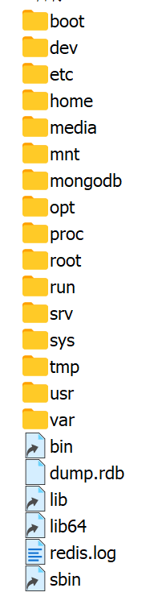

标准 Linux 文件系统结构（遵循 **Filesystem Hierarchy Standard, FHS**）的详细说明：

---



### **标准 Linux 文件系统结构**

```sh
/
├── bin/          # 基础用户命令（所有用户可用）
├── boot/         # 启动文件（内核、引导加载程序如 GRUB）
├── dev/          # 设备文件（如 /dev/sda 表示硬盘）
├── etc/          # 系统配置文件（网络、服务、软件配置）
├── home/         # 普通用户的主目录（如 /home/alice）
├── lib/          # 核心共享库（如 C 标准库 glibc）
├── lib64/        # 64 位系统的库文件（某些发行版特有）
├── media/        # 可移动设备挂载点（如 U 盘、光盘）
├── mnt/          # 临时手动挂载点（如临时挂载硬盘分区）
├── opt/          # 第三方大型软件（如 Oracle、MATLAB）
├── proc/         # 虚拟文件系统（实时进程和内核信息）
├── root/         # root 用户的主目录（非 /home/root）
├── run/          # 运行时数据（如服务 PID 文件，重启后清空）
├── sbin/         # 系统管理员命令（需 root 权限，如 fdisk、iptables）
├── srv/          # 服务数据（如 Web 服务器的网站文件）
├── sys/          # 虚拟文件系统（内核设备与驱动配置）
├── tmp/          # 临时文件（所有用户可写，重启后可能清空）
├── usr/          # 用户程序资源（二级层级）
│   ├── bin/      # 用户级命令（如 nano、git）
│   ├── lib/      # 用户级库文件
│   ├── local/    # 本地编译安装的软件（优先级高于系统包）
│   ├── sbin/     # 用户级系统管理命令
│   └── share/    # 共享数据（文档、字体、图标等）
└── var/          # 可变数据（动态生成的文件）
    ├── log/      # 系统日志（如 /var/log/syslog）
    ├── cache/    # 应用程序缓存（如 apt 缓存）
    ├── lib/      # 动态数据（如数据库文件）
    ├── spool/    # 队列数据（如邮件、打印任务）
    └── tmp/      # 临时文件（重启后保留较长时间）
```

---

### **关键目录详解**
1. **`/bin` 和 `/sbin`**  
   - `/bin`：基础命令（如 `ls`, `cp`, `cat`），所有用户可用。  
   - `/sbin`：系统管理命令（如 `fdisk`, `ifconfig`），需 root 权限。

2. **`/usr` 和 `/var`**  
   - `/usr`：用户程序资源，包含**只读数据**（安装后不变）。  
   - `/var`：存储**动态数据**（如日志、缓存、数据库）。

3. **虚拟文件系统**  
   - `/proc`：提供进程、内存、硬件信息的实时接口（如 `/proc/cpuinfo`）。  
   - `/sys`：管理内核参数和设备驱动（如调整 CPU 频率）。

4. **特殊目录**  
   - `/opt`：独立第三方软件（避免与系统包冲突）。  
   - `/srv`：服务数据（如 Web 服务器的 `/srv/http`）。  
   - `/tmp` 和 `/var/tmp`：前者重启可能清空，后者保留更久。

---

### **为什么需要标准结构？**
- **兼容性**：软件和脚本可以依赖固定路径（如 `/etc` 放配置，`/bin` 放命令）。  
- **可维护性**：管理员快速定位文件（如日志在 `/var/log`，库在 `/lib`）。  
- **安全性**：权限隔离（如 `/home` 用户私有，`/sbin` 需 root 权限）。

---

### **不同发行版的差异**
虽然大多数发行版遵循 FHS，但某些细节可能不同：
- **软件包路径**：  
  - Debian/Ubuntu：第三方软件可能放在 `/usr/local`。  
  - Fedora/RHEL：严格区分 `/usr` 和 `/opt`。  
- **配置文件**：  
  - 网络配置可能在 `/etc/network/`（Debian）或 `/etc/sysconfig/network-scripts/`（RHEL）。

---

### **学习建议**
1. **查看实际结构**：  
   
   ```bash
   tree -L 2 /  # 显示根目录下两层的结构（需安装 tree 命令）
   ```
2. **查阅文档**：  
   
   - 运行 `man hier` 查看目录结构的官方说明。  
   - 阅读 [Filesystem Hierarchy Standard](https://refspecs.linuxfoundation.org/FHS_3.0/fhs-3.0.html)。  
3. **动手实践**：  
   - 创建临时目录（如 `/mnt/test`），挂载设备或文件系统。  
   - 分析日志文件（如 `/var/log/syslog`）。

