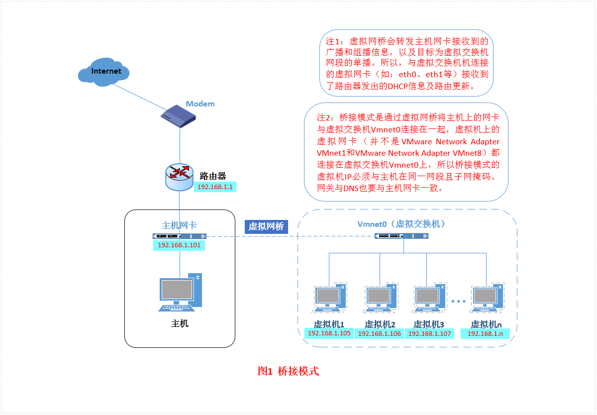
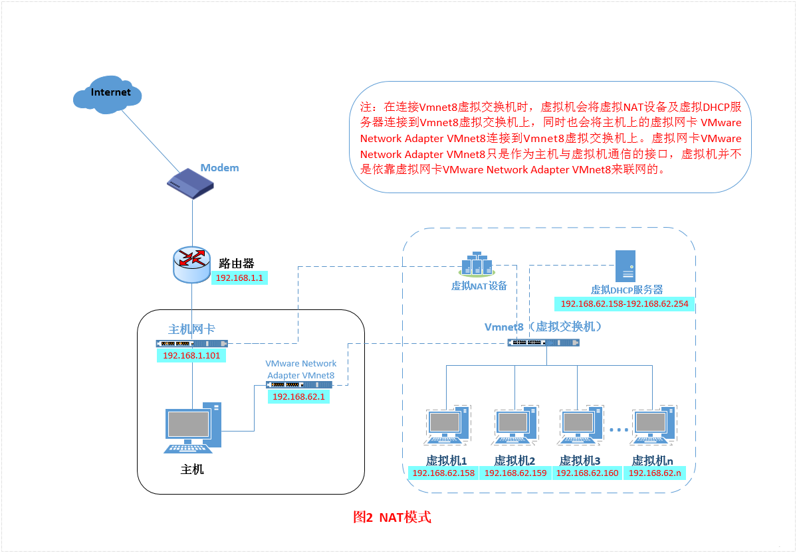
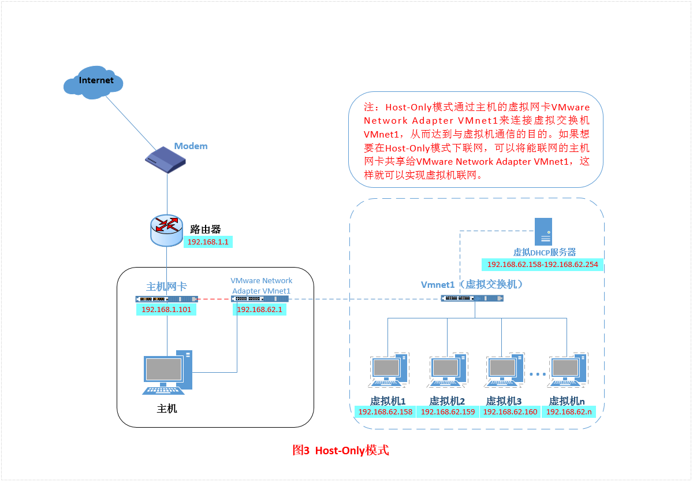

wmware的三种网络模式
<!-- more -->

## Bridged（桥接模式）

- 什么是桥接模式？桥接模式就是将主机网卡与虚拟机虚拟的网卡利用虚拟网桥进行通信。在桥接的作用下，类似于把物理主机虚拟为一个交换机，所有桥接设置的虚拟机连接到这个交换机的一个接口上，物理主机也同样插在这个交换机当中，所以所有桥接下的网卡与网卡都是交换模式的，相互可以访问而不干扰。

- 在桥接模式下，虚拟机ip地址需要与主机在同一个网段，如果需要联网，**网关与DNS需要与主机网卡一致**。
  

#### **特点**

- **直接连接物理网络**：虚拟机通过宿主机的物理网卡直接连接到外部网络，如同局域网中的独立设备。
- **独立 IP**：虚拟机与宿主机共享同一子网，拥有独立的 IP 地址。
- **双向通信**：虚拟机可与局域网内的其他设备、外部互联网直接通信。

#### **使用场景**

- **对外提供服务**：如运行 Web 服务器或 FTP 服务，需被局域网或外部访问。
- **多设备协作测试**：需要虚拟机与其他物理设备（如手机、其他电脑）直接交互。
- **真实网络环境模拟**：测试网络配置（如防火墙、路由规则）对实际网络的影响。

#### **注意事项**

- 需要确保物理网络有足够的 IP 地址分配。
- 可能存在 IP 冲突风险。

## NAT（地址转换模式）

刚刚我们说到，如果你的网络ip资源紧缺，但是你又希望你的虚拟机能够联网，这时候NAT模式是最好的选择。NAT模式借助虚拟NAT设备和虚拟DHCP服务器，使得虚拟机可以联网。
**特点**：

- **共享宿主机 IP**：虚拟机通过宿主机的 NAT 服务访问外部网络，外部无法直接访问虚拟机。
- **内部子网**：虚拟机位于宿主机创建的私有子网中（如 `192.168.x.x`）。
- **端口转发**：可通过配置将宿主机端口映射到虚拟机端口（如将宿主机的 80 端口转发到虚拟机的 80 端口）。

#### **使用场景**

- **开发测试环境**：虚拟机需要访问互联网（如下载软件、更新系统），但无需对外暴露服务。
- **节省 IP 资源**：适用于 IP 地址有限的网络环境。
- **新手友好**：无需手动配置网络，适合快速搭建隔离的开发环境。

#### **注意事项**

- 默认外部无法直接访问虚拟机，需手动配置端口转发。
- 虚拟机之间可通过私有网络通信。

## Host-Only（仅主机模式）

Host-Only模式其实就是NAT模式去除了虚拟NAT设备，然后使用VMware Network Adapter VMnet1虚拟网卡连接VMnet1虚拟交换机来与虚拟机通信的，Host-Only模式将虚拟机与外网隔开，使得虚拟机成为一个独立的系统，只与主机相互通讯。其网络结构如下图所示：

通过上图，我们可以发现，如果要使得虚拟机能联网，我们可以将主机网卡共享给VMware Network Adapter VMnet1网卡，从而达到虚拟机联网的目的

#### **特点**

- **完全隔离**：虚拟机仅能与宿主机通信，无法连接外部网络。
- **私有网络**：宿主机与虚拟机组成独立局域网，其他物理设备无法访问该网络。

#### **使用场景**

- **封闭测试环境**：安全测试（如病毒分析）、敏感实验（避免影响外部网络）。
- **内部网络调试**：测试宿主机与虚拟机间的通信（如 SSH、数据库连接）。
- **无外网需求场景**：验证软件在纯内网环境中的运行情况。

#### **注意事项**

- 虚拟机无法访问互联网，需通过宿主机共享文件或代理。

------

## 自定义模式（Custom）

#### **特点**

- **灵活配置**：可创建自定义虚拟网络（如 VLAN），支持复杂拓扑（如多网卡绑定、子网划分）。
- **高级功能**：支持流量监控、防火墙规则等。

#### **使用场景**

- **复杂网络架构模拟**：如多层应用（Web 服务器 + 数据库 + 负载均衡器）。
- **网络安全研究**：测试网络隔离、入侵检测系统（IDS）等。

------

## 团队模式（Team）（仅限 VMware Workstation）

#### **特点**

- **多虚拟机组网**：将多个虚拟机组成一个逻辑网络，可模拟交换机、路由器等设备。
- **隔离环境**：团队内的虚拟机可互相通信，但与外部隔离。

#### **使用场景**

- **分布式系统测试**：如 Hadoop 集群、微服务架构。
- **网络拓扑实验**：模拟企业级网络（如 DMZ、内网、外网分段）。

------

### **选择建议**

- **需要对外提供服务** → **桥接模式**。
- **仅需上网且简化配置** → **NAT 模式**。
- **完全隔离测试** → **仅主机模式**。
- **复杂网络实验** → **自定义或团队模式**。

------

### **注意事项**

1. VMware Workstation 与 ESXi 的配置方式略有差异（如 ESXi 使用“虚拟交换机”概念）。
2. 部分模式（如 NAT）依赖 VMware 的虚拟网络服务（如 `VMware NAT Service`），需确保服务已启动。
3. 安全场景中，优先使用隔离性更强的模式（如仅主机模式）。

通过合理选择网络模式，可以在虚拟化环境中高效模拟生产环境、保障安全性并优化资源分
