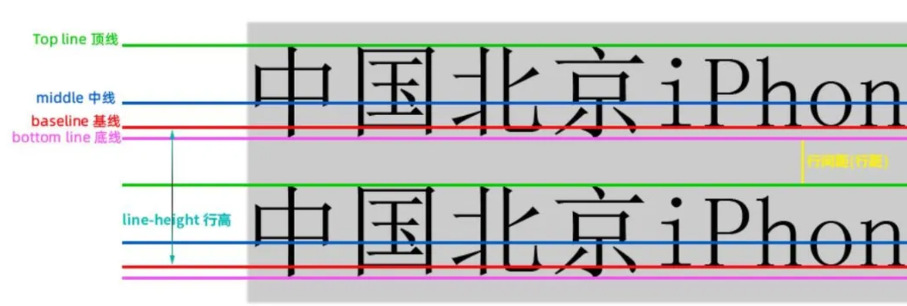
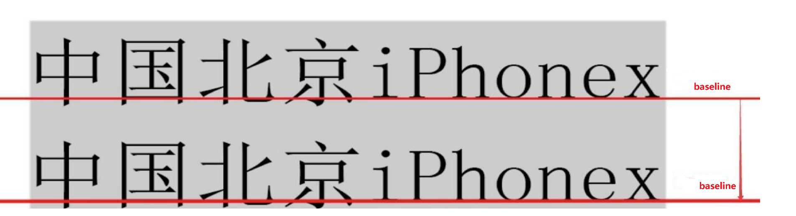
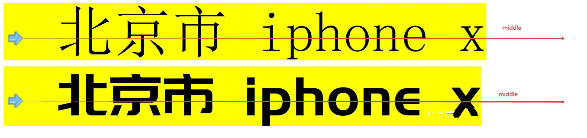

行高详解
<!-- more -->

[出处](https://zhuanlan.zhihu.com/p/352965852)

## 行高-line-Height

概念: 行高指的是文本行的`基线baseline`之间的距离, 更简单来说行高是指文本行基线间的垂直距离, 行高也是文字大小与行距的和, 行高越大则**行间距**越大!

**注意**：line-height属性不允许使用负值。

**前提知识**：顶线、中线、基线、底线、x-height、ex、内联盒模型、行距等..

## 基线-baseline

就是小写x字母的下边缘(线) 就是我们常说的 **基线** 而不是那些有尾巴的英文字母, 例如: s 、j、g、k、f、y。所以一定要注意: 基线（baseline）不是汉字文字的下底部，而是英文小写字母“x”的下底部!`内联元素`默认按照基线对齐的，即内联元素的文字都是放在基线上的。

`line-height`就是两行文字的基线之间的距离。

## 顶线-topline和底线-bottomline

分别是**中文汉字**的顶部和底部的位置。

## 中线-middleline

css当中小写x字母不仅有确定了**基线**(baseline)的位置,还有描述了**中线(等分线)**(middle)的作用， css中有一个概念叫**x-height**,意思也就是小写字母x的高度!

在css中，有些属性值的定义就和这个x-height有关, 最经典最有代表性的就是vertical-align的属性值middle 这里的middle就是中间的意思 指的其实就是**基线** 往上1/2的位置 也就是小写x字母的中间交叉点那个位置！也就是middle的位置!即中线就是横过小写英文字母x的中间的线!

### 问题：middle

vertical-align: middle 并**不是绝对的垂直居中于文字对齐**。middle也只是一种近似接近于居中的效果! 因为不同的字体在行元素中的中线的位置是不一样的 !

### 解决：ex

所以要让一个小图标来对齐一行文字,还有一个更加简便的做法 那么就是使用ex单位来解决!

**ex** 在css中的定义是一个尺寸单位, 官方的解释是: 一个 ex 是一个字体的 [x-height](https://zhida.zhihu.com/search?content_id=166567087&content_type=Article&match_order=5&q=x-height&zhida_source=entity)。其实就是你设定的字体中产生的x的大小

**ex 就是css中的一个相对单位, 相对的是字体大小和字体样式而改变的一个单位!** 指的就是小写字母x的高度 其实就是x-height

也就是说把内联元素的高度尺寸单位设置为ex 那么就不会受到 字体样式和字号的影响! 从该内联元素相对字体样式和字号进行变化!

1ex 就是一个x的高度这句话如何理解: 就是在不同字体和字号情况下x的高度!
