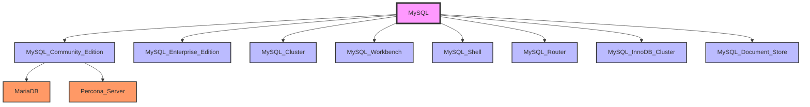

MySQL 是一个广泛使用的关系型数据库管理系统（RDBMS），它由多个版本和分支组成。以下是 MySQL 的主要版本和分支的概述：

### 1. **MySQL Community Edition**
   - **描述**: 这是 MySQL 的免费开源版本，适用于大多数用户。它由 Oracle 公司维护，并遵循 GPL（GNU General Public License）许可证。
   - **特点**: 提供基本功能，支持大多数常见的数据库操作，适合中小型项目和个人开发者。
   - **版本**: 最新稳定版本通常是推荐使用的版本，例如 MySQL 8.0.x。

### 2. **MySQL Enterprise Edition**
   - **描述**: 这是 MySQL 的商业版本，提供了额外的企业级功能和支持服务。适用于需要高级功能和技术支持的企业用户。
   - **特点**: 包括高级监控、备份、安全性和性能优化工具，以及 Oracle 提供的专业技术支持。
   - **版本**: 与 Community Edition 同步更新，但包含额外的企业功能。

### 3. **MySQL Cluster**
   - **描述**: 这是一个高可用性、实时的事务处理数据库系统，基于 MySQL 技术构建。它支持分布式架构，适合需要高可用性和可扩展性的应用。
   - **特点**: 提供自动分片、数据复制、故障转移等功能，适合电信、金融等行业的应用。
   - **版本**: 通常与 MySQL Community Edition 和 Enterprise Edition 同步更新。

### 4. **MariaDB**
   - **描述**: MariaDB 是 MySQL 的一个分支，由 MySQL 的原始开发者 Michael Widenius 创建。它旨在保持与 MySQL 的兼容性，同时提供额外的功能和改进。
   - **特点**: 包括更多的存储引擎、性能优化、以及更好的开源社区支持。MariaDB 被认为是 MySQL 的替代品，尤其在某些开源社区中更受欢迎。
   - **版本**: MariaDB 10.x 系列是最新的稳定版本。

### 5. **Percona Server**
   - **描述**: Percona Server 是 MySQL 的另一个分支，由 Percona 公司开发和维护。它专注于性能优化和高可用性。
   - **特点**: 提供了 XtraDB 存储引擎（基于 InnoDB）、性能监控工具（如 Percona Monitoring and Management）等。
   - **版本**: Percona Server 通常与 MySQL 的版本同步更新，例如 Percona Server 8.0.x。

### 6. **MySQL Workbench**
   - **描述**: MySQL Workbench 是一个集成的开发环境，用于 MySQL 数据库的设计、开发和管理。
   - **特点**: 提供数据库建模、SQL 开发、数据库管理、数据迁移等功能，适合数据库管理员和开发人员使用。
   - **版本**: MySQL Workbench 通常与 MySQL Community Edition 和 Enterprise Edition 同步更新。

### 7. **MySQL Shell**
   - **描述**: MySQL Shell 是一个高级的客户端和代码编辑器，支持 MySQL 和 MySQL 文档存储。
   - **特点**: 支持 SQL、JavaScript 和 Python 脚本，提供交互式命令行界面，适合开发和自动化任务。
   - **版本**: MySQL Shell 通常与 MySQL 的版本同步更新。

### 8. **MySQL Router**
   - **描述**: MySQL Router 是一个轻量级的中间件，用于将应用程序连接到 MySQL 服务器集群。
   - **特点**: 提供负载均衡、故障转移和连接路由功能，适合高可用性和可扩展性的应用场景。
   - **版本**: MySQL Router 通常与 MySQL 的版本同步更新。

### 9. **MySQL InnoDB Cluster**
   - **描述**: MySQL InnoDB Cluster 是一个高可用性解决方案，基于 MySQL Group Replication 技术。
   - **特点**: 提供自动故障转移、数据一致性、以及易于管理的集群功能，适合需要高可用性的应用。
   - **版本**: MySQL InnoDB Cluster 通常与 MySQL 的版本同步更新。

### 10. **MySQL Document Store**
   - **描述**: MySQL Document Store 是一个 NoSQL 风格的文档存储解决方案，基于 MySQL 的 JSON 数据类型和 X DevAPI。
   - **特点**: 支持文档存储和查询，适合需要灵活数据模型的应用程序。
   - **版本**: MySQL Document Store 通常与 MySQL 的版本同步更新。

### 总结
MySQL 的版本和分支各有其特点和适用场景。对于大多数用户来说，MySQL Community Edition 已经足够使用，而企业用户可能需要考虑 MySQL Enterprise Edition。对于需要特定功能或更好社区支持的用户，MariaDB 和 Percona Server 是不错的选择。对于高可用性和可扩展性需求，MySQL Cluster 和 MySQL InnoDB Cluster 提供了强大的解决方案。
