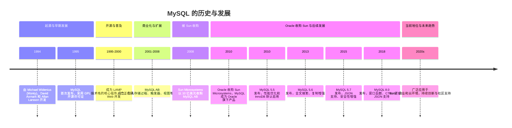

MySQL 是一款广泛使用的关系型数据库管理系统（RDBMS），其历史与发展可以追溯到 20 世纪 90 年代。以下是 MySQL 的主要历史与发展阶段：

---

### 1. **起源与早期发展（1994-1995）**
   - **创始人**：MySQL 由瑞典公司 MySQL AB 的 Michael Widenius（Monty）、David Axmark 和 Allan Larsson 开发。
   - **命名**：MySQL 的名字来源于 Michael Widenius 的女儿 "My" 和 SQL（结构化查询语言）。
   - **目标**：开发一款轻量级、高性能且开源的数据库系统，用于替代当时昂贵且复杂的商业数据库。

---

### 2. **开源与普及（1995-2000）**
   - **1995 年**：MySQL 首次发布，并采用 GNU 通用公共许可证（GPL）开源。
   - **特点**：MySQL 以其简单易用、高性能和低成本迅速吸引了大量用户，尤其是在 Web 应用开发领域。
   - **社区支持**：开源模式吸引了全球开发者参与，形成了活跃的社区。

---

### 3. **商业化与扩展（2001-2008）**
   - **MySQL AB 成立**：公司专注于 MySQL 的开发、支持和商业化。
   - **功能增强**：引入了存储过程、触发器、视图等高级功能，提升了 MySQL 的企业级能力。
   - **广泛应用**：MySQL 成为 LAMP（Linux、Apache、MySQL、PHP/Perl/Python）技术栈的核心组件，广泛应用于 Web 开发。

---

### 4. **被 Sun 收购（2008）**
   - **2008 年**：Sun Microsystems 以 10 亿美元收购 MySQL AB。
   - **目标**：Sun 希望通过 MySQL 增强其在数据库市场的竞争力，并推动开源软件的发展。
   - **争议**：收购引发了关于 MySQL 未来开源性质的担忧，尤其是其与 Oracle 的竞争关系。

---

### 5. **Oracle 收购 Sun 与后续发展（2010 至今）**
   - **2010 年**：Oracle 收购 Sun Microsystems，MySQL 成为 Oracle 旗下的产品。
   - **担忧与信任**：社区担心 Oracle 会削弱 MySQL 的开源性质，但 Oracle 持续投入资源开发 MySQL，推出了多个重要版本。
   - **版本更新**：
     - MySQL 5.5（2010）：性能优化和 InnoDB 存储引擎的默认启用。
     - MySQL 5.6（2013）：全文搜索、性能改进和复制增强。
     - MySQL 5.7（2015）：JSON 支持、性能优化和安全性增强。
     - MySQL 8.0（2018）：窗口函数、通用表表达式（CTE）、更好的 JSON 支持和性能提升。
   - **分支与衍生品**：由于对 Oracle 的担忧，出现了多个 MySQL 分支，如 MariaDB（由 MySQL 创始人 Monty 开发）、Percona Server 等。

---

### 6. **当前地位与未来趋势**
   - **广泛应用**：MySQL 是全球最流行的开源数据库之一，广泛应用于 Web 应用、企业系统和云计算环境。
   - **云集成**：MySQL 与 AWS、Azure、Google Cloud 等云平台深度集成，成为云数据库服务的重要组成部分。
   - **持续创新**：Oracle 继续推动 MySQL 的发展，专注于性能、安全性和对新技术的支持（如人工智能和机器学习）。
   - **社区与生态**：MySQL 拥有庞大的开发者社区和丰富的生态系统，包括工具、框架和插件。

---

### 总结
MySQL 从一款轻量级开源数据库发展成为全球领先的关系型数据库管理系统，其成功得益于开源模式、高性能、易用性以及广泛的社区支持。尽管经历了多次收购和争议，MySQL 仍然在数据库领域占据重要地位，并继续推动技术创新。
