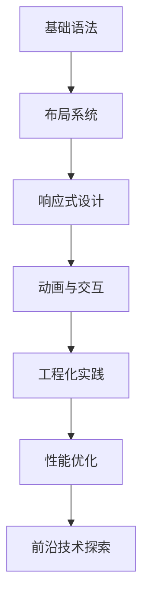

以下是针对2025年前端开发的CSS系统化学习大纲，包含现代特性与实践指南：

---

一、基础核心模块

```markdown
1. 选择器体系
   - 基础选择器：元素/类/ID/通配符 
   - 组合选择器：后代/子代/相邻兄弟 
   - 属性选择器：`[attr^=value]`等新式语法 
   - 伪类选择器：`:is()`, `:where()`, `:has()`
 
2. 盒模型进阶
   - 标准模式 vs 怪异模式 
   - `box-sizing`属性详解 
   - 现代布局模式：`display: flow-root`
 
3. 布局系统
   - 传统布局：浮动 + 清除浮动技巧 
   - 定位体系：static/relative/absolute/fixed/sticky 
   - Flexbox二维布局：容器与项目的属性映射 
   - Grid网格系统：轨道定义与区域命名 
```

---

二、响应式与自适应

```html
<div class="responsive-demo">
  <!-- 媒体查询示例 -->
  <style>
    @media (width >= 768px) and (hover: hover) {
      .card { grid-template-columns: repeat(3, 1fr) }
    }
  </style>
 
  <!-- 容器查询实践 -->
  <div class="card-container">
    @container (min-width: 380px) {
      .card { flex-direction: row }
    }
  </div>
</div>
```

---

三、视觉增强技术

```markdown
1. 过渡与动画
   - `@keyframes`规则与动画性能优化 
   - 硬件加速技巧：`will-change`属性 
   - 滚动驱动动画：`scroll-timeline`新特性 
 
2. 现代视觉效果
   - 混合模式：`mix-blend-mode`
   - 滤镜系统：`backdrop-filter`
   - 裁剪与蒙版：`clip-path`/`mask-image`
 
3. CSS变量体系
   - 全局变量与组件级变量 
   - 动态变量与JS交互 
   - 主题切换实现方案 
```

---

四、工程化实践

```markdown
| 技术栈       | 工具推荐                | 应用场景              |
|-------------|-----------------------|---------------------|
| 预处理器 | Sass + Dart Sass      | 变量/嵌套/mixin      |
| 后处理器 | PostCSS + Autoprefixer| 自动添加厂商前缀      |
| CSS框架  | Tailwind CSS 4.0      | 原子化开发模式        |
| CSS-in-JS| Emotion 12            | React组件样式管理    |
```

---

五、性能优化专项

```markdown
1. 关键渲染路径优化
   - 首屏CSS内联策略 
   - 非关键CSS异步加载 
 
2. 渲染性能指标
   - 减少布局抖动(Layout Thrashing)
   - 复合层优化技巧 
 
3. 现代加载策略
   - 字体加载优化：`font-display`属性 
   - 图片懒加载：`loading="lazy"`与CSS交集观察器 
```

---

六、学习路线图



推荐学习资源：

- MDN Web Docs：CSS最新规范文档
- CSSWG官方草案：了解正在制定的新特性
- Frontend Masters：2025年度CSS专项课程
- CodePen挑战赛：参与现代CSS创作实践

建议配合现代构建工具(Vite 5+、Webpack 6+)进行项目实践，重点掌握CSS模块化与设计系统构建能力。
