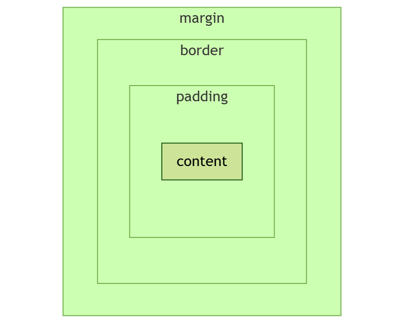

 

**盒子模型（Box Model）** 是 CSS 布局的核心概念，它定义了元素的内容、内边距、边框和外边距之间的关系。盒子模型由四个部分组成，从内到外依次是：**内容区域（Content）**、**内边距（Padding）**、**边框（Border）** 和 **外边距（Margin）**。以下是每个部分的详细解释：

---

### **1. 内容区域（Content）**
• **定义**：元素的实际内容（如文本、图片等）所在的区域。
• **属性**：
  • `width`：内容区域的宽度。
  • `height`：内容区域的高度。
• **特点**：
  • 默认情况下，`width` 和 `height` 仅包含内容区域（标准模型）。
  • 如果使用 `box-sizing: border-box`，`width` 和 `height` 会包含内容区域、内边距和边框（替代模型）。

---

### **2. 内边距（Padding）**
• **定义**：内容区域与边框之间的空白区域。
• **属性**：
  • `padding-top`：上内边距。
  • `padding-right`：右内边距。
  • `padding-bottom`：下内边距。
  • `padding-left`：左内边距。
  • 简写属性：`padding`。
• **特点**：
  • 内边距是透明的，背景颜色会延伸到内边距区域。
  • 内边距会增加元素的总宽度和高度（标准模型）。

---

### **3. 边框（Border）**
• **定义**：内边距与外边距之间的边框区域。
• **属性**：
  • `border-width`：边框宽度。
  • `border-style`：边框样式（如 `solid`、`dashed`）。
  • `border-color`：边框颜色。
  • 简写属性：`border`。
• **特点**：
  • 边框会占据空间，增加元素的总宽度和高度（标准模型）。
  • 边框的颜色和样式可以自定义。

---

### **4. 外边距（Margin）**
• **定义**：元素与其他元素之间的空白区域。
• **属性**：
  • `margin-top`：上外边距。
  • `margin-right`：右外边距。
  • `margin-bottom`：下外边距。
  • `margin-left`：左外边距。
  • 简写属性：`margin`。
• **特点**：
  • 外边距是透明的，不会影响元素的背景颜色。
  • 外边距不会增加元素的总宽度和高度，但会影响元素的布局和间距。

---

|         部分          |                             作用                             |
| :-------------------: | :----------------------------------------------------------: |
| **外边距（margin）**  |    控制元素与其他元素之间的间距，支持居中和特殊布局效果。    |
|  **边框（border）**   |          定义元素边界，增加装饰效果，影响元素尺寸。          |
| **内边距（padding）** | 控制内容与边框之间的间距，增加元素尺寸，优化点击区域和可读性。 |
