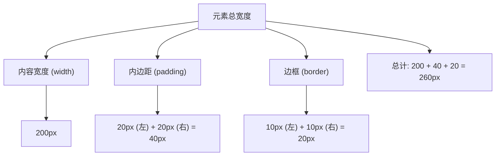
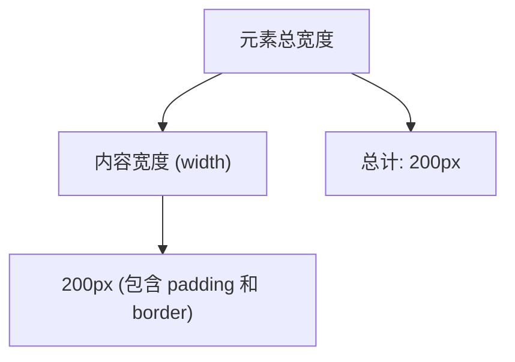

在 CSS 中，**盒模型（Box Model）** 是布局的核心概念，它定义了元素的内容、内边距、边框和外边距之间的关系。**`box-sizing`** 属性用于控制盒模型的计算方式，主要分为两种模型：**标准模型** 和 **替代模型**。

---

### **1. 标准模型（Content Box）**
默认情况下，CSS 使用标准模型（`box-sizing: content-box`）。




#### **特点**
• **宽度和高度**：仅包含内容区域（content），不包括内边距（padding）、边框（border）。
• **计算公式**：
  ```
  元素总宽度 = width + padding-left + padding-right + border-left + border-right
  元素总高度 = height + padding-top + padding-bottom + border-top + border-bottom
  ```

#### **示例**
```css
.box {
  width: 200px;
  height: 100px;
  padding: 20px;
  border: 10px solid black;
  box-sizing: content-box; /* 默认值 */
}
```
• **实际宽度**：`200 + 20*2 + 10*2 = 260px`
• **实际高度**：`100 + 20*2 + 10*2 = 160px`

---

### **2. 替代模型（Border Box）**
替代模型（`box-sizing: border-box`）更直观，常用于布局设计。




#### **特点**
• **宽度和高度**：包含内容区域（content）、内边距（padding）、边框（border）。
• **计算公式**：
  ```
  元素总宽度 = width
  元素总高度 = height
  ```
  • `width` 和 `height` 已经包含了 `padding` 和 `border`。

#### **示例**
```css
.box {
  width: 200px;
  height: 100px;
  padding: 20px;
  border: 10px solid black;
  box-sizing: border-box; /* 使用替代模型 */
}
```
• **实际宽度**：`200px`（包含 `padding` 和 `border`）
• **实际高度**：`100px`（包含 `padding` 和 `border`）

---

### **3. `box-sizing` 属性**
`box-sizing` 用于控制盒模型的计算方式。

#### **语法**
```css
box-sizing: content-box | border-box;
```

#### **取值**
| 值            | 描述                                                         |
| ------------- | ------------------------------------------------------------ |
| `content-box` | 默认值，使用标准模型，`width` 和 `height` 仅包含内容区域。   |
| `border-box`  | 使用替代模型，`width` 和 `height` 包含内容区域、内边距和边框。 |

---

### **4. 使用场景**
#### **4.1 标准模型（`content-box`）**
• **适用场景**：
  • 需要精确控制内容区域大小的场景。
  • 旧版浏览器兼容性要求。
• **缺点**：
  • 计算复杂，容易导致布局错乱。

#### **4.2 替代模型（`border-box`）**
• **适用场景**：
  • 现代网页布局，简化宽度和高度的计算。
  • 需要固定尺寸的布局（如栅格系统）。
• **优点**：
  • 直观易用，减少布局问题。

---

### **5. 全局设置替代模型**
为了方便开发，通常会将 `box-sizing` 设置为 `border-box`，并应用于所有元素。

#### **示例**
```css
*, *::before, *::after {
  box-sizing: border-box;
}
```

---

### **6. 示例对比**
```html
<div class="box content-box">标准模型</div>
<div class="box border-box">替代模型</div>
```

```css
.box {
  width: 200px;
  height: 100px;
  padding: 20px;
  border: 10px solid black;
  margin-bottom: 20px;
}

.content-box {
  box-sizing: content-box;
}

.border-box {
  box-sizing: border-box;
}
```

#### **效果**
• **标准模型**：总宽度为 `260px`，总高度为 `160px`。
• **替代模型**：总宽度为 `200px`，总高度为 `100px`。

---

### **7. 总结**
| 特性          | 标准模型（`content-box`）  | 替代模型（`border-box`）           |
| ------------- | -------------------------- | ---------------------------------- |
| **宽度/高度** | 仅包含内容区域             | 包含内容区域、内边距、边框         |
| **计算公式**  | `width + padding + border` | `width` 包含 `padding` 和 `border` |
| **适用场景**  | 精确控制内容区域           | 现代布局，简化计算                 |
| **推荐使用**  | 不推荐（复杂且易出错）     | 推荐（直观且易用）                 |

通过合理使用 `box-sizing`，可以更轻松地控制元素的尺寸和布局，提升开发效率和代码可维护性！
