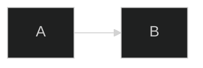
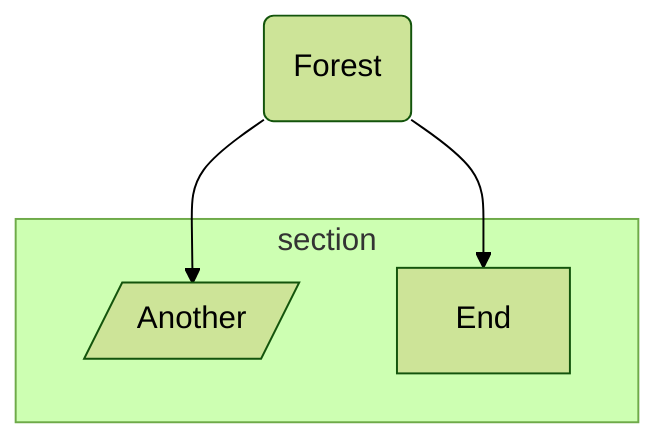
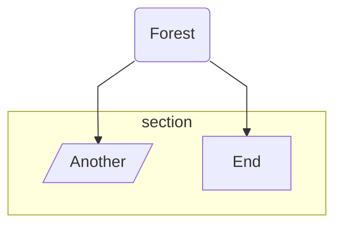
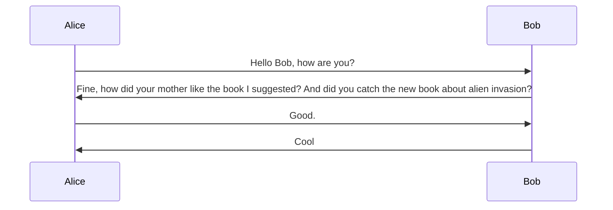
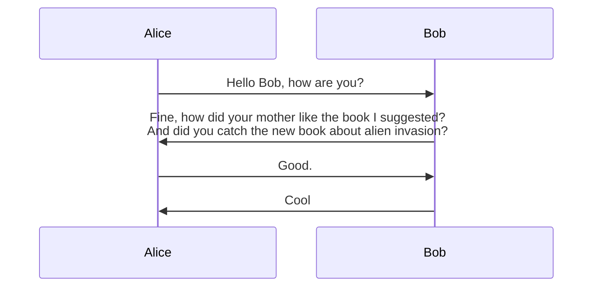

:::warning

从 v10.5.0 开始，指令已弃用。请使用前置内容中的 `config` 键传递配置。此处仅作为config学习的前置了解。

:::

```
%%{init: { "theme": "forest" } }%%
```

yaml fronttr matter格式为：

```yaml
config:
    theme: forest       
```

## 指令

指令使图表作者能够在渲染之前通过更改应用的配置来更改图表的外观。

拥有指令的意义在于，你可以在编写图表时使用它们，并且可以修改默认的全局和特定于图表的配置。因此，指令应用于默认配置之上。指令的美妙之处在于你可以使用它们来更改特定图表的配置设置，即在个人级别。

虽然指令允许你更改大多数默认配置设置，但出于安全原因，有些设置不可用。此外，你还可以选择定义一组你希望允许图表作者使用指令覆盖的配置。

## 指令选项类型

Mermaid 基本上支持两种类型的配置选项以被指令覆盖。

1. 常规/顶层配置：这些是可用并应用于所有图表的配置。一些最重要的顶层配置是：
   - theme
   - fontFamily
   - logLevel
   - securityLevel
   - startOnLoad
   - secure
2. 图特定配置：这些是可用并应用于特定图的配置。对于每个图，都有特定的配置，这些配置将改变特定图的外观和行为。例如，`mirrorActors` 是特定于 `SequenceDiagram` 的配置，可更改参与者是否镜像。因此此配置仅适用于 `SequenceDiagram` 类型。

注意：此处并未列出所有配置选项。要了解所有配置选项，请参阅源代码中的 [defaultConfig.ts](https://github.com/mermaid-js/mermaid/blob/develop/packages/mermaid/src/defaultConfig.ts)。

信息

我们计划很快在文档中发布完整的顶层配置和图表特定配置列表及其可能的值。

## 声明指令

现在我们已经定义了可用的配置类型，我们可以学习如何声明指令。指令始终以 `%%` 符号开始和结束，中间有指令文本，如 `%% {directive_text} %%`。

这里指令文本的结构就像一个嵌套的键值对映射或一个 root 为 init 的 JSON 对象。所有常规配置都在顶层定义，所有图表特定配置都定义为更深一层，图表类型作为该部分的键/根。

以下代码片段显示了指令的结构：

```
%%{
  init: {
    "theme": "dark",
    "fontFamily": "monospace",
    "logLevel": "info",
    "flowchart": {
      "htmlLabels": true,
      "curve": "linear"
    },
    "sequence": {
      "mirrorActors": true
    }
  }
}%%
```

:::details YAML

```yaml
---
title: '聊天'
config:
    theme: dark
    fontFamily: monospace
    logLevel: info
    sequence:
        mirrorActors: true
    ...
---
```

:::

你还可以在一行中定义指令，如下所示：

```
%%{init: { **insert configuration options here** } }%%
```

例如，以下代码片段：

```
%%{init: { "sequence": { "mirrorActors":false }}}%%
```

注意：作为 {argument} 传递的 JSON 对象必须是有效的键值对并用引号引起来，否则将被忽略。有效的键值对可以在 config.json 中找到。

一个简单的图表示例：

:::tabs

@tab 流程图示例



@tab 代码

```
%%{init: { 'logLevel': 'debug', 'theme': 'dark' } }%%
graph LR
    A-->B
```

:::

**关键点**  
- **全局配置**：使用 `%%{init: { 配置项 } }%%` 定义 Mermaid 图的全局配置。  
  - `logLevel: 'debug'`：设置日志级别为 `debug`，便于调试。  
  - `theme: 'dark'`：设置主题为 `dark`，适合深色背景。  
- **节点**：直接使用字母或单词定义节点，如 `A` 和 `B`。  
- **箭头**：使用 `-->` 定义箭头，表示从 `A` 到 `B` 的流向。  

:::details 实例说明  
- **全局配置**：  
  - `logLevel: 'debug'`：启用调试模式，输出更多日志信息。  
  - `theme: 'dark'`：将图的主题设置为深色风格，适合深色背景的页面。  
- **节点**：  
  - `A` 和 `B`：定义两个节点，分别命名为 `A` 和 `B`。  
- **箭头**：  
  - `A-->B`：从节点 `A` 指向节点 `B` 的箭头。  
  :::


这里指令声明将为渲染的 Mermaid 图设置 `logLevel` 到 `debug` 和 `theme` 到 `dark`，从而更改图本身的外观。

::: warning

你可以使用 'init' 或 'initialize'，因为两者都可以作为 init 指令。另请注意，`%%init%%` 和 `%%initialize%%` 指令在解析后将被分组在一起。

:::

```
%%{init: { 'logLevel': 'debug', 'theme': 'forest' } }%%
%%{initialize: { 'logLevel': 'fatal', "theme":'dark', 'startOnLoad': true } }%%
...
```

例如，解析上面的内容会生成下面的单个 `%%init%%` JSON 对象，组合两个指令并保留为 `loglevel` 给出的最后一个值：

```json
{
  "logLevel": "fatal",
  "theme": "dark",
  "startOnLoad": true
}
```

然后这将被发送到 `mermaid.initialize(...)` 进行渲染。

## 指令示例

现在已经解释了指令的概念，让我们看一些指令用法的更多示例：

### 通过指令更改主题

以下代码片段将 `theme` 更改为 `forest`：

```
%%{init: { "theme": "forest" } }%%
```

可能的主题值为：`default`、`base`、`dark`、`forest` 和 `neutral`。默认值为 `default`。

:::tabs

@tab 流程图示例



@tab 代码

```
%%{init: { "theme": "forest" } }%%
graph TD
    A(Forest) --> B[/Another/]
    A --> C[End]
    subgraph section
        B
        C
    end
```

:::

---

:::details 解释

1. **全局配置**  
   - `%%{init: { "theme": "forest" } }%%`：设置 Mermaid 图的主题为 `forest`（森林风格）。  

2. **图的类型**  
   - `graph TD`：定义从上到下（Top to Down）的流程图。  

3. **节点**  
   - `A(Forest)`：定义节点 `A`，并显示文本为 `Forest`。  
   - `B[/Another/]`：定义节点 `B`，并使用斜线 `/` 表示菱形样式，文本为 `Another`。  
   - `C[End]`：定义节点 `C`，文本为 `End`。  

4. **箭头**  
   - `A --> B`：从节点 `A` 指向节点 `B` 的箭头。  
   - `A --> C`：从节点 `A` 指向节点 `C` 的箭头。  

5. **子图**  
   - `subgraph section`：定义一个子图，名为 `section`。  
   - `B` 和 `C`：将节点 `B` 和 `C` 包含在子图中。 

:::

**关键点：**

- **主题**：`forest` 是一种深色风格的主题，适合深色背景的页面。  
- **子图**：子图可以将多个节点分组，使图更加结构化。  
- **节点样式**：  
  - `[文本]`：默认矩形节点。  
  - `[/文本/]`：菱形节点。  


### 通过指令更改 fontFamily

以下代码片段将 fontFamily 更改为 Trebuchet MS、Verdana、Arial、Sans-Serif：

```
%%{init: { "fontFamily": "Trebuchet MS, Verdana, Arial, Sans-Serif" } }%%
```


:::tabs

@tab 流程图示例


@tab 代码

```
%%{init: { "fontFamily": "Trebuchet MS, Verdana, Arial, Sans-Serif" } }%%
graph TD
    A(Forest) --> B[/Another/]
    A --> C[End]
    subgraph section
        B
        C
    end
```

:::

---

:::details 解释

1. **全局配置**  
   - `%%{init: { "fontFamily": "Trebuchet MS, Verdana, Arial, Sans-Serif" } }%%`：设置 Mermaid 图的字体为 `Trebuchet MS`，并提供了备用字体 `Verdana`、`Arial` 和 `Sans-Serif`。  

2. **图的类型**  
   - `graph TD`：定义从上到下（Top to Down）的流程图。  

3. **节点**  
   - `A(Forest)`：定义节点 `A`，并显示文本为 `Forest`。  
   - `B[/Another/]`：定义节点 `B`，并使用斜线 `/` 表示菱形样式，文本为 `Another`。  
   - `C[End]`：定义节点 `C`，文本为 `End`。  

4. **箭头**  
   - `A --> B`：从节点 `A` 指向节点 `B` 的箭头。  
   - `A --> C`：从节点 `A` 指向节点 `C` 的箭头。  

5. **子图**  
   - `subgraph section`：定义一个子图，名为 `section`。  
   - `B` 和 `C`：将节点 `B` 和 `C` 包含在子图中。

:::

**关键点**:

- **字体配置**：通过 `fontFamily` 设置字体，确保图表的文本样式符合需求。  
- **子图**：子图可以将多个节点分组，使图更加结构化。  
- **节点样式**：  
  - `[文本]`：默认矩形节点。  
  - `[/文本/]`：菱形节点。  


### 通过指令更改日志级别

以下代码片段将 `logLevel` 更改为 `2`：

```
%%{init: { "logLevel": 2 } }%%
```

可能的 `logLevel` 值为：

- `1` 用于调试，
- `2` 获取信息
- `3` 表示警告
- `4` 表示错误
- `5` 仅适用于致命错误

默认值为 `5`。

示例：


:::tabs

@tab 流程图示例


@tab 代码

```
%%{init: { "logLevel": 2 } }%%
graph TD
    A(Forest) --> B[/Another/]
    A --> C[End]
    subgraph section
        B
        C
    end
```

:::

---

::: details 解释:

1. **全局配置**  
   - `%%{init: { "logLevel": 2 } }%%`：设置 Mermaid 图的日志级别为 `2`（`info` 级别），用于输出信息级别的日志。  

2. **图的类型**  
   - `graph TD`：定义从上到下（Top to Down）的流程图。  

3. **节点**  
   - `A(Forest)`：定义节点 `A`，并显示文本为 `Forest`。  
   - `B[/Another/]`：定义节点 `B`，并使用斜线 `/` 表示菱形样式，文本为 `Another`。  
   - `C[End]`：定义节点 `C`，文本为 `End`。  

4. **箭头**  
   - `A --> B`：从节点 `A` 指向节点 `B` 的箭头。  
   - `A --> C`：从节点 `A` 指向节点 `C` 的箭头。  

5. **子图**  
   - `subgraph section`：定义一个子图，名为 `section`。  
   - `B` 和 `C`：将节点 `B` 和 `C` 包含在子图中。  

:::

**关键点**:

- **日志级别**：  
  - `logLevel: 2`：设置日志级别为 `info`，用于输出信息级别的日志。  
  - 其他可选值：  
    - `0`：`fatal`（仅输出致命错误）。  
    - `1`：`error`（输出错误及以上日志）。  
    - `3`：`debug`（输出调试及以上日志）。  
- **子图**：子图可以将多个节点分组，使图更加结构化。  
- **节点样式**：  
  - `[文本]`：默认矩形节点。  
  - `[/文本/]`：菱形节点。  


### 通过指令更改流程图配置

一些常见的流程图配置是：

- htmlLabels:true/false
- 曲线：线性/曲线
- 图表填充：number
- useMaxWidth:number

完整的流程图配置列表，请参见源代码中的 [defaultConfig.ts](https://github.com/mermaid-js/mermaid/blob/develop/packages/mermaid/src/defaultConfig.ts)。很快我们计划发布文档中更新的所有图表特定配置的完整列表。

以下代码片段更改流程图配置：

```
%%{init: { "flowchart": { "htmlLabels": true, "curve": "linear" } } }%%
```

这里我们仅覆盖流程图配置，而不是常规配置，将 `htmlLabels` 设置为 `true`，将 `curve` 设置为 `linear`。


:::tabs

@tab 流程图示例



@tab 代码

```
%%{init: { "flowchart": { "htmlLabels": true, "curve": "linear" } } }%%
graph TD
    A(Forest) --> B[/Another/]
    A --> C[End]
    subgraph section
        B
        C
    end
```

:::

---

:::details 解释

1. **全局配置**  

   - `%%{init: { "flowchart": { "htmlLabels": true, "curve": "linear" } } }%%`：  
     - `htmlLabels: true`：启用 HTML 标签支持，允许在节点文本中使用 HTML 格式。  
     - `curve: "linear"`：设置箭头连接线的样式为直线（`linear`）。  

2. **图的类型**  

   - `graph TD`：定义从上到下（Top to Down）的流程图。  

3. **节点**  

   - `A(Forest)`：定义节点 `A`，并显示文本为 `Forest`。  
   - `B[/Another/]`：定义节点 `B`，并使用斜线 `/` 表示菱形样式，文本为 `Another`。  
   - `C[End]`：定义节点 `C`，文本为 `End`。  

4. **箭头**  

   - `A --> B`：从节点 `A` 指向节点 `B` 的箭头。  
   - `A --> C`：从节点 `A` 指向节点 `C` 的箭头。  

5. **子图**  

   - `subgraph section`：定义一个子图，名为 `section`。  
   - `B` 和 `C`：将节点 `B` 和 `C` 包含在子图中。  

   :::

**关键点**:

- **`htmlLabels`**：启用后，可以在节点文本中使用 HTML 标签，例如 `<b>`、`<i>` 等。  
- **`curve`**：  
  - `"linear"`：直线连接线。  
  - 其他可选值：`"basis"`、`"cardinal"`、`"monotoneX"` 等，用于不同的曲线样式。  
- **子图**：子图可以将多个节点分组，使图更加结构化。  
- **节点样式**：  
  - `[文本]`：默认矩形节点。  
  - `[/文本/]`：菱形节点。  


### 通过指令更改时序图配置

一些常见的时序图配置是：

- width:number
- height:number
- messageAlign:左、中、右
- mirrorActors:布尔值
- useMaxWidth:布尔值
- rightAngles:布尔值
- showSequenceNumbers:布尔值
- wrap:布尔值

有关时序图配置的完整列表，请参阅源代码中的 [defaultConfig.ts](https://github.com/mermaid-js/mermaid/blob/develop/packages/mermaid/src/defaultConfig.ts)。很快我们计划发布文档中更新的所有图表特定配置的完整列表。

因此，对于时序图，`wrap` 默认值为 `false`。

:::tabs

@tab 序列图示例



@tab 代码

```
sequenceDiagram
    Alice->>Bob: Hello Bob, how are you?
    Bob->>Alice: Fine, how did your mother like the book I suggested? And did you catch the new book about alien invasion?
    Alice->>Bob: Good.
    Bob->>Alice: Cool
```

:::


:::details 解释

1. **图的类型**  
   - `sequenceDiagram`：定义一个序列图，用于表示对象之间的交互顺序。  

2. **参与者**  
   - `Alice` 和 `Bob`：定义两个参与者，分别命名为 `Alice` 和 `Bob`。  

3. **消息**  
   - `Alice->>Bob: Hello Bob, how are you?`：`Alice` 向 `Bob` 发送消息，内容为 `Hello Bob, how are you?`。  
   - `Bob->>Alice: Fine, how did your mother like the book I suggested? And did you catch the new book about alien invasion?`：`Bob` 向 `Alice` 发送消息，内容为 `Fine, how did your mother like the book I suggested? And did you catch the new book about alien invasion?`。  
   - `Alice->>Bob: Good.`：`Alice` 向 `Bob` 发送消息，内容为 `Good.`。  
   - `Bob->>Alice: Cool`：`Bob` 向 `Alice` 发送消息，内容为 `Cool`。  

---

:::

**关键点：**

- **序列图**：用于表示对象之间的交互顺序，适合描述对话或事件流程。  
- **消息箭头**：  
  - `->>`：表示实线箭头，用于同步消息。  
  - `-->`：表示虚线箭头，用于异步消息。  
- **参与者**：参与者可以是人、系统或其他实体。  


现在让我们启用时序图的换行。

以下代码片段将时序图配置从 `wrap` 更改为 `true`：

```
%%{init: { "sequence": { "wrap": true} } }%%
```

通过将该片段应用到上图，`wrap` 将被启用：


:::tabs

@tab 序列图示例



@tab 代码

```
%%{init: { "sequence": { "wrap": true, "width": 300 } } }%%
sequenceDiagram
    Alice->>Bob: Hello Bob, how are you?
    Bob->>Alice: Fine, how did your mother like the book I suggested? And did you catch the new book about alien invasion?
    Alice->>Bob: Good.
    Bob->>Alice: Cool
```

:::

---

::: details 解释

1. **全局配置**  
   - `%%{init: { "sequence": { "wrap": true, "width": 300 } } }%%`：  
     - `wrap: true`：启用文本换行功能，当消息内容过长时自动换行。  
     - `width: 300`：设置序列图的宽度为 `300` 像素。  

2. **图的类型**  
   - `sequenceDiagram`：定义一个序列图，用于表示对象之间的交互顺序。  

3. **参与者**  
   - `Alice` 和 `Bob`：定义两个参与者，分别命名为 `Alice` 和 `Bob`。  

4. **消息**  
   - `Alice->>Bob: Hello Bob, how are you?`：`Alice` 向 `Bob` 发送消息，内容为 `Hello Bob, how are you?`。  
   - `Bob->>Alice: Fine, how did your mother like the book I suggested? And did you catch the new book about alien invasion?`：`Bob` 向 `Alice` 发送消息，内容为 `Fine, how did your mother like the book I suggested? And did you catch the new book about alien invasion?`。  
   - `Alice->>Bob: Good.`：`Alice` 向 `Bob` 发送消息，内容为 `Good.`。  
   - `Bob->>Alice: Cool`：`Bob` 向 `Alice` 发送消息，内容为 `Cool`。  

---

:::

**关键点**:

- **`wrap: true`**：启用文本换行功能，适合处理长文本消息。  
- **`width: 300`**：设置序列图的宽度为 `300` 像素，控制图的显示宽度。  
- **序列图**：用于表示对象之间的交互顺序，适合描述对话或事件流程。  
- **消息箭头**：  
  - `->>`：表示实线箭头，用于同步消息。  
  - `-->`：表示虚线箭头，用于异步消息。  

