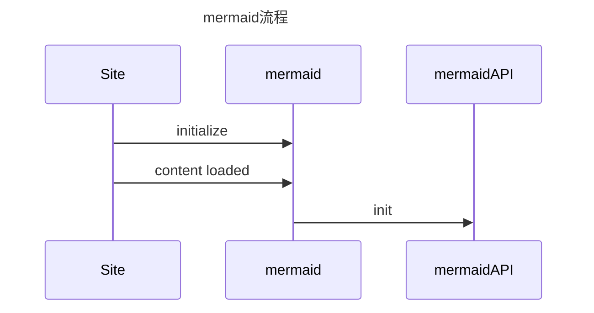
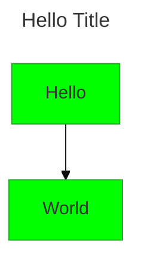

## 头部参数配置

::: tabs

@tab 头部参数配置



@tab 代码

```tex
---
title: Hello Title
config:
  theme: base
  themeVariables:
    primaryColor: "#00ff00"
---
flowchart
	Hello --> World
```

:::

## 主题配置

## 初始化配置

configApi\.reset： 此方法将图表的配置重置为整体站点配置，这是站点集成器提供的配置。每次绘制图表之前，都会从一开始就调用 reset。