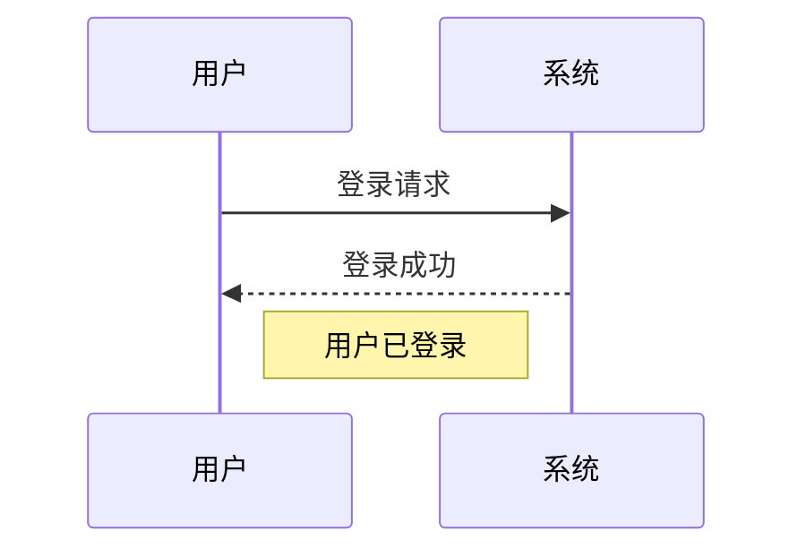

Mermaid 的 Frontmatter 配置中，时序图（Sequence Diagram）的专用配置项用于控制时序图的外观和行为。以下是 **时序图 (Sequence Diagram)** 的详细配置说明：

---

### **时序图配置项**
```yaml
---
mermaid:
  sequence:
    actorMargin: 100       # 角色之间的水平间距
    width: 300             # 图表宽度（像素）
    height: 50             # 每条消息的高度
    noteMargin: 10         # 注释框与元素的间距
    messageAlign: "center" # 消息文本对齐方式
    mirrorActors: false    # 是否镜像角色
    useMaxWidth: true      # 是否限制图表最大宽度
---
```

---

### **配置项详解**

#### **1. `actorMargin`**
- **作用**：设置角色（Actor）之间的水平间距。
- **类型**：数值（像素）。
- **示例**：
  ```yaml
  actorMargin: 100
  ```

#### **2. `width`**
- **作用**：设置时序图的宽度。
- **类型**：数值（像素）。
- **示例**：
  ```yaml
  width: 300
  ```

#### **3. `height`**
- **作用**：设置每条消息（Message）的高度。
- **类型**：数值（像素）。
- **示例**：
  ```yaml
  height: 50
  ```

#### **4. `noteMargin`**
- **作用**：设置注释框（Note）与相关元素（如角色或消息）的间距。
- **类型**：数值（像素）。
- **示例**：
  ```yaml
  noteMargin: 10
  ```

#### **5. `messageAlign`**
- **作用**：设置消息文本的对齐方式。
- **可选值**：
  - `left`：左对齐。
  - `center`：居中对齐。
  - `right`：右对齐。
- **示例**：
  ```yaml
  messageAlign: "center"
  ```

#### **6. `mirrorActors`**
- **作用**：是否镜像角色（将角色放在图表的另一侧）。
- **类型**：布尔值。
- **示例**：
  ```yaml
  mirrorActors: false
  ```

#### **7. `useMaxWidth`**
- **作用**：是否限制时序图的最大宽度。
  - 如果为 `true`，图表会根据容器宽度自动调整。
  - 如果为 `false`，图表宽度不受限制。
- **类型**：布尔值。
- **示例**：
  ```yaml
  useMaxWidth: true
  ```

---

### **完整示例**
```yaml
---
title: "时序图配置示例"
mermaid:
  sequence:
    actorMargin: 100
    width: 300
    height: 50
    noteMargin: 10
    messageAlign: "center"
    mirrorActors: false
    useMaxWidth: true
---
```

---

### **注意事项**
1. **优先级**：单个时序图的配置会覆盖 Frontmatter 中的全局配置。
2. **兼容性**：部分配置项需要 Mermaid 8.13+ 版本支持。
3. **渲染工具**：确保渲染工具（如 Docsify、VuePress）支持 Mermaid Frontmatter。

---

### **示例时序图代码**
结合上述配置的时序图代码：


