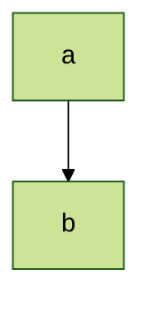
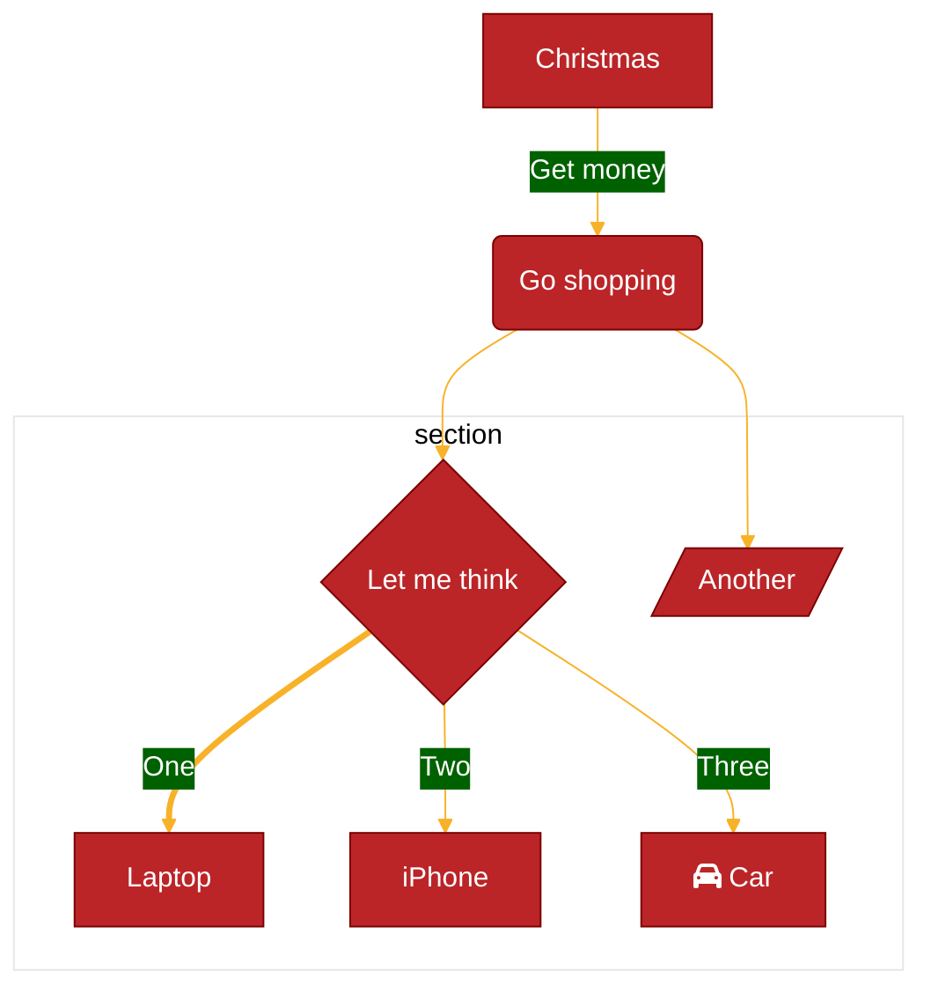

Mermaid 版本 8.7.0 中引入了动态和集成主题配置。

现在可以在站点范围内或在单个 Mermaid 图上自定义主题。对于站点范围的主题定制，使用 `initialize` 调用。对于图特定的定制，使用 `init` 指令。

## 可用主题

1. [**default**](https://github.com/mermaid-js/mermaid/blob/develop/packages/mermaid/src/themes/theme-default.js) - 这是所有图表的默认主题。
2. [**neutral**](https://github.com/mermaid-js/mermaid/blob/develop/packages/mermaid/src/themes/theme-neutral.js) - 该主题非常适合要打印的黑白文档。
3. [**dark**](https://github.com/mermaid-js/mermaid/blob/develop/packages/mermaid/src/themes/theme-dark.js) - 这个主题与深色元素或夜间模式很相配。
4. [**forest**](https://github.com/mermaid-js/mermaid/blob/develop/packages/mermaid/src/themes/theme-forest.js) - 这个主题包含绿色阴影。
5. [**base**](https://github.com/mermaid-js/mermaid/blob/develop/packages/mermaid/src/themes/theme-base.js) - 这是唯一可以修改的主题。使用此主题作为自定义的基础。

## 全站主题

要在站点范围内自定义主题，请在 `mermaid` 上调用 `initialize` 方法。

`initialize` 调用设置 `theme` 至 `base` 的示例：

```javascript
mermaid.initialize({
  securityLevel: 'loose',
  theme: 'base',
});
```

## 图表特定主题

要自定义单个图表的主题，请使用 `init` 指令。

将 `theme` 设置为 `forest` 的 `init` 指令示例：

:::tabs

@tab 图



@tab 代码

```
%%{init: {'theme':'forest'}}%%
  graph TD
    a --> b
```

:::

> 提醒：唯一可以定制的主题是 `base` 主题。以下部分介绍如何使用 `themeVariables` 进行自定义。

## 使用 `themeVariables` 自定义主题

要制作自定义主题，请通过 `init` 修改 `themeVariables`。

你将需要使用base主题，因为它是唯一可修改的主题。

| 参数           | 描述                   | 类型 | 属性                                              |
| :------------- | :--------------------- | :--- | :------------------------------------------------ |
| themeVariables | 可使用 `init` 指令修改 | 对象 | `primaryColor`、`primaryTextColor`、`lineColor`等 |

使用 `init` 指令修改 `themeVariables` 的示例：

:::tabs

@tab 图



@tab 代码

```
%%{
  init: {
    'theme': 'base',
    'themeVariables': {
      'primaryColor': '#BB2528',
      'primaryTextColor': '#fff',
      'primaryBorderColor': '#7C0000',
      'lineColor': '#F8B229',
      'secondaryColor': '#006100',
      'tertiaryColor': '#fff'
    }
  }
}%%
        graph TD
          A[Christmas] -->|Get money| B(Go shopping)
          B --> C{Let me think}
          B --> G[/Another/]
          C ==>|One| D[Laptop]
          C -->|Two| E[iPhone]
          C -->|Three| F[fa:fa-car Car]
          subgraph section
            C
            D
            E
            F
            G
          end
```

:::

## 颜色和颜色计算

为了确保图表的可读性，某些变量的默认值是通过其他变量计算或导出的。例如，`primaryBorderColor` 是从 `primaryColor` 变量导出的。所以如果自定义了 `primaryColor` 变量，Mermaid 会自动调整 `primaryBorderColor`。调整可能意味着颜色反转、色调变化、变暗/变亮 10% 等。

主题引擎只能识别十六进制颜色，不能识别颜色名称。因此，值 `#ff0000` 有效，但 `red` 无效。

## 主题变量

| 变量                 | 默认值                       | 描述                                                         |
| :------------------- | :--------------------------- | :----------------------------------------------------------- |
| darkMode             | false                        | 影响派生颜色的计算方式。将值设置为 `true` 以实现夜间模式。   |
| 背景                 | #f4f4f4                      | 用于计算应为背景色或与背景形成对比的项目的颜色               |
| fontFamily           | 投石机女士、verdana、arial   |                                                              |
| fontSize             | 16px                         | 字体大小（以像素为单位）                                     |
| primaryColor         | #fff4dd                      | 用作节点背景的颜色，其他颜色将从中派生                       |
| primaryTextColor     | 根据 darkMode #ddd/#333 计算 | 使用 `primaryColor` 用作节点中文本颜色的颜色                 |
| secondaryColor       | 从原色计算                   |                                                              |
| primaryBorderColor   | 从原色计算                   | 使用 `primaryColor` 用作节点边框的颜色                       |
| secondaryBorderColor | 从 secondaryColor 计算       | 使用 `secondaryColor` 用作节点边框的颜色                     |
| secondaryTextColor   | 从 secondaryColor 计算       | 使用 `secondaryColor` 用作节点中文本颜色的颜色               |
| tertiaryColor        | 从原色计算                   |                                                              |
| tertiaryBorderColor  | 从 tertiaryColor 计算        | 使用 `tertiaryColor` 用作节点边框的颜色                      |
| tertiaryTextColor    | 从 tertiaryColor 计算        | 使用 `tertiaryColor` 用作节点中文本颜色的颜色                |
| noteBkgColor         | #fff5ad                      | 在注意中用作背景的颜色                                       |
| noteTextColor        | #333                         | 注释矩形中的文本颜色                                         |
| noteBorderColor      | 根据 noteBkgColor 计算       | 注释矩形中的边框颜色                                         |
| lineColor            | 从背景计算                   |                                                              |
| textColor            | 从 primaryTextColor 计算     | 图表中背景上的文本，例如时序图中标签和信号上的文本或甘特图中的标题 |
| mainBkg              | 从原色计算                   | 流程图对象的背景，如矩形/圆形、类图类、时序图等              |
| errorBkgColor        | tertiaryColor                | 语法错误消息的颜色                                           |
| errorTextColor       | tertiaryTextColor            | 语法错误消息的颜色                                           |

## 流程图变量

| 变量                | 默认值                 | 描述             |
| :------------------ | :--------------------- | :--------------- |
| nodeBorder          | primaryBorderColor     | 节点边框颜色     |
| clusterBkg          | tertiaryColor          | 子图中的背景     |
| clusterBorder       | tertiaryBorderColor    | 簇边框颜色       |
| defaultLinkColor    | lineColor              | 链接颜色         |
| titleColor          | tertiaryTextColor      | 标题颜色         |
| edgeLabelBackground | 从 secondaryColor 计算 |                  |
| nodeTextColor       | primaryTextColor       | 节点内文本的颜色 |

## 时序图变量

| 变量                | 默认值                 | 描述           |
| :------------------ | :--------------------- | :------------- |
| actorBkg            | mainBkg                | 角色背景颜色   |
| actorBorder         | primaryBorderColor     | 角色边框颜色   |
| 角色文本颜色        | primaryTextColor       | 角色文本颜色   |
| 角色线颜色          | actorBorder            | 角色线颜色     |
| signalColor         | textColor              | 信号颜色       |
| signalTextColor     | textColor              | 信号文本颜色   |
| labelBoxBkgColor    | actorBkg               | 标签框背景颜色 |
| labelBoxBorderColor | actorBorder            | 标签框边框颜色 |
| labelTextColor      | 角色文本颜色           | 标签文本颜色   |
| loopTextColor       | 角色文本颜色           | 循环文本颜色   |
| 激活边框颜色        | 从 secondaryColor 计算 | 激活边框颜色   |
| 激活 Bkg 颜色       | secondaryColor         | 激活背景颜色   |
| sequenceNumberColor | 根据 lineColor 计算    | 序列号 颜色    |

## 饼图变量

| 变量                | 默认值                 | 描述                     |
| :------------------ | :--------------------- | :----------------------- |
| pie1                | primaryColor           | 填写饼图中的第一部分     |
| pie2                | secondaryColor         | 填写饼图的第二部分       |
| pie3                | 从三级计算             | 填写饼图中的第三部分     |
| pie4                | 从原色计算             | 填写饼图中的第四部分     |
| pie5                | 从 secondaryColor 计算 | 填写饼图中的第五部分     |
| pie6                | 从 tertiaryColor 计算  | 填写饼图中的第 6 部分    |
| pie7                | 从原色计算             | 填写饼图第七部分         |
| pie8                | 从原色计算             | 填写饼图第 8 部分        |
| pie9                | 从原色计算             | 填写饼图中的第 9 部分    |
| pie10               | 从原色计算             | 填写饼图中的第 10 部分   |
| pie11               | 从原色计算             | 填写饼图第 11 部分       |
| pie12               | 从原色计算             | 填写饼图第 12 部分       |
| pieTitleTextSize    | 25px                   | 标题文本大小             |
| pieTitleTextColor   | taskTextDarkColor      | 标题文本颜色             |
| pieSectionTextSize  | 17px                   | 各个部分标签的文本大小   |
| pieSectionTextColor | textColor              | 各个部分标签的文本颜色   |
| pieLegendTextSize   | 17px                   | 图表图例中标签的文本大小 |
| pieLegendTextColor  | taskTextDarkColor      | 图表图例中标签的文本颜色 |
| pieStrokeColor      | 黑色的                 | 各个饼图部分的边框颜色   |
| pieStrokeWidth      | 2px                    | 各个饼图部分的边框宽度   |
| pieOuterStrokeWidth | 2px                    | 饼图外圆的边框宽度       |
| pieOuterStrokeColor | 黑色的                 | 饼图外圆的边框颜色       |
| pieOpacity          | 0.7                    | 各个饼图部分的不透明度   |

## 状态颜色

| 变量          | 默认值           | 描述                   |
| :------------ | :--------------- | :--------------------- |
| labelColor    | primaryTextColor |                        |
| altBackground | tertiaryColor    | 用于深度复合状态的背景 |

## 类别颜色

| 变量      | 默认值    | 描述             |
| :-------- | :-------- | :--------------- |
| classText | textColor | 类图中文本的颜色 |

## 用户旅程颜色

| 变量      | 默认值                 | 描述                    |
| :-------- | :--------------------- | :---------------------- |
| fillType0 | primaryColor           | 填写旅程图中的第一部分  |
| fillType1 | secondaryColor         | 填写旅程图中的第二部分  |
| fillType2 | 从原色计算             | 填写旅程图中的第三部分  |
| fillType3 | 从 secondaryColor 计算 | 填写旅程图中的第四部分  |
| fillType4 | 从原色计算             | 填写旅程图中的第五部分  |
| fillType5 | 从 secondaryColor 计算 | 填写行程图中的第 6 部分 |
| fillType6 | 从原色计算             | 填写旅程图第七部分      |
| fillType7 | 从 secondaryColor 计算 | 填写旅程图第 8 部分     |
