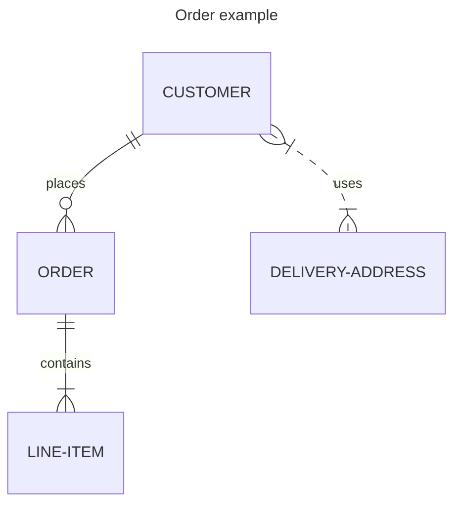
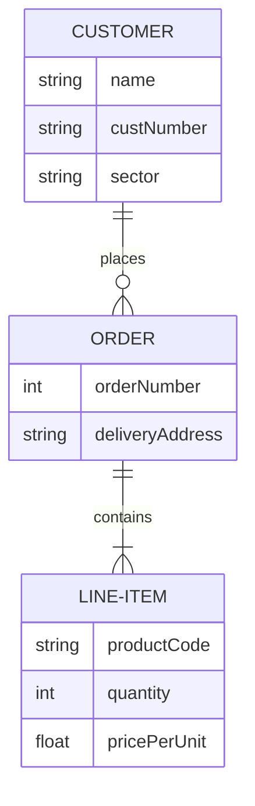
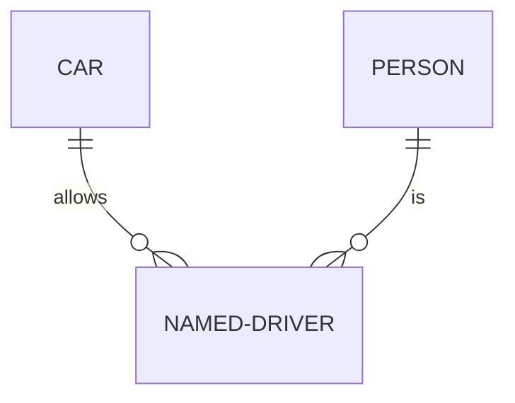
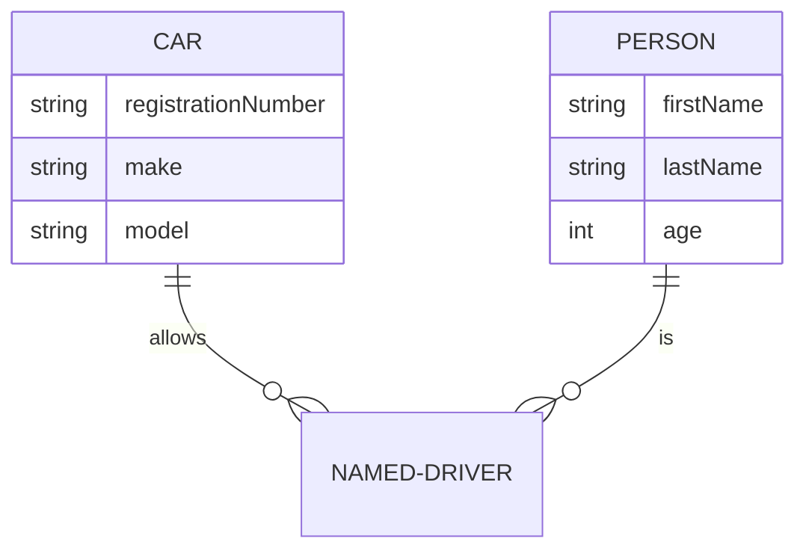
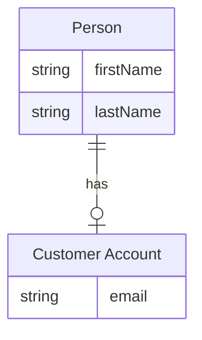
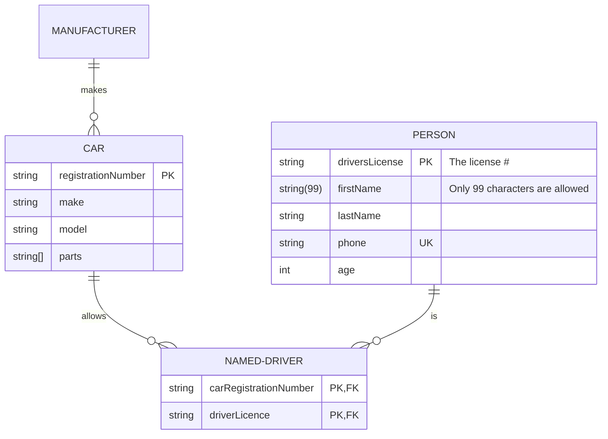

> 实体关系模型（或 ER 模型）描述特定知识字段中相关的感兴趣的事物。基本 ER 模型由实体类型（对感兴趣的事物进行分类）组成，并指定实体（这些实体类型的实例）之间可以存在的关系 

请注意，ER 建模的实践者几乎总是将实体类型简称为实体。例如，`CUSTOMER` 实体类型将简称为 `CUSTOMER` 实体。这种情况很常见，不建议做任何其他事情，但从技术上讲，实体是实体类型的抽象实例，这就是 ER 图所示的内容 - 抽象实例以及它们之间的关系。这就是为什么实体总是使用单数名词来命名。

实体关系图（Entity-Relationship Diagram，简称ER图）是一种用于描述数据模型的可视化工具，广泛应用于数据库设计、系统分析和软件开发等领域。以下是实体关系图的主要使用场景：

:::details 使用场景

### 1. **数据库设计**
   - **场景**：在设计关系型数据库时，ER图用于描述实体（表）、属性（字段）以及实体之间的关系（如一对一、一对多、多对多）。
   - **作用**：
     - 帮助设计者清晰地规划数据库结构。
     - 确保数据的完整性和一致性。
     - 为后续的数据库实现提供蓝图。

---

### 2. **系统分析与需求建模**
   - **场景**：在系统开发初期，ER图用于分析业务需求，明确系统中涉及的实体及其关系。
   - **作用**：
     - 帮助开发团队和业务人员理解系统的数据需求。
     - 作为沟通工具，确保各方对数据模型的理解一致。

---

### 3. **数据仓库设计**
   - **场景**：在设计数据仓库时，ER图用于描述数据源、数据表及其关系，支持数据集成和数据分析。
   - **作用**：
     - 帮助设计数据仓库的星型模型或雪花模型。
     - 支持数据的抽取、转换和加载（ETL）过程。

---

### 4. **业务流程建模**
   - **场景**：在业务流程建模中，ER图用于描述业务中涉及的实体及其关系，帮助优化业务流程。
   - **作用**：
     - 识别业务流程中的关键数据实体。
     - 支持业务流程的自动化和信息化。

---

### 5. **软件开发与维护**
   - **场景**：在软件开发过程中，ER图用于指导数据库的实现，并在维护阶段用于理解现有数据结构。
   - **作用**：
     - 作为开发文档的一部分，帮助开发人员快速理解数据模型。
     - 在系统升级或重构时，提供数据结构的参考。

---

### 6. **数据迁移与集成**
   - **场景**：在数据迁移或系统集成项目中，ER图用于描述源系统和目标系统的数据结构及其映射关系。
   - **作用**：
     - 帮助规划数据迁移策略。
     - 确保数据在迁移或集成过程中的一致性和完整性。

---

### 7. **教学与培训**
   - **场景**：在数据库课程或培训中，ER图用于讲解数据库设计的基本概念和方法。
   - **作用**：
     - 帮助学习者理解实体、属性和关系的概念。
     - 作为实践工具，支持学习者设计简单的数据库模型。

---

### 8. **文档与沟通**
   - **场景**：在项目文档中，ER图用于描述系统的数据模型，作为沟通工具。
   - **作用**：
     - 帮助团队成员和非技术人员理解系统的数据结构。
     - 作为项目交付物的一部分，提供清晰的系统设计说明。

---

### 9. **数据治理与合规**
   - **场景**：在数据治理项目中，ER图用于描述数据的来源、流向和关系，支持数据质量管理。
   - **作用**：
     - 帮助识别数据的关键实体和依赖关系。
     - 支持数据合规性检查（如GDPR、HIPAA等）。

---

### 10. **原型设计与快速验证**
   - **场景**：在敏捷开发中，ER图用于快速设计数据模型原型，验证业务需求。
   - **作用**：
     - 支持快速迭代和反馈。
     - 帮助团队在早期阶段发现潜在的设计问题。

:::


以下是将你提供的文本处理为 `:::tabs` 格式的示例，并解释如何在 Mermaid 的 `erDiagram` 中定义实体和关系：

:::tabs

@tab ER 图示例



@tab 代码

```
---
title: Order example
---
erDiagram
    CUSTOMER ||--o{ ORDER : places
    ORDER ||--|{ LINE-ITEM : contains
    CUSTOMER }|..|{ DELIVERY-ADDRESS : uses
```

:::

**关键点**  
- **标题**：使用 `title` 为 ER 图添加标题。  
- **实体**：直接定义实体名称（如 `CUSTOMER`、`ORDER` 等）。  
- **关系**：使用 `实体A 关系符号 实体B : 描述` 定义实体之间的关系，关系符号包括：  
  - `||--o{`：一对多关系（左侧实体为“一”）。  
  - `||--|{`：多对多关系。  
  - `}|..|{`：弱实体关系。  

:::details 实例说明  
- **标题**：`Order example`，表示 ER 图的主题。  
- **实体**：  
  - `CUSTOMER`：客户实体。  
  - `ORDER`：订单实体。  
  - `LINE-ITEM`：订单项实体。  
  - `DELIVERY-ADDRESS`：配送地址实体。  
- **关系**：  
  - `CUSTOMER ||--o{ ORDER : places`：客户可以下多个订单，描述为 `places`。  
  - `ORDER ||--|{ LINE-ITEM : contains`：订单可以包含多个订单项，描述为 `contains`。  
  - `CUSTOMER }|..|{ DELIVERY-ADDRESS : uses`：客户可以使用多个配送地址，描述为 `uses`。  
  :::

如果有其他问题或需要进一步调整，请随时告诉我！


实体名称通常是大写的，尽管对此没有公认的标准，并且在 Mermaid 中也没有要求。

实体之间的关系由带有表示基数的结束标记的线表示。Mermaid 使用最流行的鱼尾纹表示法。鱼尾纹直观地传达了它所连接的实体的许多实例的可能性。

ER 图可用于各种目的，从没有任何实现细节的抽象逻辑模型到关系数据库表的物理模型。在 ER 图上包含属性定义有助于理解实体的目的和含义。这些不一定需要详尽无遗；通常一小部分属性就足够了。Mermaid 允许根据其类型和名称来定义它们。

以下是将你提供的文本处理为 `:::tabs` 格式的示例，并解释如何在 Mermaid 的 `erDiagram` 中定义实体、关系和实体属性：

:::tabs

@tab ER 图示例



@tab 代码

```
erDiagram
    CUSTOMER ||--o{ ORDER : places
    CUSTOMER {
        string name
        string custNumber
        string sector
    }
    ORDER ||--|{ LINE-ITEM : contains
    ORDER {
        int orderNumber
        string deliveryAddress
    }
    LINE-ITEM {
        string productCode
        int quantity
        float pricePerUnit
    }
```

:::

**关键点**  
- **实体**：直接定义实体名称（如 `CUSTOMER`、`ORDER` 等）。  
- **关系**：使用 `实体A 关系符号 实体B : 描述` 定义实体之间的关系，关系符号包括：  
  - `||--o{`：一对多关系（左侧实体为“一”）。  
  - `||--|{`：多对多关系。  
- **实体属性**：使用 `实体名 { 属性类型 属性名 }` 定义实体属性。  

:::details 实例说明  
- **实体**：  
  - `CUSTOMER`：客户实体，包含属性 `name`（姓名）、`custNumber`（客户编号）、`sector`（行业）。  
  - `ORDER`：订单实体，包含属性 `orderNumber`（订单号）、`deliveryAddress`（配送地址）。  
  - `LINE-ITEM`：订单项实体，包含属性 `productCode`（产品代码）、`quantity`（数量）、`pricePerUnit`（单价）。  
- **关系**：  
  - `CUSTOMER ||--o{ ORDER : places`：客户可以下多个订单，描述为 `places`。  
  - `ORDER ||--|{ LINE-ITEM : contains`：订单可以包含多个订单项，描述为 `contains`。  
  :::

如果有其他问题或需要进一步调整，请随时告诉我！

在 ER 图上包含属性时，必须决定是否包含外键作为属性。这可能取决于你尝试表示关系表结构的紧密程度。如果你的图表是一个逻辑模型，并不意味着暗示关系实现，那么最好将它们排除在外，因为关联关系已经传达了实体关联的方式。例如，JSON 数据结构可以使用数组实现一对多关系，而无需外键属性。类似地，面向对象的编程语言可以使用对集合的指针或引用。即使对于用于关系实现的模型，你也可能会认为包含外键属性会重复关系已经描述的信息，并且不会为实体添加含义。最终，这是你的选择。

## 语法

### 实体和关系

ER 图的 Mermaid 语法与 PlantUML 兼容，并带有用于标记关系的扩展。每个语句由以下部分组成：

```
    <first-entity> [<relationship> <second-entity> : <relationship-label>]
```

在哪里：

- `first-entity` 是实体的名称。名称必须以字母字符或下划线开头（从 v10.5.0+ 开始），并且还可以包含数字和连字符。
- `relationship` 描述了两个实体相互关联的方式。见下文。
- `second-entity` 是另一个实体的名称。
- `relationship-label` 从第一实体的角度描述关系。

例如：

```
    PROPERTY ||--|{ ROOM : contains
```

该声明可以理解为一个属性包含一个或多个房间，而一个房间是一个且唯一一个属性的一部分。可以看到这里的标签是从第一个实体的角度来看的：属性包含房间，但房间不包含属性。当从第二实体的角度考虑时，等效标签通常很容易推断出来。（一些 ER 图从两个角度标记关系，但这在这里不受支持，并且通常是多余的）。

只有声明的 `first-entity` 部分是强制性的。这使得显示没有关系的实体成为可能，这在图表的迭代构建过程中非常有用。如果指定了语句的任何其他部分，则所有部分都是强制性的。

### 关系语法

每个语句的 `relationship` 部分可以分为三个子部分：

- 第一个实体相对于第二个实体的基数
- 该关系是否赋予 'child' 实体身份
- 第二个实体相对于第一个实体的基数

基数是描述另一个实体有多少元素可以与相关实体相关的属性。在上面的示例中，`PROPERTY` 可以有一个或多个与其关联的 `ROOM` 实例，而 `ROOM` 只能与一个 `PROPERTY` 关联。每个基数标记中有两个字符。最外面的字符代表最大值，最里面的字符代表最小值。下表总结了可能的基数。

| 值（左） | 值（右） | 意义                 |
| :------: | :------: | :------------------- |
|   `|o`   |   `o|`   | 零或一               |
|   `||`   |   `||`   | 正好一个             |
|   `}o`   |   `o{`   | 零个或多个（无上限） |
|   `}|`   |   `|{`   | 1 个或多个（无上限） |

**别名**

|  值（左）  |  值（右）  | 别名为     |
| :--------: | :--------: | :--------- |
|   一或零   |   一或零   | 零或一     |
|   零或一   |   零或一   | 零或一     |
| 一个或多个 | 一个或多个 | 一个或多个 |
| 一个或多个 | 一个或多个 | 一个或多个 |
|  many(1)   |  many(1)   | 一个或多个 |
|     1+     |     1+     | 一个或多个 |
| 零个或多个 | 零个或多个 | 零个或多个 |
| 零个或多个 | 零个或多个 | 零个或多个 |
|  many(0)   |  many(0)   | 零个或多个 |
|     0+     |     0+     | 零个或多个 |
|  只有一个  |  只有一个  | 正好一个   |
|     1      |     1      | 正好一个   |

### 鉴别

关系可分为识别性关系或非识别性关系，分别用实线或虚线渲染。当所讨论的实体之一不能离开另一个实体而独立存在时，这一点是相关的。例如，一家为人们驾驶汽车提供保险的公司可能需要在 `NAMED-DRIVER` 上存储数据。在建模时，我们可能首先观察到 `CAR` 可以由许多 `PERSON` 实例驱动，而 `PERSON` 可以驱动许多 `CAR` - 两个实体都可以独立存在，因此这是一种非识别关系，我们可以在 Mermaid 中将其指定为：`PERSON }|..|{ CAR : "driver"`。请注意关系中间的两个点，这将导致在两个实体之间绘制虚线。但是，当这种多对多关系解析为两个一对多关系时，我们观察到如果没有 `PERSON` 和 `CAR`，`NAMED-DRIVER` 就不可能存在 - 关系变得具有识别性，并使用连字符指定，连字符转换为实线：

**别名**

|   值   |   别名为    |
| :----: | :---------: |
|   to   | identifying |
| 可选地 | 不可识别的  |

以下是将你提供的文本处理为 `:::tabs` 格式的示例，并解释如何在 Mermaid 的 `erDiagram` 中定义实体和关系：

:::tabs

@tab ER 图示例



@tab 代码

```
erDiagram
    CAR ||--o{ NAMED-DRIVER : allows
    PERSON ||--o{ NAMED-DRIVER : is
```

:::

**关键点**  
- **实体**：直接定义实体名称（如 `CAR`、`PERSON`、`NAMED-DRIVER`）。  
- **关系**：使用 `实体A 关系符号 实体B : 描述` 定义实体之间的关系，关系符号包括：  
  - `||--o{`：一对多关系（左侧实体为“一”）。  

:::details 实例说明  
- **实体**：  
  - `CAR`：汽车实体。  
  - `PERSON`：人员实体。  
  - `NAMED-DRIVER`：指定驾驶员实体。  
- **关系**：  
  - `CAR ||--o{ NAMED-DRIVER : allows`：一辆汽车可以允许多个指定驾驶员，描述为 `allows`。  
  - `PERSON ||--o{ NAMED-DRIVER : is`：一个人可以是多个指定驾驶员，描述为 `is`。  
  :::

如果有其他问题或需要进一步调整，请随时告诉我！

### 属性

可以通过指定实体名称后跟包含多个 `type name` 对的块来定义实体的属性，其中块由开头 `{` 和结尾 `}` 分隔。属性在实体框内渲染。例如：

以下是将你提供的文本处理为 `:::tabs` 格式的示例，并解释如何在 Mermaid 的 `erDiagram` 中定义实体、关系和实体属性：

:::tabs

@tab ER 图示例



@tab 代码

```
erDiagram
    CAR ||--o{ NAMED-DRIVER : allows
    CAR {
        string registrationNumber
        string make
        string model
    }
    PERSON ||--o{ NAMED-DRIVER : is
    PERSON {
        string firstName
        string lastName
        int age
    }
```

:::

**关键点**  
- **实体**：直接定义实体名称（如 `CAR`、`PERSON`、`NAMED-DRIVER`）。  
- **关系**：使用 `实体A 关系符号 实体B : 描述` 定义实体之间的关系，关系符号包括：  
  - `||--o{`：一对多关系（左侧实体为“一”）。  
- **实体属性**：使用 `实体名 { 属性类型 属性名 }` 定义实体属性。  

:::details 实例说明  
- **实体**：  
  - `CAR`：汽车实体，包含属性 `registrationNumber`（车牌号）、`make`（制造商）、`model`（型号）。  
  - `PERSON`：人员实体，包含属性 `firstName`（名字）、`lastName`（姓氏）、`age`（年龄）。  
  - `NAMED-DRIVER`：指定驾驶员实体。  
- **关系**：  
  - `CAR ||--o{ NAMED-DRIVER : allows`：一辆汽车可以允许多个指定驾驶员，描述为 `allows`。  
  - `PERSON ||--o{ NAMED-DRIVER : is`：一个人可以是多个指定驾驶员，描述为 `is`。  
  :::

如果有其他问题或需要进一步调整，请随时告诉我！

`type` 值必须以字母字符开头，并且可以包含数字、连字符、下划线、圆括号和方括号。`name` 值遵循与 `type` 类似的格式，但可能以星号开头，作为指示属性是主键的另一个选项。除此之外，没有任何限制，也没有隐式的有效数据类型集。

### 实体名称别名 

(v10.5.0+)可以使用方括号将别名添加到实体。如果提供，别名将显示在图中而不是实体名称。

以下是将你提供的文本处理为 `:::tabs` 格式的示例，并解释如何在 Mermaid 的 `erDiagram` 中定义实体、关系和实体属性：

:::tabs

@tab ER 图示例



@tab 代码

```
erDiagram
    p[Person] {
        string firstName
        string lastName
    }
    a["Customer Account"] {
        string email
    }
    p ||--o| a : has
```

:::

**关键点**  
- **实体**：使用 `实体名[标签]` 定义实体，并指定标签。  
- **实体属性**：使用 `实体名 { 属性类型 属性名 }` 定义实体属性。  
- **关系**：使用 `实体A 关系符号 实体B : 描述` 定义实体之间的关系，关系符号包括：  
  - `||--o|`：一对多关系（左侧实体为“一”）。  

:::details 实例说明  
- **实体**：  
  - `p[Person]`：定义名为 `p` 的实体，标签为 `Person`，包含属性 `firstName`（名字）、`lastName`（姓氏）。  
  - `a["Customer Account"]`：定义名为 `a` 的实体，标签为 `Customer Account`，包含属性 `email`（电子邮件）。  
- **关系**：  
  - `p ||--o| a : has`：一个人可以拥有多个客户账户，描述为 `has`。  
  :::

如果有其他问题或需要进一步调整，请随时告诉我！

### 属性键和注释

属性还可以定义 `key` 或注释。键可以是 `PK`、`FK` 或 `UK`，分别表示主键、外键或唯一键。要在单个属性上指定多个键约束，请用逗号分隔它们（例如，`PK, FK`）。`comment` 由属性末尾的双引号定义。注释本身不能包含双引号字符。

以下是将你提供的文本处理为 `:::tabs` 格式的示例，并解释如何在 Mermaid 的 `erDiagram` 中定义实体、关系和实体属性，包括主键、外键、唯一键和复杂数据类型：

:::tabs

@tab ER 图示例



@tab 代码

```
erDiagram
    CAR ||--o{ NAMED-DRIVER : allows
    CAR {
        string registrationNumber PK
        string make
        string model
        string[] parts
    }
    PERSON ||--o{ NAMED-DRIVER : is
    PERSON {
        string driversLicense PK "The license #"
        string(99) firstName "Only 99 characters are allowed"
        string lastName
        string phone UK
        int age
    }
    NAMED-DRIVER {
        string carRegistrationNumber PK, FK
        string driverLicence PK, FK
    }
    MANUFACTURER only one to zero or more CAR : makes
```

:::

**关键点**  
- **实体**：直接定义实体名称（如 `CAR`、`PERSON`、`NAMED-DRIVER`、`MANUFACTURER`）。  
- **实体属性**：使用 `实体名 { 属性类型 属性名 标记 "描述" }` 定义实体属性，支持主键（`PK`）、外键（`FK`）、唯一键（`UK`）和复杂数据类型（如 `string[]`）。  
- **关系**：使用 `实体A 关系符号 实体B : 描述` 定义实体之间的关系，关系符号包括：  
  - `||--o{`：一对多关系（左侧实体为“一”）。  
  - `only one to zero or more`：一对一或多关系。  

:::details 实例说明  
- **实体**：  
  - `CAR`：汽车实体，包含属性 `registrationNumber`（车牌号，主键）、`make`（制造商）、`model`（型号）、`parts`（零件，数组类型）。  
  - `PERSON`：人员实体，包含属性 `driversLicense`（驾驶证号，主键，描述为“The license #”）、`firstName`（名字，最多 99 个字符）、`lastName`（姓氏）、`phone`（电话，唯一键）、`age`（年龄）。  
  - `NAMED-DRIVER`：指定驾驶员实体，包含属性 `carRegistrationNumber`（车牌号，主键和外键）、`driverLicence`（驾驶证号，主键和外键）。  
  - `MANUFACTURER`：制造商实体。  
- **关系**：  
  - `CAR ||--o{ NAMED-DRIVER : allows`：一辆汽车可以允许多个指定驾驶员，描述为 `allows`。  
  - `PERSON ||--o{ NAMED-DRIVER : is`：一个人可以是多个指定驾驶员，描述为 `is`。  
  - `MANUFACTURER only one to zero or more CAR : makes`：一个制造商可以制造零辆或多辆汽车，描述为 `makes`。  
  :::

如果有其他问题或需要进一步调整，请随时告诉我！

:::warning

- 如果你希望关系标签超过一个单词，则必须在短语周围使用双引号
- 如果你根本不需要关系上的标签，则必须使用空双引号字符串
- (v11.1.0+)如果你想要在关系上使用多行标签，请在两行之间使用 `<br />`（`"first line<br />second line"`）

:::

## 样式

**配置选项**: 对于简单的颜色定制：

| 名称     | 用作                                 |
| :------- | :----------------------------------- |
| `fill`   | 实体或属性的背景颜色                 |
| `stroke` | 实体或属性的边框颜色、关系的线条颜色 |

**使用的类**: 以下 CSS 类选择器可用于更丰富的样式：

| 选择器                     | 描述                 |
| :------------------------- | :------------------- |
| `.er.attributeBoxEven`     | 包含偶数行属性的框   |
| `.er.attributeBoxOdd`      | 包含奇数行属性的框   |
| `.er.entityBox`            | 代表实体的方框       |
| `.er.entityLabel`          | 实体的标签           |
| `.er.relationshipLabel`    | 关系的标签           |
| `.er.relationshipLabelBox` | 关系标签周围的框     |
| `.er.relationshipLine`     | 表示实体之间关系的线 |
