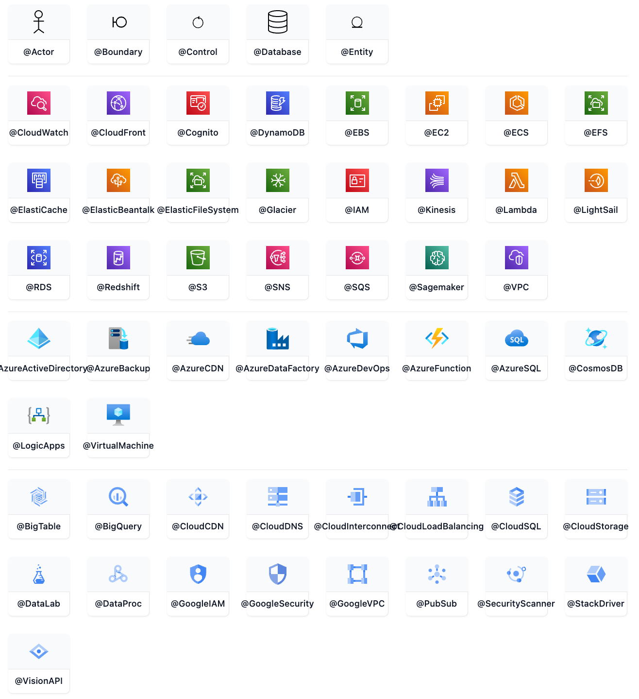

> 时序图是一种交互图，显示进程如何彼此运行以及以什么顺序运行。

请注意，ZenUML 使用与 mermaid 中原始时序图不同的语法。

Mermaid 的 `zenuml` 图中定义标题和交互：

:::tabs

@tab ZenUML 图示例


@tab 代码

```
zenuml
    title Demo
    Alice->John: Hello John, how are you?
    John->Alice: Great!
    Alice->John: See you later!
```

:::

**关键点**  

- **标题**：使用 `title` 为 ZenUML 图添加标题。  
- **交互**：使用 `参与者A->参与者B: 消息` 定义参与者之间的交互。  

:::details 实例说明  

- **标题**：`Demo`，表示 ZenUML 图的主题。  
- **交互**：  
  - `Alice` 向 `John` 发送消息：`Hello John, how are you?`。  
  - `John` 向 `Alice` 回复：`Great!`。  
  - `Alice` 向 `John` 发送消息：`See you later!`。  
  :::

### 参加者

可以像本页第一个示例中那样隐式定义参与者。参与者或参与者按照图表源文本中的出现顺序渲染。有时，你可能希望以不同于第一条消息中的顺序显示参与者。可以通过执行以下操作来指定角色的出场顺序：

Mermaid 的 `zenuml` 图中定义标题、参与者和交互：

:::tabs

@tab ZenUML 图示例


@tab 代码

```
zenuml
    title Declare participant (optional)
    Bob
    Alice
    Alice->Bob: Hi Bob
    Bob->Alice: Hi Alice
```

:::

**关键点**  

- **标题**：使用 `title` 为 ZenUML 图添加标题。  
- **参与者**：直接声明参与者（如 `Bob` 和 `Alice`）。  
- **交互**：使用 `参与者A->参与者B: 消息` 定义参与者之间的交互。  

:::details 实例说明  

- **标题**：`Declare participant (optional)`，表示 ZenUML 图的主题。  
- **参与者**：  
  - `Bob`：声明参与者 Bob。  
  - `Alice`：声明参与者 Alice。  
- **交互**：  
  - `Alice` 向 `Bob` 发送消息：`Hi Bob`。  
  - `Bob` 向 `Alice` 回复：`Hi Alice`。  
  :::

### 注释者

如果你特别想使用符号而不仅仅是带有文本的矩形，你可以通过使用注释器语法来声明参与者，如下所示。

Mermaid 的 `zenuml` 图中定义标题、参与者（使用注释符）和交互：

:::tabs

@tab ZenUML 图示例


@tab 代码

```
zenuml
    title Annotators
    @Actor Alice
    @Database Bob
    Alice->Bob: Hi Bob
    Bob->Alice: Hi Alice
```

:::

**关键点**  

- **标题**：使用 `title` 为 ZenUML 图添加标题。  
- **参与者**：使用 `@类型 参与者名` 声明参与者并指定类型（如 `Actor`、`Database`）。  
- **交互**：使用 `参与者A->参与者B: 消息` 定义参与者之间的交互。  

:::details 实例说明  

- **标题**：`Annotators`，表示 ZenUML 图的主题。  
- **参与者**：  
  - `@Actor Alice`：声明参与者 Alice，类型为 `Actor`。  
  - `@Database Bob`：声明参与者 Bob，类型为 `Database`。  
- **交互**：  
  - `Alice` 向 `Bob` 发送消息：`Hi Bob`。  
  - `Bob` 向 `Alice` 回复：`Hi Alice`。  
  :::

以下是可用的注释器：



### 别名

参与者可以有一个方便的标识符和描述性标签。

Mermaid 的 `zenuml` 图中定义标题、别名和交互：

:::tabs

@tab ZenUML 图示例


@tab 代码

```
zenuml
    title Aliases
    A as Alice
    J as John
    A->J: Hello John, how are you?
    J->A: Great!
```

:::

**关键点**  

- **标题**：使用 `title` 为 ZenUML 图添加标题。  
- **别名**：使用 `别名 as 参与者名` 为参与者定义别名。  
- **交互**：使用 `别名A->别名B: 消息` 定义参与者之间的交互。  

:::details 实例说明  

- **标题**：`Aliases`，表示 ZenUML 图的主题。  
- **别名**：  
  - `A as Alice`：为 `Alice` 定义别名 `A`。  
  - `J as John`：为 `John` 定义别名 `J`。  
- **交互**：  
  - `A` 向 `J` 发送消息：`Hello John, how are you?`。  
  - `J` 向 `A` 回复：`Great!`。  
  :::

## 信息

消息可以是以下之一：

1. 同步消息
2. 异步消息
3. 创建消息
4. 响应消息

### 同步消息

你可以想象编程语言中的同步（阻塞）方法。

Mermaid 的 `zenuml` 图中定义标题和同步消息：

:::tabs

@tab ZenUML 图示例


@tab 代码

```
zenuml
    title Sync message
    A.SyncMessage
    A.SyncMessage(with, parameters) {
      B.nestedSyncMessage()
    }
```

:::

**关键点**  

- **标题**：使用 `title` 为 ZenUML 图添加标题。  
- **同步消息**：使用 `参与者.消息名` 定义同步消息。  
- **嵌套消息**：使用 `{ ... }` 定义嵌套的同步消息。  

:::details 实例说明  

- **标题**：`Sync message`，表示 ZenUML 图的主题。  
- **同步消息**：  
  - `A.SyncMessage`：参与者 `A` 发送同步消息 `SyncMessage`。  
  - `A.SyncMessage(with, parameters)`：参与者 `A` 发送带参数的同步消息 `SyncMessage`。  
  - 嵌套消息：`B.nestedSyncMessage()`，参与者 `B` 发送嵌套的同步消息 `nestedSyncMessage`。  
  :::

### 异步消息

你可以想象编程语言中的异步（非阻塞）方法。触发一个事件然后忘记它。

Mermaid 的 `zenuml` 图中定义标题和异步消息：

:::tabs

@tab ZenUML 图示例


@tab 代码

```
zenuml
    title Async message
    Alice->Bob: How are you?
```

:::

**关键点**  

- **标题**：使用 `title` 为 ZenUML 图添加标题。  
- **异步消息**：使用 `参与者A->参与者B: 消息` 定义异步消息。  

:::details 实例说明  

- **标题**：`Async message`，表示 ZenUML 图的主题。  
- **异步消息**：  
  - `Alice` 向 `Bob` 发送异步消息：`How are you?`。  
  :::

### 创建消息

我们使用 `new` 关键字来创建一个对象。

Mermaid 的 `zenuml` 图中定义对象创建：

:::tabs

@tab ZenUML 图示例


@tab 代码

```
zenuml
    new A1
    new A2(with, parameters)
```

:::

**关键点**  

- **对象创建**：使用 `new 对象名` 定义对象创建。  
- **带参数的对象创建**：使用 `new 对象名(参数)` 定义带参数的对象创建。  

:::details 实例说明  

- **对象创建**：  
  - `new A1`：创建对象 `A1`。  
  - `new A2(with, parameters)`：创建带参数的对象 `A2`。  
  :::

### 响应消息

响应消息的表达方式有以下三种：

Mermaid 的 `zenuml` 图中定义返回值：

:::tabs

@tab ZenUML 图示例


@tab 代码

```
zenuml
    // 1. assign a variable from a sync message.
    a = A.SyncMessage()

    // 1.1. optionally give the variable a type
    SomeType a = A.SyncMessage()

    // 2. use return keyword
    A.SyncMessage() {
    return result
    }

    // 3. use @return or @reply annotator on an async message
    @return
    A->B: result
```

:::

**关键点**  

- **返回值赋值**：使用 `变量 = 参与者.消息()` 将同步消息的返回值赋值给变量。  
- **带类型的返回值赋值**：使用 `类型 变量 = 参与者.消息()` 定义带类型的返回值赋值。  
- **返回语句**：在同步消息块中使用 `return 返回值` 定义返回值。  
- **异步消息返回值**：使用 `@return` 或 `@reply` 注释符定义异步消息的返回值。  

:::details 实例说明  

1. **返回值赋值**：  
   - `a = A.SyncMessage()`：将 `A.SyncMessage()` 的返回值赋值给变量 `a`。  
2. **带类型的返回值赋值**：  
   - `SomeType a = A.SyncMessage()`：将 `A.SyncMessage()` 的返回值赋值给类型为 `SomeType` 的变量 `a`。  
3. **返回语句**：  
   - `A.SyncMessage() { return result }`：在同步消息块中返回 `result`。  
4. **异步消息返回值**：  
   - `@return A->B: result`：定义异步消息 `A->B` 的返回值为 `result`。  
   :::

第三种方式 `@return` 很少使用，但是当你想返回到上一级时它很有用。

Mermaid 的 `zenuml` 图中定义回复消息和嵌套逻辑：

:::tabs

@tab ZenUML 图示例


@tab 代码

```
zenuml
    title Reply message
    Client->A.method() {
      B.method() {
        if(condition) {
          return x1
          // return early
          @return
          A->Client: x11
        }
      }
      return x2
    }
```

:::

**关键点**  

- **标题**：使用 `title` 为 ZenUML 图添加标题。  
- **嵌套逻辑**：使用 `{ ... }` 定义嵌套逻辑。  
- **回复消息**：使用 `@return` 注释符定义异步回复消息。  
- **条件判断**：在嵌套逻辑中使用 `if(condition)` 定义条件判断。  
- **返回值**：使用 `return 值` 定义返回值。  

:::details 实例说明  

- **标题**：`Reply message`，表示 ZenUML 图的主题。  
- **嵌套逻辑**：  
  - `Client->A.method()`：客户端调用 `A` 的 `method` 方法。  
  - `B.method()`：在 `A.method()` 中调用 `B` 的 `method` 方法。  
  - `if(condition)`：在 `B.method()` 中定义条件判断。  
    - 如果条件为真，返回 `x1`，并通过 `@return` 发送异步回复消息 `A->Client: x11`。  
  - 如果条件为假，返回 `x2`。  
  :::

## 嵌套

同步消息和创建消息自然可以与 `{}` 嵌套。

Mermaid 的 `zenuml` 图中定义嵌套的同步和异步消息：

:::tabs

@tab ZenUML 图示例


@tab 代码

```
zenuml
    A.method() {
      B.nested_sync_method()
      B->C: nested async message
    }
```

:::

**关键点**  

- **嵌套逻辑**：使用 `{ ... }` 定义嵌套逻辑。  
- **同步消息**：使用 `参与者.消息()` 定义同步消息。  
- **异步消息**：使用 `参与者A->参与者B: 消息` 定义异步消息。  

:::details 实例说明  

- **嵌套逻辑**：  
  - `A.method()`：参与者 `A` 调用 `method` 方法。  
  - `B.nested_sync_method()`：在 `A.method()` 中，参与者 `B` 调用 `nested_sync_method` 同步方法。  
  - `B->C: nested async message`：在 `A.method()` 中，参与者 `B` 向 `C` 发送异步消息 `nested async message`。  
  :::

## 注释

可以使用 `// comment` 语法向时序图添加注释。注释将渲染在消息或片段上方。其他地方的注释将被忽略。支持 Markdown。

请参阅下面的示例：

Mermaid 的 `zenuml` 图中添加注释和消息：

:::tabs

@tab ZenUML 图示例


@tab 代码

```
zenuml
    // a comment on a participant will not be rendered
    BookService
    // a comment on a message.
    // **Markdown** is supported.
    BookService.getBook()
```

:::

**关键点**  

- **注释**：使用 `//` 添加注释，注释不会被渲染。  
- **参与者**：直接声明参与者（如 `BookService`）。  
- **消息**：使用 `参与者.消息()` 定义同步消息。  

:::details 实例说明  

- **注释**：  
  - `// a comment on a participant will not be rendered`：关于参与者的注释。  
  - `// a comment on a message.` 和 `// **Markdown** is supported.`：关于消息的注释，支持 Markdown 语法。  
- **参与者**：  
  - `BookService`：声明参与者 `BookService`。  
- **消息**：  
  - `BookService.getBook()`：参与者 `BookService` 调用 `getBook` 方法。  
  :::

## 循环

可以在 ZenUML 图中表达循环。这是通过以下任何一种符号来完成的：

1. while
2. for
3. 对于每个，对于每个
4. loop

**语法：**

```
while(condition) {
    ...statements...
}
```

Mermaid 的 `zenuml` 图中定义循环逻辑：

:::tabs

@tab ZenUML 图示例


@tab 代码

```
zenuml
    Alice->John: Hello John, how are you?
    while(true) {
      John->Alice: Great!
    }
```

:::

**关键点**  

- **异步消息**：使用 `参与者A->参与者B: 消息` 定义异步消息。  
- **循环逻辑**：使用 `while(条件) { ... }` 定义循环逻辑。  

:::details 实例说明  

- **异步消息**：  
  - `Alice->John: Hello John, how are you?`：`Alice` 向 `John` 发送异步消息。  
- **循环逻辑**：  
  - `while(true) { John->Alice: Great! }`：在条件为 `true` 的情况下，`John` 会不断向 `Alice` 回复 `Great!`。  
  :::

## 替代

可以在时序图中表达替代路径。这是通过符号完成的

zenuml

```
if(condition1) {
    ...statements...
} else if(condition2) {
    ...statements...
} else {
    ...statements...
}
```

```

```

## 选择

可以渲染 `opt` 片段。这是通过符号完成的

zenuml

```
opt {
  ...statements...
}
```

Mermaid 的 `zenuml` 图中定义条件逻辑：

:::tabs

@tab ZenUML 图示例


@tab 代码

```
zenuml
    Alice->Bob: Hello Bob, how are you?
    if(is_sick) {
      Bob->Alice: Not so good :(
    } else {
      Bob->Alice: Feeling fresh like a daisy
    }
```

:::

**关键点**  

- **异步消息**：使用 `参与者A->参与者B: 消息` 定义异步消息。  
- **条件逻辑**：使用 `if(条件) { ... } else { ... }` 定义条件逻辑。  

:::details 实例说明  

- **异步消息**：  
  - `Alice->Bob: Hello Bob, how are you?`：`Alice` 向 `Bob` 发送异步消息。  
- **条件逻辑**：  
  - `if(is_sick)`：如果 `is_sick` 为真，`Bob` 回复 `Not so good :(`。  
  - `else`：否则，`Bob` 回复 `Feeling fresh like a daisy`。  
  :::

## 平行线

可以显示并行发生的动作。

这是通过符号完成的

zenuml

```
par {
  statement1
  statement2
  statement3
}
```

Mermaid 的 `zenuml` 图中定义并行逻辑：

:::tabs

@tab ZenUML 图示例


@tab 代码

```
zenuml
    par {
        Alice->Bob: Hello guys!
        Alice->John: Hello guys!
    }
```

:::

**关键点**  

- **并行逻辑**：使用 `par { ... }` 定义并行逻辑。  
- **异步消息**：使用 `参与者A->参与者B: 消息` 定义异步消息。  

:::details 实例说明  

- **并行逻辑**：  
  - `par { ... }`：表示 `Alice` 同时向 `Bob` 和 `John` 发送消息。  
- **异步消息**：  
  - `Alice->Bob: Hello guys!`：`Alice` 向 `Bob` 发送异步消息。  
  - `Alice->John: Hello guys!`：`Alice` 向 `John` 发送异步消息。  
  :::

## Try/Catch/Finally（中断）

可以指示流内序列的停止（通常用于对异常进行建模）。

这是通过符号完成的

```
try {
  ...statements...
} catch {
  ...statements...
} finally {
  ...statements...
}
```

Mermaid 的 `zenuml` 图中定义异常处理逻辑：

:::tabs

@tab ZenUML 图示例


@tab 代码

```
zenuml
    try {
      Consumer->API: Book something
      API->BookingService: Start booking process
    } catch {
      API->Consumer: show failure
    } finally {
      API->BookingService: rollback status
    }
```

:::

**关键点**  

- **异常处理**：使用 `try { ... } catch { ... } finally { ... }` 定义异常处理逻辑。  
- **异步消息**：使用 `参与者A->参与者B: 消息` 定义异步消息。  

:::details 实例说明  

- **try 块**：  
  - `Consumer->API: Book something`：`Consumer` 向 `API` 发送异步消息。  
  - `API->BookingService: Start booking process`：`API` 向 `BookingService` 发送异步消息。  
- **catch 块**：  
  - `API->Consumer: show failure`：如果发生异常，`API` 向 `Consumer` 发送失败消息。  
- **finally 块**：  
  - `API->BookingService: rollback status`：无论是否发生异常，`API` 都会向 `BookingService` 发送回滚状态的消息。  
  :::

## 与你的库/网站集成

Zenuml 使用实验性延迟加载和异步渲染功能，这些功能将来可能会发生变化。

你可以使用此方法将包括 zenuml 图的 Mermaid 添加到网页中：

```html
<script type="module">
  import mermaid from 'https://cdn.jsdelivr.net/npm/mermaid@10/dist/mermaid.esm.min.mjs';
  import zenuml from 'https://cdn.jsdelivr.net/npm/@mermaid-js/mermaid-zenuml@0.1.0/dist/mermaid-zenuml.esm.min.mjs';
  await mermaid.registerExternalDiagrams([zenuml]);
</script>
```
