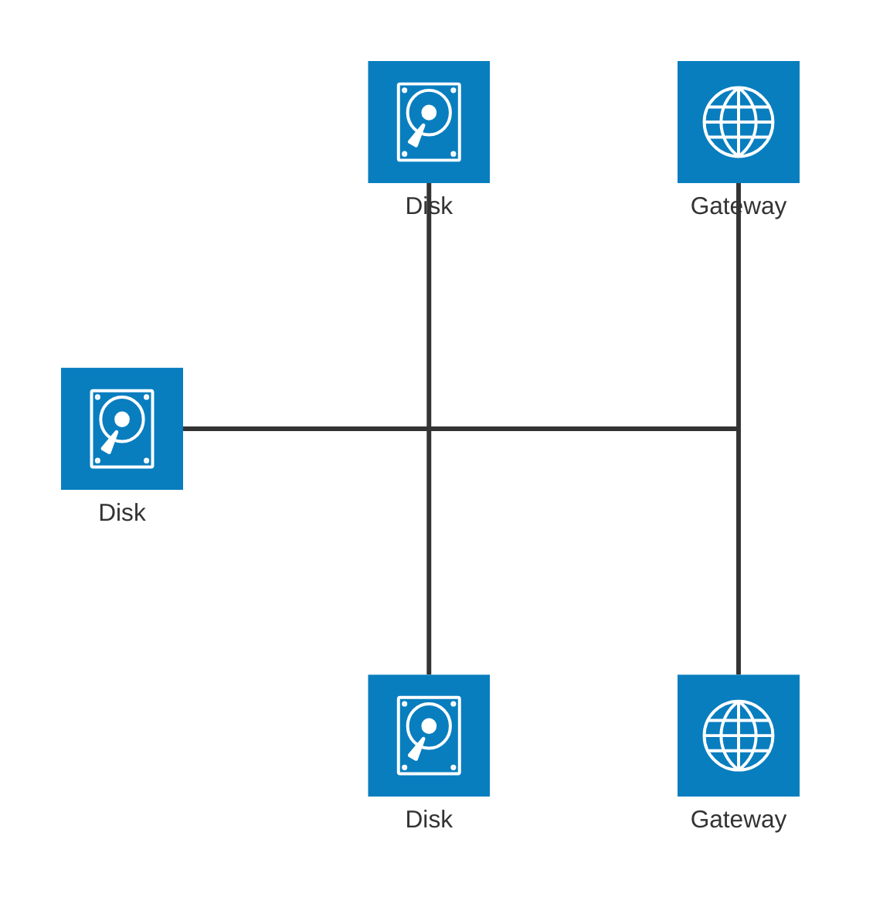

```mermaid
architecture-beta
    group api(logos:aws-lambda)[API]

    service db(logos:aws-aurora)[Database] in api
    service disk1(logos:aws-glacier)[Storage] in api
    service disk2(logos:aws-s3)[Storage] in api
    service server(logos:aws-ec2)[Server] in api

    db:L -- R:server
    disk1:T -- B:server
    disk2:T -- B:db
```

> 在 mermaid-js 的上下文中，架构图用于显示云或 CI/CD 部署中常见的服务和资源之间的关系。在架构图中，服务（节点）通过边连接。相关服务可以放在组中，以更好地说明它们的组织方式。架构图文档 (v11.1.0+)

Mermaid 的 `architecture-beta` 图中定义组、服务和关系：

:::tabs

@tab 架构图示例


@tab 代码

```
architecture-beta
    group api(cloud)[API]

    service db(database)[Database] in api
    service disk1(disk)[Storage] in api
    service disk2(disk)[Storage] in api
    service server(server)[Server] in api

    db:L -- R:server
    disk1:T -- B:server
    disk2:T -- B:db
```

:::

**关键点**  
- **组**：使用 `group 组名(图标)[标签]` 定义组。  
- **服务**：使用 `service 服务名(图标)[标签] in 组名` 定义服务并指定所属组。  
- **关系**：使用 `服务名:方向 -- 方向:服务名` 定义服务之间的关系，方向包括 `L`（左）、`R`（右）、`T`（上）、`B`（下）。  

:::details 实例说明  
- **组**：  
  - `api(cloud)[API]`：定义一个名为 `API` 的组，图标为 `cloud`。  
- **服务**：  
  - `db(database)[Database] in api`：在 `api` 组中定义一个名为 `Database` 的服务，图标为 `database`。  
  - `disk1(disk)[Storage] in api`：在 `api` 组中定义一个名为 `Storage` 的服务，图标为 `disk`。  
  - `disk2(disk)[Storage] in api`：在 `api` 组中定义另一个名为 `Storage` 的服务，图标为 `disk`。  
  - `server(server)[Server] in api`：在 `api` 组中定义一个名为 `Server` 的服务，图标为 `server`。  
- **关系**：  
  - `db:L -- R:server`：`Database` 服务的左侧连接到 `Server` 服务的右侧。  
  - `disk1:T -- B:server`：`Storage` 服务的顶部连接到 `Server` 服务的底部。  
  - `disk2:T -- B:db`：另一个 `Storage` 服务的顶部连接到 `Database` 服务的底部。  
  :::


## 语法

架构的构建块是 `groups`、`services`、`edges` 和 `junctions`。

对于支持组件，图标通过用 `()` 包围图标名称来声明，而标签通过用 `[]` 包围文本来声明。

要开始架构图，请使用关键字 `architecture-beta`，后跟你的组、服务、边和连接点。虽然 3 个构建块中的每一个都可以按任何顺序声明，但必须小心确保标识符先前已由另一个组件声明。

### 组

声明组的语法是：

```
group {group id}({icon name})[{title}] (in {parent id})?
```

放在一起：

```
group public_api(cloud)[Public API]
```

创建一个标识为 `public_api` 的组，使用图标 `cloud`，并具有标签 `Public API`。

此外，可以使用可选的 `in` 关键字将组放置在组中

```
group private_api(cloud)[Private API] in public_api
```

### 服务

声明服务的语法是：

```
service {service id}({icon name})[{title}] (in {parent id})?
```

放在一起：

```
service database1(database)[My Database]
```

创建标识为 `database1` 的服务，使用图标 `database`，标签为 `My Database`。

如果服务属于某个组，则可以通过可选的 `in` 关键字将其放置在其中

```
service database1(database)[My Database] in private_api
```

### 边缘

声明边的语法是：

```
{serviceId}{{group}}?:{T|B|L|R} {<}?--{>}? {T|B|L|R}:{serviceId}{{group}}?
```

#### 边缘方向

边从哪一侧出来，通过在服务连接到箭头的一侧添加冒号 (`:`) 并添加 `L|R|T|B` 来指定

例如：

```
db:R -- L:server
```

在服务 `db` 和 `server` 之间创建一条边，该边从 `db` 的右侧和 `server` 的左侧出来。

```
db:T -- L:server
```

在服务 `db` 和 `server` 之间创建 90 度边，边从 `db` 的顶部和 `server` 的左侧出来。

#### 箭头

可以通过在左侧方向前添加 `<` 和/或在右侧方向后添加 `>`，将箭头添加到边的每一侧。

例如：

```
subnet:R --> L:gateway
```

创建一条带有箭头的边，进入 `gateway` 服务

#### 组外的边缘

要让边从一个组转到另一个组或另一个组内的服务，可以在 `serviceId` 之后添加 `{group}` 修饰符。

例如：

```
service server[Server] in groupOne
service subnet[Subnet] in groupTwo

server{group}:B --> T:subnet{group}
```

创建一条从 `groupOne` 出来、与 `server` 相邻、进入 `groupTwo`、与 `subnet` 相邻的边。

需要注意的是，`groupId` 不能用于指定边，而 `{group}` 修饰符只能用于组内的服务。

### 连接点

连接是一种特殊类型的节点，可充当边之间的潜在 4 路分割。

声明连接的语法是：

```
junction {junction id} (in {parent id})?
```

Mermaid 的 `architecture-beta` 图中定义服务、连接点和关系：

:::tabs

@tab 架构图示例



@tab 代码

```
architecture-beta
    service left_disk(disk)[Disk]
    service top_disk(disk)[Disk]
    service bottom_disk(disk)[Disk]
    service top_gateway(internet)[Gateway]
    service bottom_gateway(internet)[Gateway]
    junction junctionCenter
    junction junctionRight

    left_disk:R -- L:junctionCenter
    top_disk:B -- T:junctionCenter
    bottom_disk:T -- B:junctionCenter
    junctionCenter:R -- L:junctionRight
    top_gateway:B -- T:junctionRight
    bottom_gateway:T -- B:junctionRight
```

:::

**关键点**  
- **服务**：使用 `service 服务名(图标)[标签]` 定义服务。  
- **连接点**：使用 `junction 连接点名` 定义连接点。  
- **关系**：使用 `服务名:方向 -- 方向:服务名` 或 `服务名:方向 -- 方向:连接点` 定义服务与连接点之间的关系，方向包括 `L`（左）、`R`（右）、`T`（上）、`B`（下）。  

:::details 实例说明  
- **服务**：  
  - `left_disk(disk)[Disk]`：定义一个名为 `Disk` 的服务，图标为 `disk`。  
  - `top_disk(disk)[Disk]`：定义另一个名为 `Disk` 的服务，图标为 `disk`。  
  - `bottom_disk(disk)[Disk]`：定义第三个名为 `Disk` 的服务，图标为 `disk`。  
  - `top_gateway(internet)[Gateway]`：定义一个名为 `Gateway` 的服务，图标为 `internet`。  
  - `bottom_gateway(internet)[Gateway]`：定义另一个名为 `Gateway` 的服务，图标为 `internet`。  
- **连接点**：  
  - `junctionCenter`：定义一个名为 `junctionCenter` 的连接点。  
  - `junctionRight`：定义一个名为 `junctionRight` 的连接点。  
- **关系**：  
  - `left_disk:R -- L:junctionCenter`：`left_disk` 服务的右侧连接到 `junctionCenter` 的左侧。  
  - `top_disk:B -- T:junctionCenter`：`top_disk` 服务的底部连接到 `junctionCenter` 的顶部。  
  - `bottom_disk:T -- B:junctionCenter`：`bottom_disk` 服务的顶部连接到 `junctionCenter` 的底部。  
  - `junctionCenter:R -- L:junctionRight`：`junctionCenter` 的右侧连接到 `junctionRight` 的左侧。  
  - `top_gateway:B -- T:junctionRight`：`top_gateway` 服务的底部连接到 `junctionRight` 的顶部。  
  - `bottom_gateway:T -- B:junctionRight`：`bottom_gateway` 服务的顶部连接到 `junctionRight` 的底部。  
  :::


## 图标

默认情况下，架构图支持以下图标：`cloud`, `database`, `disk`, `internet`, `server`.用户可以使用 iconify.design 中提供的 200,000 多个图标中的任何一个，也可以按照步骤 [此处](https://mermaid.nodejs.cn/config/icons.html) 添加自己的自定义图标。

安装图标后，可以使用 "name:icon-name" 格式在架构图中使用它们，其中 name 是注册图标包时使用的值。

Mermaid 的 `architecture-beta` 图中定义组、服务和关系，并使用 AWS 图标：

:::tabs

@tab 架构图示例



@tab 代码

```
architecture-beta
    group api(logos:aws-lambda)[API]

    service db(logos:aws-aurora)[Database] in api
    service disk1(logos:aws-glacier)[Storage] in api
    service disk2(logos:aws-s3)[Storage] in api
    service server(logos:aws-ec2)[Server] in api

    db:L -- R:server
    disk1:T -- B:server
    disk2:T -- B:db
```

:::

**关键点**  
- **组**：使用 `group 组名(logos:图标)[标签]` 定义组，并指定图标。  
- **服务**：使用 `service 服务名(logos:图标)[标签] in 组名` 定义服务并指定所属组和图标。  
- **关系**：使用 `服务名:方向 -- 方向:服务名` 定义服务之间的关系，方向包括 `L`（左）、`R`（右）、`T`（上）、`B`（下）。  

:::details 实例说明  
- **组**：  
  - `api(logos:aws-lambda)[API]`：定义一个名为 `API` 的组，图标为 AWS Lambda。  
- **服务**：  
  - `db(logos:aws-aurora)[Database] in api`：在 `api` 组中定义一个名为 `Database` 的服务，图标为 AWS Aurora。  
  - `disk1(logos:aws-glacier)[Storage] in api`：在 `api` 组中定义一个名为 `Storage` 的服务，图标为 AWS Glacier。  
  - `disk2(logos:aws-s3)[Storage] in api`：在 `api` 组中定义另一个名为 `Storage` 的服务，图标为 AWS S3。  
  - `server(logos:aws-ec2)[Server] in api`：在 `api` 组中定义一个名为 `Server` 的服务，图标为 AWS EC2。  
- **关系**：  
  - `db:L -- R:server`：`Database` 服务的左侧连接到 `Server` 服务的右侧。  
  - `disk1:T -- B:server`：`Storage` 服务的顶部连接到 `Server` 服务的底部。  
  - `disk2:T -- B:db`：另一个 `Storage` 服务的顶部连接到 `Database` 服务的底部。  
  :::


