Mermaid 的 `block-beta` 图中定义块、箭头和样式：

:::tabs

@tab 块图示例

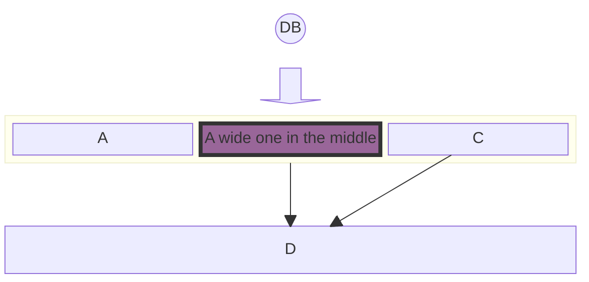

@tab 代码

```
block-beta
columns 1
  db(("DB"))
  blockArrowId6<["&nbsp;&nbsp;&nbsp;"]>(down)
  block:ID
    A
    B["A wide one in the middle"]
    C
  end
  space
  D
  ID --> D
  C --> D
  style B fill:#969,stroke:#333,stroke-width:4px
```

:::

**关键点**  
- **列**：使用 `columns` 定义列数。  
- **块**：使用 `块名(("标签"))` 或 `块名["标签"]` 定义块。  
- **箭头**：使用 `块名 --> 块名` 定义箭头，或使用 `blockArrowId<["标签"]>(方向)` 定义带标签的箭头。  
- **样式**：使用 `style 块名 样式属性` 定义块的样式。  

:::details 实例说明  
- **列**：`columns 1`，定义 1 列布局。  
- **块**：  
  - `db(("DB"))`：定义一个名为 `db` 的块，标签为 `DB`。  
  - `B["A wide one in the middle"]`：定义一个名为 `B` 的块，标签为 `A wide one in the middle`。  
  - `A`、`C`、`D`：定义名为 `A`、`C`、`D` 的块。  
- **箭头**：  
  - `blockArrowId6<["&nbsp;&nbsp;&nbsp;"]>(down)`：定义一个带标签的箭头，标签为空格，方向为 `down`。  
  - `ID --> D`：从 `ID` 块指向 `D` 块的箭头。  
  - `C --> D`：从 `C` 块指向 `D` 块的箭头。  
- **样式**：  
  - `style B fill:#969,stroke:#333,stroke-width:4px`：为 `B` 块设置填充颜色为 `#969`，边框颜色为 `#333`，边框宽度为 `4px`。  
  :::


## 1.定义和目的

框图是一种直观、有效的方式来直观地表示复杂的系统、流程或架构。它们由块和连接器组成，其中块代表基本组件或功能，连接器显示这些组件之间的关系或流程。这种图表方法在工程、软件开发和流程管理等各个字段都至关重要。

框图的主要目的是提供系统的高级视图，以便轻松理解和分析，而无需深入研究每个组件的复杂细节。这使得它们对于简化复杂系统以及解释系统内组件的整体结构和交互特别有用。

许多人使用 Mermaid 流程图来达到此目的。这样做的副作用是自动布局有时会将形状移动到图表制作者不想要的位置。框图使用不同的方法。在此图中，我们让作者完全控制形状的放置位置。


**使用场景**：框图在各个行业和学科中都有广泛的应用。一些关键用例包括：

- 软件架构：在软件开发中，框图可用于说明软件应用的体系结构。这包括显示不同模块或服务如何交互、数据流和高级组件交互。
- 网络图：框图非常适合表示 IT 和电信中的网络架构。它们可以描述不同的网络设备和服务如何互连，包括路由、交换机、防火墙以及网络上的数据流。
- 工艺流程图：在商业和制造中，可以使用框图来创建流程图。这些流程图代表业务或制造流程的各个阶段，有助于可视化步骤顺序、决策点和控制流程。
- 电气系统：工程师使用框图来表示电气系统和电路。它们可以说明电气系统的高级结构、不同电气组件之间的相互作用以及电流的流动。
- 教育目的：框图也广泛用于教育材料中，以简化的方式解释复杂的概念和系统。它们有助于分解和可视化科学理论、工程原理和技术系统。

这些示例展示了框图在提供复杂系统的清晰简洁表示方面的多功能性。它们的简单性和清晰度使它们成为各个字段的专业人士有效交流复杂想法的宝贵工具。

在以下部分中，我们将深入研究使用 Mermaid 创建和操作框图的细节，涵盖从基本语法到高级配置和样式的所有内容。

使用 Mermaid 创建框图非常简单且易于访问。本节介绍开始构建简单图表所需的基本语法和结构。了解这些基本概念是有效利用 Mermaid 完成更复杂的绘图任务的关键。

## 3.简单框图

### **基础结构**

框图的核心是由代表不同实体或组件的块组成。在 Mermaid 中，这些块可以使用简单的文本标签轻松创建。框图的最基本形式可以是一系列没有任何连接器的块。

示例 - 简单框图：要创建一个包含三个标记为 'a'、'b' 和 'c' 的块的简单框图，语法如下：

Mermaid 的 `block-beta` 图中定义块：

:::tabs

@tab 块图示例

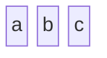

@tab 代码

```
block-beta
  a b c
```

:::

**关键点**  
- **块**：使用 `块名` 定义块，多个块可以在同一行中用空格分隔。  

:::details 实例说明  
- **块**：  
  - `a`：定义一个名为 `a` 的块。  
  - `b`：定义一个名为 `b` 的块。  
  - `c`：定义一个名为 `c` 的块。  
  :::


此示例将生成三个块的水平序列。每个块都会自动间隔和对齐，以实现最佳的可读性。

### 列用法

虽然简单的框图是线性且简单的，但更复杂的系统可能需要结构化布局。Mermaid 允许将块组织成多个列，从而有助于创建更复杂和详细的图表。

示例 - 多柱图：在需要将块分布到多个列的情况下，你可以指定列数并相应地排列块。以下是如何创建具有三列和四个块的框图，其中第四个块出现在第二行中：

Mermaid 的 `block-beta` 图中定义块和列：

:::tabs

@tab 块图示例

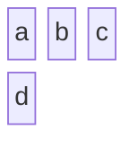

@tab 代码

```
block-beta
  columns 3
  a b c d
```

:::

**关键点**  
- **列**：使用 `columns` 定义列数。  
- **块**：使用 `块名` 定义块，多个块可以在同一行中用空格分隔。  

:::details 实例说明  
- **列**：`columns 3`，定义 3 列布局。  
- **块**：  
  - `a`：定义一个名为 `a` 的块。  
  - `b`：定义一个名为 `b` 的块。  
  - `c`：定义一个名为 `c` 的块。  
  - `d`：定义一个名为 `d` 的块。  
  :::


此语法指示 Mermaid 将块 'a'、'b'、'c' 和 'd' 排列在三列中，并根据需要换行到下一行。此功能对于表示分层或多层系统（例如网络层或分层结构）特别有用。

Mermaid 框图的这些基本构建块为更复杂的图表提供了基础。语法的简单性允许快速创建和迭代图表，使其成为可视化想法和概念的有效工具。在下一节中，我们将探讨高级块配置选项，包括设置块宽度和创建复合块。

## 3. 高级块配置

在基础知识的基础上，本节深入研究 Mermaid 中框图的更高级功能。这些功能使图表设计具有更大的灵活性和复杂性，可适应更广泛的用例和场景。

### 设置块宽度

在更复杂的图表中，你可能需要跨越多个列的块来强调某些组件或表示更大的实体。Mermaid 允许调整块宽度以覆盖多个列，从而增强图表的可读性和结构。

示例 - 跨多列的块：要创建一个块跨越两列的框图，你可以为每个块指定所需的宽度：

Mermaid 的 `block-beta` 图中定义块、列和块宽度：

:::tabs

@tab 块图示例

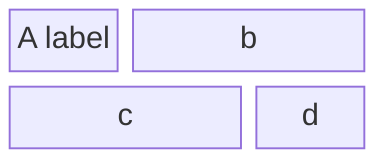

@tab 代码

```
block-beta
  columns 3
  a["A label"] b:2 c:2 d
```

:::

**关键点**  
- **列**：使用 `columns` 定义列数。  
- **块**：使用 `块名["标签"]` 或 `块名:宽度` 定义块，支持为块添加标签和指定宽度。  

:::details 实例说明  
- **列**：`columns 3`，定义 3 列布局。  
- **块**：  
  - `a["A label"]`：定义一个名为 `a` 的块，标签为 `A label`。  
  - `b:2`：定义一个名为 `b` 的块，宽度为 `2`。  
  - `c:2`：定义一个名为 `c` 的块，宽度为 `2`。  
  - `d`：定义一个名为 `d` 的块。  
  :::


在此示例中，标记为 "A 标签" 的块跨越一列，而块 'b'、'c' 跨越 2 列，'d' 再次分配了自己的列。块大小的这种灵活性对于准确表示具有不同重要性或大小的组件的系统至关重要。

### 创建复合块

复合块或块中的块是 Mermaid 框图语法中的一项高级功能。它们允许表示嵌套或分层系统，其中一个组件包含多个子组件。

示例 - 复合块：创建复合块涉及定义父块，然后在其中嵌套其他块。以下是如何定义具有嵌套元素的复合块：

Mermaid 的 `block-beta` 图中定义块和嵌套块：

:::tabs

@tab 块图示例

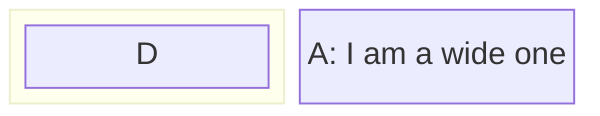

@tab 代码

```
block-beta
    block
      D
    end
    A["A: I am a wide one"]
```

:::

**关键点**  
- **块**：使用 `块名["标签"]` 定义块，支持为块添加标签。  
- **嵌套块**：使用 `block ... end` 定义嵌套块。  

:::details 实例说明  
- **块**：  
  - `A["A: I am a wide one"]`：定义一个名为 `A` 的块，标签为 `A: I am a wide one`。  
- **嵌套块**：  
  - `block ... end`：定义一个嵌套块，包含块 `D`。  
  :::


在此语法中，'D' 是较大父块内的嵌套块。此功能对于描述复杂的结构特别有用，例如具有多个服务的服务器或较大组织框架内的部门。

### 列宽动态

Mermaid 还允许根据块的内容动态调整列宽。列的宽度由列中最宽的块确定，确保图表保持平衡和可读。

示例 - 动态列宽：在具有不同块大小的图表中，Mermaid 会自动调整列宽以适合每列中最大的块。这是一个例子：

Mermaid 的 `block-beta` 图中定义块、列和嵌套块：

:::tabs

@tab 块图示例

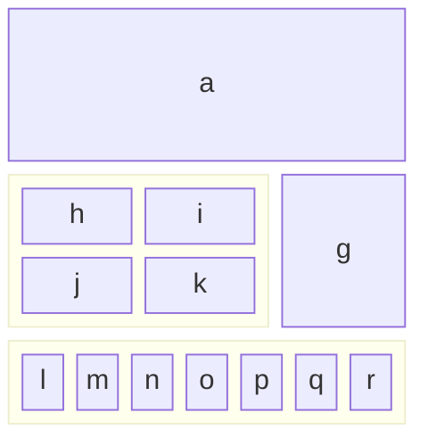

@tab 代码

```
block-beta
  columns 3
  a:3
  block:group1:2
    columns 2
    h i j k
  end
  g
  block:group2:3
    %% columns auto (default)
    l m n o p q r
  end
```

:::

**关键点**  
- **列**：使用 `columns` 定义列数。  
- **块**：使用 `块名:宽度` 定义块，支持指定宽度。  
- **嵌套块**：使用 `block:组名:宽度 ... end` 定义嵌套块，并指定组名和宽度。  
- **注释**：使用 `%%` 添加注释，注释不会被渲染。  

:::details 实例说明  
- **列**：  
  - `columns 3`：定义 3 列布局。  
- **块**：  
  - `a:3`：定义一个名为 `a` 的块，宽度为 `3`。  
  - `g`：定义一个名为 `g` 的块。  
- **嵌套块**：  
  - `block:group1:2 ... end`：定义一个名为 `group1` 的嵌套块，宽度为 `2`，内部使用 `columns 2` 定义 2 列布局，包含块 `h`、`i`、`j`、`k`。  
  - `block:group2:3 ... end`：定义一个名为 `group2` 的嵌套块，宽度为 `3`，内部使用默认列布局，包含块 `l`、`m`、`n`、`o`、`p`、`q`、`r`。  
- **注释**：`%% columns auto (default)`，添加注释，注释不会被渲染。  
:::


此示例演示了 Mermaid 如何动态调整列的宽度以适应最宽的块，在本例中为 'a' 和复合块 'e'。这种动态调整对于创建视觉平衡且易于理解的图表至关重要。

水平合并块：在需要水平堆叠块的情况下，可以使用列宽来完成任务。可以通过将块放在单个列中来垂直排列。以下是创建 4 个块堆叠在一起的框图的方法：


在此示例中，合并块的宽度会动态调整为最大子块的宽度。

借助这些高级配置选项，可以定制 Mermaid 的框图来表示各种复杂的系统和结构。这些功能提供的灵活性使用户能够创建信息丰富且具有视觉吸引力的图表。在以下部分中，我们将探索更多功能，包括不同的块形状和链接选项。

## 4. 块品种和形状

Mermaid 的框图不限于标准矩形形状。可以使用多种块形状，从而可以更细致和定制地表示不同类型的信息或实体。本节概述了可以在 Mermaid 中使用的不同块形状及其特定应用。

### 标准和特殊块形状

Mermaid 支持一系列块形状，以满足不同的图表需求，从基本的几何形状到更专业的形式。

#### 圆边块

要创建具有圆边的块，可用于表示更柔软或更灵活的组件：

Mermaid 的 `block-beta` 图中定义嵌套块和列：

:::tabs

@tab 块图示例

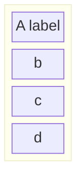

@tab 代码

```
block-beta
  block
    columns 1
    a["A label"] b c d
  end
```

:::

**关键点**  
- **嵌套块**：使用 `block ... end` 定义嵌套块。  
- **列**：使用 `columns` 定义列数。  
- **块**：使用 `块名["标签"]` 定义块，支持为块添加标签。  

:::details 实例说明  
- **嵌套块**：  
  - `block ... end`：定义一个嵌套块。  
- **列**：  
  - `columns 1`：定义 1 列布局。  
- **块**：  
  - `a["A label"]`：定义一个名为 `a` 的块，标签为 `A label`。  
  - `b`：定义一个名为 `b` 的块。  
  - `c`：定义一个名为 `c` 的块。  
  - `d`：定义一个名为 `d` 的块。  
  :::


#### 体育场形块

体育场形状的块类似于拉长的圆圈，可用于面向过程的组件：

Mermaid 的 `block-beta` 图中定义块和块内容：

:::tabs

@tab 块图示例

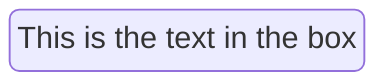

@tab 代码

```
block-beta
    id1("This is the text in the box")
```

:::

**关键点**  
- **块**：使用 `块名("块内容")` 定义块，并指定块内容。  

:::details 实例说明  
- **块**：  
  - `id1("This is the text in the box")`：定义一个名为 `id1` 的块，内容为 `This is the text in the box`。  
  :::


#### 子程序形状

为了表示子例程或包含的进程，具有双垂直线的块非常有用：

Mermaid 的 `block-beta` 图中定义块和块内容：

:::tabs

@tab 块图示例

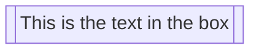

@tab 代码

```
block-beta
    id1[["This is the text in the box"]]
```

:::

**关键点**  
- **块**：使用 `块名[["块内容"]]` 定义块，并指定块内容。  

:::details 实例说明  
- **块**：  
  - `id1[["This is the text in the box"]]`：定义一个名为 `id1` 的块，内容为 `This is the text in the box`。  
  :::


#### 圆柱形

圆柱形非常适合表示数据库或存储组件：

Mermaid 的 `block-beta` 图中定义块和块内容：

:::tabs

@tab 块图示例

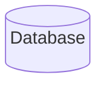

@tab 代码

```
block-beta
    id1[("Database")]
```

:::

**关键点**  
- **块**：使用 `块名[("块内容")]` 定义块，并指定块内容。  

:::details 实例说明  
- **块**：  
  - `id1[("Database")]`：定义一个名为 `id1` 的块，内容为 `Database`。  
  :::


#### 圆形

圆形可用于集中或关键组件：

Mermaid 的 `block-beta` 图中定义块和块内容，并将其渲染为圆形：

:::tabs

@tab 块图示例

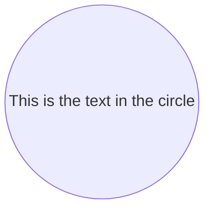

@tab 代码

```
block-beta
    id1(("This is the text in the circle"))
```

:::

**关键点**  
- **块**：使用 `块名(("块内容"))` 定义块，并指定块内容，块会被渲染为圆形。  

:::details 实例说明  
- **块**：  
  - `id1(("This is the text in the circle"))`：定义一个名为 `id1` 的块，内容为 `This is the text in the circle`，块会被渲染为圆形。  
  :::


#### 不对称、菱形和六边形形状

对于决策点，使用菱形，对于独特或专门的过程，可以使用不对称和六边形形状：

**不对称**

Mermaid 的 `block-beta` 图中定义块和块内容：

:::tabs

@tab 块图示例

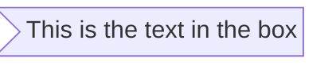

@tab 代码

```
block-beta
  id1>"This is the text in the box"]
```

:::

**关键点**  
- **块**：使用 `块名>"块内容"]` 定义块，并指定块内容。  

:::details 实例说明  
- **块**：  
  - `id1>"This is the text in the box"]`：定义一个名为 `id1` 的块，内容为 `This is the text in the box`。  
  :::


**菱形**

Mermaid 的 `block-beta` 图中定义块和块内容：

:::tabs

@tab 块图示例

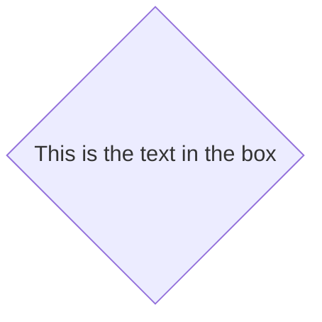

@tab 代码

```
block-beta
    id1{"This is the text in the box"}
```

:::

**关键点**  
- **块**：使用 `块名{"块内容"}` 定义块，并指定块内容。  

:::details 实例说明  
- **块**：  
  - `id1{"This is the text in the box"}`：定义一个名为 `id1` 的块，内容为 `This is the text in the box`。  
  :::


**六边形**

Mermaid 的 `block-beta` 图中定义块和块内容：

:::tabs

@tab 块图示例

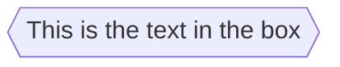

@tab 代码

```
block-beta
    id1{{"This is the text in the box"}}
```

:::

**关键点**  
- **块**：使用 `块名{{"块内容"}}` 定义块，并指定块内容。  

:::details 实例说明  
- **块**：  
  - `id1{{"This is the text in the box"}}`：定义一个名为 `id1` 的块，内容为 `This is the text in the box`。  
  :::


#### 平行四边形和梯形

平行四边形和梯形形状非常适合输入/输出和过渡过程：

Mermaid 的 `block-beta` 图中定义块和块内容，并使用斜角样式：

:::tabs

@tab 块图示例

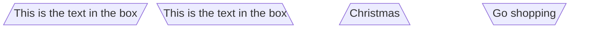

@tab 代码

```
block-beta
  id1[/"This is the text in the box"/]
  id2[\"This is the text in the box"\]
  A[/"Christmas"\]
  B[\"Go shopping"/]
```

:::

**关键点**  
- **块**：使用 `块名[/"块内容"/]` 或 `块名[\"块内容"\` 定义块，并指定块内容，块会被渲染为斜角样式。  

:::details 实例说明  
- **块**：  
  - `id1[/"This is the text in the box"/]`：定义一个名为 `id1` 的块，内容为 `This is the text in the box`，块会被渲染为斜角样式。  
  - `id2[\"This is the text in the box"\`：定义一个名为 `id2` 的块，内容为 `This is the text in the box`，块会被渲染为斜角样式。  
  - `A[/"Christmas"\`：定义一个名为 `A` 的块，内容为 `Christmas`，块会被渲染为斜角样式。  
  - `B[\"Go shopping"/]`：定义一个名为 `B` 的块，内容为 `Go shopping`，块会被渲染为斜角样式。  
  :::


#### 双圈

为了高亮关键或高优先级组件，双圆圈可能是有效的：

Mermaid 的 `block-beta` 图中定义块和块内容，并将其渲染为圆形：

:::tabs

@tab 块图示例

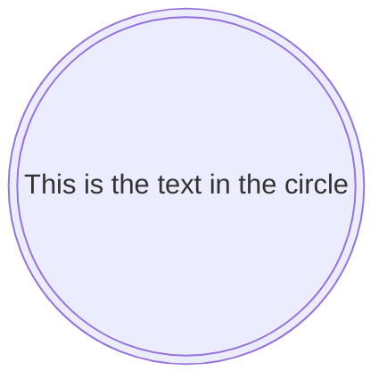

@tab 代码

```
block-beta
    id1((("This is the text in the circle")))
```

:::

**关键点**  
- **块**：使用 `块名((("块内容")))` 定义块，并指定块内容，块会被渲染为圆形。  

:::details 实例说明  
- **块**：  
  - `id1((("This is the text in the circle")))`：定义一个名为 `id1` 的块，内容为 `This is the text in the circle`，块会被渲染为圆形。  
  :::


### 块箭头和空格块

Mermaid 还提供独特的形状，例如箭头和空间块，用于定向流动和间距。

#### 块箭头

块箭头可以直观地指示流程内的方向或流程：

Mermaid 的 `block-beta` 图中定义带标签的箭头及其方向：

:::tabs

@tab 块图示例

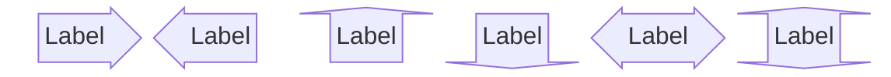

@tab 代码

```
block-beta
  blockArrowId<["Label"]>(right)
  blockArrowId2<["Label"]>(left)
  blockArrowId3<["Label"]>(up)
  blockArrowId4<["Label"]>(down)
  blockArrowId5<["Label"]>(x)
  blockArrowId6<["Label"]>(y)
  blockArrowId6<["Label"]>(x, down)
```

:::

**关键点**  
- **带标签的箭头**：使用 `blockArrowId<["标签"]>(方向)` 定义带标签的箭头，并指定方向。  
- **方向**：支持 `right`（右）、`left`（左）、`up`（上）、`down`（下）、`x`（水平）、`y`（垂直）等方向，也可以组合使用（如 `x, down`）。  

:::details 实例说明  
- **箭头**：  
  - `blockArrowId<["Label"]>(right)`：定义一个带标签 `Label` 的箭头，方向为右。  
  - `blockArrowId2<["Label"]>(left)`：定义一个带标签 `Label` 的箭头，方向为左。  
  - `blockArrowId3<["Label"]>(up)`：定义一个带标签 `Label` 的箭头，方向为上。  
  - `blockArrowId4<["Label"]>(down)`：定义一个带标签 `Label` 的箭头，方向为下。  
  - `blockArrowId5<["Label"]>(x)`：定义一个带标签 `Label` 的箭头，方向为水平。  
  - `blockArrowId6<["Label"]>(y)`：定义一个带标签 `Label` 的箭头，方向为垂直。  
  - `blockArrowId6<["Label"]>(x, down)`：定义一个带标签 `Label` 的箭头，方向为水平和下。  
  :::


#### 空间块

空间块可用于在图中创建有意的空白空间，这对于布局和可读性很有用：

or

Mermaid 的 `block-beta` 图中定义块和空白空间：

:::tabs

@tab 块图示例

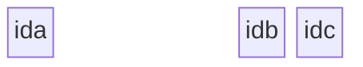

@tab 代码

```
block-beta
  ida space:3 idb idc
```

:::

**关键点**  
- **块**：使用 `块名` 定义块。  
- **空白空间**：使用 `space:宽度` 定义空白空间，并指定宽度。  

:::details 实例说明  
- **块**：  
  - `ida`：定义一个名为 `ida` 的块。  
  - `idb`：定义一个名为 `idb` 的块。  
  - `idc`：定义一个名为 `idc` 的块。  
- **空白空间**：  
  - `space:3`：定义一个宽度为 `3` 的空白空间。  
  :::


请注意，你可以使用数字符号 `space:num` 设置空间块占用的列数，其中 num 是指示 num 列宽度的数字。你还可以使用 `space`，它默认为一列。

Mermaid 中的各种形状和特殊块增强了框图的表达能力，允许更准确和针对特定上下文的表示。这些选项使用户可以灵活地创建信息丰富且具有视觉吸引力的图表。在接下来的部分中，我们将探索连接这些块并自定义其外观的方法。

### 标准和特殊块形状

讨论可用于块的各种形状，包括标准形状和特殊形式，例如块箭头和空间块。

## 5. 使用边连接块

Mermaid 中框图的主要功能之一是能够使用各种类型的边或链接来连接块。本节探讨块互连以表示组件之间的关系和流程的不同方式。

### 基础链接和箭头类型

连接块最基本的方面是使用箭头或链接。这些连接器描述了块之间的关系或信息流。Mermaid 提供了一系列箭头类型来满足不同的图表需求。

**示例 - 基本链接**

可以创建一个带有箭头的简单链接来显示从一个块到另一个块的方向或流程：

Mermaid 的 `block-beta` 图中定义块、空白空间和箭头：

:::tabs

@tab 块图示例

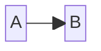

@tab 代码

```
block-beta
  A space B
  A-->B
```

:::

**关键点**  
- **块**：使用 `块名` 定义块。  
- **空白空间**：使用 `space` 定义空白空间。  
- **箭头**：使用 `块名-->块名` 定义箭头。  

:::details 实例说明  
- **块**：  
  - `A`：定义一个名为 `A` 的块。  
  - `B`：定义一个名为 `B` 的块。  
- **空白空间**：  
  - `space`：在 `A` 和 `B` 之间定义一个空白空间。  
- **箭头**：  
  - `A-->B`：从 `A` 块指向 `B` 块的箭头。  
  :::


该示例使用简单的箭头说明了从块 'A' 到块 'B' 的直接连接。

此语法创建一条连接 'A' 和 'B' 的线，暗示某种关系或连接，但不指示特定方向。

### 链接上的文本

除了连接块之外，通常还需要描述或标记关系。Mermaid 允许在链接上包含文本，为连接提供上下文。

示例 - 带链接的文本 要将文本添加到链接，语法包括链接定义中的文本：

Mermaid 的 `block-beta` 图中定义块、空白空间和带标签的箭头：

:::tabs

@tab 块图示例

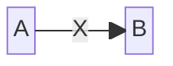

@tab 代码

```
block-beta
  A space:2 B
  A-- "X" -->B
```

:::

**关键点**  
- **块**：使用 `块名` 定义块。  
- **空白空间**：使用 `space:宽度` 定义空白空间，并指定宽度。  
- **带标签的箭头**：使用 `块名-- "标签" -->块名` 定义带标签的箭头。  

:::details 实例说明  
- **块**：  
  - `A`：定义一个名为 `A` 的块。  
  - `B`：定义一个名为 `B` 的块。  
- **空白空间**：  
  - `space:2`：在 `A` 和 `B` 之间定义一个宽度为 `2` 的空白空间。  
- **带标签的箭头**：  
  - `A-- "X" -->B`：从 `A` 块指向 `B` 块的箭头，标签为 `X`。  
  :::


此示例演示如何向链接添加描述性文本，以增强图表传达的信息。

示例 - 边缘和样式：

Mermaid 的 `block-beta` 图中定义块、空白空间和带标签的箭头：

:::tabs

@tab 块图示例

```mermaid
block-beta
  A space:2 B
  A-- "X" -->B
```

@tab 代码

```
block-beta
  A space:2 B
  A-- "X" -->B
```

:::

**关键点**  
- **块**：使用 `块名` 定义块。  
- **空白空间**：使用 `space:宽度` 定义空白空间，并指定宽度。  
- **带标签的箭头**：使用 `块名-- "标签" -->块名` 定义带标签的箭头。  

:::details 实例说明  
- **块**：  
  - `A`：定义一个名为 `A` 的块。  
  - `B`：定义一个名为 `B` 的块。  
- **空白空间**：  
  - `space:2`：在 `A` 和 `B` 之间定义一个宽度为 `2` 的空白空间。  
- **带标签的箭头**：  
  - `A-- "X" -->B`：从 `A` 块指向 `B` 块的箭头，标签为 `X`。  
  :::


## 6. 样式和定制

除了框图的结构和布局之外，Mermaid 还提供广泛的样式选项。这些定制功能允许创建更具视觉特性和信息丰富的图表。本节介绍如何将单独的样式应用于块以及如何使用类在多个元素之间实现一致的样式。

Mermaid 可以对各个块进行详细的样式设置，允许你应用各种 CSS 属性，例如颜色、描边和边框粗细。此功能对于高亮图表的特定部分或遵守某些视觉主题特别有用。

**示例 - 设计单个块的样式**

要将自定义样式应用于块，你可以使用 `style` 关键字，后跟块标识符和所需的 CSS 属性：

Mermaid 的 `block-beta` 图中定义块、箭头、样式和嵌套块：

:::tabs

@tab 块图示例

```mermaid
block-beta
columns 1
  db(("DB"))
  blockArrowId6<["&nbsp;&nbsp;&nbsp;"]>(down)
  block:ID
    A
    B["A wide one in the middle"]
    C
  end
  space
  D
  ID --> D
  C --> D
  style B fill:#939,stroke:#333,stroke-width:4px
```

@tab 代码

```
block-beta
columns 1
  db(("DB"))
  blockArrowId6<["&nbsp;&nbsp;&nbsp;"]>(down)
  block:ID
    A
    B["A wide one in the middle"]
    C
  end
  space
  D
  ID --> D
  C --> D
  style B fill:#939,stroke:#333,stroke-width:4px
```

:::

**关键点**  
- **列**：使用 `columns` 定义列数。  
- **块**：使用 `块名(("标签"))` 或 `块名["标签"]` 定义块，支持为块添加标签。  
- **箭头**：使用 `块名 --> 块名` 定义箭头。  
- **带标签的箭头**：使用 `blockArrowId<["标签"]>(方向)` 定义带标签的箭头。  
- **嵌套块**：使用 `block:组名 ... end` 定义嵌套块。  
- **空白空间**：使用 `space` 定义空白空间。  
- **样式**：使用 `style 块名 样式属性` 定义块的样式。  

:::details 实例说明  
- **列**：`columns 1`，定义 1 列布局。  
- **块**：  
  - `db(("DB"))`：定义一个名为 `db` 的块，标签为 `DB`，块会被渲染为圆形。  
  - `B["A wide one in the middle"]`：定义一个名为 `B` 的块，标签为 `A wide one in the middle`。  
  - `A`、`C`、`D`：定义名为 `A`、`C`、`D` 的块。  
- **箭头**：  
  - `ID --> D`：从 `ID` 块指向 `D` 块的箭头。  
  - `C --> D`：从 `C` 块指向 `D` 块的箭头。  
- **带标签的箭头**：  
  - `blockArrowId6<["&nbsp;&nbsp;&nbsp;"]>(down)`：定义一个带标签的箭头，标签为空格，方向为 `down`。  
- **嵌套块**：  
  - `block:ID ... end`：定义一个名为 `ID` 的嵌套块，包含块 `A`、`B`、`C`。  
- **空白空间**：  
  - `space`：在嵌套块和 `D` 块之间定义一个空白空间。  
- **样式**：  
  - `style B fill:#939,stroke:#333,stroke-width:4px`：为 `B` 块设置填充颜色为 `#939`，边框颜色为 `#333`，边框宽度为 `4px`。  
  :::


在此示例中，定义了名为 'blue' 的类并将其应用于块 'A'，而块 'B' 接收单独的样式。这证明了 Mermaid 在同一图表中应用共享和独特样式的灵活性。

单独或通过类设置块样式的能力提供了增强块图的视觉效果和清晰度的强大工具。无论是强调某些元素还是保持整个图表的凝聚力设计，这些样式功能都是有效图表绘制的核心。接下来的部分将介绍实际示例和用例，然后提供解决常见问题的提示。

## 7. 实际示例和用例

当应用于现实场景时，Mermaid 框图的多功能性变得显而易见。本节提供了演示前面几节中讨论的各种功能的应用的实际示例。这些示例展示了如何使用框图以可访问且信息丰富的方式表示复杂的系统和流程。结合结构、链接和样式元素，我们可以创建在不同上下文中满足特定目的的综合图表。

示例 - 系统架构:

说明具有互连组件的简单软件系统架构：

Mermaid 的 `block-beta` 图中定义块、箭头、样式和类：

:::tabs

@tab 块图示例

```mermaid
block-beta
  columns 3
  Frontend blockArrowId6<[" "]>(right) Backend
  space:2 down<[" "]>(down)
  Disk left<[" "]>(left) Database[("Database")]

  classDef front fill:#696,stroke:#333;
  classDef back fill:#969,stroke:#333;
  class Frontend front
  class Backend,Database back
```

@tab 代码

```
block-beta
  columns 3
  Frontend blockArrowId6<[" "]>(right) Backend
  space:2 down<[" "]>(down)
  Disk left<[" "]>(left) Database[("Database")]

  classDef front fill:#696,stroke:#333;
  classDef back fill:#969,stroke:#333;
  class Frontend front
  class Backend,Database back
```

:::

**关键点**  
- **列**：使用 `columns` 定义列数。  
- **块**：使用 `块名` 或 `块名[("标签")]` 定义块，支持为块添加标签。  
- **箭头**：使用 `blockArrowId<["标签"]>(方向)` 定义带标签的箭头。  
- **空白空间**：使用 `space:宽度` 定义空白空间，并指定宽度。  
- **样式**：使用 `classDef 类名 样式属性` 定义样式类，使用 `class 块名 类名` 应用样式类。  

:::details 实例说明  
- **列**：`columns 3`，定义 3 列布局。  
- **块**：  
  - `Frontend`：定义一个名为 `Frontend` 的块。  
  - `Backend`：定义一个名为 `Backend` 的块。  
  - `Disk`：定义一个名为 `Disk` 的块。  
  - `Database[("Database")]`：定义一个名为 `Database` 的块，标签为 `Database`，块会被渲染为圆形。  
- **箭头**：  
  - `blockArrowId6<[" "]>(right)`：定义一个带标签的箭头，标签为空格，方向为右。  
  - `down<[" "]>(down)`：定义一个带标签的箭头，标签为空格，方向为下。  
  - `left<[" "]>(left)`：定义一个带标签的箭头，标签为空格，方向为左。  
- **空白空间**：  
  - `space:2`：定义一个宽度为 `2` 的空白空间。  
- **样式**：  
  - `classDef front fill:#696,stroke:#333;`：定义一个名为 `front` 的样式类，填充颜色为 `#696`，边框颜色为 `#333`。  
  - `classDef back fill:#969,stroke:#333;`：定义一个名为 `back` 的样式类，填充颜色为 `#969`，边框颜色为 `#333`。  
  - `class Frontend front`：将 `front` 样式类应用到 `Frontend` 块。  
  - `class Backend,Database back`：将 `back` 样式类应用到 `Backend` 和 `Database` 块。  
  :::


示例 - 业务流程:

表示具有决策点和多个阶段的业务流程：

Mermaid 的 `block-beta` 图中定义块、箭头、样式和空白空间：

:::tabs

@tab 块图示例

```mermaid
block-beta
  columns 3
  Start(("Start")) space:2
  down<[" "]>(down) space:2
  Decision{{"Make Decision"}} right<["Yes"]>(right) Process1["Process A"]
  downAgain<["No"]>(down) space r3<["Done"]>(down)
  Process2["Process B"] r2<["Done"]>(right) End(("End"))

  style Start fill:#969;
  style End fill:#696;
```

@tab 代码

```
block-beta
  columns 3
  Start(("Start")) space:2
  down<[" "]>(down) space:2
  Decision{{"Make Decision"}} right<["Yes"]>(right) Process1["Process A"]
  downAgain<["No"]>(down) space r3<["Done"]>(down)
  Process2["Process B"] r2<["Done"]>(right) End(("End"))

  style Start fill:#969;
  style End fill:#696;
```

:::

**关键点**  
- **列**：使用 `columns` 定义列数。  
- **块**：使用 `块名(("标签"))` 或 `块名["标签"]` 定义块，支持为块添加标签。  
- **箭头**：使用 `blockArrowId<["标签"]>(方向)` 定义带标签的箭头。  
- **空白空间**：使用 `space` 或 `space:宽度` 定义空白空间，并指定宽度。  
- **样式**：使用 `style 块名 样式属性` 定义块的样式。  

:::details 实例说明  
- **列**：`columns 3`，定义 3 列布局。  
- **块**：  
  - `Start(("Start"))`：定义一个名为 `Start` 的块，标签为 `Start`，块会被渲染为圆形。  
  - `Decision{{"Make Decision"}}`：定义一个名为 `Decision` 的块，标签为 `Make Decision`，块会被渲染为菱形。  
  - `Process1["Process A"]`：定义一个名为 `Process1` 的块，标签为 `Process A`。  
  - `Process2["Process B"]`：定义一个名为 `Process2` 的块，标签为 `Process B`。  
  - `End(("End"))`：定义一个名为 `End` 的块，标签为 `End`，块会被渲染为圆形。  
- **箭头**：  
  - `down<[" "]>(down)`：定义一个带标签的箭头，标签为空格，方向为下。  
  - `right<["Yes"]>(right)`：定义一个带标签的箭头，标签为 `Yes`，方向为右。  
  - `downAgain<["No"]>(down)`：定义一个带标签的箭头，标签为 `No`，方向为下。  
  - `r3<["Done"]>(down)`：定义一个带标签的箭头，标签为 `Done`，方向为下。  
  - `r2<["Done"]>(right)`：定义一个带标签的箭头，标签为 `Done`，方向为右。  
- **空白空间**：  
  - `space:2`：定义一个宽度为 `2` 的空白空间。  
  - `space`：定义一个默认宽度的空白空间。  
- **样式**：  
  - `style Start fill:#969;`：为 `Start` 块设置填充颜色为 `#969`。  
  - `style End fill:#696;`：为 `End` 块设置填充颜色为 `#696`。  
  :::


这些实际示例和场景强调了 Mermaid 框图在简化和有效地跨各个字段传达复杂信息方面的实用性。

下一节“'故障排除和常见问题'”将提供有关解决使用 Mermaid 框图时遇到的常见挑战的见解，以确保流畅的图表绘制体验。

## 8. 故障排除和常见问题

#### 错误链接

一个常见的错误是不正确的链接语法，这可能会导致意外的结果或损坏的图表：

```
block-beta
  A - B
```

更正：确保使用箭头（--> 或 ---）正确指定块之间的链接，以定义连接的方向和类型。另请记住，框图的基础之一是让作者完全控制框的位置，因此在示例中你需要在框之间添加空格：

Mermaid 的 `block-beta` 图中定义块、空白空间和箭头：

:::tabs

@tab 块图示例

```mermaid
block-beta
  A space B
  A --> B
```

@tab 代码

```
block-beta
  A space B
  A --> B
```

:::

**关键点**  
- **块**：使用 `块名` 定义块。  
- **空白空间**：使用 `space` 定义空白空间。  
- **箭头**：使用 `块名 --> 块名` 定义箭头。  

:::details 实例说明  
- **块**：  
  - `A`：定义一个名为 `A` 的块。  
  - `B`：定义一个名为 `B` 的块。  
- **空白空间**：  
  - `space`：在 `A` 和 `B` 之间定义一个空白空间。  
- **箭头**：  
  - `A --> B`：从 `A` 块指向 `B` 块的箭头。  
  :::


#### 错位的样式

在错误的上下文中或使用不正确的语法应用样式可能会导致块的样式不符合预期：

Mermaid 的 `block-beta` 图中定义块和样式：

:::tabs

@tab 块图示例

```mermaid
block-beta
    A
    style A fill:#969
```

@tab 代码

```
block-beta
    A
    style A fill:#969
```

:::

**关键点**  
- **块**：使用 `块名` 定义块。  
- **样式**：使用 `style 块名 样式属性` 定义块的样式。  

:::details 实例说明  
- **块**：  
  - `A`：定义一个名为 `A` 的块。  
- **样式**：  
  - `style A fill:#969`：为 `A` 块设置填充颜色为 `#969`。  
  :::


更正：通过确保用逗号正确分隔样式属性并使用正确的 CSS 属性格式来更正语法：

Mermaid 的 `block-beta` 图中定义块和样式：

:::tabs

@tab 块图示例

```mermaid
block-beta
  A
  style A fill:#969,stroke:#333
```

@tab 代码

```
block-beta
  A
  style A fill:#969,stroke:#333
```

:::

**关键点**  
- **块**：使用 `块名` 定义块。  
- **样式**：使用 `style 块名 样式属性` 定义块的样式。  

:::details 实例说明  
- **块**：  
  - `A`：定义一个名为 `A` 的块。  
- **样式**：  
  - `style A fill:#969,stroke:#333`：为 `A` 块设置填充颜色为 `#969`，边框颜色为 `#333`。  
  :::


### 复杂图表结构的技巧

管理 Mermaid 图中的复杂性涉及规划和采用最佳实践。

- **模块化设计**

将复杂的图表分解为更小、更易于管理的组件。这种方法不仅使图表更易于理解，而且简化了创建和维护过程。

- **一致的风格**

使用类在相似元素之间保持一致的样式。这不仅节省了时间，还确保了外观的凝聚力和专业性。

- **注释和文档**

在 Mermaid 语法中使用带有 `%%` 的注释来记录图表各个部分的用途。这种做法对于保持清晰度非常宝贵，尤其是在团队工作或在一段时间后返回图表时。

通过这些故障排除提示和最佳实践，你可以有效管理和解决 Mermaid 框图中的常见问题。最后一部分，'结论'，将总结本文档中涵盖的要点，并邀请用户反馈以进行持续改进。
