> "在软件工程中，统一建模语言（UML）中的类图是一种静态结构图，它通过显示系统的类、它们的属性、操作（或方法）以及对象之间的关系来描述系统的结构。"
>
> -Wikipedia

类图是面向对象建模的主要构建块。它用于应用结构的一般概念建模，以及将模型转换为编程代码的详细建模。类图也可用于数据建模。类图中的类表示主要元素、应用中的交互以及要编程的类。

Mermaid 类图中添加注释、继承关系和类属性：

:::tabs

@tab 动物示例类图

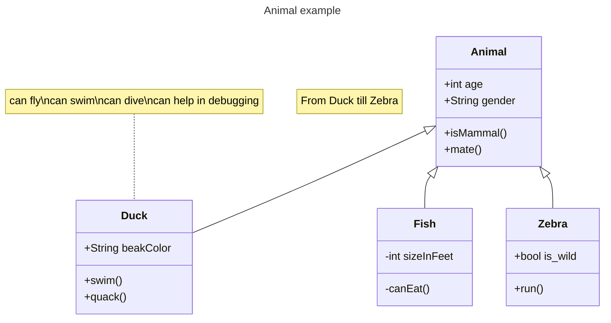

@tab 代码

```
---
title: Animal example
---
classDiagram
    note "From Duck till Zebra"
    Animal <|-- Duck
    note for Duck "can fly\ncan swim\ncan dive\ncan help in debugging"
    Animal <|-- Fish
    Animal <|-- Zebra
    Animal : +int age
    Animal : +String gender
    Animal: +isMammal()
    Animal: +mate()
    class Duck{
        +String beakColor
        +swim()
        +quack()
    }
    class Fish{
        -int sizeInFeet
        -canEat()
    }
    class Zebra{
        +bool is_wild
        +run()
    }
```

:::

**关键点**:

- **注释（`note`）**：使用 `note` 添加全局注释或特定类的注释，支持多行文本（用 `\n` 分隔）。  
- **继承关系（`<|--`）**：使用 `<|--` 表示类之间的继承关系。  
- **类属性与方法**：使用 `+` 表示公共属性和方法，`-` 表示私有属性和方法。  
- **类定义**：使用 `class` 关键字定义类，并在大括号 `{}` 中列出属性和方法。  
- **标题**：使用 `---` 和 `title` 添加图表标题。  


:::details 示例说明

1. **`Animal` 类**：作为基类，定义了公共属性（`age` 和 `gender`）和方法（`isMammal` 和 `mate`）。  
2. **`Duck` 类**：继承自 `Animal`，添加了 `beakColor` 属性和 `swim`、`quack` 方法，并附带注释说明其能力。  
3. **`Fish` 类**：继承自 `Animal`，定义了私有属性 `sizeInFeet` 和方法 `canEat`。  
4. **`Zebra` 类**：继承自 `Animal`，添加了 `is_wild` 属性和 `run` 方法。  
5. **全局注释**：`From Duck till Zebra` 描述了图表的范围。  

:::

## 语法

UML 提供了表示类成员（例如属性和方法）以及有关它们的附加信息的机制。图中类的单个实例包含三个部分：

- 顶部隔间包含类的名称。它以粗体居中打印，第一个字母大写。它还可能包含描述类性质的可选注释文本。
- 中间的部分包含类的属性。它们左对齐且第一个字母小写。
- 底部隔间包含该类可以执行的操作。它们也是左对齐的，并且第一个字母是小写的。

以下是将你提供的文本处理为 `:::tabs` 格式的示例，并将关键点以普通加黑形式呈现：

:::tabs

@tab 银行示例类图

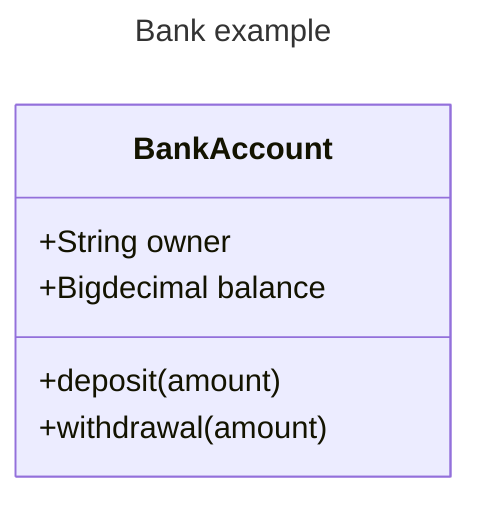

@tab 代码

```
---
title: Bank example
---
classDiagram
    class BankAccount
    BankAccount : +String owner
    BankAccount : +Bigdecimal balance
    BankAccount : +deposit(amount)
    BankAccount : +withdrawal(amount)
```

:::

**关键点**  
- **类定义**：使用 `class` 关键字定义类。  
- **类属性**：使用 `+` 表示公共属性，格式为 `类名 : +类型 属性名`。  
- **类方法**：使用 `+` 表示公共方法，格式为 `类名 : +方法名(参数)`。  
- **标题**：使用 `---` 和 `title` 添加图表标题。

## 定义一个类

定义类有两种方法：

- 显式使用关键字 class（如 `class Animal`）来定义 Animal 类。
- 通过一次定义两个类及其关系的关系。例如，`Vehicle <|-- Car`。

Mermaid 类图中定义类和继承关系：

:::tabs

@tab 类与继承关系

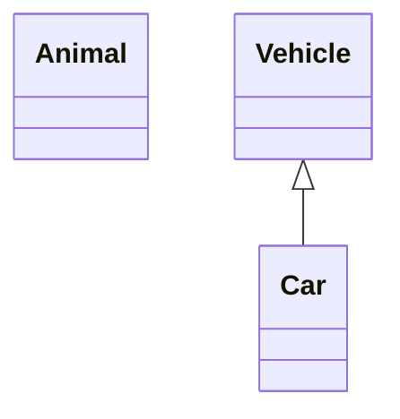

@tab 代码

```
classDiagram
    class Animal
    Vehicle <|-- Car
```

:::

::: details **关键点**  
- **类定义**：使用 `class` 关键字定义类。  
- **继承关系**：使用 `<|--` 表示类之间的继承关系，左侧为父类，右侧为子类。  

:::

命名约定：类名只能由字母数字字符（包括 unicode）、下划线和短划线 (-) 组成。

### 类别标签

Mermaid 类图中定义带标签的类和关系：

:::tabs

@tab 带标签的类与关系

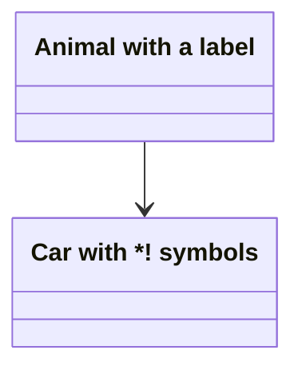

@tab 代码

```
classDiagram
    class Animal["Animal with a label"]
    class Car["Car with *! symbols"]
    Animal --> Car
```

:::

**关键点**  
- **带标签的类**：使用 `["标签内容"]` 为类定义自定义标签，标签内容可以包含特殊符号或描述。  
- **关系**：使用 `-->` 表示类之间的关系，箭头指向目标类。  

::: details **示例说明:**

1. **`Animal` 类**：定义了一个带标签的类，标签为 `"Animal with a label"`。  
2. **`Car` 类**：定义了一个带标签的类，标签为 `"Car with *! symbols"`。  
3. **关系**：`Animal` 与 `Car` 之间存在一种关系，用箭头 `-->` 表示。  

:::

`反引号`来转义标签中的特殊字符：

Mermaid 类图中使用带特殊字符的类名和关系：

:::tabs

@tab 带特殊字符的类与关系

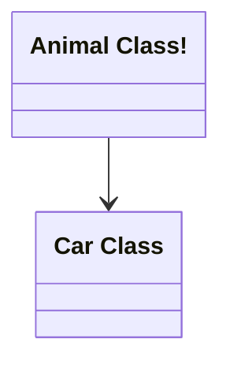

@tab 代码

```
classDiagram
    class `Animal Class!`
    class `Car Class`
    `Animal Class!` --> `Car Class`
```

:::

**关键点**  
- **带特殊字符的类名**：使用反引号 `` ` `` 包裹类名，支持类名中包含空格或特殊字符（如 `!`）。  
- **关系**：使用 `-->` 表示类之间的关系，箭头指向目标类。  

::: details 实例说明
- **`Animal Class!` 类**：定义了一个包含特殊字符 `!` 和空格的类。  
- **`Car Class` 类**：定义了一个包含空格的类。  
- **关系**：`Animal Class!` 与 `Car Class` 之间存在一种关系，用箭头 `-->` 表示。  

:::

## 定义类的成员

Mermaid 根据括号 `()` 是否存在来区分属性和函数/方法。带有 `()` 的被视为函数/方法，所有其他被视为属性。

有两种方法可以定义类的成员

- 使用 :（冒号）后跟成员名称来关联类的成员，这对于一次定义一个成员很有用。例如：

Mermaid 类图中定义类及其属性和方法：

:::tabs

@tab 银行账户类图

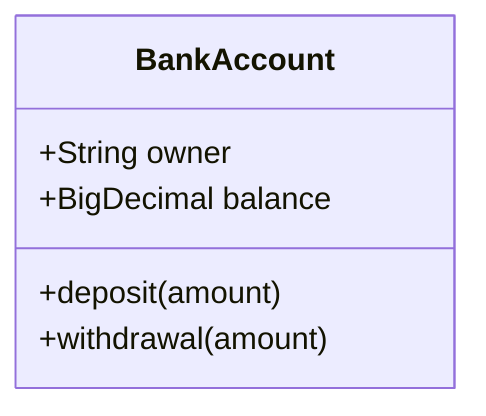

@tab 代码

```
classDiagram
class BankAccount
BankAccount : +String owner
BankAccount : +BigDecimal balance
BankAccount : +deposit(amount)
BankAccount : +withdrawal(amount)
```

:::

- 使用 {} 括号关联类的成员，其中成员分组在大括号内。适合一次定义多个成员。例如：

Mermaid 类图中使用类定义块（`{}`）定义类及其属性和方法：

:::tabs

@tab 银行账户类图


@tab 代码

```
classDiagram
class BankAccount{
    +String owner
    +BigDecimal balance
    +deposit(amount)
    +withdrawal(amount)
}
```

:::

**关键点**  
- **类定义块**：使用 `{}` 包裹类的属性和方法，使代码更结构化。  
- **类属性**：使用 `+` 表示公共属性，格式为 `+类型 属性名`。  
- **类方法**：使用 `+` 表示公共方法，格式为 `+方法名(参数)`。  

#### 返回类型

使用将返回的数据类型来结束方法/函数定义

::: warning

最终的 `)` 和返回类型之间必须有空格。

:::

 Mermaid 类图中使用类定义块（`{}`）定义类及其属性和方法，包括方法的返回类型：

:::tabs

@tab 银行账户类图

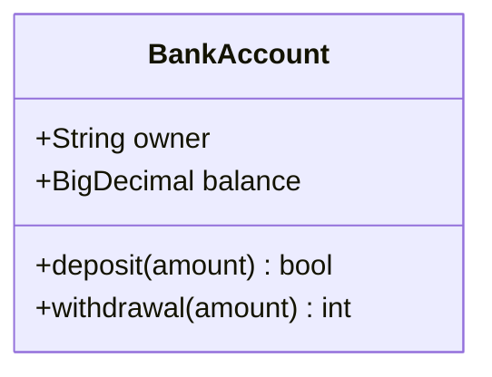

@tab 代码

```
classDiagram
class BankAccount{
    +String owner
    +BigDecimal balance
    +deposit(amount) bool
    +withdrawal(amount) int
}
```

:::

**关键点**  
- **类定义块**：使用 `{}` 包裹类的属性和方法，使代码更结构化。  
- **类属性**：使用 `+` 表示公共属性，格式为 `+类型 属性名`。  
- **类方法**：使用 `+` 表示公共方法，格式为 `+方法名(参数) 返回类型`。  

::: details 实例说明
- **`BankAccount` 类**：表示银行账户，定义了以下内容：  
  - **属性**：  
    - `owner`（账户持有人，类型为 `String`）。  
    - `balance`（账户余额，类型为 `BigDecimal`）。  
  - **方法**：  
    - `deposit(amount) bool`：存款操作，返回布尔值表示成功或失败。  
    - `withdrawal(amount) int`：取款操作，返回整数值表示取款状态或结果。  

:::

#### 通用类型

泛型可以表示为类定义的一部分，也可以表示为类成员/返回类型。为了将该项目表示为通用项，请将该类型括在 `~`（波形符）内。支持嵌套类型声明（例如 `List<List<int>>`），但当前不支持包含逗号的泛型。（如 `List<List<K, V>>`）

> 请注意，当在类定义中使用泛型时，泛型类型不被视为类名称的一部分。IE。：对于任何需要引用类名的语法，你需要删除定义的类型部分。这也意味着 mermaid 目前不支持两个具有相同名称但泛型类型不同的类。

Mermaid 类图中使用泛型（`~`）定义类及其属性和方法：

:::tabs

@tab 泛型类图

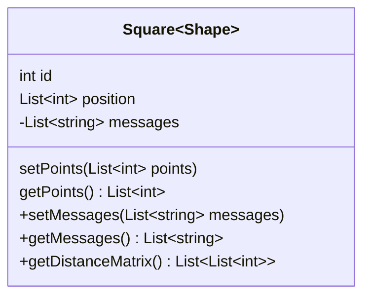

@tab 代码

```
classDiagram
class Square~Shape~{
    int id
    List~int~ position
    setPoints(List~int~ points)
    getPoints() List~int~
}

Square : -List~string~ messages
Square : +setMessages(List~string~ messages)
Square : +getMessages() List~string~
Square : +getDistanceMatrix() List~List~int~~
```

:::

**关键点**  
- **泛型类**：使用 `~` 表示泛型类型，例如 `Square~Shape~` 表示 `Square` 是一个泛型类，泛型参数为 `Shape`。  
- **泛型属性和方法**：使用 `~` 定义泛型类型，例如 `List~int~` 表示 `List` 的泛型类型为 `int`。  
- **访问修饰符**：使用 `+` 表示公共成员，`-` 表示私有成员。  
- **类定义块**：使用 `{}` 包裹类的属性和方法，使代码更结构化。  

::: details 实例说明
- **`Square~Shape~` 类**：表示一个泛型类，定义了以下内容：  
  - **属性**：  
    - `id`（整型 ID）。  
    - `position`（泛型列表，类型为 `List~int~`）。  
  - **方法**：  
    - `setPoints(List~int~ points)`：设置点列表。  
    - `getPoints() List~int~`：获取点列表。  
- **`Square` 类的其他成员**：  
  - **属性**：  
    - `messages`（私有泛型列表，类型为 `List~string~`）。  
  - **方法**：  
    - `setMessages(List~string~ messages)`：设置消息列表。  
    - `getMessages() List~string~`：获取消息列表。  
    - `getDistanceMatrix() List~List~int~~`：获取距离矩阵，返回嵌套的泛型列表。  

:::

#### 能见度

为了描述属于类（即类成员）的属性或方法/函数的可见性（或封装），

- `+` Public
- `-` Private
- `#` Protected
- `~` Package/Internal

> 通过在方法末尾添加以下符号来在方法定义中包含其他分类器，即：在 `()` 或返回类型之后：
>
> - `*` Abstract：`someAbstractMethod()*` 或 `someAbstractMethod() int*`
> - `$` Static：`someStaticMethod()$` 或 `someStaticMethod() String$`

> 请通过在末尾添加以下符号来在字段定义中包含其他分类器：
>
> - `$` Static：`String someField$`

## 定义关系

关系是一个通用术语，涵盖类图和对象图上发现的特定类型的逻辑连接。


```
[classA][Arrow][ClassB]
```

目前支持的 UML 下为类定义了八种不同类型的关系：

| 类型   | 描述         |
| :----- | :----------- |
| `<|--` | 继承         |
| `*--`  | 作品         |
| `o--`  | 聚合         |
| `-->`  | 关联         |
| `--`   | 链接（实心） |
| `..>`  | 依赖         |
| `..|>` | 实现         |
| `..`   | 链接（虚线） |

 Mermaid 类图中使用不同的关系符号表示类之间的关系：

:::tabs

@tab 类关系图

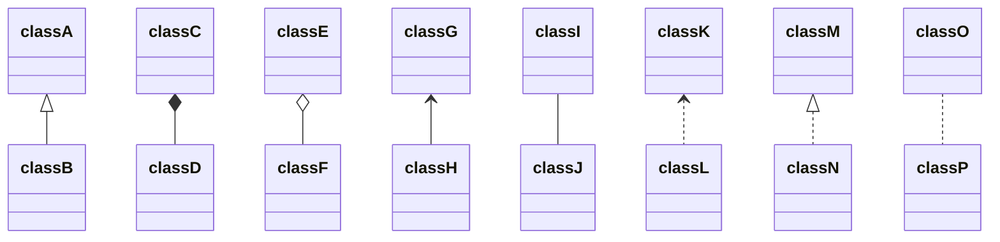

@tab 代码

```
classDiagram
classA <|-- classB
classC *-- classD
classE o-- classF
classG <-- classH
classI -- classJ
classK <.. classL
classM <|.. classN
classO .. classP
```

:::

**关键点**  
- **继承关系**：  
  - `<|--`：表示 `classB` 继承自 `classA`。  
  - `<|..`：表示 `classN` 继承自 `classM`（虚线表示）。  
- **组合关系**：  
  - `*--`：表示 `classD` 是 `classC` 的一部分（强组合）。  
- **聚合关系**：  
  - `o--`：表示 `classF` 是 `classE` 的一部分（弱聚合）。  
- **关联关系**：  
  - `<--`：表示 `classH` 与 `classG` 之间的单向关联。  
  - `--`：表示 `classI` 与 `classJ` 之间的双向关联。  
- **依赖关系**：  
  - `<..`：表示 `classL` 依赖于 `classK`（虚线表示）。  
  - `..`：表示 `classO` 与 `classP` 之间的双向依赖（虚线表示）。  

::: details 实例说明
- **`classA <|-- classB`**：`classB` 继承自 `classA`。  
- **`classC *-- classD`**：`classD` 是 `classC` 的一部分（强组合）。  
- **`classE o-- classF`**：`classF` 是 `classE` 的一部分（弱聚合）。  
- **`classG <-- classH`**：`classH` 单向关联 `classG`。  
- **`classI -- classJ`**：`classI` 与 `classJ` 双向关联。  
- **`classK <.. classL`**：`classL` 依赖于 `classK`。  
- **`classM <|.. classN`**：`classN` 继承自 `classM`（虚线表示）。  
- **`classO .. classP`**：`classO` 与 `classP` 双向依赖（虚线表示）。  

:::

箭头也可以用于相反的方向：

Mermaid 类图中使用不同的关系符号表示类之间的关系，并添加关系标签：

:::tabs

@tab 类关系图

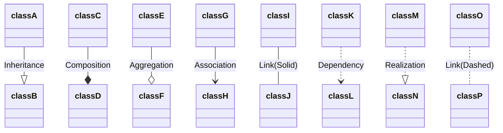

@tab 代码

```
classDiagram
classA --|> classB : Inheritance
classC --* classD : Composition
classE --o classF : Aggregation
classG --> classH : Association
classI -- classJ : Link(Solid)
classK ..> classL : Dependency
classM ..|> classN : Realization
classO .. classP : Link(Dashed)
```

:::

### 关系标签

可以将标签文本添加到关系中：

```
[classA][Arrow][ClassB]:LabelText
```


Mermaid 类图中使用不同的关系符号表示类之间的关系，并添加关系标签：

:::tabs

@tab 类关系图

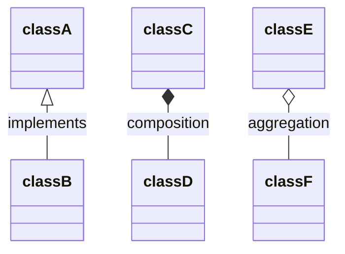

@tab 代码

```
classDiagram
classA <|-- classB : implements
classC *-- classD : composition
classE o-- classF : aggregation
```

:::

**关键点**  
- **继承关系**：  
  - `<|--`：表示 `classB` 继承自 `classA`，标签为 `implements`。  
- **组合关系**：  
  - `*--`：表示 `classD` 是 `classC` 的一部分，标签为 `composition`。  
- **聚合关系**：  
  - `o--`：表示 `classF` 是 `classE` 的一部分，标签为 `aggregation`。  

::: details 实例说明
- **`classA <|-- classB : implements`**：`classB` 继承自 `classA`，关系标签为 `implements`。  
- **`classC *-- classD : composition`**：`classD` 是 `classC` 的一部分，关系标签为 `composition`。  
- **`classE o-- classF : aggregation`**：`classF` 是 `classE` 的一部分，关系标签为 `aggregation`。  

:::

### 双向关系

关系在逻辑上可以表示 N:M 关联：

Mermaid 类图中使用双向继承关系符号：

:::tabs

@tab 双向继承关系

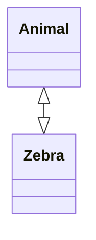

@tab 代码

```
classDiagram
    Animal <|--|> Zebra
```

:::

**关键点**  
- **双向继承关系**：  
  - `<|--|>`：表示 `Animal` 和 `Zebra` 之间存在双向继承关系。  

::: details 实例说明
- **`Animal <|--|> Zebra`**：`Animal` 和 `Zebra` 之间存在双向继承关系，意味着 `Animal` 可以继承 `Zebra` 的特性，同时 `Zebra` 也可以继承 `Animal` 的特性。  

:::

语法如下：

```
[Relation Type][Link][Relation Type]
```

其中 `Relation Type` 可以是以下之一：

| 类型 | 描述 |
| :--- | :--- |
| `<|` | 继承 |
| `\*` | 作品 |
| `o`  | 聚合 |
| `>`  | 关联 |
| `<`  | 关联 |
| `|>` | 实现 |

`Link` 可以是以下之一：

| 类型 | 描述 |
| :--- | :--- |
| --   | 实线 |
| ..   | 虚线 |

### 棒棒糖界面

类也可以被赋予一个特殊的关系类型，该关系类型在类上定义棒棒糖接口。棒棒糖接口使用以下语法定义：

- `bar ()-- foo`
- `foo --() bar`

带有棒棒糖的界面（bar）连接到类（foo）。

:::warning

注意：定义的每个接口都是唯一的，并且不应在类之间共享/有多个边缘连接到它。

:::

Mermaid 类图中使用简单关联关系符号：

:::tabs

@tab 简单关联关系

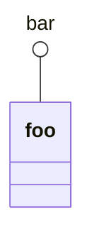

@tab 代码

```
classDiagram
  bar ()-- foo
```

:::

**关键点**  
- **简单关联关系**：  
  - `()--`：表示 `bar` 和 `foo` 之间存在简单关联关系。  

::: details 实例说明
- **`bar ()-- foo`**：`bar` 和 `foo` 之间存在简单关联关系，意味着 `bar` 和 `foo` 之间存在某种连接或关联。

:::  

Mermaid 类图中定义类及其属性和方法，以及表示类之间的关系：

:::tabs

@tab 类与关系图

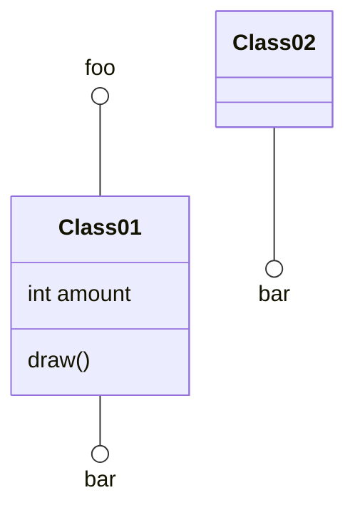

@tab 代码

```
classDiagram
  class Class01 {
    int amount
    draw()
  }
  Class01 --() bar
  Class02 --() bar

  foo ()-- Class01
```

:::

**关键点**  
- **类定义**：使用 `class` 关键字定义类，并在 `{}` 中列出属性和方法。  
- **类属性**：使用 `+` 表示公共属性，`-` 表示私有属性，`#` 表示受保护的属性。  
- **类方法**：使用 `+` 表示公共方法，`-` 表示私有方法，`#` 表示受保护的方法。  
- **关联关系**：使用 `--()` 表示类之间的关联关系。  

::: details 实例说明
- **`Class01` 类**：表示一个类，定义了以下内容：  
  - **属性**：  
    - `amount`（整型属性）。  
  - **方法**：  
    - `draw()`：表示一个方法。  
- **关联关系**：  
  - `Class01 --() bar`：`Class01` 与 `bar` 之间存在关联关系。  
  - `Class02 --() bar`：`Class02` 与 `bar` 之间存在关联关系。  
  - `foo ()-- Class01`：`foo` 与 `Class01` 之间存在关联关系。  

:::

## 定义命名空间

命名空间对类进行分组。

Mermaid 类图中使用命名空间（`namespace`）定义类及其属性：

:::tabs

@tab 命名空间与类图

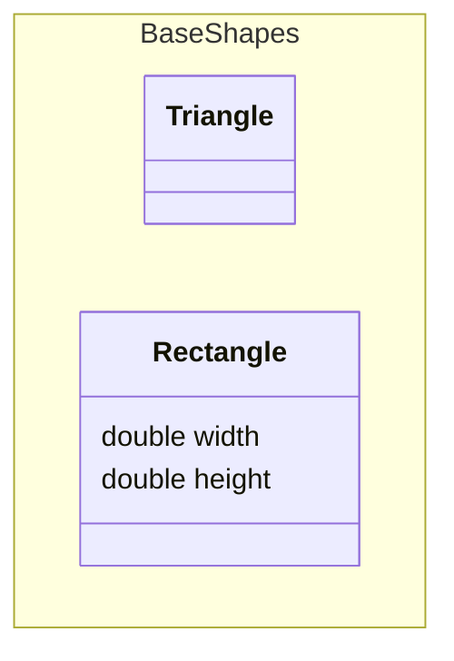

@tab 代码

```
classDiagram
namespace BaseShapes {
    class Triangle
    class Rectangle {
      double width
      double height
    }
}
```

:::

**关键点**  
- **命名空间**：使用 `namespace` 关键字定义命名空间，将相关类组织在一起。  
- **类定义**：使用 `class` 关键字定义类，并在 `{}` 中列出属性。  
- **类属性**：使用 `+` 表示公共属性，`-` 表示私有属性，`#` 表示受保护的属性。  

::: details 实例说明
- **`BaseShapes` 命名空间**：包含两个类 `Triangle` 和 `Rectangle`。  
- **`Triangle` 类**：表示一个三角形类，未定义具体属性或方法。  
- **`Rectangle` 类**：表示一个矩形类，定义了以下属性：  
  - `width`（宽度，类型为 `double`）。  
  - `height`（高度，类型为 `double`）。  

:::

## 关系的基数/多重性

类图中的多重性或基数指示可以链接到另一类的实例的一个类的实例数。例如，每个公司都会有一名或多名员工（不是零），并且每个员工当前为零个或一个公司工作。

多重符号放置在关联的末尾附近。

不同的基数选项是：

- `1` 只有 1 个
- `0..1` 零或一
- `1..*` 一个或多个
- `*` 许多
- `n` n（其中 n>1）
- `0..n` 0 到 n（其中 n>1）
- `1..n` 1 到 n（其中 n>1）

通过将文本选项放在给定箭头之前或之后的引号 `"` 内，可以轻松定义基数。例如：

```
[classA] "cardinality1" [Arrow] "cardinality2" [ClassB]:LabelText
```

Mermaid 类图中使用多重性（multiplicity）表示类之间的关系：

:::tabs

@tab 多重性关系图

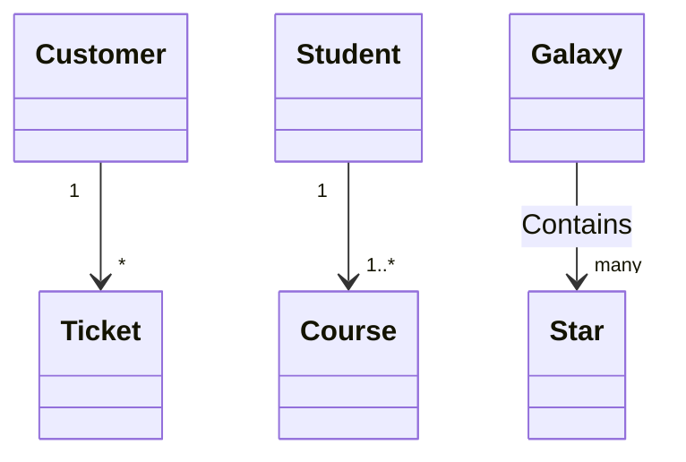

@tab 代码

```
classDiagram
    Customer "1" --> "*" Ticket
    Student "1" --> "1..*" Course
    Galaxy --> "many" Star : Contains
```

:::

**关键点**  
- **多重性**：使用 `"n"` 或 `"n..m"` 表示类之间的多重性关系，描述对象之间的数量关系。  
- **关系标签**：使用 `:` 添加关系标签，描述关系的含义。  
- **关系符号**：使用 `-->` 表示单向关系。  

::: details 实例说明
- **`Customer "1" --> "*" Ticket`**：一个 `Customer` 可以拥有多个 `Ticket`。  
- **`Student "1" --> "1..*" Course`**：一个 `Student` 可以注册一个或多个 `Course`。  
- **`Galaxy --> "many" Star : Contains`**：一个 `Galaxy` 包含多个 `Star`，关系标签为 `Contains`。  

:::

## 类上的注释

可以使用标记来注释类，以提供有关该类的附加元数据。这可以更清楚地表明其性质。一些常见的注释包括：

- `<<Interface>>` 表示一个接口类
- `<<Abstract>>` 表示一个抽象类
- `<<Service>>` 代表一个服务类
- `<<Enumeration>>` 表示一个枚举

注释在开头 `<<` 和结尾 `>>` 内定义。有两种方法可以向类添加注释，两种方法的输出都是相同的：

- 在定义类之后的单独一行中：

Mermaid 类图中定义接口及其属性和方法：

:::tabs

@tab 接口定义

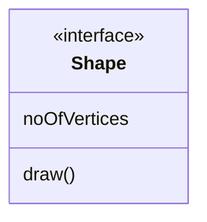

@tab 代码

```
classDiagram
class Shape
<<interface>> Shape
Shape : noOfVertices
Shape : draw()
```

:::

**关键点**  
- **接口定义**：使用 `<<interface>>` 标记表示接口。  
- **接口属性**：使用 `:` 定义接口属性，例如 `noOfVertices`。  
- **接口方法**：使用 `:` 定义接口方法，例如 `draw()`。  

::: details 实例说明
- **`Shape` 接口**：表示一个接口，定义了以下内容：  
  - **属性**：  
    - `noOfVertices`：表示顶点的数量。  
  - **方法**：  
    - `draw()`：表示绘制方法。  

:::

- 在与类定义一起的嵌套结构中：

Mermaid 类图中定义接口和枚举：

:::tabs

@tab 接口与枚举

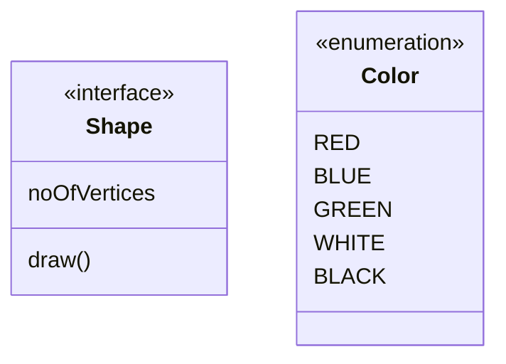

@tab 代码

```
classDiagram
class Shape{
    <<interface>>
    noOfVertices
    draw()
}
class Color{
    <<enumeration>>
    RED
    BLUE
    GREEN
    WHITE
    BLACK
}
```

:::

## 注释

可以在类图中输入注释，解析器将忽略该注释。注释需要独占一行，并且必须以 `%%`（双百分号）开头。下一个换行符之前的任何文本都将被视为注释，包括任何类图语法。

## 设置图表的方向

对于类图，你可以使用方向语句来设置图渲染的方向：

Mermaid 类图中定义类及其属性，并使用聚合关系表示类之间的关联：

:::tabs

@tab 类与聚合关系

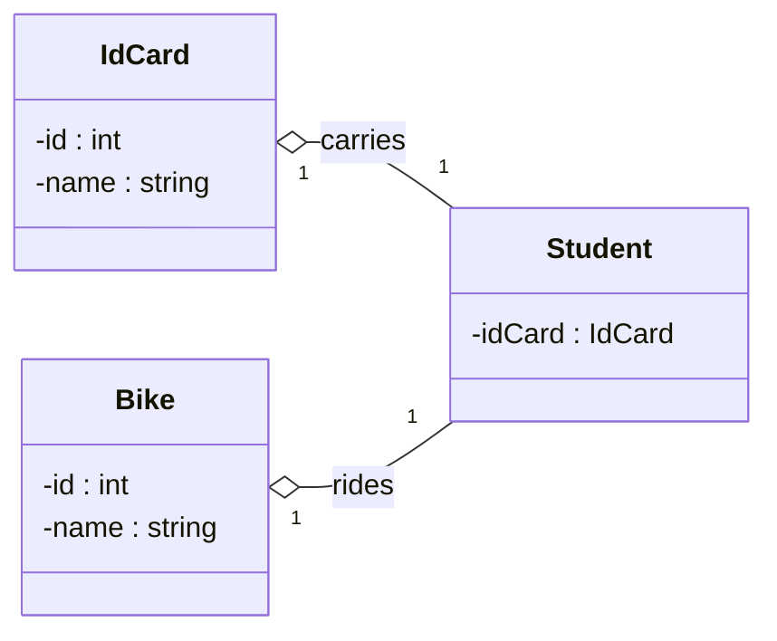

@tab 代码

```
classDiagram
  direction RL
  class Student {
    -idCard : IdCard
  }
  class IdCard{
    -id : int
    -name : string
  }
  class Bike{
    -id : int
    -name : string
  }
  Student "1" --o "1" IdCard : carries
  Student "1" --o "1" Bike : rides
```

:::

**关键点**  
- **方向设置**：使用 `direction RL` 设置图表的方向为从右到左（Right to Left）。  
- **类定义**：使用 `class` 关键字定义类，并在 `{}` 中列出属性。  
- **私有属性**：使用 `-` 表示私有属性。  
- **聚合关系**：使用 `--o` 表示聚合关系，并添加关系标签描述关联含义。  
- **多重性**：使用 `"1"` 表示一对一关系。  

::: details 实例说明
- **`Student` 类**：表示学生类，定义了以下内容：  
  - **属性**：  
    - `idCard`（类型为 `IdCard`，表示学生持有的身份证）。  
- **`IdCard` 类**：表示身份证类，定义了以下内容：  
  - **属性**：  
    - `id`（整型 ID）。  
    - `name`（姓名，类型为 `string`）。  
- **`Bike` 类**：表示自行车类，定义了以下内容：  
  - **属性**：  
    - `id`（整型 ID）。  
    - `name`（名称，类型为 `string`）。  
- **聚合关系**：  
  - `Student "1" --o "1" IdCard : carries`：一个学生持有一张身份证，关系标签为 `carries`。  
  - `Student "1" --o "1" Bike : rides`：一个学生骑一辆自行车，关系标签为 `rides`。  

:::

## 相互作用

可以将单击事件绑定到节点。单击可能会导致 JavaScript 回调或导致在新浏览器选项卡中打开的链接。注意：使用 `securityLevel='strict'` 时禁用此功能，使用 `securityLevel='loose'` 时启用此功能。

声明所有类后，你可以在单独的行上定义这些操作。

```
action className "reference" "tooltip"
click className call callback() "tooltip"
click className href "url" "tooltip"
```

- action 是 `link` 或 `callback`，具体取决于你想要调用的交互类型
- className 是与操作关联的节点的 id
- Reference 可以是 url 链接，也可以是回调的函数名称。
- （可选）工具提示是悬停在元素上时显示的字符串（注意：工具提示的样式由 .mermaidTooltip 类设置。）
- 注意：将以 nodeId 作为参数调用回调函数。

## 注意

可以使用 `note "line1\nline2"` 在图表上添加注释。可以使用 `note for <CLASS NAME> "line1\nline2"` 为特定类添加注释。

Mermaid 类图中添加全局注释和类注释：

:::tabs

@tab 注释示例

```mermaid
classDiagram
    note "This is a general note"
    note for MyClass "This is a note for a class"
    class MyClass{
    }
```

@tab 代码

```
classDiagram
    note "This is a general note"
    note for MyClass "This is a note for a class"
    class MyClass{
    }
```

:::

**关键点**  
- **全局注释**：使用 `note "注释内容"` 添加全局注释，注释内容会显示在图表中。  
- **类注释**：使用 `note for 类名 "注释内容"` 为特定类添加注释，注释内容会显示在类旁边。  
- **类定义**：使用 `class` 关键字定义类，可以在 `{}` 中列出属性和方法。  

::: details 实例说明
- **全局注释**：`This is a general note` 是一个全局注释，显示在图表中。  
- **类注释**：`This is a note for a class` 是 `MyClass` 的注释，显示在 `MyClass` 旁边。  
- **`MyClass` 类**：表示一个空类，未定义属性或方法。  

:::


网址链接：

Mermaid 类图中为类添加链接和工具提示：

:::tabs

@tab 链接与工具提示

```mermaid
classDiagram
class Shape
link Shape "https://www.github.com" "This is a tooltip for a link"
class Shape2
click Shape2 href "https://www.github.com" "This is a tooltip for a link"
```

@tab 代码

```
classDiagram
class Shape
link Shape "https://www.github.com" "This is a tooltip for a link"
class Shape2
click Shape2 href "https://www.github.com" "This is a tooltip for a link"
```

:::

**关键点**  
- **链接与工具提示**：  
  - 使用 `link 类名 "URL" "工具提示"` 为类添加链接和工具提示。  
  - 使用 `click 类名 href "URL" "工具提示"` 为类添加点击事件、链接和工具提示。  
- **类定义**：使用 `class` 关键字定义类。  

::: details 实例说明
- **`Shape` 类**：添加了一个链接和工具提示，点击 `Shape` 类会跳转到 `https://www.github.com`，并显示工具提示 `This is a tooltip for a link`。  
- **`Shape2` 类**：添加了一个点击事件、链接和工具提示，点击 `Shape2` 类会跳转到 `https://www.github.com`，并显示工具提示 `This is a tooltip for a link`。  

:::

回调：

Mermaid 类图中为类添加回调函数和工具提示：

:::tabs

@tab 回调与工具提示

```mermaid
classDiagram
class Shape
callback Shape "callbackFunction" "This is a tooltip for a callback"
class Shape2
click Shape2 call callbackFunction() "This is a tooltip for a callback"
```

@tab 代码

```
classDiagram
class Shape
callback Shape "callbackFunction" "This is a tooltip for a callback"
class Shape2
click Shape2 call callbackFunction() "This is a tooltip for a callback"
```

:::

**关键点**  
- **回调函数与工具提示**：  
  - 使用 `callback 类名 "回调函数名" "工具提示"` 为类添加回调函数和工具提示。  
  - 使用 `click 类名 call 回调函数名() "工具提示"` 为类添加点击事件、回调函数和工具提示。  
- **类定义**：使用 `class` 关键字定义类。  

::: details 实例说明
- **`Shape` 类**：添加了一个回调函数和工具提示，点击 `Shape` 类会触发 `callbackFunction`，并显示工具提示 `This is a tooltip for a callback`。  
- **`Shape2` 类**：添加了一个点击事件、回调函数和工具提示，点击 `Shape2` 类会触发 `callbackFunction`，并显示工具提示 `This is a tooltip for a callback`。  

:::


```html
<script>
  const callbackFunction = function () {
    alert('A callback was triggered');
  };
</script>
```

Mermaid 类图中为类添加回调函数、链接和工具提示：

:::tabs

@tab 回调、链接与工具提示

```mermaid
classDiagram
    class Class01
    class Class02
    callback Class01 "callbackFunction" "Callback tooltip"
    link Class02 "https://www.github.com" "This is a link"
    class Class03
    class Class04
    click Class03 call callbackFunction() "Callback tooltip"
    click Class04 href "https://www.github.com" "This is a link"
```

@tab 代码

```
classDiagram
    class Class01
    class Class02
    callback Class01 "callbackFunction" "Callback tooltip"
    link Class02 "https://www.github.com" "This is a link"
    class Class03
    class Class04
    click Class03 call callbackFunction() "Callback tooltip"
    click Class04 href "https://www.github.com" "This is a link"
```

:::

**关键点**  
- **回调函数**：  
  - 使用 `callback 类名 "回调函数名" "工具提示"` 为类添加回调函数和工具提示。  
  - 使用 `click 类名 call 回调函数名() "工具提示"` 为类添加点击事件、回调函数和工具提示。  
- **链接**：  
  - 使用 `link 类名 "URL" "工具提示"` 为类添加链接和工具提示。  
  - 使用 `click 类名 href "URL" "工具提示"` 为类添加点击事件、链接和工具提示。  
- **类定义**：使用 `class` 关键字定义类。  

::: details 实例说明
- **`Class01` 类**：添加了一个回调函数和工具提示，点击 `Class01` 类会触发 `callbackFunction`，并显示工具提示 `Callback tooltip`。  
- **`Class02` 类**：添加了一个链接和工具提示，点击 `Class02` 类会跳转到 `https://www.github.com`，并显示工具提示 `This is a link`。  
- **`Class03` 类**：添加了一个点击事件、回调函数和工具提示，点击 `Class03` 类会触发 `callbackFunction`，并显示工具提示 `Callback tooltip`。  
- **`Class04` 类**：添加了一个点击事件、链接和工具提示，点击 `Class04` 类会跳转到 `https://www.github.com`，并显示工具提示 `This is a link`。  

:::

> **成功** 工具提示功能和链接到 URL 的功能从 0.5.2 版本开始提供。

在 HTML 页面中使用交互式链接的完整示例：

```html
<body>
  <pre class="mermaid">
    classDiagram
    Animal <|-- Duck
    Animal <|-- Fish
    Animal <|-- Zebra
    Animal : +int age
    Animal : +String gender
    Animal: +isMammal()
    Animal: +mate()
    class Duck{
      +String beakColor
      +swim()
      +quack()
      }
    class Fish{
      -int sizeInFeet
      -canEat()
      }
    class Zebra{
      +bool is_wild
      +run()
      }

      callback Duck callback "Tooltip"
      link Zebra "https://www.github.com" "This is a link"
  </pre>

  <script>
    const callback = function () {
      alert('A callback was triggered');
    };
    const config = {
      startOnLoad: true,
      securityLevel: 'loose',
    };
    mermaid.initialize(config);
  </script>
</body>
```

## 样式

### 设置节点样式

可以使用 `style` 关键字将特定样式（例如较粗的边框或不同的背景颜色）应用于单个节点。

:::warning

请注意，注释和命名空间不能单独设置样式，但支持主题。

:::

Mermaid 类图中为类添加样式：

:::tabs

@tab 类样式

```mermaid
classDiagram
  class Animal
  class Mineral
  style Animal fill:#f9f,stroke:#333,stroke-width:4px
  style Mineral fill:#bbf,stroke:#f66,stroke-width:2px,color:#fff,stroke-dasharray: 5 5
```

@tab 代码

```
classDiagram
  class Animal
  class Mineral
  style Animal fill:#f9f,stroke:#333,stroke-width:4px
  style Mineral fill:#bbf,stroke:#f66,stroke-width:2px,color:#fff,stroke-dasharray: 5 5
```

:::

**关键点**  
- **类定义**：使用 `class` 关键字定义类。  
- **样式定义**：使用 `style 类名 样式规则` 为类添加样式。  
  - `fill`：设置填充颜色。  
  - `stroke`：设置边框颜色。  
  - `stroke-width`：设置边框宽度。  
  - `color`：设置文本颜色。  
  - `stroke-dasharray`：设置边框虚线样式。  

::: details 实例说明
- **`Animal` 类**：  
  - 填充颜色为 `#f9f`（粉色）。  
  - 边框颜色为 `#333`（深灰色），宽度为 `4px`。  
- **`Mineral` 类**：  
  - 填充颜色为 `#bbf`（浅蓝色）。  
  - 边框颜色为 `#f66`（红色），宽度为 `2px`。  
  - 文本颜色为 `#fff`（白色）。  
  - 边框为虚线样式，`5 5` 表示虚线的长度和间隔。  

:::

### 类样式

比每次定义样式更方便的是定义一类样式并将该类附加到应该具有不同外观的节点。

类定义：

```
classDef className fill:#f9f,stroke:#333,stroke-width:4px;
```

此外，还可以在一条语句中为多个类定义样式：

```
classDef firstClassName,secondClassName font-size:12pt;
```

将类附加到节点：

```
cssClass "nodeId1" className;
```

还可以在一条语句中将一个类附加到节点列表：

```
cssClass "nodeId1,nodeId2" className;
```

添加类的更简短形式是使用 `:::` 运算符将类名附加到节点：

Mermaid 类图中使用类定义块（`classDef`）为类添加样式：

:::tabs

@tab 类定义块样式

```mermaid
classDiagram
    class Animal:::someclass
    classDef someclass fill:#f96
```

@tab 代码

```
classDiagram
    class Animal:::someclass
    classDef someclass fill:#f96
```

:::

**关键点**  
- **类定义块**：使用 `classDef` 关键字定义样式块，可以复用样式。  
- **类样式应用**：使用 `:::样式名` 将样式应用到类。  
- **样式规则**：支持设置填充颜色（`fill`）、边框颜色（`stroke`）、文本颜色（`color`）等。  

::: details 实例说明
- **`someclass` 样式**：定义了填充颜色为 `#f96`（橙色）。  
- **`Animal` 类**：应用了 `someclass` 样式，填充颜色为 `#f96`。  

:::

或者：

Mermaid 类图中使用类定义块（`classDef`）为类添加样式，同时定义类的属性和方法：

:::tabs

@tab 类定义块样式与类属性

```mermaid
classDiagram
    class Animal:::someclass {
        -int sizeInFeet
        -canEat()
    }
    classDef someclass fill:#f96
```

@tab 代码

```
classDiagram
    class Animal:::someclass {
        -int sizeInFeet
        -canEat()
    }
    classDef someclass fill:#f96
```

:::

**关键点**  
- **类定义块**：使用 `classDef` 关键字定义样式块，可以复用样式。  
- **类样式应用**：使用 `:::样式名` 将样式应用到类。  
- **类属性与方法**：在 `{}` 中定义类的属性和方法，使用 `-` 表示私有成员。  
- **样式规则**：支持设置填充颜色（`fill`）、边框颜色（`stroke`）、文本颜色（`color`）等。  

::: details 实例说明
- **`someclass` 样式**：定义了填充颜色为 `#f96`（橙色）。  
- **`Animal` 类**：  
  - 应用了 `someclass` 样式，填充颜色为 `#f96`。  
  - 定义了以下内容：  
    - **属性**：  
      - `sizeInFeet`（整型属性，表示动物的脚大小）。  
    - **方法**：  
      - `canEat()`：表示动物可以进食。  

:::

### 默认类别

如果某个类名为 default，它将应用于所有节点。应在之后定义特定的样式和类以覆盖应用的默认样式。

```
classDef default fill:#f9f,stroke:#333,stroke-width:4px;
```

Mermaid 类图中使用默认样式和自定义样式为类添加样式：

:::tabs

@tab 默认样式与自定义样式

```mermaid
classDiagram
  class Animal:::pink
  class Mineral

  classDef default fill:#f96,color:red
  classDef pink color:#f9f
```

@tab 代码

```
classDiagram
  class Animal:::pink
  class Mineral

  classDef default fill:#f96,color:red
  classDef pink color:#f9f
```

:::

**关键点**  
- **默认样式**：使用 `classDef default` 定义默认样式，所有未明确指定样式的类都会应用此样式。  
- **自定义样式**：使用 `classDef 样式名` 定义自定义样式，并通过 `:::样式名` 将样式应用到类。  
- **样式规则**：支持设置填充颜色（`fill`）、文本颜色（`color`）等。  

::: details 实例说明
- **默认样式**：  
  - 填充颜色为 `#f96`（橙色）。  
  - 文本颜色为 `red`（红色）。  
- **`pink` 样式**：  
  - 文本颜色为 `#f9f`（粉色）。  
- **`Animal` 类**：应用了 `pink` 样式，文本颜色为 `#f9f`。  
- **`Mineral` 类**：应用了默认样式，填充颜色为 `#f96`，文本颜色为 `red`。  

:::

### CSS类

还可以在 CSS 样式中预定义类，这些类可以从图形定义中应用，如下例所示：

**示例样式**

```html
<style>
  .styleClass > * > g {
    fill: #ff0000;
    stroke: #ffff00;
    stroke-width: 4px;
  }
</style>
```

**定义示例**

Mermaid 类图中为类应用样式：

:::tabs

@tab 类样式应用

```mermaid
classDiagram
    class Animal:::styleClass
```

@tab 代码

```
classDiagram
    class Animal:::styleClass
```

:::

**关键点**  
- **类样式应用**：使用 `:::样式名` 将样式应用到类。  
- **样式定义**：需要先使用 `classDef` 定义样式，然后才能通过 `:::样式名` 应用。  

实例说明
- **`Animal` 类**：应用了名为 `styleClass` 的样式。  
- **注意**：如果未定义 `styleClass` 样式，类将不会有任何样式效果。  


> 不能同时使用此简写方法和关系语句添加 cssClasses。

## 配置

可以隐藏类节点的空成员框。

这是通过更改类图配置的 hideEmptyMembersBox 值来完成的。

Mermaid 类图中配置隐藏空成员框，并定义一个类：

:::tabs

@tab 配置与类图

```mermaid
---
  config:
    class:
      hideEmptyMembersBox: true
---
classDiagram
  class Duck
```

@tab 代码

```
---
  config:
    class:
      hideEmptyMembersBox: true
---
classDiagram
  class Duck
```

:::

**关键点**  
- **配置隐藏空成员框**：  
  - 使用 `config` 配置块，设置 `hideEmptyMembersBox: true`，隐藏没有属性和方法的类的成员框。  
- **类定义**：使用 `class` 关键字定义类。  

::: details 实例说明
- **`Duck` 类**：定义了一个空类，由于启用了 `hideEmptyMembersBox`，类的成员框会被隐藏。  

:::

