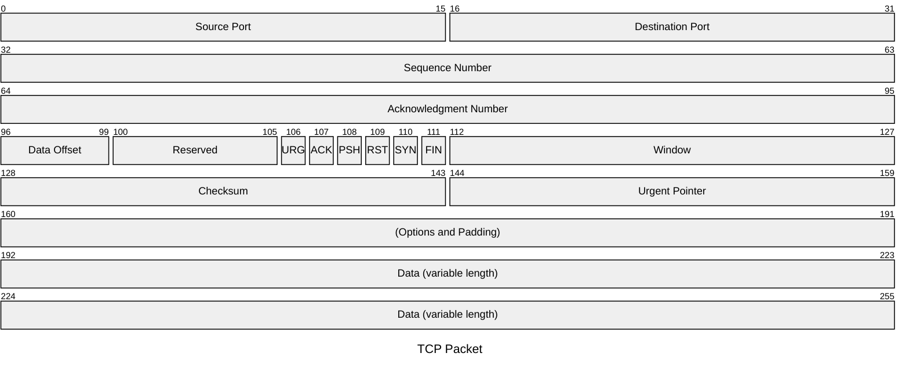
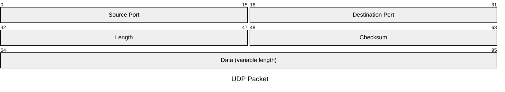

## 介绍

数据包图是用于说明网络数据包的结构和内容的可视化表示。网络数据包是通过网络传输的数据的基本单位。数据包图 (v11.0.0+)

## 用法

这种图表类型对于需要以清晰简洁的方式表示网络数据包结构的开发者、网络工程师、教育工作者和学生特别有用。

## 语法

```md
packet-beta
start: "Block name" %% Single-bit block
start-end: "Block name" %% Multi-bit blocks
... More Fields ...
```


Mermaid 数据包图中定义标题和数据包字段：

:::tabs

@tab 数据包图示例



@tab 代码

```
---
title: "TCP Packet"
---
packet-beta
0-15: "Source Port"
16-31: "Destination Port"
32-63: "Sequence Number"
64-95: "Acknowledgment Number"
96-99: "Data Offset"
100-105: "Reserved"
106: "URG"
107: "ACK"
108: "PSH"
109: "RST"
110: "SYN"
111: "FIN"
112-127: "Window"
128-143: "Checksum"
144-159: "Urgent Pointer"
160-191: "(Options and Padding)"
192-255: "Data (variable length)"
```

:::

**关键点**  
- **标题**：使用 `---` 包裹 `title` 为数据包图添加标题。  
- **数据包字段**：使用 `packet-beta` 定义数据包图，并通过 `起始位-结束位: "字段名"` 定义数据包字段。  
- **字段范围**：字段的范围用 `起始位-结束位` 表示。  
- **字段名称**：字段名称用双引号 `"字段名"` 包裹。  

:::details 实例说明  
- **标题**：`TCP Packet`，表示数据包图的主题。  
- **数据包字段**：  
  - `0-15`：`Source Port`（源端口）。  
  - `16-31`：`Destination Port`（目标端口）。  
  - `32-63`：`Sequence Number`（序列号）。  
  - `64-95`：`Acknowledgment Number`（确认号）。  
  - `96-99`：`Data Offset`（数据偏移）。  
  - `100-105`：`Reserved`（保留位）。  
  - `106`：`URG`（紧急标志）。  
  - `107`：`ACK`（确认标志）。  
  - `108`：`PSH`（推送标志）。  
  - `109`：`RST`（重置标志）。  
  - `110`：`SYN`（同步标志）。  
  - `111`：`FIN`（结束标志）。  
  - `112-127`：`Window`（窗口大小）。  
  - `128-143`：`Checksum`（校验和）。  
  - `144-159`：`Urgent Pointer`（紧急指针）。  
  - `160-191`：`(Options and Padding)`（选项和填充）。  
  - `192-255`：`Data (variable length)`（数据，可变长度）。  
  :::

Mermaid 数据包图中定义标题和数据包字段：

:::tabs

@tab 数据包图示例



@tab 代码

```
packet-beta
title UDP Packet
0-15: "Source Port"
16-31: "Destination Port"
32-47: "Length"
48-63: "Checksum"
64-95: "Data (variable length)"
```

:::

**关键点**  
- **标题**：使用 `title` 为数据包图添加标题。  
- **数据包字段**：使用 `packet-beta` 定义数据包图，并通过 `起始位-结束位: "字段名"` 定义数据包字段。  
- **字段范围**：字段的范围用 `起始位-结束位` 表示。  
- **字段名称**：字段名称用双引号 `"字段名"` 包裹。  

:::details 实例说明  
- **标题**：`UDP Packet`，表示数据包图的主题。  
- **数据包字段**：  
  - `0-15`：`Source Port`（源端口）。  
  - `16-31`：`Destination Port`（目标端口）。  
  - `32-47`：`Length`（长度）。  
  - `48-63`：`Checksum`（校验和）。  
  - `64-95`：`Data (variable length)`（数据，可变长度）。  
  :::

## 语法细节

- 范围：标题后面的每一行代表数据包中的不同字段。范围（例如 `0-15`）指示数据包中的位位置。
- 字段说明：该字段所代表内容的简短描述，用引号引起来。

## 配置
