节点可以通过链接/边连接。可以有不同类型的链接或将文本字符串附加到链接。

以下是将提供的文本处理为与之前格式一致的 Markdown 内容：

---

### 基本箭头形状

#### 1. 带箭头的链接

:::tabs

@tab 带箭头的链接


@tab 代码

```
flowchart LR
    A-->B
```

:::

:::info

使用 `-->` 表示带箭头的链接，适合表示流程的方向。

:::

---

#### 2. 一个打开的链接

:::tabs

@tab 一个打开的链接

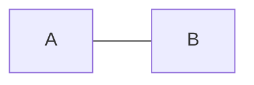

@tab 代码

```
flowchart LR
    A --- B
```

:::

:::info

使用 `---` 表示不带箭头的链接，适合表示连接关系。

:::

---

#### 3. 链接上的文本

:::tabs

@tab 链接上的文本

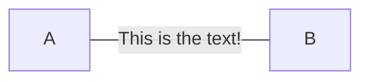

@tab 代码

```
flowchart LR
    A-- This is the text! ---B
```

:::

:::info

在链接上添加文本，使用 `-- text ---` 或 `---|text|` 语法。

:::

---

#### 4. 带有箭头和文本的链接

:::tabs

@tab 带有箭头和文本的链接

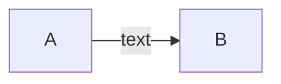

@tab 代码

```
flowchart LR
    A-->|text|B
```

:::

:::info

使用 `-->|text|` 或 `-- text -->` 表示带箭头和文本的链接。

:::

---

#### 5. 虚线链接

:::tabs

@tab 虚线链接


@tab 代码

```
flowchart LR
   A-.->B;
```

:::

:::info

使用 `-.->` 表示虚线链接，适合表示弱连接或可选路径。

:::

---

#### 6. 带文本的虚线链接

:::tabs

@tab 带文本的虚线链接

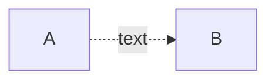

@tab 代码

```
flowchart LR
   A-. text .-> B
```

:::

:::info

使用 `-. text .->` 表示带文本的虚线链接。

:::

---

#### 7. 粗链接

:::tabs

@tab 粗链接

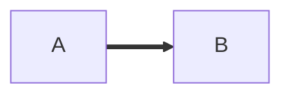

@tab 代码

```
flowchart LR
   A ==> B
```

:::

:::info

使用 `==>` 表示粗链接，适合表示重要或强连接。

:::

---

#### 8. 带文本的粗链接

:::tabs

@tab 带文本的粗链接

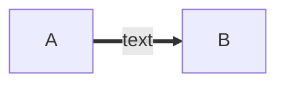

@tab 代码

```
flowchart LR
   A == text ==> B
```

:::

:::info

使用 `== text ==>` 表示带文本的粗链接。

:::

---

#### 9. 看不见的链接

:::tabs

@tab 看不见的链接

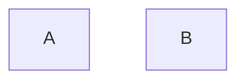

@tab 代码

```
flowchart LR
    A ~~~ B
```

:::

:::info

使用 `~~~` 表示看不见的链接，适合用于调整节点的布局。

:::

---

#### 10. 链接的链接

:::tabs

@tab 链接的链接

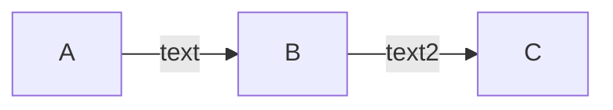

@tab 代码

```
flowchart LR
   A -- text --> B -- text2 --> C
```

:::

:::info

在同一行中声明多个链接，简化流程图的定义。

:::

---

#### 11. 多节点链接

:::tabs

@tab 多节点链接

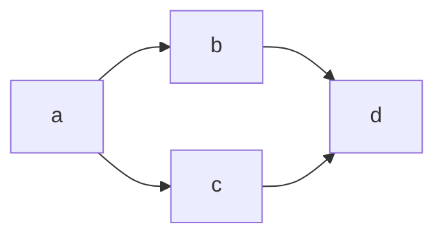

@tab 代码

```
flowchart LR
   a --> b & c--> d
```

:::

:::info

使用 `&` 连接多个节点，适合表示复杂的依赖关系。

:::

---

#### 12. 复杂的依赖关系

:::tabs

@tab 复杂的依赖关系

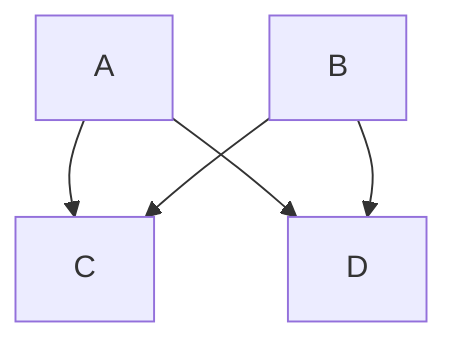

@tab 代码

```
flowchart TB
    A & B--> C & D
```

:::

:::info

使用 `&` 和 `-->` 组合表示复杂的依赖关系。

:::

### 新的箭头类型

支持新类型的箭头：

- 圆边
- 交叉边缘

以下是将提供的文本处理为与之前格式一致的 Markdown 内容：

---

#### 1. 圆边示例

:::tabs

@tab 圆边示例

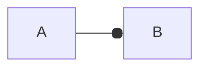

@tab 代码

```
flowchart LR
    A --o B
```

:::

:::info

使用 `--o` 表示圆边链接，适合表示一种特殊的连接关系。

:::

---

#### 2. 交叉边缘示例

:::tabs

@tab 交叉边缘示例

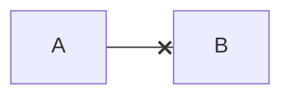

@tab 代码

```
flowchart LR
    A --x B
```

:::

:::info

使用 `--x` 表示交叉边缘链接，适合表示否定或终止的关系。

:::

---

#### 3. 多方向箭头

可以使用多向箭头。

:::tabs

@tab

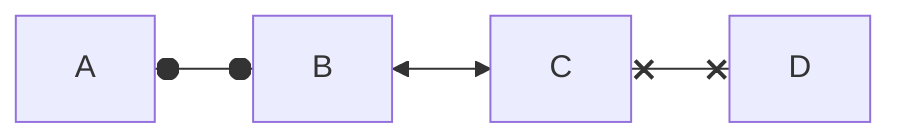

@tab

```
flowchart LR
    A o--o B
    B <--> C
    C x--x D
```

:::

### 链接的最小长度

流程图中的每个节点最终根据其链接到的节点分配给渲染图中的一个等级，即垂直或水平级别（取决于流程图方向）。默认情况下，链接可以跨越任意数量的等级，但你可以通过在链接定义中添加额外的破折号来要求任何链接比其他链接更长。

在以下示例中，在从节点 B 到节点 E 的链接中添加了两个额外的破折号，以便它比常规链接多跨越两个等级：

:::tabs

@tab 链接最小长度

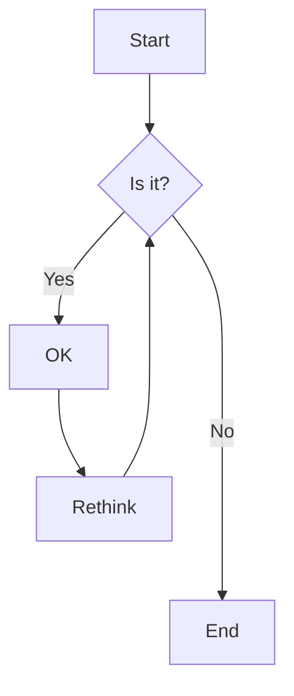

@tab 代码

```
flowchart TD
    A[Start] --> B{Is it?}
    B -->|Yes| C[OK]
    C --> D[Rethink]
    D --> B
    B ---->|No| E[End]
    
```
:::
> **注意** 链接仍可能比渲染引擎所请求的等级数更长，以适应其他请求。

当链接标签写在链接中间时，必须在链接右侧添加额外的破折号。以下示例与上一个示例等效：

:::tabs

@tab 中间标签


@tab 代码

```
flowchart TD
    A[Start] --> B{Is it?}
    B -- Yes --> C[OK]
    C --> D[Rethink]
    D --> B
    B -- No ----> E[End]
```

:::

对于点链接或粗链接，要添加的字符是等号或点，如下表所示：

| 长度           |   1    |    2    |    3     |
| :------------- | :----: | :-----: | :------: |
| 普通的         | `---`  | `----`  | `-----`  |
| 正常带箭头     | `-->`  | `--->`  | `---->`  |
| 厚的           | `===`  | `====`  | `=====`  |
| 粗带箭头       | `==>`  | `===>`  | `====>`  |
| 点状           | `-.-`  | `-..-`  | `-...-`  |
| 带有箭头的虚线 | `-.->` | `-..->` | `-...->` |
