### 基本形状

#### 1.具有圆边的节点

:::tabs

@tab 具有圆边的节点

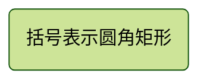

@tab 代码

```
flowchart LR
    id1(This is the text in the box)
```

:::

---

#### 2.体育场形状的节点

:::tabs

@tab 体育场形状的节点


@tab 代码

```
flowchart LR
    id1([This is the text in the box])
```

:::

---

#### 3.子程序形状中的节点

:::tabs

@tab 子程序形状中的节点

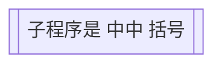

@tab 代码

```
flowchart LR
    id1[[This is the text in the box]]
```

:::

---

#### 4.圆柱形节点

:::tabs

@tab 圆柱形节点

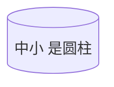

@tab 代码

```
flowchart LR
    id1[(Database)]
```

:::

---

#### 5.一个圆形的节点

:::tabs

@tab 一个圆形的节点

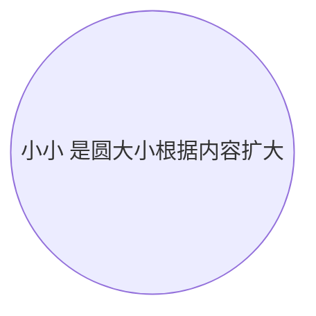

@tab 代码

```
flowchart LR
    id1((This is the text in the circle))
```

:::

---

#### 6.形状不对称的节点

:::tabs

@tab 形状不对称的节点

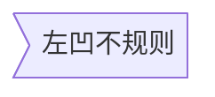

@tab 代码

```
flowchart LR
    id1>This is the text in the box]
```

:::

:::info

目前只有上面的形状是可能的，而不是它的镜像。这可能会随着未来的版本而改变。

:::

---

#### 7.节点（菱形）

:::tabs

@tab 节点（菱形）

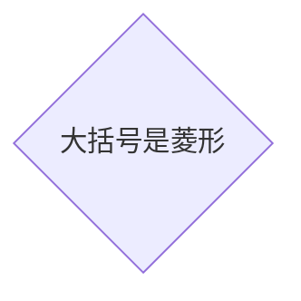

@tab 代码

```
flowchart LR
    id1{This is the text in the box}
```

:::

---

#### 8.六边形节点

:::tabs

@tab 六边形节点


@tab 代码

```
flowchart LR
    id1{{This is the text in the box}}
```

:::

---

:::tabs

#### 9.平行四边形

@tab 平行四边形

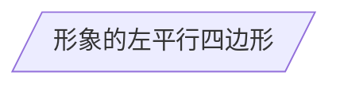

@tab 代码

```
flowchart TD
    id1[/This is the text in the box/]
```

:::

---

#### 10.平行四边形替代

:::tabs

@tab 平行四边形替代

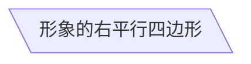

@tab 代码

```
flowchart TD
    id1[\This is the text in the box\]
```

:::

---

#### 11.梯形

:::tabs

@tab 梯形

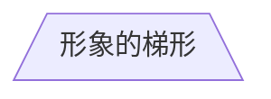

@tab 代码

```
flowchart TD
    A[/Christmas\]
```

:::

---

#### 12.梯形替代

:::tabs

@tab 梯形替代

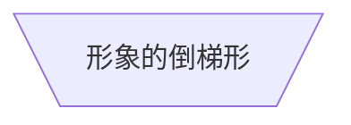

@tab 代码

```
flowchart TD
    B[\Go shopping/]
```

:::

---

#### 13.双圈

:::tabs

@tab 双圈

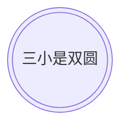

@tab 代码

```
flowchart TD
    id1(((This is the text in the circle)))
```

:::

### 扩展形状

流程图中的扩展节点形状 (v11.3.0+)引入了 30 种新形状，以增强流程图创建的灵活性和精确度。这些新形状提供了更多选项来直观地表示流程、决策、事件、数据存储以及流程图中的其他元素，从而提高清晰度和语义含义。

**形状定义的新语法**：

 现在支持定义形状类型的通用语法，以适应不断增长的形状数量。此语法允许你使用清晰灵活的格式将特定形状分配给节点：

```
A@{ shape: rect }
```

此语法将节点 A 创建为矩形。它的渲染方式与 `A["A"]` 或 `A` 相同。

以下是新引入的形状及其相应的语义含义、简称和别名的完整列表：

| **Semantic Name**                 | **Shape Name**         | **Short Name** | **Description**                | **Alias Supported**                                          |
| :-------------------------------- | :--------------------- | :------------- | :----------------------------- | :----------------------------------------------------------- |
| Card                              | Notched Rectangle      | `notch-rect`   | Represents a card              | `card`, `notched-rectangle`                                  |
| Collate                           | Hourglass              | `hourglass`    | Represents a collate operation | `collate`, `hourglass`                                       |
| Com Link                          | Lightning Bolt         | `bolt`         | Communication link             | `com-link`, `lightning-bolt`                                 |
| Comment                           | Curly Brace            | `brace`        | Adds a comment                 | `brace-l`, `comment`                                         |
| Comment Right                     | Curly Brace            | `brace-r`      | Adds a comment                 |                                                              |
| Comment with braces on both sides | Curly Braces           | `braces`       | Adds a comment                 |                                                              |
| Data Input/Output                 | Lean Right             | `lean-r`       | Represents input or output     | `in-out`, `lean-right`                                       |
| Data Input/Output                 | Lean Left              | `lean-l`       | Represents output or input     | `lean-left`, `out-in`                                        |
| Database                          | Cylinder               | `cyl`          | Database storage               | `cylinder`, `database`, `db`                                 |
| Decision                          | Diamond                | `diam`         | Decision-making step           | `decision`, `diamond`, `question`                            |
| Delay                             | Half-Rounded Rectangle | `delay`        | Represents a delay             | `half-rounded-rectangle`                                     |
| Direct Access Storage             | Horizontal Cylinder    | `h-cyl`        | Direct access storage          | `das`, `horizontal-cylinder`                                 |
| Disk Storage                      | Lined Cylinder         | `lin-cyl`      | Disk storage                   | `disk`, `lined-cylinder`                                     |
| Display                           | Curved Trapezoid       | `curv-trap`    | Represents a display           | `curved-trapezoid`, `display`                                |
| Divided Process                   | Divided Rectangle      | `div-rect`     | Divided process shape          | `div-proc`, `divided-process`, `divided-rectangle`           |
| Document                          | Document               | `doc`          | Represents a document          | `doc`, `document`                                            |
| Event                             | Rounded Rectangle      | `rounded`      | Represents an event            | `event`                                                      |
| Extract                           | Triangle               | `tri`          | Extraction process             | `extract`, `triangle`                                        |
| Fork/Join                         | Filled Rectangle       | `fork`         | Fork or join in process flow   | `join`                                                       |
| Internal Storage                  | Window Pane            | `win-pane`     | Internal storage               | `internal-storage`, `window-pane`                            |
| Junction                          | Filled Circle          | `f-circ`       | Junction point                 | `filled-circle`, `junction`                                  |
| Lined Document                    | Lined Document         | `lin-doc`      | Lined document                 | `lined-document`                                             |
| Lined/Shaded Process              | Lined Rectangle        | `lin-rect`     | Lined process shape            | `lin-proc`, `lined-process`, `lined-rectangle`, `shaded-process` |
| Loop Limit                        | Trapezoidal Pentagon   | `notch-pent`   | Loop limit step                | `loop-limit`, `notched-pentagon`                             |
| Manual File                       | Flipped Triangle       | `flip-tri`     | Manual file operation          | `flipped-triangle`, `manual-file`                            |
| Manual Input                      | Sloped Rectangle       | `sl-rect`      | Manual input step              | `manual-input`, `sloped-rectangle`                           |
| Manual Operation                  | Trapezoid Base Top     | `trap-t`       | Represents a manual task       | `inv-trapezoid`, `manual`, `trapezoid-top`                   |
| Multi-Document                    | Stacked Document       | `docs`         | Multiple documents             | `documents`, `st-doc`, `stacked-document`                    |
| Multi-Process                     | Stacked Rectangle      | `st-rect`      | Multiple processes             | `processes`, `procs`, `stacked-rectangle`                    |
| Odd                               | Odd                    | `odd`          | Odd shape                      |                                                              |
| Paper Tape                        | Flag                   | `flag`         | Paper tape                     | `paper-tape`                                                 |
| Prepare Conditional               | Hexagon                | `hex`          | Preparation or condition step  | `hexagon`, `prepare`                                         |
| Priority Action                   | Trapezoid Base Bottom  | `trap-b`       | Priority action                | `priority`, `trapezoid`, `trapezoid-bottom`                  |
| Process                           | Rectangle              | `rect`         | Standard process shape         | `proc`, `process`, `rectangle`                               |
| Start                             | Circle                 | `circle`       | Starting point                 | `circ`                                                       |
| Start                             | Small Circle           | `sm-circ`      | Small starting point           | `small-circle`, `start`                                      |
| Stop                              | Double Circle          | `dbl-circ`     | Represents a stop point        | `double-circle`                                              |
| Stop                              | Framed Circle          | `fr-circ`      | Stop point                     | `framed-circle`, `stop`                                      |
| Stored Data                       | Bow Tie Rectangle      | `bow-rect`     | Stored data                    | `bow-tie-rectangle`, `stored-data`                           |
| Subprocess                        | Framed Rectangle       | `fr-rect`      | Subprocess                     | `framed-rectangle`, `subproc`, `subprocess`, `subroutine`    |
| Summary                           | Crossed Circle         | `cross-circ`   | Summary                        | `crossed-circle`, `summary`                                  |
| Tagged Document                   | Tagged Document        | `tag-doc`      | Tagged document                | `tag-doc`, `tagged-document`                                 |
| Tagged Process                    | Tagged Rectangle       | `tag-rect`     | Tagged process                 | `tag-proc`, `tagged-process`, `tagged-rectangle`             |
| Terminal Point                    | Stadium                | `stadium`      | Terminal point                 | `pill`, `terminal`                                           |
| Text Block                        | Text Block             | `text`         | Text block                     |                                                              |

以下是使用一些新引入的形状的示例流程图：

```
flowchart RL
    A@{ shape: manual-file, label: "File Handling"}
    B@{ shape: manual-input, label: "User Input"}
    C@{ shape: docs, label: "Multiple Documents"}
    D@{ shape: procs, label: "Process Automation"}
    E@{ shape: paper-tape, label: "Paper Records"}
```

#### 1. 进程

:::tabs

@tab 进程

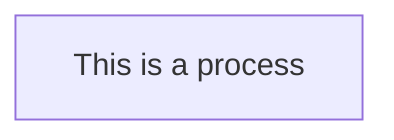

@tab 代码

```
flowchart TD
    A@{ shape: rect, label: "This is a process" }
```

:::

:::info

进程节点使用 `shape: rect` 定义，适合表示一般流程中的步骤或操作。

:::

---

#### 2. 事件

:::tabs

@tab 事件


@tab 代码

```
flowchart TD
    A@{ shape: rounded, label: "This is an event" }
```

:::

:::info

事件节点使用 `shape: rounded` 定义，常用于表示流程的开始或结束。

:::

---

#### 3. 终点 (体育场)

:::tabs

@tab 终点 (体育场)

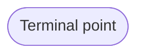

@tab 代码

```
flowchart TD
    A@{ shape: stadium, label: "Terminal point" }
```

:::

:::info

体育场形状的节点使用 `shape: stadium` 定义，通常用于表示流程的终点。

:::

---

#### 4. 子流程

:::tabs

@tab 子流程

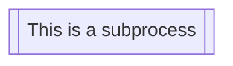

@tab 代码

```
flowchart TD
    A@{ shape: subproc, label: "This is a subprocess" }
```

:::

:::info

子流程节点使用 `shape: subproc` 定义，适合表示流程中的子任务或模块。

:::

---

#### 5. 数据库（圆柱体）

:::tabs

@tab 数据库（圆柱体）

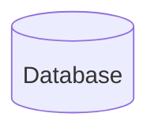

@tab 代码

```
flowchart TD
    A@{ shape: cyl, label: "Database" }
```

:::

:::info

数据库节点使用 `shape: cyl` 定义，常用于表示数据存储或数据库。

:::

---

#### 6. 开始 (圆形)

:::tabs

@tab 开始 (圆形)

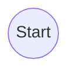

@tab 代码

```
flowchart TD
    A@{ shape: circle, label: "Start" }
```

:::

:::info

开始节点使用 `shape: circle` 定义，适合表示流程的起点。

:::

---

#### 7. 奇数

:::tabs

@tab 奇数

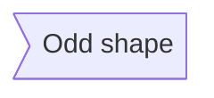

@tab 代码

```
flowchart TD
    A@{ shape: odd, label: "Odd shape" }
```

:::

:::info

奇数形状的节点使用 `shape: odd` 定义，适合表示特殊形状的节点。

:::

---

#### 8. 决策（菱形）

:::tabs

@tab 决策（菱形）

```mermaid
flowchart TD
    A@{ shape: diamond, label: "Decision" }
```

@tab 代码

```
flowchart TD
    A@{ shape: diamond, label: "Decision" }
```

:::

:::info

决策节点使用 `shape: diamond` 定义，常用于表示条件判断或决策点。

:::

---

#### 9. 准备条件 (六边形)

:::tabs

@tab 准备条件 (六边形)

```mermaid
flowchart TD
    A@{ shape: hex, label: "Prepare conditional" }
```

@tab 代码

```
flowchart TD
    A@{ shape: hex, label: "Prepare conditional" }
```

:::

:::info

六边形节点使用 `shape: hex` 定义，适合表示准备条件或特殊操作。

:::

---

#### 10. 数据输入/输出（向右倾斜）

:::tabs

@tab 数据输入/输出（向右倾斜）

```mermaid
flowchart TD
    A@{ shape: lean-r, label: "Input/Output" }
```

@tab 代码

```
flowchart TD
    A@{ shape: lean-r, label: "Input/Output" }
```

:::

:::info

向右倾斜的节点使用 `shape: lean-r` 定义，常用于表示数据输入或输出。

:::

---

#### 11. 数据输入/输出（向左倾斜）

:::tabs

@tab 数据输入/输出（向左倾斜）

```mermaid
flowchart TD
    A@{ shape: lean-l, label: "Output/Input" }
```

@tab 代码

```
flowchart TD
    A@{ shape: lean-l, label: "Output/Input" }
```

:::

:::info

向左倾斜的节点使用 `shape: lean-l` 定义，适合表示数据输出或输入。

:::

---

#### 12. 优先操作 (梯形底面底部)

:::tabs

@tab 优先操作 (梯形底面底部)

```mermaid
flowchart TD
    A@{ shape: trap-b, label: "Priority action" }
```

@tab 代码

```
flowchart TD
    A@{ shape: trap-b, label: "Priority action" }
```

:::

:::info

梯形底面底部的节点使用 `shape: trap-b` 定义，适合表示优先操作。

:::

---

#### 13. 手动操作 (梯形底面顶部)

:::tabs

@tab 手动操作 (梯形底面顶部)

```mermaid
flowchart TD
    A@{ shape: trap-t, label: "Manual operation" }
```

@tab 代码

```
flowchart TD
    A@{ shape: trap-t, label: "Manual operation" }
```

:::

:::info

梯形底面顶部的节点使用 `shape: trap-t` 定义，适合表示手动操作。

:::

---

#### 14. 停止 (双圆圈)

:::tabs

@tab 停止 (双圆圈)

```mermaid
flowchart TD
    A@{ shape: dbl-circ, label: "Stop" }
```

@tab 代码

```
flowchart TD
    A@{ shape: dbl-circ, label: "Stop" }
```

:::

:::info

双圆圈节点使用 `shape: dbl-circ` 定义，常用于表示流程的终止点。

:::

---

#### 15. 文本块

:::tabs

@tab 文本块

```mermaid
flowchart TD
    A@{ shape: text, label: "This is a text block" }
```

@tab 代码

```
flowchart TD
    A@{ shape: text, label: "This is a text block" }
```

:::

:::info

文本块节点使用 `shape: text` 定义，适合表示纯文本内容。

:::

---

#### 16. 卡片（缺口矩形）

:::tabs

@tab 卡片（缺口矩形）

```mermaid
flowchart TD
    A@{ shape: notch-rect, label: "Card" }
```

@tab 代码

```
flowchart TD
    A@{ shape: notch-rect, label: "Card" }
```

:::

:::info

缺口矩形节点使用 `shape: notch-rect` 定义，适合表示卡片或特殊形状的节点。

:::

---

#### 17. 带线/阴影流程

:::tabs

@tab 带线/阴影流程

```mermaid
flowchart TD
    A@{ shape: lin-rect, label: "Lined process" }
```

@tab 代码

```
flowchart TD
    A@{ shape: lin-rect, label: "Lined process" }
```

:::

:::info

带线/阴影流程节点使用 `shape: lin-rect` 定义，适合表示带有线条或阴影的流程。

:::

---

#### 18. 开始 (小圆形)

:::tabs

@tab 开始 (小圆形)

```mermaid
flowchart TD
    A@{ shape: sm-circ, label: "Small start" }
```

@tab 代码

```
flowchart TD
    A@{ shape: sm-circ, label: "Small start" }
```

:::

:::info

小圆形节点使用 `shape: sm-circ` 定义，适合表示流程的小型起点。

:::

---

#### 19. 停止 (带框的圆圈)

:::tabs

@tab 停止 (带框的圆圈)

```mermaid
flowchart TD
    A@{ shape: framed-circle, label: "Stop" }
```

@tab 代码

```
flowchart TD
    A@{ shape: framed-circle, label: "Stop" }
```

:::

:::info

带框的圆圈节点使用 `shape: framed-circle` 定义，常用于表示流程的终止点。

:::

---

#### 20. 分叉/连接 (长矩形)

:::tabs

@tab 分叉/连接 (长矩形)

```mermaid
flowchart TD
    A@{ shape: fork, label: "Fork or Join" }
```

@tab 代码

```
flowchart TD
    A@{ shape: fork, label: "Fork or Join" }
```

:::

:::info

长矩形节点使用 `shape: fork` 定义，适合表示分叉或连接点。

:::

---

#### 21. 整理（沙漏）

:::tabs

@tab 整理（沙漏）

```mermaid
flowchart TD
    A@{ shape: hourglass, label: "Collate" }
```

@tab 代码

```
flowchart TD
    A@{ shape: hourglass, label: "Collate" }
```

:::

:::info

沙漏节点使用 `shape: hourglass` 定义，适合表示整理或排序操作。

:::

---

#### 22. 注释（大括号）

:::tabs

@tab 注释（大括号）

```mermaid
flowchart TD
    A@{ shape: comment, label: "Comment" }
```

@tab 代码

```
flowchart TD
    A@{ shape: comment, label: "Comment" }
```

:::

:::info

注释节点使用 `shape: comment` 定义，适合表示附加说明或注释。

:::

---

#### 23. 注释右侧（大括号右侧）

:::tabs

@tab 注释右侧（大括号右侧）

```mermaid
flowchart TD
    A@{ shape: brace-r, label: "Comment" }
```

@tab 代码

```
flowchart TD
    A@{ shape: brace-r, label: "Comment" }
```

:::

:::info

右侧大括号节点使用 `shape: brace-r` 定义，适合表示右侧的注释。

:::

---

#### 24. 注释两侧均带括号

:::tabs

@tab 注释两侧均带括号

```mermaid
flowchart TD
    A@{ shape: braces, label: "Comment" }
```

@tab 代码

```
flowchart TD
    A@{ shape: braces, label: "Comment" }
```

:::

:::info

两侧均带括号的节点使用 `shape: braces` 定义，适合表示两侧的注释。

:::

---

#### 25. Com Link（闪电）

:::tabs

@tab Com Link（闪电）

```mermaid
flowchart TD
    A@{ shape: bolt, label: "Communication link" }
```

@tab 代码

```
flowchart TD
    A@{ shape: bolt, label: "Communication link" }
```

:::

:::info

闪电节点使用 `shape: bolt` 定义，适合表示通信链接或快速操作。

:::

---

#### 26. 文档

:::tabs

@tab 文档

```mermaid
flowchart TD
    A@{ shape: doc, label: "Document" }
```

@tab 代码

```
flowchart TD
    A@{ shape: doc, label: "Document" }
```

:::

:::info

文档节点使用 `shape: doc` 定义，适合表示文件或文档。

:::

---

#### 27. 延迟（半圆角矩形）

:::tabs

@tab 延迟（半圆角矩形）

```mermaid
flowchart TD
    A@{ shape: delay, label: "Delay" }
```

@tab 代码

```
flowchart TD
    A@{ shape: delay, label: "Delay" }
```

:::

:::info

半圆角矩形节点使用 `shape: delay` 定义，适合表示延迟或等待操作。

:::

---

#### 28. 直接访问存储（水平圆柱体)

:::tabs

@tab 直接访问存储（水平圆柱体)

```mermaid
flowchart TD
    A@{ shape: das, label: "Direct access storage" }
```

@tab 代码

```
flowchart TD
    A@{ shape: das, label: "Direct access storage" }
```

:::

:::info

水平圆柱体节点使用 `shape: das` 定义，适合表示直接访问存储。

:::

---

#### 29. 磁盘存储 (带线圆柱体)

:::tabs

@tab 磁盘存储 (带线圆柱体)

```mermaid
flowchart TD
    A@{ shape: lin-cyl, label: "Disk storage" }
```

@tab 代码

```
flowchart TD
    A@{ shape: lin-cyl, label: "Disk storage" }
```

:::

:::info

带线圆柱体节点使用 `shape: lin-cyl` 定义，适合表示磁盘存储。

:::

---

#### 30. 显示 (弧形梯形)

:::tabs

@tab 显示 (弧形梯形)

```mermaid
flowchart TD
    A@{ shape: curv-trap, label: "Display" }
```

@tab 代码

```
flowchart TD
    A@{ shape: curv-trap, label: "Display" }
```

:::

:::info

弧形梯形节点使用 `shape: curv-trap` 定义，适合表示显示或输出设备。

:::

---

#### 31. 分割流程 (分割矩形)

:::tabs

@tab 分割流程 (分割矩形)

```mermaid
flowchart TD
    A@{ shape: div-rect, label: "Divided process" }
```

@tab 代码

```
flowchart TD
    A@{ shape: div-rect, label: "Divided process" }
```

:::

:::info

分割矩形节点使用 `shape: div-rect` 定义，适合表示分割的流程或模块。

:::

---

#### 32. 提取 (小三角形)

:::tabs

@tab 提取 (小三角形)

```mermaid
flowchart TD
    A@{ shape: tri, label: "Extract" }
```

@tab 代码

```
flowchart TD
    A@{ shape: tri, label: "Extract" }
```

:::

:::info

小三角形节点使用 `shape: tri` 定义，适合表示提取或分离操作。

:::

---

#### 33. 内部存储 (窗格)

:::tabs

@tab 内部存储 (窗格)

```mermaid
flowchart TD
    A@{ shape: win-pane, label: "Internal storage" }
```

@tab 代码

```
flowchart TD
    A@{ shape: win-pane, label: "Internal storage" }
```

:::

:::info

窗格节点使用 `shape: win-pane` 定义，适合表示内部存储或数据分区。

:::

---

#### 34. 连接 (实心圆)

:::tabs

@tab 连接 (实心圆)

```mermaid
flowchart TD
    A@{ shape: f-circ, label: "Junction" }
```

@tab 代码

```
flowchart TD
    A@{ shape: f-circ, label: "Junction" }
```

:::

:::info

实心圆节点使用 `shape: f-circ` 定义，适合表示连接点或汇聚点。

:::

---

#### 35. 带线文档

:::tabs

@tab 带线文档

```mermaid
flowchart TD
    A@{ shape: lin-doc, label: "Lined document" }
```

@tab 代码

```
flowchart TD
    A@{ shape: lin-doc, label: "Lined document" }
```

:::

:::info

带线文档节点使用 `shape: lin-doc` 定义，适合表示带有线条的文档。

:::

---

#### 36. 循环限制 (缺口五边形)

:::tabs

@tab 循环限制 (缺口五边形)

```mermaid
flowchart TD
    A@{ shape: notch-pent, label: "Loop limit" }
```

@tab 代码

```
flowchart TD
    A@{ shape: notch-pent, label: "Loop limit" }
```

:::

:::info

缺口五边形节点使用 `shape: notch-pent` 定义，适合表示循环限制或特殊条件。

:::

---

#### 37. 手动文件 (翻转三角形)

:::tabs

@tab 手动文件 (翻转三角形)

```mermaid
flowchart TD
    A@{ shape: flip-tri, label: "Manual file" }
```

@tab 代码

```
flowchart TD
    A@{ shape: flip-tri, label: "Manual file" }
```

:::

:::info

翻转三角形节点使用 `shape: flip-tri` 定义，适合表示手动文件或操作。

:::

---

#### 38. 手动输入 (倾斜矩形)

:::tabs

@tab 手动输入 (倾斜矩形)

```mermaid
flowchart TD
    A@{ shape: sl-rect, label: "Manual input" }
```

@tab 代码

```
flowchart TD
    A@{ shape: sl-rect, label: "Manual input" }
```

:::

:::info

倾斜矩形节点使用 `shape: sl-rect` 定义，适合表示手动输入或操作。

:::

---

#### 39. 多文档 (堆叠文档)

:::tabs

@tab 多文档 (堆叠文档)

```mermaid
flowchart TD
    A@{ shape: docs, label: "Multiple documents" }
```

@tab 代码

```
flowchart TD
    A@{ shape: docs, label: "Multiple documents" }
```

:::

:::info

堆叠文档节点使用 `shape: docs` 定义，适合表示多个文档或文件。

:::

---

#### 40. 多进程 (堆叠矩形)

:::tabs

@tab 多进程 (堆叠矩形)

```mermaid
flowchart TD
    A@{ shape: processes, label: "Multiple processes" }
```

@tab 代码

```
flowchart TD
    A@{ shape: processes, label: "Multiple processes" }
```

:::

:::info

堆叠矩形节点使用 `shape: processes` 定义，适合表示多个进程或任务。

:::

---

#### 41. 纸带 (标志)

:::tabs

@tab 纸带 (标志)

```mermaid
flowchart TD
	 A@{ shape: flag, label: "Paper tape" }
```

@tab 代码

```
flowchart TD
    A@{ shape: flag, label: "Paper tape" }
```

:::

#### 42.存储的数据 (蝴蝶结矩形)

:::tabs

@tab 存储的数据

```mermaid
flowchart TD
    A@{ shape: bow-rect, label: "Stored data" }
```

@tab 代码

```
flowchart TD
    A@{ shape: bow-rect, label: "Stored data" }
```

:::

#### 43.摘要 (带十字的圆圈)

:::tabs

@tab 摘要

```mermaid
flowchart TD
    A@{ shape: cross-circ, label: "Summary" }
```

@tab 代码

```
flowchart TD
    A@{ shape: cross-circ, label: "Summary" }
```

:::

#### 44.标记的文档

:::tabs

@tab 摘要

```mermaid
flowchart TD
    A@{ shape: tag-doc, label: "Tagged document" }
```

@tab 代码

```
flowchart TD
    A@{ shape: tag-doc, label: "Tagged document" }
```

:::

#### 45.标记的流程 (标记矩形)

:::tabs

@tab 标记的流程

```mermaid
flowchart TD
    A@{ shape: tag-rect, label: "Tagged process" }
```

@tab 代码

```
flowchart TD
    A@{ shape: tag-rect, label: "Tagged process" }
```

:::

## 特殊形状

（v11.3.0+）流程图还引入了 2 种特殊形状来增强你的流程图：图标和图片。这些形状允许你直接在流程图中包括图标和图片，从而提供更多的视觉背景和清晰度。

#### 图标形状

你可以使用 `icon` 形状在流程图中包括图标。要使用图标，你需要先注册图标包。按照提供的说明 [此处](https://mermaid.nodejs.cn/config/icons.html)。定义图标形状的语法如下：

```
flowchart TD
    A@{ icon: "fa:user", form: "square", label: "User Icon", pos: "t", h: 60 }
```

- 图标：来自注册图标包的图标名称。
- 表格：指定图标的背景形状。如果未定义，图标将没有背景。选项包括：
  - `square`
  - `circle`
  - `rounded`
- 标签：与图标关联的文本标签。这可以是任何字符串。如果未定义，则不会显示任何标签。
- pos：标签的位置。如果未定义，标签将默认为图标底部。可能的值是：
  - `t`
  - `b`
- h：图标的高度。如果未定义，则默认为 48，这是最小值。

#### 图片形状

你可以使用 `image` 形状在流程图中包括图片。定义图片形状的语法如下：

```
flowchart TD
    A@{ img: "https://example.com/image.png", label: "Image Label", pos: "t", w: 60, h: 60, constraint: "off" }
```

- 图片：要显示的图片的 URL。
- 标签：与图片关联的文本标签。这可以是任何字符串。如果未定义，则不会显示任何标签。
- pos：标签的位置。如果未定义，则标签将默认为图片底部。可能的值是：
  - `t`
  - `b`
- w：图片的宽度。如果未定义，则默认为图片的自然宽度。
- h：图片的高度。如果未定义，则默认为图片的自然高度。
- 约束：确定图片是否应限制节点大小。此设置还确保图片保持其原始纵横比，并根据宽度（`w`）调整高度（`h`）。如果未定义，则默认为 `off` 可能的值是：
  - `on`
  - `off`

