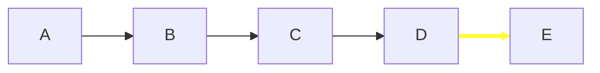
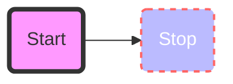
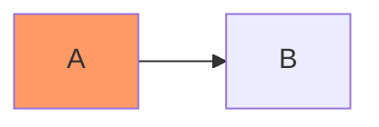
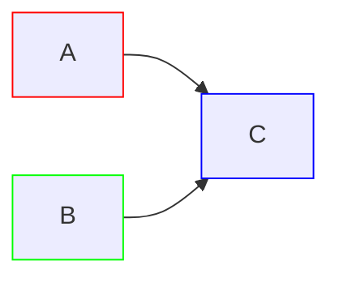
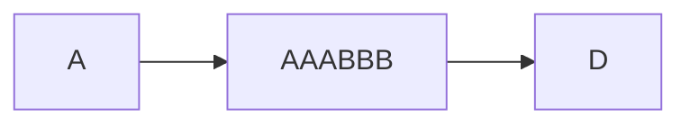
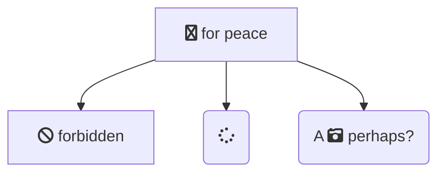

### 设置链接样式

可以设置链接样式。例如，你可能想要设计一个在流程中向后移动的链接。由于链接没有像节点一样的 id，因此需要其他一些方法来决定链接应附加到什么样式。使用图表中定义链接时的顺序号来代替 ids，或者使用默认值应用于所有链接。在下面的示例中，linkStyle 语句中定义的样式将属于图中的第四个链接：

```
linkStyle 3 stroke:#ff3,stroke-width:4px,color:red;
```



```
flowchart LR
	A-->B
	B-->C
	C-->D
	D-->E
	linkStyle 3 stroke:#ff3,stroke-width:4px,color:red;
```

还可以通过用逗号分隔链接编号，在单个语句中向多个链接添加样式：

```
linkStyle 1,2,7 color:blue;
```

### 样式线条曲线

如果默认方法不能满足你的需求，可以设置用于项目之间线条的曲线类型的样式。可用的曲线样式包括 `basis`、`bumpX`、`bumpY`、`cardinal`、`catmullRom`、`linear`、`monotoneX`、`monotoneY`、`natural`、`step`、`stepAfter` 和 `stepBefore`。

在此示例中，从左到右的图表使用 `stepBefore` 曲线样式：

```
%%{ init: { 'flowchart': { 'curve': 'stepBefore' } } }%%
graph LR
```

有关可用曲线的完整列表，包括自定义曲线的说明，请参阅 [d3-shape](https://github.com/d3/d3-shape/) 项目中的 [形状](https://d3js.org/d3-shape/curve) 文档。

### 设置节点样式

可以对节点应用特定样式，例如较粗的边框或不同的背景颜色。

:::tabs

以下是将你提供的文本处理为 `:::tabs` 格式的示例，并解释如何在 Mermaid 的 `flowchart` 图中定义节点、箭头和样式：

:::tabs

@tab 流程图示例



@tab 代码

```
flowchart LR
    id1(Start)-->id2(Stop)
    style id1 fill:#f9f,stroke:#333,stroke-width:4px
    style id2 fill:#bbf,stroke:#f66,stroke-width:2px,color:#fff,stroke-dasharray: 5 5
```

:::

**关键点**  
- **节点**：使用 `节点名(标签)` 定义节点，并指定标签。  
- **箭头**：使用 `节点名-->节点名` 定义箭头。  
- **样式**：使用 `style 节点名 样式属性` 定义节点的样式。  

:::details 实例说明  
- **节点**：  
  - `id1(Start)`：定义一个名为 `id1` 的节点，标签为 `Start`。  
  - `id2(Stop)`：定义一个名为 `id2` 的节点，标签为 `Stop`。  
- **箭头**：  
  - `id1-->id2`：从 `id1` 节点指向 `id2` 节点的箭头。  
- **样式**：  
  - `style id1 fill:#f9f,stroke:#333,stroke-width:4px`：为 `id1` 节点设置填充颜色为 `#f9f`，边框颜色为 `#333`，边框宽度为 `4px`。  
  - `style id2 fill:#bbf,stroke:#f66,stroke-width:2px,color:#fff,stroke-dasharray: 5 5`：为 `id2` 节点设置填充颜色为 `#bbf`，边框颜色为 `#f66`，边框宽度为 `2px`，文字颜色为 `#fff`，边框为虚线样式。  
  :::

如果有其他问题或需要进一步调整，请随时告诉我！

### 类

比每次定义样式更方便的是定义一类样式并将该类附加到应该具有不同外观的节点。

类定义如下例所示：

```
    classDef className fill:#f9f,stroke:#333,stroke-width:4px;
```

此外，还可以在一条语句中为多个类定义样式：

```
    classDef firstClassName,secondClassName font-size:12pt;
```

将类附加到节点的操作如下：

```
    class nodeId1 className;
```

还可以在一条语句中将一个类附加到节点列表：

```
    class nodeId1,nodeId2 className;
```

添加类的一种较短形式是使用 `:::` 运算符将类名附加到节点，如下所示：

:::tabs

@tab 类



@tab 代码

```
flowchart LR
    A:::someclass --> B
    classDef someclass fill:#f96
```

:::

当声明节点之间的多个链接时可以使用这种形式：

:::tabs

@tab 多类



@tab 代码

```
flowchart LR
    A:::foo & B:::bar --> C:::foobar
    classDef foo stroke:#f00
    classDef bar stroke:#0f0
    classDef foobar stroke:#00f
```

:::

### CSS 类

还可以在 CSS 样式中预定义类，这些类可以从图形定义中应用，如下例所示：

**示例样式**

```css
<style>
  .cssClass > rect {
    fill: #ff0000;
    stroke: #ffff00;
    stroke-width: 4px;
  }
</style>
```

**定义示例**

:::tabs

@tab css 类



@tab 代码


```
flowchart LR
    A-->B[AAA<span>BBB</span>]
    B-->D
    class A cssClass
```

:::

### 默认类别

如果一个类被命名为 default，它将被分配给所有没有特定类定义的类。

```
    classDef default fill:#f9f,stroke:#333,stroke-width:4px;
```

### fontawesome的基本支持

可以添加来自 fontawesome 的图标。

通过语法 fa:#icon class name# 访问图标。

:::tabs

@tab fontawesome图标



@tab 代码

```
flowchart TD
    B["fa:fa-twitter for peace"]
    B-->C[fa:fa-ban forbidden]
    B-->D(fa:fa-spinner)
    B-->E(A fa:fa-camera-retro perhaps?)
```

:::

如果网站上包含 CSS，Mermaid 支持 Font Awesome。Mermaid 对可以使用的 Font Awesome 版本没有任何限制。

请参阅 [官方 Font Awesome 文档](https://fontawesome.com/start) 了解如何将其包含在你的网站中。

在 `<head>` 中添加此片段将添加对 Font Awesome v6.5.1 的支持

```html
<link
  href="https://cdnjs.cloudflare.com/ajax/libs/font-awesome/6.5.1/css/all.min.css"
  rel="stylesheet"
/>
```

