title: 流程图
article: false
order: 1

流程图由节点（几何形状）和边（箭头或线条）组成。Mermaid 定义了如何制作节点和边，并适应不同的箭头类型、多方向箭头以及任何与子图的链接。

::: warning

如果你在流程图节点中使用单词 "end"，请将整个单词或任何字母大写（例如，"End" 或 "END"），或应用此workaround。输入全部小写字母的 "end" 将破坏流程图。

警告

如果你使用字母 "o" 或 "x" 作为连接流程图节点的首字母，请在字母前添加空格或将字母大写（例如，"dev--- ops"、"dev---Ops"）。输入 "A---oB" 将创建circle edge。输入 "A---xB" 将创建cross edge。

:::

::: tabs

@tab 节点

| 节点形状     | 符号       | 扩展 |
| ------------ | ---------- | ---- |
| 圆角矩形     | `()`       |      |
| 圆           | `(())`     |      |
| 双圆         | `（(())）` |      |
| 体育场       | `([])`     |      |
|              |            |      |
| 矩形         | `[]`       |      |
| 圆柱         | `[()]`     |      |
| 子程序       | `[[]]`     |      |
|              |            |      |
| 右平行四边形 | `[\\]`     |      |
| 左平行四边形 | `[//]`     |      |
| 梯形         | `[/\]`     |      |
| 倒梯形       | `[\/]`     |      |
| 左凹四边形   | `>]`       |      |
| 菱形         | `{}`       |      |
|              |            |      |
|              |            |      |
| 六边形       | `{{}}`     |      |

@tab 扩展形状

| **Semantic Name**                 | **Shape Name**         | **Short Name** | **Description**                | **Alias Supported**                                          |
| :-------------------------------- | :--------------------- | :------------- | :----------------------------- | :----------------------------------------------------------- |
| Card                              | Notched Rectangle      | `notch-rect`   | Represents a card              | `card`, `notched-rectangle`                                  |
| Collate                           | Hourglass              | `hourglass`    | Represents a collate operation | `collate`, `hourglass`                                       |
| Com Link                          | Lightning Bolt         | `bolt`         | Communication link             | `com-link`, `lightning-bolt`                                 |
| Comment                           | Curly Brace            | `brace`        | Adds a comment                 | `brace-l`, `comment`                                         |
| Comment Right                     | Curly Brace            | `brace-r`      | Adds a comment                 |                                                              |
| Comment with braces on both sides | Curly Braces           | `braces`       | Adds a comment                 |                                                              |
| Data Input/Output                 | Lean Right             | `lean-r`       | Represents input or output     | `in-out`, `lean-right`                                       |
| Data Input/Output                 | Lean Left              | `lean-l`       | Represents output or input     | `lean-left`, `out-in`                                        |
| Database                          | Cylinder               | `cyl`          | Database storage               | `cylinder`, `database`, `db`                                 |
| Decision                          | Diamond                | `diam`         | Decision-making step           | `decision`, `diamond`, `question`                            |
| Delay                             | Half-Rounded Rectangle | `delay`        | Represents a delay             | `half-rounded-rectangle`                                     |
| Direct Access Storage             | Horizontal Cylinder    | `h-cyl`        | Direct access storage          | `das`, `horizontal-cylinder`                                 |
| Disk Storage                      | Lined Cylinder         | `lin-cyl`      | Disk storage                   | `disk`, `lined-cylinder`                                     |
| Display                           | Curved Trapezoid       | `curv-trap`    | Represents a display           | `curved-trapezoid`, `display`                                |
| Divided Process                   | Divided Rectangle      | `div-rect`     | Divided process shape          | `div-proc`, `divided-process`, `divided-rectangle`           |
| Document                          | Document               | `doc`          | Represents a document          | `doc`, `document`                                            |
| Event                             | Rounded Rectangle      | `rounded`      | Represents an event            | `event`                                                      |
| Extract                           | Triangle               | `tri`          | Extraction process             | `extract`, `triangle`                                        |
| Fork/Join                         | Filled Rectangle       | `fork`         | Fork or join in process flow   | `join`                                                       |
| Internal Storage                  | Window Pane            | `win-pane`     | Internal storage               | `internal-storage`, `window-pane`                            |
| Junction                          | Filled Circle          | `f-circ`       | Junction point                 | `filled-circle`, `junction`                                  |
| Lined Document                    | Lined Document         | `lin-doc`      | Lined document                 | `lined-document`                                             |
| Lined/Shaded Process              | Lined Rectangle        | `lin-rect`     | Lined process shape            | `lin-proc`, `lined-process`, `lined-rectangle`, `shaded-process` |
| Loop Limit                        | Trapezoidal Pentagon   | `notch-pent`   | Loop limit step                | `loop-limit`, `notched-pentagon`                             |
| Manual File                       | Flipped Triangle       | `flip-tri`     | Manual file operation          | `flipped-triangle`, `manual-file`                            |
| Manual Input                      | Sloped Rectangle       | `sl-rect`      | Manual input step              | `manual-input`, `sloped-rectangle`                           |
| Manual Operation                  | Trapezoid Base Top     | `trap-t`       | Represents a manual task       | `inv-trapezoid`, `manual`, `trapezoid-top`                   |
| Multi-Document                    | Stacked Document       | `docs`         | Multiple documents             | `documents`, `st-doc`, `stacked-document`                    |
| Multi-Process                     | Stacked Rectangle      | `st-rect`      | Multiple processes             | `processes`, `procs`, `stacked-rectangle`                    |
| Odd                               | Odd                    | `odd`          | Odd shape                      |                                                              |
| Paper Tape                        | Flag                   | `flag`         | Paper tape                     | `paper-tape`                                                 |
| Prepare Conditional               | Hexagon                | `hex`          | Preparation or condition step  | `hexagon`, `prepare`                                         |
| Priority Action                   | Trapezoid Base Bottom  | `trap-b`       | Priority action                | `priority`, `trapezoid`, `trapezoid-bottom`                  |
| Process                           | Rectangle              | `rect`         | Standard process shape         | `proc`, `process`, `rectangle`                               |
| Start                             | Circle                 | `circle`       | Starting point                 | `circ`                                                       |
| Start                             | Small Circle           | `sm-circ`      | Small starting point           | `small-circle`, `start`                                      |
| Stop                              | Double Circle          | `dbl-circ`     | Represents a stop point        | `double-circle`                                              |
| Stop                              | Framed Circle          | `fr-circ`      | Stop point                     | `framed-circle`, `stop`                                      |
| Stored Data                       | Bow Tie Rectangle      | `bow-rect`     | Stored data                    | `bow-tie-rectangle`, `stored-data`                           |
| Subprocess                        | Framed Rectangle       | `fr-rect`      | Subprocess                     | `framed-rectangle`, `subproc`, `subprocess`, `subroutine`    |
| Summary                           | Crossed Circle         | `cross-circ`   | Summary                        | `crossed-circle`, `summary`                                  |
| Tagged Document                   | Tagged Document        | `tag-doc`      | Tagged document                | `tag-doc`, `tagged-document`                                 |
| Tagged Process                    | Tagged Rectangle       | `tag-rect`     | Tagged process                 | `tag-proc`, `tagged-process`, `tagged-rectangle`             |
| Terminal Point                    | Stadium                | `stadium`      | Terminal point                 | `pill`, `terminal`                                           |
| Text Block                        | Text Block             | `text`         | Text block                     |                                                              |


@tab 箭头

- 箭头的长度和延长通过增加短横`-`、`=`等
- 箭头可以双向，如`--->`双向为`<--->`
- 添加文本`箭头|文本|`如`A-->|文本内容|B`

| 箭头类型 | 描述                                 | 实例    |
| -------- | ------------------------------------ | ------- |
| 普通箭头 | 基础三个短横或两个短横一个右尖括号； | `A-->B` |
| 虚线箭头 | 短横点短横；                         | `A-.-B` |
| 粗箭头   | 基础三个等号或两个等号一个右尖括号； | `A===B` |
| 隐形箭头 | 三个波浪号；                         | `A~~~B` |
| 原点箭头 | 两个短横一个小写o;                   | `A--oB` |
| 叉箭头   | 两个短横一个小写x;                   | `A--xB` |

:::

## 节点基础

### 1.基本节点

:::tabs

@tab 基本节点

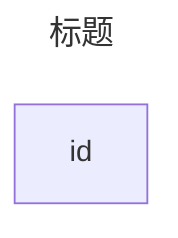

@tab 代码

```
---
title: Node
---
flowchart LR
    id
```

:::

:::info

id 是框中显示的内容。

除了 `flowchart`，还可以使用 `graph`。

:::

### 2.带文本的节点

也可以在框中设置与 id 不同的文本。如果执行此操作多次，则它将是为要使用的节点找到的最后一个文本。此外，如果稍后为节点定义边，则可以省略文本定义。渲染盒子时将使用先前定义的值。

:::tabs

@tab 带文本节点

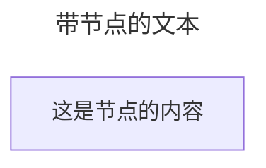

@tab 代码

```
---
title: Node with text
---
flowchart LR
    id1[This is the text in the box]
```

:::

#### 统一码文本

使用 `"` 将 unicode 文本括起来。

:::tabs

@tab 文本

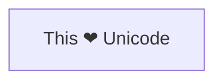

@tab 代码

```
flowchart LR
    id["This ❤ Unicode"]
```

:::

#### Markdown格式

使用`双引号和反引号`将文本括起来，文本中的markdown语法会被解析。

:::tabs

@tab markdown嵌入

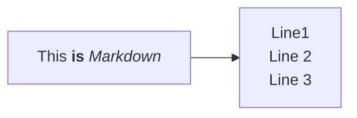

@tab 代码

```
%%{init: {"flowchart": {"htmlLabels": false}} }%%
flowchart LR代码
    markdown["`This **is** _Markdown_`"]
    newLines["`Line1
    Line 2
    Line 3`"]
    markdown --> newLines
```

:::

#### Markdown字符串

"Markdown 字符串" 功能通过提供更通用的字符串类型来增强流程图和思维导图，该字符串类型支持粗体和斜体等文本格式选项，并自动将文本换行在标签内。

:::tabs Markdown 字符串

@tab

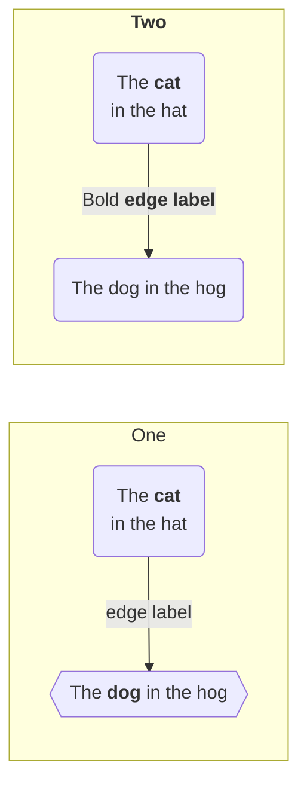

@tab 代码

```
%%{init: {"flowchart": {"htmlLabels": false}} }%%
flowchart LR
subgraph "One"
  a("`The **cat**
  in the hat`") -- "edge label" --> b{{"`The **dog** in the hog`"}}
end
subgraph "`**Two**`"
  c("`The **cat**
  in the hat`") -- "`Bold **edge label**`" --> d("The dog in the hog")
end
```

:::

格式设置：

- 对于粗体文本，请在文本前后使用双星号 (`**`)。
- 对于斜体，请在文本前后使用单个星号 (`*`)。
- 对于传统字符串，你需要添加 `<br>` 标签以使文本换行在节点中。但是，当文本变得太长时，Markdown 字符串会自动换行，并允许你只需使用换行符而不是 `<br>` 标记来开始新行。

此功能适用于节点标签、边标签和子图标签。

可以通过使用禁用自动换行

```
---
config:
  markdownAutoWrap: false
---
graph LR
```

#### 跳转

可以将单击事件绑定到节点，单击可以导致 JavaScript 回调或将在新浏览器选项卡中打开的链接。

:::info

使用 `securityLevel='strict'` 时禁用此功能，使用 `securityLevel='loose'` 时启用此功能。

:::

```
click nodeId callback
click nodeId call callback()
```

- nodeId 是节点的 id
- 回调是在显示图形的页面上定义的 javascript 函数的名称，该函数将以 nodeId 作为参数进行调用。

下面的工具提示使用示例：

```html
<script>
  window.callback = function () {
    alert('A callback was triggered');
  };
</script>
```

工具提示文本用双引号引起来。工具提示的样式由 `.mermaidTooltip` 类设置。

以下是将你提供的文本处理为 `:::tabs` 格式的示例，并解释如何在 Mermaid 的 `flowchart` 图中定义节点、箭头、点击事件和工具提示：

:::tabs

@tab 流程图示例

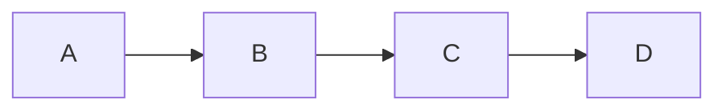

@tab 代码

```
flowchart LR
    A-->B
    B-->C
    C-->D
    click A callback "Tooltip for a callback"
    click B "https://www.github.com" "This is a tooltip for a link"
    click C call callback() "Tooltip for a callback"
    click D href "https://www.github.com" "This is a tooltip for a link"
```

:::

**关键点**  
- **节点**：使用 `节点名` 定义节点。  
- **箭头**：使用 `节点名-->节点名` 定义箭头。  
- **点击事件**：使用 `click 节点名 回调或链接` 定义点击事件。  
- **工具提示**：使用 `"工具提示内容"` 为点击事件添加工具提示。  

:::details 实例说明  
- **节点**：  
  - `A`、`B`、`C`、`D`：定义名为 `A`、`B`、`C`、`D` 的节点。  
- **箭头**：  
  - `A-->B`：从 `A` 节点指向 `B` 节点的箭头。  
  - `B-->C`：从 `B` 节点指向 `C` 节点的箭头。  
  - `C-->D`：从 `C` 节点指向 `D` 节点的箭头。  
- **点击事件**：  
  - `click A callback "Tooltip for a callback"`：为 `A` 节点定义回调点击事件，工具提示为 `Tooltip for a callback`。  
  - `click B "https://www.github.com" "This is a tooltip for a link"`：为 `B` 节点定义链接点击事件，链接为 `https://www.github.com`，工具提示为 `This is a tooltip for a link`。  
  - `click C call callback() "Tooltip for a callback"`：为 `C` 节点定义回调点击事件，工具提示为 `Tooltip for a callback`。  
  - `click D href "https://www.github.com" "This is a tooltip for a link"`：为 `D` 节点定义链接点击事件，链接为 `https://www.github.com`，工具提示为 `This is a tooltip for a link`。  
  :::

如果有其他问题或需要进一步调整，请随时告诉我！

> **成功** 工具提示功能和链接到 URL 的功能从 0.5.2 版本开始提供。

?> 由于 Docsify 处理 JavaScript 回调函数方式的限制，可以在 [这个 jsfiddle](https://jsfiddle.net/yk4h7qou/2/) 查看上述的替代工作演示。

默认情况下，链接在同一浏览器选项卡/窗口中打开。可以通过向点击定义添加链接目标来更改此设置（支持 `_self`、`_blank`、`_parent` 和 `_top`）：

:::tabs

以下是将你提供的文本处理为 `:::tabs` 格式的示例，并解释如何在 Mermaid 的 `flowchart` 图中定义节点、箭头、点击事件和工具提示，并指定链接在新标签页中打开：

:::tabs

@tab 流程图示例

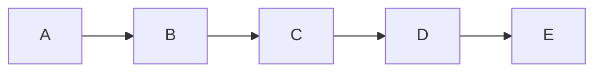

@tab 代码

```
flowchart LR
    A-->B
    B-->C
    C-->D
    D-->E
    click A "https://www.github.com" _blank
    click B "https://www.github.com" "Open this in a new tab" _blank
    click C href "https://www.github.com" _blank
    click D href "https://www.github.com" "Open this in a new tab" _blank
```

:::

**关键点**  
- **节点**：使用 `节点名` 定义节点。  
- **箭头**：使用 `节点名-->节点名` 定义箭头。  
- **点击事件**：使用 `click 节点名 链接` 定义点击事件，支持在新标签页中打开链接。  
- **工具提示**：使用 `"工具提示内容"` 为点击事件添加工具提示。  
- **新标签页**：使用 `_blank` 指定链接在新标签页中打开。  

:::details 实例说明  
- **节点**：  
  - `A`、`B`、`C`、`D`、`E`：定义名为 `A`、`B`、`C`、`D`、`E` 的节点。  
- **箭头**：  
  - `A-->B`：从 `A` 节点指向 `B` 节点的箭头。  
  - `B-->C`：从 `B` 节点指向 `C` 节点的箭头。  
  - `C-->D`：从 `C` 节点指向 `D` 节点的箭头。  
  - `D-->E`：从 `D` 节点指向 `E` 节点的箭头。  
- **点击事件**：  
  - `click A "https://www.github.com" _blank`：为 `A` 节点定义链接点击事件，链接为 `https://www.github.com`，在新标签页中打开。  
  - `click B "https://www.github.com" "Open this in a new tab" _blank`：为 `B` 节点定义链接点击事件，链接为 `https://www.github.com`，工具提示为 `Open this in a new tab`，在新标签页中打开。  
  - `click C href "https://www.github.com" _blank`：为 `C` 节点定义链接点击事件，链接为 `https://www.github.com`，在新标签页中打开。  
  - `click D href "https://www.github.com" "Open this in a new tab" _blank`：为 `D` 节点定义链接点击事件，链接为 `https://www.github.com`，工具提示为 `Open this in a new tab`，在新标签页中打开。  
  :::

如果有其他问题或需要进一步调整，请随时告诉我！

初学者提示 — 在 html 上下文中使用交互式链接的完整示例：

```html
<body>
  <pre class="mermaid">
    flowchart LR
        A-->B
        B-->C
        C-->D
        click A callback "Tooltip"
        click B "https://www.github.com" "This is a link"
        click C call callback() "Tooltip"
        click D href "https://www.github.com" "This is a link"
  </pre>

  <script>
    window.callback = function () {
      alert('A callback was triggered');
    };
    const config = {
      startOnLoad: true,
      flowchart: { useMaxWidth: true, htmlLabels: true, curve: 'cardinal' },
      securityLevel: 'loose',
    };
    mermaid.initialize(config);
  </script>
</body>
```


### 3.方向

该语句声明了流程图的方向。

这声明流程图是从上到下（`TD` 或 `TB`）的。

:::tabs

@tab 从上到下

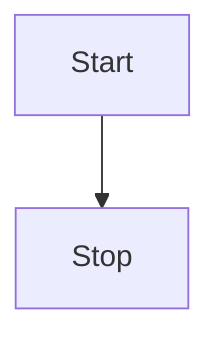

@tab 代码

```
flowchart TD
    Start --> Stop
```

:::

这声明流程图是从左到右定向的 (`LR`)。

:::tabs

@tab 从左到右

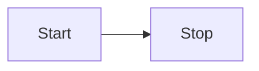

@tab 代码

```
flowchart LR
    Start --> Stop
```

:::

可能的流程图方向是：

- TB - 从上到下
- TD - 自上而下/与从上到下相同
- BT - 从下到上
- RL - 从右到左
- LR - 从左到右

### 4.注释

可以在流程图中输入注释，解析器将忽略这些注释。注释需要独占一行，并且必须以 `%%`（双百分号）开头。注释开始后到下一个**换行符**的任何文本都将被视为注释，包括任何流语法

:::tabs

@tab 注释

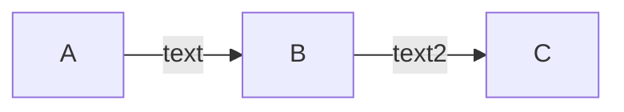

@tab 代码

```
flowchart LR
%% this is a comment A -- text --> B{node}
   A -- text --> B -- text2 --> C
```

:::


### 破坏语法的特殊字符

可以将文本放在引号内以渲染更麻烦的字符。：

:::tabs

@tab 特殊字符

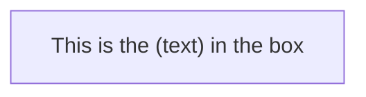

@tab 代码

```
flowchart LR
    id1["This is the (text) in the box"]
```

:::

### 用于转义字符的实体

可以使用此处示例的语法对字符进行转义。

:::tabs

@tab转义

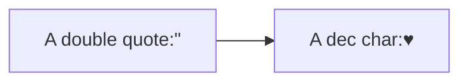

@tab 代码

```
 flowchart LR
        A["A double quote:#quot;"] --> B["A dec char:#9829;"]
```

:::

给出的数字以 10 为基数，因此 `#` 可以编码为 `#35;`。还支持使用 HTML 字符名称。

## 子图

子图语法：

```
subgraph title
    graph definition
end
```

案例：

:::tabs

@tab 子图案例

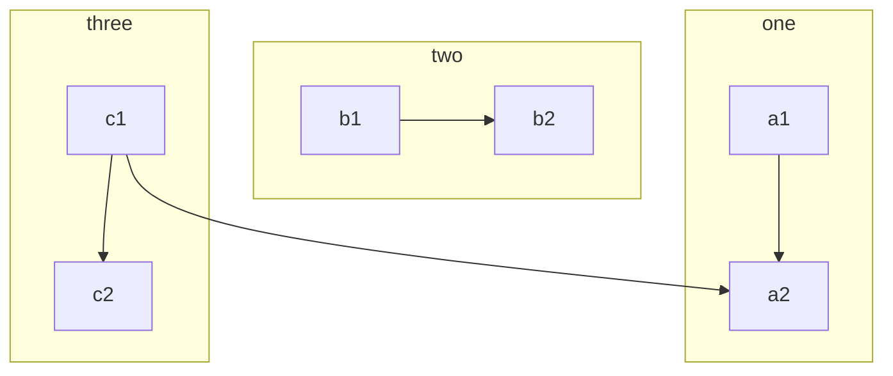

@tab 代码

```
flowchart TB
    c1-->a2
    subgraph one
    a1-->a2
    end
    subgraph two
    b1-->b2
    end
    subgraph three
    c1-->c2
    end
```

:::

你还可以为子图设置显式 id。

:::tabs

@tab 显示id

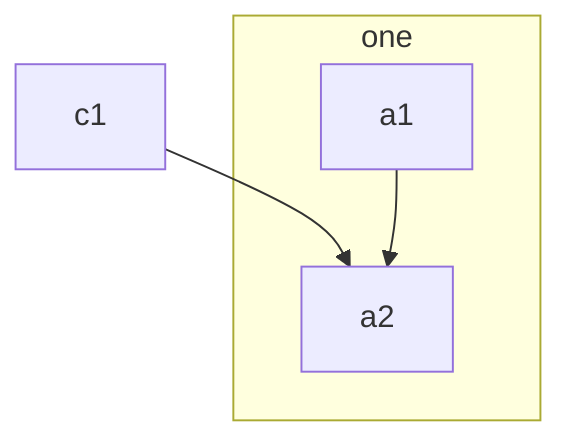

@tab 代码

```
flowchart TB
    c1-->a2
    subgraph ide1 [one]
    a1-->a2
    end
```

:::

### 流程图

使用图形类型流程图，还可以设置子图的边和子图的边，

:::tabs

@tab 子图流程图

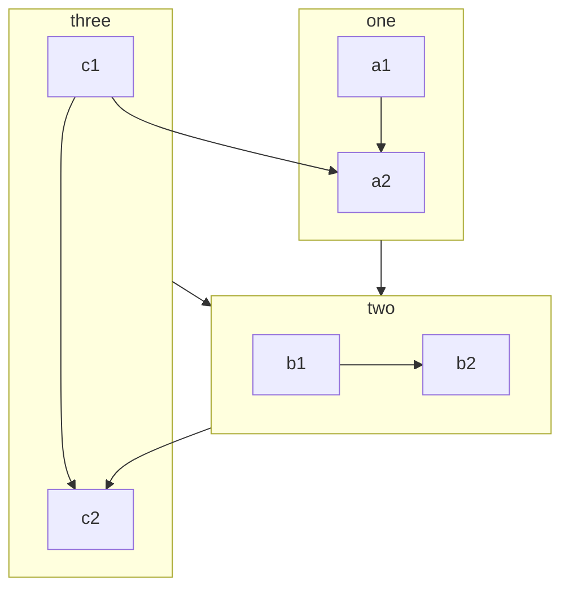

@tab 代码

```
flowchart TB
    c1-->a2
    subgraph one
    a1-->a2
    end
    subgraph two
    b1-->b2
    end
    subgraph three
    c1-->c2
    end
    one --> two
    three --> two
    two --> c2
```

:::

### 子图中的方向

使用graphtype流程图，你可以使用方向语句来设置子图渲染的方向，如本例所示。

:::tabs

@tab 子图方向

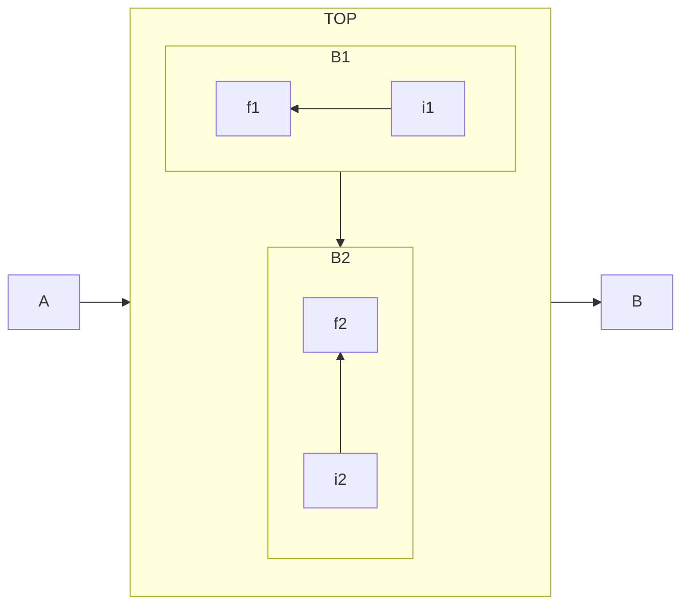

@tab 代码

```
flowchart LR
  subgraph TOP
    direction TB
    subgraph B1
        direction RL
        i1 -->f1
    end
    subgraph B2
        direction BT
        i2 -->f2
    end
  end
  A --> TOP --> B
  B1 --> B2
```

:::

### 局限性

如果任何子图的节点链接到外部，则子图方向将被忽略。相反，子图将继承父图的方向：

:::tabs

@tab 流程图示例


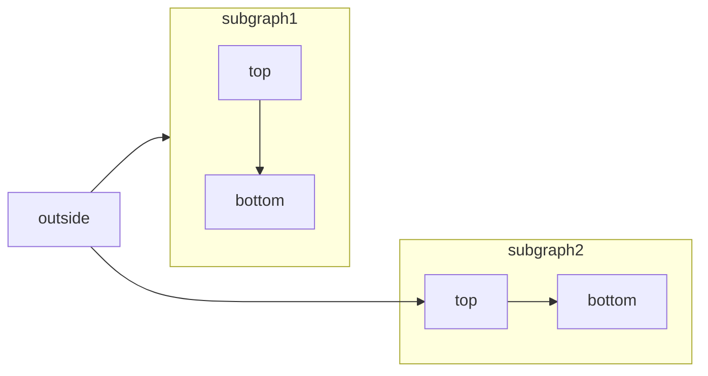


@tab 代码

```
flowchart LR
    subgraph subgraph1
        direction TB
        top1[top] --> bottom1[bottom]
    end
    subgraph subgraph2
        direction TB
        top2[top] --> bottom2[bottom]
    end
  
    outside --> subgraph1
    outside ---> top2
```

:::

---

**解释**：

1. **图的类型**  
   - `flowchart LR`：定义一个从左到右（Left-to-Right）的流程图。

2. **子图（Subgraph）**  
   - `subgraph subgraph1` 和 `subgraph subgraph2`：定义两个子图，分别命名为 `subgraph1` 和 `subgraph2`。  
   - `direction TB`：设置子图的方向为从上到下（Top-to-Bottom）。  
   - `top1[top] --> bottom1[bottom]`：在 `subgraph1` 中，`top1` 节点连接到 `bottom1` 节点。  
   - `top2[top] --> bottom2[bottom]`：在 `subgraph2` 中，`top2` 节点连接到 `bottom2` 节点。

3. **外部链接**  
   - `outside --> subgraph1`：外部节点 `outside` 连接到 `subgraph1`。由于 `subgraph1` 的方向为 `TB`，子图的方向保持不变。  
   - `outside ---> top2`：外部节点 `outside` 连接到 `subgraph2` 中的 `top2` 节点。由于 `subgraph2` 的方向为 `TB`，但链接发生在子图内部，子图的方向继承顶层图的方向（`LR`）。

**关键点**：

- **子图方向**：子图可以通过 `direction` 属性设置自己的方向（如 `TB` 或 `LR`）。  
- **外部链接**：  
  - 当链接到子图时（如 `outside --> subgraph1`），子图的方向保持不变。  
  - 当链接到子图内部的节点时（如 `outside ---> top2`），子图的方向继承顶层图的方向。  

### fontawesome的基本支持

可以添加来自 fontawesome 的图标。

通过语法 fa:#icon class name# 访问图标。

:::tabs

@tab fontawesome图标

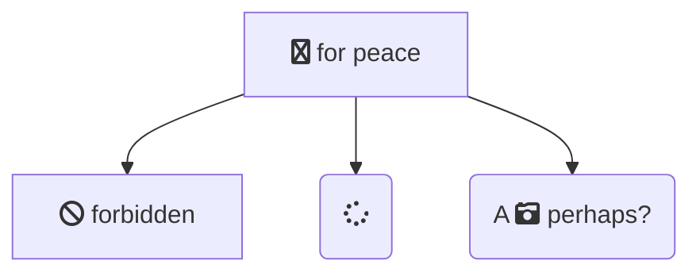

@tab 代码

```
flowchart TD
    B["fa:fa-twitter for peace"]
    B-->C[fa:fa-ban forbidden]
    B-->D(fa:fa-spinner)
    B-->E(A fa:fa-camera-retro perhaps?)
```

:::

如果网站上包含 CSS，Mermaid 支持 Font Awesome。Mermaid 对可以使用的 Font Awesome 版本没有任何限制。

请参阅 [官方 Font Awesome 文档](https://fontawesome.com/start) 了解如何将其包含在你的网站中。

在 `<head>` 中添加此片段将添加对 Font Awesome v6.5.1 的支持

```html
<link
  href="https://cdnjs.cloudflare.com/ajax/libs/font-awesome/6.5.1/css/all.min.css"
  rel="stylesheet"
/>
```

### 自定义图标

只要网站导入相应的工具包，就可以使用 Font Awesome 提供的自定义图标。

请注意，目前这是 Font Awesome 的付费功能。

对于自定义图标，你需要使用 `fak` 前缀。

**示例**

```
flowchart TD
    B[fa:fa-twitter] %% standard icon
    B-->E(fak:fa-custom-icon-name) %% custom icon
```

并尝试渲染它

:::tabs

@tab 自定义图标

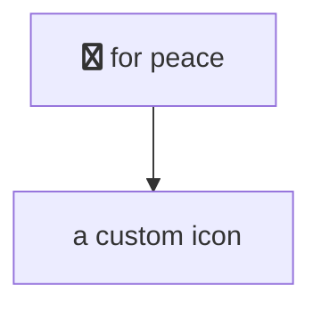

@tab代码

```
flowchart TD
    B["fa:fa-twitter for peace"]
    B-->C["fab:fa-truck-bold a custom icon"]
```

:::

### 分号处理

**图形声明的顶点和链接之间有空格且没有分号**：

- 在图形声明中，语句现在也可以不以分号结束。在 0.2.16 版本之后，以分号结束图形语句只是可选的。因此，下面的图形声明也与旧的图形声明一样有效。
- 顶点和链接之间允许有一个空格。但是，顶点及其文本以及链接及其文本之间不应有任何空格。图形声明的旧语法也将起作用，因此这个新功能是可选的，引入它是为了提高可读性。

下面是图边的新声明，它与旧的图边声明一起有效。

::: tabs

@tab 图示

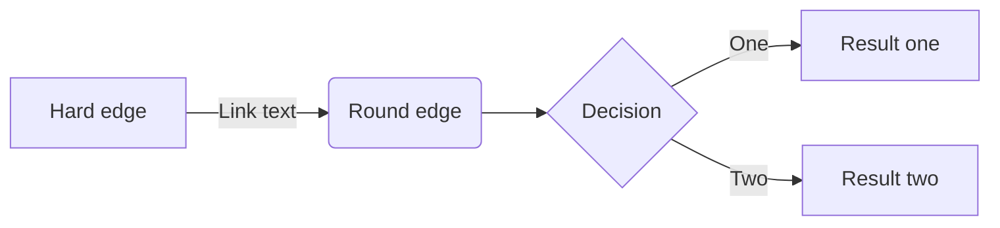

@tab 代码

```
flowchart LR
    A[Hard edge] -->|Link text| B(Round edge)
    B --> C{Decision}
    C -->|One| D[Result one]
    C -->|Two| E[Result two]
```

:::

## 配置

### 渲染器

图表的布局是通过渲染器完成的。默认渲染器是 dagre。

从 Mermaid 版本 9.4 开始，你可以使用名为 elk 的备用渲染器。Elk 渲染器更适合更大和/或更复杂的图表。

Elk 渲染器是一个实验性功能。你可以通过添加以下指令将渲染器更改为 elk：

```
%%{init: {"flowchart": {"defaultRenderer": "elk"}} }%%
```

信息

请注意，网站需要使用 Mermaid 9.4 以上版本才能正常工作，并在延迟加载配置中启用此功能。

### 宽度

可以调整渲染流程图的宽度。

这是通过定义 mermaid.flowchartConfig 或通过 CLI 使用带有配置的 JSON 文件来完成的。mermaidCLI 页面描述了如何使用 CLI。mermaid.flowchartConfig 可以设置为带有配置参数的 JSON 字符串或相应的对象。

```javascript
.flowchartConfig = {
    width: 100%
}
```
