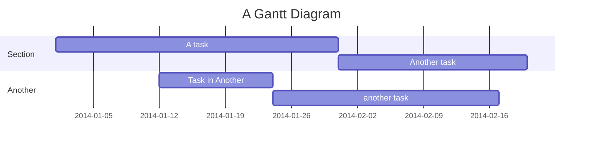
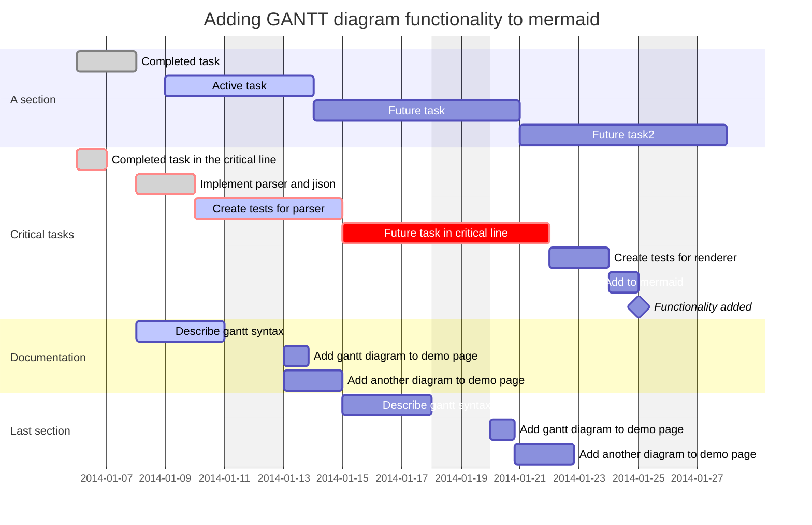
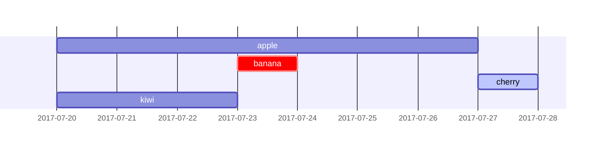
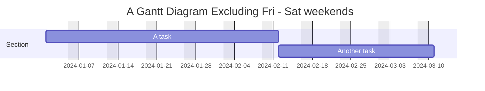
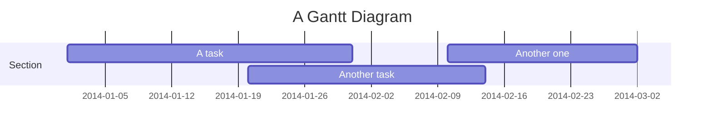

```mermaid
gantt
    dateFormat HH:mm
    axisFormat %H:%M
    Initial milestone : milestone, m1, 17:49, 2m
    Task A : 10m
    Task B : 5m
    Final milestone : milestone, m2, 18:08, 4m
```

```mermaid
gantt
    title Git Issues - days since last update
    dateFormat X
    axisFormat %s
    section Issue19062
    71   : 0, 71
    section Issue19401
    36   : 0, 36
    section Issue193
    34   : 0, 34
    section Issue7441
    9    : 0, 9
    section Issue1300
    5    : 0, 5
```

# 甘特图

> 甘特图是一种柱状图，最初由 Karol Adamiecki 于 1896 年开发，并由 Henry Gantt 在 1910 年代独立开发，它说明了项目进度表以及任何一个项目完成所需的时间。甘特图显示了项目的终端元素和摘要元素的开始日期和完成日期之间的天数。

:::warning 给用户的注意事项

甘特图将每一项计划任务记录为从左向右延伸的一个连续条。x 轴代表时间，y 轴记录不同的任务及其完成的顺序。

请务必记住，当特定于任务的日期、日期或日期集合为 "excluded" 时，甘特图将通过向右延长相同天数来适应这些更改，而不是在任务内创建间隙 。

但是，如果排除的日期位于设置为连续开始的两个任务之间，则将以图形方式跳过排除的日期并留空，并且将在排除的日期结束后开始下一个任务。

甘特图对于跟踪项目完成之前所需的时间很有用，但它也可以用于以图形方式表示 "非工作日"，只需进行一些调整。

:::

Mermaid 可以将甘特图渲染为 SVG、PNG 或可粘贴到文档中的 MarkDown 链接。

以下是将你提供的文本处理为 `:::tabs` 格式的示例，并解释如何在 Mermaid 的 `gantt` 图中定义甘特图、部分和任务：

:::tabs

@tab 甘特图示例



@tab 代码

```
gantt
    title A Gantt Diagram
    dateFormat YYYY-MM-DD
    section Section
        A task          :a1, 2014-01-01, 30d
        Another task    :after a1, 20d
    section Another
        Task in Another :2014-01-12, 12d
        another task    :24d
```

:::

**关键点**  
- **标题**：使用 `title` 为甘特图添加标题。  
- **日期格式**：使用 `dateFormat` 定义日期格式。  
- **部分**：使用 `section 部分名` 定义甘特图的部分。  
- **任务**：使用 `任务名 : 任务ID, 开始日期, 持续时间` 或 `任务名 : after 任务ID, 持续时间` 定义任务。  

:::details 实例说明  
- **标题**：`A Gantt Diagram`，表示甘特图的主题。  
- **日期格式**：`YYYY-MM-DD`，表示日期格式为年-月-日。  
- **部分**：  
  - `Section`：定义一个名为 `Section` 的部分。  
  - `Another`：定义另一个名为 `Another` 的部分。  
- **任务**：  
  - `A task :a1, 2014-01-01, 30d`：在 `Section` 部分，定义一个任务 `A task`，任务 ID 为 `a1`，开始日期为 `2014-01-01`，持续时间为 `30` 天。  
  - `Another task :after a1, 20d`：在 `Section` 部分，定义另一个任务 `Another task`，在任务 `a1` 完成后开始，持续时间为 `20` 天。  
  - `Task in Another :2014-01-12, 12d`：在 `Another` 部分，定义一个任务 `Task in Another`，开始日期为 `2014-01-12`，持续时间为 `12` 天。  
  - `another task :24d`：在 `Another` 部分，定义另一个任务 `another task`，持续时间为 `24` 天。  
  :::

如果有其他问题或需要进一步调整，请随时告诉我！

## 语法

以下是将你提供的文本处理为 `:::tabs` 格式的示例，并解释如何在 Mermaid 的 `gantt` 图中定义甘特图、部分、任务和排除日期：

:::tabs

@tab 甘特图示例



@tab 代码

```
gantt
    dateFormat  YYYY-MM-DD
    title       Adding GANTT diagram functionality to mermaid
    excludes    weekends
    %% (`excludes` accepts specific dates in YYYY-MM-DD format, days of the week ("sunday") or "weekends", but not the word "weekdays".)

    section A section
    Completed task            :done,    des1, 2014-01-06,2014-01-08
    Active task               :active,  des2, 2014-01-09, 3d
    Future task               :         des3, after des2, 5d
    Future task2              :         des4, after des3, 5d

    section Critical tasks
    Completed task in the critical line :crit, done, 2014-01-06,24h
    Implement parser and jison          :crit, done, after des1, 2d
    Create tests for parser             :crit, active, 3d
    Future task in critical line        :crit, 5d
    Create tests for renderer           :2d
    Add to mermaid                      :until isadded
    Functionality added                 :milestone, isadded, 2014-01-25, 0d

    section Documentation
    Describe gantt syntax               :active, a1, after des1, 3d
    Add gantt diagram to demo page      :after a1  , 20h
    Add another diagram to demo page    :doc1, after a1  , 48h

    section Last section
    Describe gantt syntax               :after doc1, 3d
    Add gantt diagram to demo page      :20h
    Add another diagram to demo page    :48h
```

:::

**关键点**  
- **标题**：使用 `title` 为甘特图添加标题。  
- **日期格式**：使用 `dateFormat` 定义日期格式。  
- **排除日期**：使用 `excludes` 排除特定日期或时间段（如 `weekends`）。  
- **部分**：使用 `section 部分名` 定义甘特图的部分。  
- **任务**：使用 `任务名 : 状态, 任务ID, 开始日期, 持续时间` 或 `任务名 : after 任务ID, 持续时间` 定义任务，支持状态（如 `done`、`active`）、关键路径（`crit`）和里程碑（`milestone`）。  

:::details 实例说明  
- **标题**：`Adding GANTT diagram functionality to mermaid`，表示甘特图的主题。  
- **日期格式**：`YYYY-MM-DD`，表示日期格式为年-月-日。  
- **排除日期**：`excludes weekends`，表示排除周末。  
- **部分**：  
  - `A section`：定义一个名为 `A section` 的部分。  
  - `Critical tasks`：定义另一个名为 `Critical tasks` 的部分。  
  - `Documentation`：定义第三个名为 `Documentation` 的部分。  
  - `Last section`：定义第四个名为 `Last section` 的部分。  
- **任务**：  
  - `Completed task :done, des1, 2014-01-06,2014-01-08`：在 `A section` 部分，定义一个已完成的任务 `Completed task`，任务 ID 为 `des1`，开始日期为 `2014-01-06`，结束日期为 `2014-01-08`。  
  - `Active task :active, des2, 2014-01-09, 3d`：在 `A section` 部分，定义一个进行中的任务 `Active task`，任务 ID 为 `des2`，开始日期为 `2014-01-09`，持续时间为 `3` 天。  
  - `Future task : des3, after des2, 5d`：在 `A section` 部分，定义一个未来任务 `Future task`，在任务 `des2` 完成后开始，持续时间为 `5` 天。  
  - `Future task2 : des4, after des3, 5d`：在 `A section` 部分，定义另一个未来任务 `Future task2`，在任务 `des3` 完成后开始，持续时间为 `5` 天。  
  - `Completed task in the critical line :crit, done, 2014-01-06,24h`：在 `Critical tasks` 部分，定义一个关键路径上的已完成任务 `Completed task in the critical line`，开始日期为 `2014-01-06`，持续时间为 `24` 小时。  
  - `Implement parser and jison :crit, done, after des1, 2d`：在 `Critical tasks` 部分，定义一个关键路径上的已完成任务 `Implement parser and jison`，在任务 `des1` 完成后开始，持续时间为 `2` 天。  
  - `Create tests for parser :crit, active, 3d`：在 `Critical tasks` 部分，定义一个关键路径上的进行中任务 `Create tests for parser`，持续时间为 `3` 天。  
  - `Future task in critical line :crit, 5d`：在 `Critical tasks` 部分，定义一个关键路径上的未来任务 `Future task in critical line`，持续时间为 `5` 天。  
  - `Create tests for renderer :2d`：在 `Critical tasks` 部分，定义一个任务 `Create tests for renderer`，持续时间为 `2` 天。  
  - `Add to mermaid :until isadded`：在 `Critical tasks` 部分，定义一个任务 `Add to mermaid`，持续到 `isadded` 里程碑。  
  - `Functionality added :milestone, isadded, 2014-01-25, 0d`：在 `Critical tasks` 部分，定义一个里程碑 `Functionality added`，日期为 `2014-01-25`。  
  - `Describe gantt syntax :active, a1, after des1, 3d`：在 `Documentation` 部分，定义一个进行中的任务 `Describe gantt syntax`，任务 ID 为 `a1`，在任务 `des1` 完成后开始，持续时间为 `3` 天。  
  - `Add gantt diagram to demo page :after a1, 20h`：在 `Documentation` 部分，定义一个任务 `Add gantt diagram to demo page`，在任务 `a1` 完成后开始，持续时间为 `20` 小时。  
  - `Add another diagram to demo page :doc1, after a1, 48h`：在 `Documentation` 部分，定义另一个任务 `Add another diagram to demo page`，任务 ID 为 `doc1`，在任务 `a1` 完成后开始，持续时间为 `48` 小时。  
  - `Describe gantt syntax :after doc1, 3d`：在 `Last section` 部分，定义一个任务 `Describe gantt syntax`，在任务 `doc1` 完成后开始，持续时间为 `3` 天。  
  - `Add gantt diagram to demo page :20h`：在 `Last section` 部分，定义一个任务 `Add gantt diagram to demo page`，持续时间为 `20` 小时。  
  - `Add another diagram to demo page :48h`：在 `Last section` 部分，定义另一个任务 `Add another diagram to demo page`，持续时间为 `48` 小时。  
  :::

如果有其他问题或需要进一步调整，请随时告诉我！

任务默认是连续的。任务开始日期默认为前一任务的结束日期。

冒号 `:` 将任务标题与其元数据分隔开。元数据项由逗号 `,` 分隔。有效标签为 `active`、`done`、`crit` 和 `milestone`。标签是可选的，但如果使用，则必须首先指定它们。处理完标签后，剩余的元数据项解释如下：

1. 如果指定单个项目，它将确定任务何时结束。它可以是特定的日期/时间或持续时间。如果指定了持续时间，则会将其添加到任务的开始日期以确定任务的结束日期，同时考虑所有排除情况。
2. 如果指定了两项，则最后一项的解释与前一种情况相同。第一项可以指定明确的开始日期/时间（以 `dateFormat` 指定的格式）或使用 `after <otherTaskID> [[otherTaskID2 [otherTaskID3]]...]` 引用另一个任务。在后一种情况下，任务的开始日期将根据任何引用任务的最晚结束日期进行设置。
3. 如果指定了三个项目，则最后两个项目将按照前一种情况进行解释。第一项表示任务的 ID，可以使用 `later <taskID>` 语法引用。

| 元数据语法                                           | 开始日期                             | 结束日期                                | ID       |
| :--------------------------------------------------- | :----------------------------------- | :-------------------------------------- | :------- |
| `<taskID>, <startDate>, <endDate>`                   | 使用 `dateformat` 解释的 `startdate` | 使用 `dateformat` 解释的 `endDate`      | `taskID` |
| `<taskID>, <startDate>, <length>`                    | 使用 `dateformat` 解释的 `startdate` | 开始日期 + `length`                     | `taskID` |
| `<taskID>, after <otherTaskId>, <endDate>`           | 先前指定任务的结束日期 `otherTaskID` | 使用 `dateformat` 解释的 `endDate`      | `taskID` |
| `<taskID>, after <otherTaskId>, <length>`            | 先前指定任务的结束日期 `otherTaskID` | 开始日期 + `length`                     | `taskID` |
| `<taskID>, <startDate>, until <otherTaskId>`         | 使用 `dateformat` 解释的 `startdate` | 先前指定的任务 `otherTaskID` 的开始日期 | `taskID` |
| `<taskID>, after <otherTaskId>, until <otherTaskId>` | 先前指定任务的结束日期 `otherTaskID` | 先前指定的任务 `otherTaskID` 的开始日期 | `taskID` |
| `<startDate>, <endDate>`                             | 使用 `dateformat` 解释的 `startdate` | 使用 `dateformat` 解释的 `enddate`      | n/a      |
| `<startDate>, <length>`                              | 使用 `dateformat` 解释的 `startdate` | 开始日期 + `length`                     | n/a      |
| `after <otherTaskID>, <endDate>`                     | 先前指定任务的结束日期 `otherTaskID` | 使用 `dateformat` 解释的 `enddate`      | n/a      |
| `after <otherTaskID>, <length>`                      | 先前指定任务的结束日期 `otherTaskID` | 开始日期 + `length`                     | n/a      |
| `<startDate>, until <otherTaskId>`                   | 使用 `dateformat` 解释的 `startdate` | 先前指定的任务 `otherTaskID` 的开始日期 | n/a      |
| `after <otherTaskId>, until <otherTaskId>`           | 先前指定任务的结束日期 `otherTaskID` | 先前指定的任务 `otherTaskID` 的开始日期 | n/a      |
| `<endDate>`                                          | 上一任务的结束日期                   | 使用 `dateformat` 解释的 `enddate`      | n/a      |
| `<length>`                                           | 上一任务的结束日期                   | 开始日期 + `length`                     | n/a      |
| `until <otherTaskId>`                                | 上一任务的结束日期                   | 先前指定的任务 `otherTaskID` 的开始日期 | n/a      |

信息

在 (v10.9.0+) 中添加了对关键字 `until` 的支持。这可用于定义正在运行的任务，直到其他特定任务或里程碑开始。

为简单起见，该表未显示使用 `after` 关键字列出的多个任务的使用。以下是如何使用它以及如何解释它的示例：

以下是将你提供的文本处理为 `:::tabs` 格式的示例，并解释如何在 Mermaid 的 `gantt` 图中定义任务和关系：

:::tabs

@tab 甘特图示例



@tab 代码

```
gantt
    apple :a, 2017-07-20, 1w
    banana :crit, b, 2017-07-23, 1d
    cherry :active, c, after b a, 1d
    kiwi   :d, 2017-07-20, until b c
```

:::

**关键点**  
- **任务**：使用 `任务名 : 状态, 任务ID, 开始日期, 持续时间` 或 `任务名 : after 任务ID, 持续时间` 定义任务，支持状态（如 `active`）、关键路径（`crit`）和直到某个任务（`until`）。  

:::details 实例说明  
- **任务**：  
  - `apple :a, 2017-07-20, 1w`：定义一个任务 `apple`，任务 ID 为 `a`，开始日期为 `2017-07-20`，持续时间为 `1` 周。  
  - `banana :crit, b, 2017-07-23, 1d`：定义一个关键路径任务 `banana`，任务 ID 为 `b`，开始日期为 `2017-07-23`，持续时间为 `1` 天。  
  - `cherry :active, c, after b a, 1d`：定义一个进行中的任务 `cherry`，任务 ID 为 `c`，在任务 `b` 和 `a` 完成后开始，持续时间为 `1` 天。  
  - `kiwi :d, 2017-07-20, until b c`：定义一个任务 `kiwi`，任务 ID 为 `d`，开始日期为 `2017-07-20`，持续到任务 `b` 和 `c` 完成。  
  :::

如果有其他问题或需要进一步调整，请随时告诉我！

### 标题

`title` 是一个可选字符串，显示在甘特图的顶部，用于描述整个图表。

### 排除

`excludes` 是可选属性，接受 YYYY-MM-DD 格式的特定日期、星期几 ("sunday") 或 "weekends"，但不接受单词 "weekdays"。这些日期将标记在图表上，并且不包括在任务的持续时间计算中。这意味着，如果任务间隔期间存在排除的日期，则将在任务末尾添加 'skipped' 天，以确保持续时间符合代码中指定的要求。

**周末 (v\11.0.0+)**：

排除周末时，可以将周末配置为周五和周六或周六和周日。默认情况下，周末是周六和周日。要定义周末开始日，可以在新行中添加一个可选属性 `weekend`，后跟 `friday` 或 `saturday`。

以下是将你提供的文本处理为 `:::tabs` 格式的示例，并解释如何在 Mermaid 的 `gantt` 图中定义甘特图、排除日期和任务：

:::tabs

@tab 甘特图示例



@tab 代码

```
gantt
    title A Gantt Diagram Excluding Fri - Sat weekends
    dateFormat YYYY-MM-DD
    excludes weekends
    weekend friday
    section Section
        A task          :a1, 2024-01-01, 30d
        Another task    :after a1, 20d
```

:::

**关键点**  
- **标题**：使用 `title` 为甘特图添加标题。  
- **日期格式**：使用 `dateFormat` 定义日期格式。  
- **排除日期**：使用 `excludes` 排除特定日期或时间段（如 `weekends`），并通过 `weekend` 指定周末的起始日（如 `friday`）。  
- **部分**：使用 `section 部分名` 定义甘特图的部分。  
- **任务**：使用 `任务名 : 任务ID, 开始日期, 持续时间` 或 `任务名 : after 任务ID, 持续时间` 定义任务。  

:::details 实例说明  
- **标题**：`A Gantt Diagram Excluding Fri - Sat weekends`，表示甘特图的主题。  
- **日期格式**：`YYYY-MM-DD`，表示日期格式为年-月-日。  
- **排除日期**：  
  - `excludes weekends`：排除周末。  
  - `weekend friday`：指定周末从周五开始（即周五和周六为周末）。  
- **部分**：  
  - `Section`：定义一个名为 `Section` 的部分。  
- **任务**：  
  - `A task :a1, 2024-01-01, 30d`：在 `Section` 部分，定义一个任务 `A task`，任务 ID 为 `a1`，开始日期为 `2024-01-01`，持续时间为 `30` 天。  
  - `Another task :after a1, 20d`：在 `Section` 部分，定义另一个任务 `Another task`，在任务 `a1` 完成后开始，持续时间为 `20` 天。  
  :::

如果有其他问题或需要进一步调整，请随时告诉我！

### 章节陈述

你可以将图表划分为各个部分，例如将项目的不同部分（例如开发和文档）分开。

为此，请以 `section` 关键字开始一行并为其命名。

::: warning

与整个图表的标题不同，此名称是必需的。

:::

### 里程碑

你可以将里程碑添加到图表中。里程碑与任务不同，因为它们代表单个时刻并由关键字 `milestone` 标识。以下是有关如何使用里程碑的示例。你可能会注意到，里程碑的确切位置由里程碑的初始日期和任务的 "duration" 确定，如下所示：initial date+duration/2.

## 设置日期

`dateFormat` 定义甘特图元以下是将你提供的文本处理为 `:::tabs` 格式的示例，并解释如何在 Mermaid 的 `gantt` 图中定义时间格式、里程碑和任务：

:::tabs

@tab 甘特图示例



@tab 代码

```
gantt
    dateFormat HH:mm
    axisFormat %H:%M
    Initial milestone : milestone, m1, 17:49, 2m
    Task A : 10m
    Task B : 5m
    Final milestone : milestone, m2, 18:08, 4m
```

:::

**关键点**  
- **时间格式**：使用 `dateFormat` 定义时间格式，使用 `axisFormat` 定义时间轴的显示格式。  
- **里程碑**：使用 `里程碑名 : milestone, 里程碑ID, 时间, 持续时间` 定义里程碑。  
- **任务**：使用 `任务名 : 持续时间` 定义任务。  

:::details 实例说明  
- **时间格式**：  
  - `dateFormat HH:mm`：定义时间格式为小时:分钟。  
  - `axisFormat %H:%M`：定义时间轴的显示格式为小时:分钟。  
- **里程碑**：  
  - `Initial milestone : milestone, m1, 17:49, 2m`：定义一个初始里程碑 `Initial milestone`，里程碑 ID 为 `m1`，时间为 `17:49`，持续时间为 `2` 分钟。  
  - `Final milestone : milestone, m2, 18:08, 4m`：定义一个最终里程碑 `Final milestone`，里程碑 ID 为 `m2`，时间为 `18:08`，持续时间为 `4` 分钟。  
- **任务**：  
  - `Task A : 10m`：定义一个任务 `Task A`，持续时间为 `10` 分钟。  
  - `Task B : 5m`：定义一个任务 `Task B`，持续时间为 `5` 分钟。  
  :::

如果有其他问题或需要进一步调整，请随时告诉我！素的日期输入格式。这些日期如何在渲染的图表输出中表示由 `axisFormat` 定义。

### 输入日期格式

默认输入日期格式为 `YYYY-MM-DD`。你可以定义你的自定义 `dateFormat`。

markdown

```
dateFormat YYYY-MM-DD
```

支持以下格式选项：

| 输入       | 示例           | 描述                                           |
| :--------- | :------------- | :--------------------------------------------- |
| `YYYY`     | 2014           | 4 位数字年份                                   |
| `YY`       | 14             | 2 位数字年份                                   |
| `Q`        | 1..4           | 年的季度。将月份设置为季度的第一个月。         |
| `M MM`     | 1..12          | 月份数                                         |
| `MMM MMMM` | 一月..十二月   | 由 `dayjs.locale()` 设置的语言环境中的月份名称 |
| `D DD`     | 1..31          | 一个月中的哪一天                               |
| `Do`       | 1st..31st      | 带序数的月份中的某一天                         |
| `DDD DDDD` | 1..365         | 一年中的某一天                                 |
| `X`        | 1410715640.579 | Unix 时间戳                                    |
| `x`        | 1410715640579  | Unix 毫秒时间戳                                |
| `H HH`     | 0..23          | 24 小时时间                                    |
| `h hh`     | 1..12          | 与 `a A` 一起使用的 12 小时时间。              |
| `a A`      | 上午下午       | 午后或午前                                     |
| `m mm`     | 0..59          | 分钟                                           |
| `s ss`     | 0..59          | 秒数                                           |
| `S`        | 0..9           | 十分之一秒                                     |
| `SS`       | 0..99          | 一秒几百                                       |
| `SSS`      | 0..999         | 千分之一秒                                     |
| `Z ZZ`     | +12:00         | 与 UTC 的偏移量为 +-HH:mm、+-HHmm 或 Z         |

### 轴上的输出日期格式

默认输出日期格式为 `YYYY-MM-DD`。你可以定义自定义 `axisFormat`，例如 2020 年第一季度的 `2020-Q1`。

```
axisFormat %Y-%m-%d
```

支持以下格式字符串：

| 格式 | 定义                                                   |
| :--- | :----------------------------------------------------- |
| %a   | 工作日缩写名称                                         |
| %A   | 工作日的完整名称                                       |
| %b   | 月份名称缩写                                           |
| %B   | 月份全名                                               |
| %c   | 日期和时间，如 "%a %b %e %H:%M:%S %Y"                  |
| %d   | 十进制数形式的月份中的零填充日期 [01,31]               |
| %e   | 以空格填充的十进制数字形式的月份日期 [1,31]；相当于%_d |
| %H   | 小时（24 小时制），十进制数 [00,23]                    |
| %I   | 小时（12 小时制），十进制数 [01,12]                    |
| %j   | 一年中的第几天，十进制数 [001,366]                     |
| %m   | 十进制数形式的月份 [01,12]                             |
| %M   | 分钟为十进制数 [00,59]                                 |
| %L   | 十进制数形式的毫秒 [000, 999]                          |
| %p   | 上午或下午                                             |
| %S   | 秒为十进制数 [00,61]                                   |
| %U   | 一年中的周数（星期日为一周的第一天），十进制数 [00,53] |
| %w   | 十进制数形式的工作日 [0(Sunday),6]                     |
| %W   | 一年中的周数（星期一为一周的第一天），十进制数 [00,53] |
| %x   | 日期，如 "%m/%d/%Y"                                    |
| %X   | 时间，如 "%H:%M:%S"                                    |
| %y   | 没有世纪的年份作为十进制数 [00,99]                     |
| %Y   | 年份，世纪为十进制数                                   |
| %Z   | 时区偏移量，例如 "-0700"                               |
| %%   | 一个 "%" 字面字符                                      |

### 轴刻度 

(v10.3.0+)默认输出刻度为自动。你可以定制你的 `tickInterval`，例如 `1day` 或 `1week`。

```
tickInterval 1day
```

模式是：

```javascript
/^([1-9][0-9]*)(millisecond|second|minute|hour|day|week|month)$/;
```

更多信息：https://github.com/d3/d3-time#interval_every

基于周的 `tickInterval` 默认从星期日开始一周。如果你希望指定 `tickInterval` 应开始的另一个工作日，请使用 `weekday` 选项：

以下是将你提供的文本处理为 `:::tabs` 格式的示例，并解释如何在 Mermaid 的 `gantt` 图中定义时间刻度和工作日起始日：

:::tabs

@tab 甘特图示例

```mermaid
gantt
  tickInterval 1week
  weekday monday
```

@tab 代码

```
gantt
  tickInterval 1week
  weekday monday
```

:::

**关键点**  
- **时间刻度**：使用 `tickInterval` 定义时间刻度间隔（如 `1week`）。  
- **工作日起始日**：使用 `weekday` 定义工作周的起始日（如 `monday`）。  

:::details 实例说明  
- **时间刻度**：  
  - `tickInterval 1week`：定义时间刻度间隔为 `1` 周。  
- **工作日起始日**：  
  - `weekday monday`：定义工作周的起始日为周一。  
  :::

如果有其他问题或需要进一步调整，请随时告诉我！


:::warning

在 v10.3.0 中添加了 `millisecond` 和 `second` 支持

:::

## 紧凑模式输出

紧凑模式允许你在同一行中显示多个任务。通过前面的 YAML 设置设置图形的显示模式，可以为甘特图启用紧凑模式。

以下是将你提供的文本处理为 `:::tabs` 格式的示例，并解释如何在 Mermaid 的 `gantt` 图中定义甘特图、部分和任务，同时启用紧凑模式：

:::tabs

@tab 甘特图示例



@tab 代码

```
---
displayMode: compact
---
gantt
    title A Gantt Diagram
    dateFormat  YYYY-MM-DD

    section Section
    A task           :a1, 2014-01-01, 30d
    Another task     :a2, 2014-01-20, 25d
    Another one      :a3, 2014-02-10, 20d
```

:::

**关键点**  
- **紧凑模式**：使用 `displayMode: compact` 启用紧凑模式，使甘特图更简洁。  
- **标题**：使用 `title` 为甘特图添加标题。  
- **日期格式**：使用 `dateFormat` 定义日期格式。  
- **部分**：使用 `section 部分名` 定义甘特图的部分。  
- **任务**：使用 `任务名 : 任务ID, 开始日期, 持续时间` 定义任务。  

:::details 实例说明  
- **紧凑模式**：`displayMode: compact`，使甘特图更简洁。  
- **标题**：`A Gantt Diagram`，表示甘特图的主题。  
- **日期格式**：`YYYY-MM-DD`，表示日期格式为年-月-日。  
- **部分**：  
  - `Section`：定义一个名为 `Section` 的部分。  
- **任务**：  
  - `A task :a1, 2014-01-01, 30d`：在 `Section` 部分，定义一个任务 `A task`，任务 ID 为 `a1`，开始日期为 `2014-01-01`，持续时间为 `30` 天。  
  - `Another task :a2, 2014-01-20, 25d`：在 `Section` 部分，定义另一个任务 `Another task`，任务 ID 为 `a2`，开始日期为 `2014-01-20`，持续时间为 `25` 天。  
  - `Another one :a3, 2014-02-10, 20d`：在 `Section` 部分，定义第三个任务 `Another one`，任务 ID 为 `a3`，开始日期为 `2014-02-10`，持续时间为 `20` 天。  
  :::

如果有其他问题或需要进一步调整，请随时告诉我！

## 注释

可以在甘特图中输入注释，解析器将忽略该注释。注释需要独占一行，并且必须以 `%%`（双百分号）开头。注释开始后到下一个换行符的任何文本都将被视为注释，包括任何图表语法。

以下是将你提供的文本处理为 `:::tabs` 格式的示例，并解释如何在 Mermaid 的 `gantt` 图中定义甘特图、部分和任务，同时添加注释：

:::tabs

@tab 甘特图示例


@tab 代码

```
gantt
    title A Gantt Diagram
    %% This is a comment
    dateFormat YYYY-MM-DD
    section Section
        A task          :a1, 2014-01-01, 30d
        Another task    :after a1, 20d
    section Another
        Task in Another :2014-01-12, 12d
        another task    :24d
```

:::

**关键点**  
- **标题**：使用 `title` 为甘特图添加标题。  
- **注释**：使用 `%%` 添加注释，注释不会被渲染。  
- **日期格式**：使用 `dateFormat` 定义日期格式。  
- **部分**：使用 `section 部分名` 定义甘特图的部分。  
- **任务**：使用 `任务名 : 任务ID, 开始日期, 持续时间` 或 `任务名 : after 任务ID, 持续时间` 定义任务。  

:::details 实例说明  
- **标题**：`A Gantt Diagram`，表示甘特图的主题。  
- **注释**：`%% This is a comment`，添加注释，注释不会被渲染。  
- **日期格式**：`YYYY-MM-DD`，表示日期格式为年-月-日。  
- **部分**：  
  - `Section`：定义一个名为 `Section` 的部分。  
  - `Another`：定义另一个名为 `Another` 的部分。  
- **任务**：  
  - `A task :a1, 2014-01-01, 30d`：在 `Section` 部分，定义一个任务 `A task`，任务 ID 为 `a1`，开始日期为 `2014-01-01`，持续时间为 `30` 天。  
  - `Another task :after a1, 20d`：在 `Section` 部分，定义另一个任务 `Another task`，在任务 `a1` 完成后开始，持续时间为 `20` 天。  
  - `Task in Another :2014-01-12, 12d`：在 `Another` 部分，定义一个任务 `Task in Another`，开始日期为 `2014-01-12`，持续时间为 `12` 天。  
  - `another task :24d`：在 `Another` 部分，定义另一个任务 `another task`，持续时间为 `24` 天。  
  :::

如果有其他问题或需要进一步调整，请随时告诉我！

## 样式

甘特图的样式是通过定义许多 CSS 类来完成的。在渲染期间，这些类是从位于 src/diagrams/gantt/styles.js 的文件中提取的

| 类                    | 描述                               |
| :-------------------- | :--------------------------------- |
| grid.tick             | 网格线的样式                       |
| grid.path             | 网格边框的样式                     |
| .taskText             | 任务文本样式                       |
| .taskTextOutsideRight | 超出右侧活动栏的任务文本的样式。   |
| .taskTextOutsideLeft  | 超出活动栏、向左的任务文本的样式。 |
| todayMarker           | "今日标记" 的切换和样式            |

样式表示例:

```css
.grid .tick {
  stroke: lightgrey;
  opacity: 0.3;
  shape-rendering: crispEdges;
}
.grid path {
  stroke-width: 0;
}

#tag {
  color: white;
  background: #fa283d;
  width: 150px;
  position: absolute;
  display: none;
  padding: 3px 6px;
  margin-left: -80px;
  font-size: 11px;
}

#tag:before {
  border: solid transparent;
  content: ' ';
  height: 0;
  left: 50%;
  margin-left: -5px;
  position: absolute;
  width: 0;
  border-width: 10px;
  border-bottom-color: #fa283d;
  top: -20px;
}
.taskText {
  fill: white;
  text-anchor: middle;
}
.taskTextOutsideRight {
  fill: black;
  text-anchor: start;
}
.taskTextOutsideLeft {
  fill: black;
  text-anchor: end;
}
```

## 今日标记

你可以设置当前日期标记的样式或隐藏该标记。要设置其样式，请为 `todayMarker` 键添加一个值。

```
todayMarker stroke-width:5px,stroke:#0f0,opacity:0.5
```

要隐藏标记，请将 `todayMarker` 设置为 `off`。

```
todayMarker off
```

## 配置

可以调整渲染甘特图的边距。

这是通过定义配置对象的 `ganttConfig` 部分来完成的。[mermaidCLI](https://mermaid.nodejs.cn/config/mermaidCLI.html) 页描述了如何使用 CLI。

mermaid.ganttConfig 可以设置为带有配置参数的 JSON 字符串或相应的对象。

```javascript
mermaid.ganttConfig = {
  titleTopMargin: 25, // Margin top for the text over the diagram
  barHeight: 20, // The height of the bars in the graph
  barGap: 4, // The margin between the different activities in the gantt diagram
  topPadding: 75, // Margin between title and gantt diagram and between axis and gantt diagram.
  rightPadding: 75, // The space allocated for the section name to the right of the activities
  leftPadding: 75, // The space allocated for the section name to the left of the activities
  gridLineStartPadding: 10, // Vertical starting position of the grid lines
  fontSize: 12, // Font size
  sectionFontSize: 24, // Font size for sections
  numberSectionStyles: 1, // The number of alternating section styles
  axisFormat: '%d/%m', // Date/time format of the axis
  tickInterval: '1week', // Axis ticks
  topAxis: true, // When this flag is set, date labels will be added to the top of the chart
  displayMode: 'compact', // Turns compact mode on
  weekday: 'sunday', // On which day a week-based interval should start
};
```

**可能的配置参数：**

| 参数         | 描述                                                         | 默认值 |
| :----------- | :----------------------------------------------------------- | :----- |
| mirrorActor  | 打开/关闭图表下方和上方参与者的渲染                          | false  |
| 底部边距调整 | 调整图表结束的距离。使用 css 的宽边框样式可能会产生不需要的剪裁，这就是此配置参数存在的原因。 | 1      |

## 相互作用

可以将单击事件绑定到任务。单击可能会导致 JavaScript 回调或导致在当前浏览器选项卡中打开的链接。注意：使用 `securityLevel='strict'` 时禁用此功能，使用 `securityLevel='loose'` 时启用此功能。

```
click taskId call callback(arguments)
click taskId href URL
```

- taskId 是任务的 id
- 回调是在显示图表的页面上定义的 javascript 函数的名称，如果没有指定其他参数，将以 taskId 作为参数调用该函数。

初学者提示 — 在 html 上下文中使用交互式链接的完整示例：

```html
<body>
  <pre class="mermaid">
    gantt
      dateFormat  YYYY-MM-DD

      section Clickable
      Visit mermaidjs         :active, cl1, 2014-01-07, 3d
      Print arguments         :cl2, after cl1, 3d
      Print task              :cl3, after cl2, 3d

      click cl1 href "https://mermaidjs.github.io/"
      click cl2 call printArguments("test1", "test2", test3)
      click cl3 call printTask()
  </pre>

  <script>
    const printArguments = function (arg1, arg2, arg3) {
      alert('printArguments called with arguments: ' + arg1 + ', ' + arg2 + ', ' + arg3);
    };
    const printTask = function (taskId) {
      alert('taskId: ' + taskId);
    };
    const config = {
      startOnLoad: true,
      securityLevel: 'loose',
    };
    mermaid.initialize(config);
  </script>
</body>
```

## 柱状图（使用甘特图）

以下是将你提供的文本处理为 `:::tabs` 格式的示例，并解释如何在 Mermaid 的 `gantt` 图中定义甘特图、部分和任务，并使用时间戳格式：

:::tabs

@tab 甘特图示例



@tab 代码

```
gantt
    title Git Issues - days since last update
    dateFormat X
    axisFormat %s
    section Issue19062
    71   : 0, 71
    section Issue19401
    36   : 0, 36
    section Issue193
    34   : 0, 34
    section Issue7441
    9    : 0, 9
    section Issue1300
    5    : 0, 5
```

:::

**关键点**  
- **标题**：使用 `title` 为甘特图添加标题。  
- **时间戳格式**：使用 `dateFormat X` 定义日期格式为时间戳，使用 `axisFormat %s` 定义时间轴的显示格式为时间戳。  
- **部分**：使用 `section 部分名` 定义甘特图的部分。  
- **任务**：使用 `任务名 : 开始时间, 持续时间` 定义任务。  

:::details 实例说明  
- **标题**：`Git Issues - days since last update`，表示甘特图的主题。  
- **时间戳格式**：  
  - `dateFormat X`：定义日期格式为时间戳。  
  - `axisFormat %s`：定义时间轴的显示格式为时间戳。  
- **部分**：  
  - `Issue19062`：定义一个名为 `Issue19062` 的部分。  
  - `Issue19401`：定义另一个名为 `Issue19401` 的部分。  
  - `Issue193`：定义第三个名为 `Issue193` 的部分。  
  - `Issue7441`：定义第四个名为 `Issue7441` 的部分。  
  - `Issue1300`：定义第五个名为 `Issue1300` 的部分。  
- **任务**：  
  - `71 : 0, 71`：在 `Issue19062` 部分，定义一个任务 `71`，开始时间为 `0`，持续时间为 `71`。  
  - `36 : 0, 36`：在 `Issue19401` 部分，定义一个任务 `36`，开始时间为 `0`，持续时间为 `36`。  
  - `34 : 0, 34`：在 `Issue193` 部分，定义一个任务 `34`，开始时间为 `0`，持续时间为 `34`。  
  - `9 : 0, 9`：在 `Issue7441` 部分，定义一个任务 `9`，开始时间为 `0`，持续时间为 `9`。  
  - `5 : 0, 5`：在 `Issue1300` 部分，定义一个任务 `5`，开始时间为 `0`，持续时间为 `5`。  
  :::

如果有其他问题或需要进一步调整，请随时告诉我！
