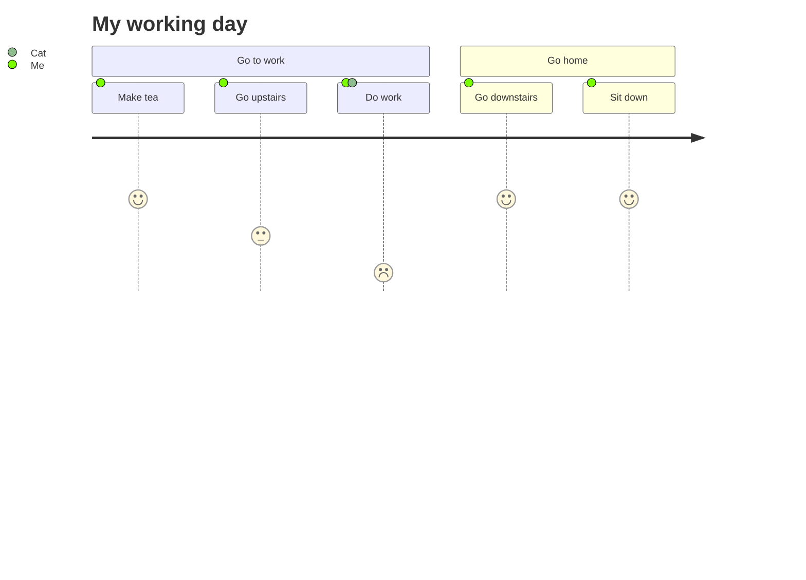

> 用户旅程高度详细地描述了不同用户在系统、应用或网站内完成特定任务所采取的步骤。该技术显示当前（原样）用户工作流程，并揭示未来工作流程的改进字段。

 `journey` 图中定义旅程、部分和步骤：

:::tabs

@tab 旅程图示例



@tab 代码

```
journey
    title My working day
    section Go to work
      Make tea: 5: Me
      Go upstairs: 3: Me
      Do work: 1: Me, Cat
    section Go home
      Go downstairs: 5: Me
      Sit down: 5: Me
```

:::

**关键点**  
- **标题**：使用 `title` 为旅程图添加标题。  
- **部分**：使用 `section 部分名` 定义旅程的部分。  
- **步骤**：使用 `步骤名: 分数: 参与者` 定义步骤，其中 `分数` 表示步骤的重要性或时间，`参与者` 表示执行步骤的人或物。  

:::details 实例说明  
- **标题**：`My working day`，表示旅程图的主题。  
- **部分**：  
  - `Go to work`：定义“去工作”部分。  
  - `Go home`：定义“回家”部分。  
- **步骤**：  
  - `Make tea: 5: Me`：在“去工作”部分，`Me` 执行“泡茶”步骤，分数为 `5`。  
  - `Go upstairs: 3: Me`：在“去工作”部分，`Me` 执行“上楼”步骤，分数为 `3`。  
  - `Do work: 1: Me, Cat`：在“去工作”部分，`Me` 和 `Cat` 执行“工作”步骤，分数为 `1`。  
  - `Go downstairs: 5: Me`：在“回家”部分，`Me` 执行“下楼”步骤，分数为 `5`。  
  - `Sit down: 5: Me`：在“回家”部分，`Me` 执行“坐下”步骤，分数为 `5`。  
  :::

每个用户旅程都分为几个部分，这些部分描述了用户尝试完成的任务的一部分。

任务语法为 `Task name: <score>: <comma separated list of actors>`
