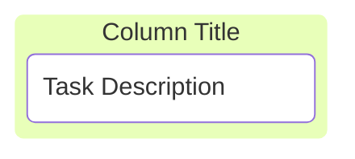
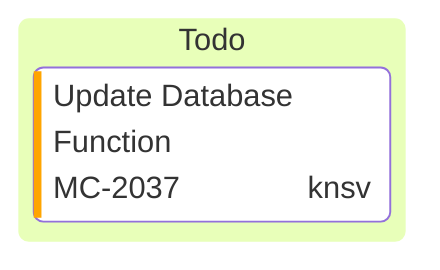
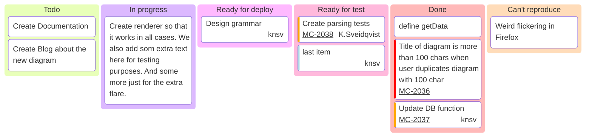

Mermaid 的看板图允许你创建在工作流程的不同阶段移动的任务的可视化表示。本指南根据提供的示例解释了如何使用看板图语法。

## 概述

Mermaid 中的看板图以 kanban 关键字开头，后跟列（阶段）的定义以及这些列中的任务。

Mermaid 看板图中定义列和任务：

:::tabs

@tab 看板图示例



@tab 代码

```
kanban
  column1[Column Title]
    task1[Task Description]
```

:::

**关键点**  
- **列**：使用 `列名[列标题]` 定义看板中的列。  
- **任务**：使用 `任务名[任务描述]` 定义任务，并嵌套在列中。  

:::details 实例说明  
- **列**：`column1[Column Title]`，定义了一个列，标题为 `Column Title`。  
- **任务**：`task1[Task Description]`，定义了一个任务，描述为 `Task Description`，并归属于 `column1` 列。  
:::

## 定义列

列代表工作流程中的不同阶段，例如“待办事项”、“进行中”、“完成”等。每列都使用唯一标识符和用方括号括起来的标题来定义。

**语法：**

```
columnId[Column Title]
```

- columnId：列的唯一标识符。
- [列标题]：列标题上显示的标题。

像这样 `id1[Todo]`

## 向列添加任务

任务以缩进形式列在各自的列下。每个任务还有一个唯一标识符和一个用方括号括起来的描述。

**语法：**

```
taskId[Task Description]
```

```
•	taskId: A unique identifier for the task.
•	[Task Description]: The description of the task.
```

**示例：**

```
docs[Create Documentation]
```

## 向任务添加元数据

你可以使用 @{ ... } 语法为每个任务包含其他元数据。元数据可以包含键值对，如分配、票证、优先级等。这将被添加到节点的渲染中。

## 支持的元数据键

```
•	assigned: Specifies who is responsible for the task.
•	ticket: Links the task to a ticket or issue number.
•	priority: Indicates the urgency of the task. Allowed values: 'Very High', 'High', 'Low' and 'Very Low'
```

Mermaid 看板图中定义列、任务和任务属性：

:::tabs

@tab 看板图示例



@tab 代码

```
kanban
todo[Todo]
  id3[Update Database Function]@{ ticket: MC-2037, assigned: 'knsv', priority: 'High' }
```

:::

**关键点**  
- **列**：使用 `列名[列标题]` 定义看板中的列。  
- **任务**：使用 `任务名[任务描述]` 定义任务，并嵌套在列中。  
- **任务属性**：使用 `@{ 属性名: 属性值 }` 为任务添加属性。  

:::details 实例说明  
- **列**：`todo[Todo]`，定义了一个列，标题为 `Todo`。  
- **任务**：`id3[Update Database Function]`，定义了一个任务，描述为 `Update Database Function`，并归属于 `todo` 列。  
- **任务属性**：  
  - `ticket`：任务关联的票号为 `MC-2037`。  
  - `assigned`：任务分配给 `knsv`。  
  - `priority`：任务优先级为 `High`。  
  :::

## 配置选项

你可以使用 markdown 文件开头的配置块自定义看板图。这对于设置全局设置（如票证的基本 URL）很有用。目前，看板图 `ticketBaseUrl` 有一个配置选项。这可以按照以下示例进行设置：

```yaml
---
config:
  kanban:
    ticketBaseUrl: 'https://yourproject.atlassian.net/browse/#TICKET#'
---
```

当看板项目具有分配的票号时，图表中的票号将链接到定义票的外部系统。`ticketBaseUrl` 将基本 URL 设置为外部系统，并将 #TICKET# 替换为任务元数据中的票证值以创建有效链接。

**完整示例**:

Mermaid 看板图中定义列、任务、任务属性以及配置：

:::tabs

@tab 看板图示例



@tab 代码

```
---
config:
  kanban:
    ticketBaseUrl: 'https://mermaidchart.atlassian.net/browse/#TICKET#'
---
kanban
  Todo
    [Create Documentation]
    docs[Create Blog about the new diagram]
  [In progress]
    id6[Create renderer so that it works in all cases. We also add som extra text here for testing purposes. And some more just for the extra flare.]
  id9[Ready for deploy]
    id8[Design grammar]@{ assigned: 'knsv' }
  id10[Ready for test]
    id4[Create parsing tests]@{ ticket: MC-2038, assigned: 'K.Sveidqvist', priority: 'High' }
    id66[last item]@{ priority: 'Very Low', assigned: 'knsv' }
  id11[Done]
    id5[define getData]
    id2[Title of diagram is more than 100 chars when user duplicates diagram with 100 char]@{ ticket: MC-2036, priority: 'Very High'}
    id3[Update DB function]@{ ticket: MC-2037, assigned: knsv, priority: 'High' }

  id12[Can't reproduce]
    id3[Weird flickering in Firefox]
```

:::

**关键点**  
- **配置**：  
  - 使用 `---` 包裹 `config` 定义看板图的配置。  
  - `ticketBaseUrl`：设置任务票号的链接基础 URL。  
- **列**：使用 `列名[列标题]` 定义看板中的列。  
- **任务**：使用 `任务名[任务描述]` 定义任务，并嵌套在列中。  
- **任务属性**：使用 `@{ 属性名: 属性值 }` 为任务添加属性，如 `ticket`、`assigned`、`priority` 等。  

:::details 实例说明  
- **配置**：  
  - `ticketBaseUrl`：任务票号的链接基础 URL 为 `https://mermaidchart.atlassian.net/browse/#TICKET#`。  
- **列**：  
  - `Todo`：待办列。  
  - `In progress`：进行中列。  
  - `Ready for deploy`：准备部署列。  
  - `Ready for test`：准备测试列。  
  - `Done`：已完成列。  
  - `Can't reproduce`：无法复现列。  
- **任务**：  
  - `Create Documentation`：创建文档任务。  
  - `docs[Create Blog about the new diagram]`：创建博客任务。  
  - `id6[Create renderer so that it works in all cases...]`：创建渲染器任务。  
  - `id8[Design grammar]`：设计语法任务，分配给 `knsv`。  
  - `id4[Create parsing tests]`：创建解析测试任务，票号为 `MC-2038`，分配给 `K.Sveidqvist`，优先级为 `High`。  
  - `id66[last item]`：最后一个任务，优先级为 `Very Low`，分配给 `knsv`。  
  - `id5[define getData]`：定义 `getData` 任务。  
  - `id2[Title of diagram is more than 100 chars...]`：标题过长任务，票号为 `MC-2036`，优先级为 `Very High`。  
  - `id3[Update DB function]`：更新数据库函数任务，票号为 `MC-2037`，分配给 `knsv`，优先级为 `High`。  
  - `id3[Weird flickering in Firefox]`：Firefox 中奇怪的闪烁任务。  
  :::

> 总之，在 Mermaid 中创建看板图是一个简单的过程，可以有效地可视化你的工作流程。首先使用 kanban 关键字启动图表。使用唯一标识符和标题定义你的列，以表示项目的不同阶段。在每一列下，列出你的任务（也使用唯一标识符），并根据需要提供详细描述。请记住，正确的缩进至关重要；任务必须在其父列下缩进以保持正确的结构。
>
> 你可以使用 @{ ... } 语法向任务添加可选元数据来增强你的图表，这允许你包含其他上下文，例如受让人、票号和优先级。为了进一步定制，利用文件顶部的配置块设置全局选项，如 ticketBaseUrl，以便直接从你的图表链接票证。
>
> 通过遵守这些准则（确保唯一标识符、正确缩进以及利用元数据和配置选项），你可以创建一个全面且定制的看板，使用 Mermaid 有效地规划出项目的工作流程。
