> “状态图是计算机科学及相关字段中用于描述系统行为的一种图表。状态图要求所描述的系统由有限数量的状态组成；有时，情况确实如此，而有时这是一个合理的抽象。”维基百科

Mermaid 可以渲染状态图。该语法尝试与 plantUml 中使用的语法兼容，因为这将使用户更容易在 mermaid 和 plantUml 之间共享图表。

Mermaid 状态图中定义状态和状态转换：

:::tabs

@tab 状态图示例

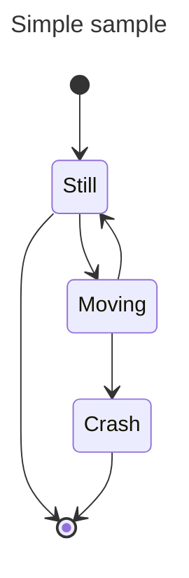

@tab 代码

```
---
title: Simple sample
---
stateDiagram-v2
    [*] --> Still
    Still --> [*]

    Still --> Moving
    Moving --> Still
    Moving --> Crash
    Crash --> [*]
```

:::

**关键点**  
- **状态图标题**：使用 `title` 关键字为状态图添加标题。  
- **初始状态**：使用 `[*]` 表示初始状态。  
- **状态定义**：直接使用状态名称（如 `Still`、`Moving`、`Crash`）定义状态。  
- **状态转换**：使用 `-->` 表示状态之间的转换。  

:::details 实例说明  
- **初始状态**：`[*]` 表示初始状态，指向 `Still` 状态。  
- **状态转换**：  
  - `Still` 可以转换回初始状态 `[*]`。  
  - `Still` 可以转换到 `Moving` 状态。  
  - `Moving` 可以转换回 `Still` 状态，或转换到 `Crash` 状态。  
  - `Crash` 可以转换回初始状态 `[*]`。  

:::


Mermaid 状态图中定义状态和状态转换：

:::tabs

@tab 状态图示例

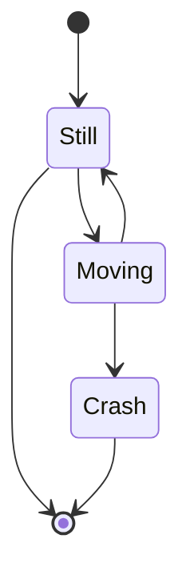

@tab 代码

```
stateDiagram
    [*] --> Still
    Still --> [*]

    Still --> Moving
    Moving --> Still
    Moving --> Crash
    Crash --> [*]
```

:::

**关键点**  
- **初始状态**：使用 `[*]` 表示初始状态。  
- **状态定义**：直接使用状态名称（如 `Still`、`Moving`、`Crash`）定义状态。  
- **状态转换**：使用 `-->` 表示状态之间的转换。  

:::details 实例说明  
- **初始状态**：`[*]` 表示初始状态，指向 `Still` 状态。  
- **状态转换**：  
  - `Still` 可以转换回初始状态 `[*]`。  
  - `Still` 可以转换到 `Moving` 状态。  
  - `Moving` 可以转换回 `Still` 状态，或转换到 `Crash` 状态。  
  - `Crash` 可以转换回初始状态 `[*]`。  

:::


在状态图中，系统是根据状态以及一个状态如何通过转换更改为另一种状态来描述的。上面的示例图显示了三种状态：尽管如此，移动和崩溃。你从静止状态开始。你可以从静止状态更改为移动状态。你可以从“移动”状态更改回“静止”状态或“崩溃”状态。没有从静止到崩溃的过渡。（如果你还在的话，你就不会崩溃。）

## 状态

可以通过多种方式声明状态。最简单的方法是只用 id 定义一个状态：

Mermaid 状态图中定义一个状态：

:::tabs

@tab 状态图示例

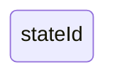

@tab 代码

```
stateDiagram-v2
    stateId
```

:::

**关键点**  
- **状态定义**：直接使用状态名称（如 `stateId`）定义状态。  

:::details 实例说明  
- **`stateId` 状态**：表示一个状态，可以在状态图中与其他状态进行转换。  
- **注意**：如果未定义状态之间的转换，`stateId` 将单独显示在状态图中。  
:::

另一种方法是使用 state 关键字和如下描述：

 Mermaid 状态图中定义带有描述的状态：

:::tabs

@tab 状态图示例

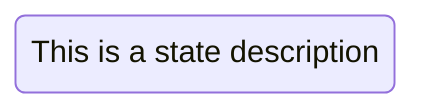

@tab 代码

```
stateDiagram-v2
    state "This is a state description" as s2
```

:::

**关键点**  
- **状态定义**：使用 `state "描述" as 状态名` 定义状态，并为其添加描述。  
- **描述**：描述会显示在状态框中，提供状态的额外信息。  

:::details 实例说明  
- **`s2` 状态**：表示一个状态，描述为 `This is a state description`。  
- **注意**：如果未定义状态之间的转换，`s2` 将单独显示在状态图中。  
:::


使用描述定义状态的另一种方法是定义状态 id，后跟冒号和描述：

Mermaid 状态图中为状态添加描述：

:::tabs

@tab 状态图示例


@tab 代码

```
stateDiagram-v2
    s2 : This is a state description
```

:::

**关键点**  
- **状态描述**：使用 `状态名 : 描述` 为状态添加描述，描述会显示在状态框中。  
- **状态定义**：直接使用状态名称（如 `s2`）定义状态。  

:::details 实例说明  
- **`s2` 状态**：表示一个状态，描述为 `This is a state description`。  
- **注意**：如果未定义状态之间的转换，`s2` 将单独显示在状态图中。  
:::

## 过渡

转换是一种状态进入另一种状态时的路径/边缘。这使用文本箭头 "-->" 表示。

当你定义两个状态之间的转换并且状态尚未定义时，未定义的状态将使用转换中的 id 进行定义。你稍后可以向以此方式定义的状态添加描述。

Mermaid 状态图中定义状态之间的转换：

:::tabs

@tab 状态图示例

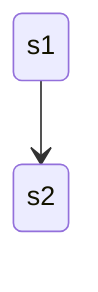

@tab 代码

```
stateDiagram-v2
    s1 --> s2
```

:::

**关键点**  
- **状态转换**：使用 `-->` 表示状态之间的转换。  
- **状态定义**：直接使用状态名称（如 `s1` 和 `s2`）定义状态。  

:::details 实例说明  
- **`s1` 状态**：表示一个状态。  
- **`s2` 状态**：表示另一个状态。  
- **转换**：`s1` 可以转换到 `s2`。  
:::

可以向过渡添加文本来描述它所代表的内容：

Mermaid 状态图中定义带有标签的状态转换：

:::tabs

@tab 状态图示例

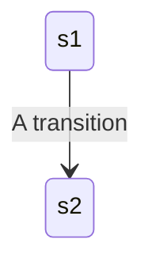

@tab 代码

```
stateDiagram-v2
    s1 --> s2: A transition
```

:::

**关键点**  
- **状态转换**：使用 `-->` 表示状态之间的转换。  
- **转换标签**：使用 `: 标签` 为转换添加描述，描述会显示在转换箭头上。  
- **状态定义**：直接使用状态名称（如 `s1` 和 `s2`）定义状态。  

:::details 实例说明  
- **`s1` 状态**：表示一个状态。  
- **`s2` 状态**：表示另一个状态。  
- **转换**：`s1` 可以转换到 `s2`，转换标签为 `A transition`。  
:::

## 开始和结束

有两种特殊状态指示图的开始和停止。它们是用 [*] 语法编写的，并且转换到它的方向将其定义为开始或停止状态。

Mermaid 状态图中定义初始状态和结束状态：

:::tabs

@tab 状态图示例

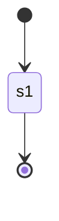

@tab 代码

```
stateDiagram-v2
    [*] --> s1
    s1 --> [*]
```

:::

**关键点**  
- **初始状态**：使用 `[*]` 表示初始状态。  
- **结束状态**：使用 `[*]` 表示结束状态。  
- **状态转换**：使用 `-->` 表示状态之间的转换。  
- **状态定义**：直接使用状态名称（如 `s1`）定义状态。  

:::details 实例说明  
- **初始状态**：`[*]` 表示初始状态，指向 `s1` 状态。  
- **结束状态**：`s1` 可以转换回 `[*]`，表示结束状态。  
:::

## 复合状态

在现实世界中使用状态图时，你通常会得到多维的图，因为一个状态可以有多个内部状态。在这个术语中，这些被称为复合状态。

为了定义复合状态，你需要使用 state 关键字，后跟 id 和 {} 之间的复合状态主体。你可以像简单状态一样在单独的行上命名复合状态。请参阅下面的示例：

 Mermaid 状态图中定义复合状态和嵌套状态：

:::tabs

@tab 状态图示例

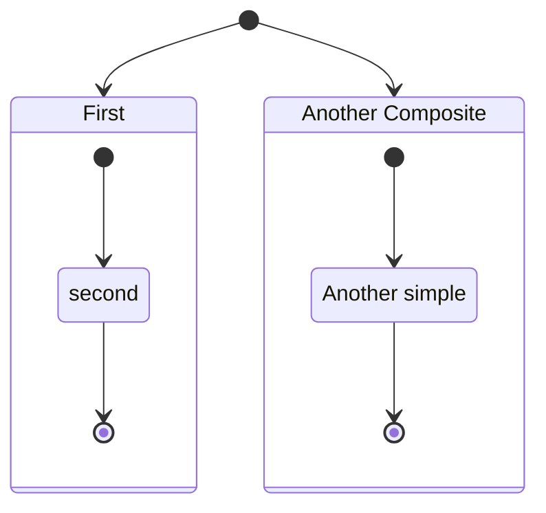

@tab 代码

```
stateDiagram-v2
    [*] --> First
    state First {
        [*] --> second
        second --> [*]
    }

    [*] --> NamedComposite
    NamedComposite: Another Composite
    state NamedComposite {
        [*] --> namedSimple
        namedSimple --> [*]
        namedSimple: Another simple
    }
```

:::

**关键点**  
- **复合状态**：使用 `state 状态名 { ... }` 定义复合状态，复合状态可以包含嵌套状态。  
- **嵌套状态**：在复合状态内部定义状态和状态转换。  
- **状态描述**：使用 `状态名 : 描述` 为状态添加描述。  
- **初始状态**：使用 `[*]` 表示初始状态。  
- **结束状态**：使用 `[*]` 表示结束状态。  

:::details 实例说明  
- **`First` 复合状态**：  
  - 包含一个嵌套状态 `second`。  
  - `[*]` 表示初始状态，指向 `second`。  
  - `second` 可以转换回 `[*]`，表示结束状态。  
- **`NamedComposite` 复合状态**：  
  - 描述为 `Another Composite`。  
  - 包含一个嵌套状态 `namedSimple`，描述为 `Another simple`。  
  - `[*]` 表示初始状态，指向 `namedSimple`。  
  - `namedSimple` 可以转换回 `[*]`，表示结束状态。  
  :::


你可以在多个层中执行此操作：

 Mermaid 状态图中定义多层嵌套的复合状态：

:::tabs

@tab 状态图示例

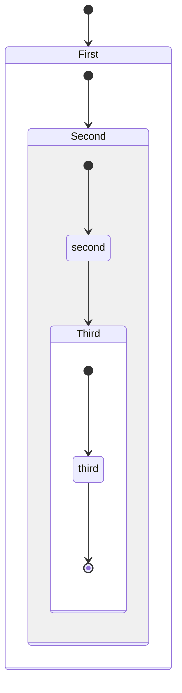

@tab 代码

```
stateDiagram-v2
    [*] --> First

    state First {
        [*] --> Second

        state Second {
            [*] --> second
            second --> Third

            state Third {
                [*] --> third
                third --> [*]
            }
        }
    }
```

:::

**关键点**  
- **多层嵌套复合状态**：使用 `state 状态名 { ... }` 定义复合状态，复合状态可以嵌套其他复合状态。  
- **初始状态**：使用 `[*]` 表示初始状态。  
- **结束状态**：使用 `[*]` 表示结束状态。  
- **状态转换**：使用 `-->` 表示状态之间的转换。  

:::details 实例说明  
- **`First` 复合状态**：  
  - 包含一个嵌套复合状态 `Second`。  
  - `[*]` 表示初始状态，指向 `Second`。  
- **`Second` 复合状态**：  
  - 包含一个嵌套状态 `second` 和一个嵌套复合状态 `Third`。  
  - `[*]` 表示初始状态，指向 `second`。  
  - `second` 可以转换到 `Third`。  
- **`Third` 复合状态**：  
  - 包含一个嵌套状态 `third`。  
  - `[*]` 表示初始状态，指向 `third`。  
  - `third` 可以转换回 `[*]`，表示结束状态。  
  :::


你还可以定义复合状态之间的转换：

 

Mermaid 状态图中定义多个复合状态及其嵌套状态：

:::tabs

@tab 状态图示例

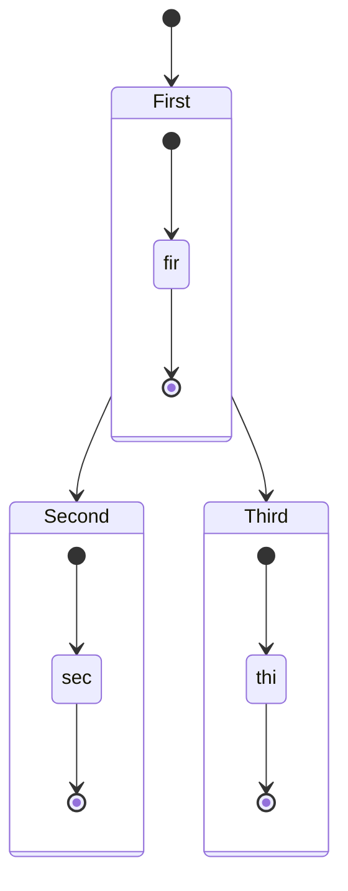

@tab 代码

```
stateDiagram-v2
    [*] --> First
    First --> Second
    First --> Third

    state First {
        [*] --> fir
        fir --> [*]
    }
    state Second {
        [*] --> sec
        sec --> [*]
    }
    state Third {
        [*] --> thi
        thi --> [*]
    }
```

:::

**关键点**  
- **复合状态**：使用 `state 状态名 { ... }` 定义复合状态，复合状态可以包含嵌套状态。  
- **状态转换**：使用 `-->` 表示状态之间的转换。  
- **初始状态**：使用 `[*]` 表示初始状态。  
- **结束状态**：使用 `[*]` 表示结束状态。  

:::details 实例说明  
- **顶层状态转换**：  
  - `[*]` 表示初始状态，指向 `First`。  
  - `First` 可以转换到 `Second` 或 `Third`。  
- **`First` 复合状态**：  
  - 包含一个嵌套状态 `fir`。  
  - `[*]` 表示初始状态，指向 `fir`。  
  - `fir` 可以转换回 `[*]`，表示结束状态。  
- **`Second` 复合状态**：  
  - 包含一个嵌套状态 `sec`。  
  - `[*]` 表示初始状态，指向 `sec`。  
  - `sec` 可以转换回 `[*]`，表示结束状态。  
- **`Third` 复合状态**：  
  - 包含一个嵌套状态 `thi`。  
  - `[*]` 表示初始状态，指向 `thi`。  
  - `thi` 可以转换回 `[*]`，表示结束状态。  
  :::

你无法定义属于不同复合状态的内部状态之间的转换

## 选择

有时你需要对两个或多个路径之间的选择进行建模，可以使用 <\<choice\>\> 来实现。

Mermaid 状态图中定义选择状态（`choice`）和条件转换：

:::tabs

@tab 状态图示例

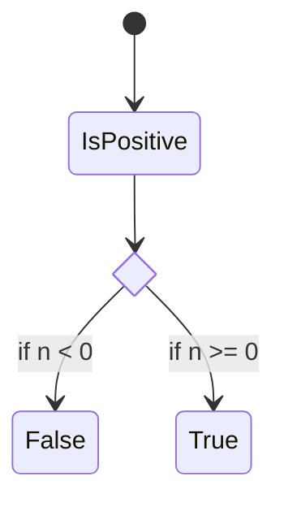

@tab 代码

```
stateDiagram-v2
    state if_state <<choice>>
    [*] --> IsPositive
    IsPositive --> if_state
    if_state --> False: if n < 0
    if_state --> True : if n >= 0
```

:::

**关键点**  
- **选择状态**：使用 `state 状态名 <<choice>>` 定义选择状态，表示条件分支。  
- **条件转换**：使用 `--> 目标状态 : 条件` 定义带条件的转换。  
- **初始状态**：使用 `[*]` 表示初始状态。  

:::details 实例说明  
- **初始状态**：`[*]` 表示初始状态，指向 `IsPositive`。  
- **`IsPositive` 状态**：表示一个状态，指向选择状态 `if_state`。  
- **选择状态 `if_state`**：  
  - 如果 `n < 0`，则转换到 `False` 状态。  
  - 如果 `n >= 0`，则转换到 `True` 状态。  
  :::

## 复刻

可以使用 \<\<fork\>\> < 在图中指定一个分叉 \<join\>\>。

 Mermaid 状态图中定义分支（`fork`）和合并（`join`）状态：

:::tabs

@tab 状态图示例

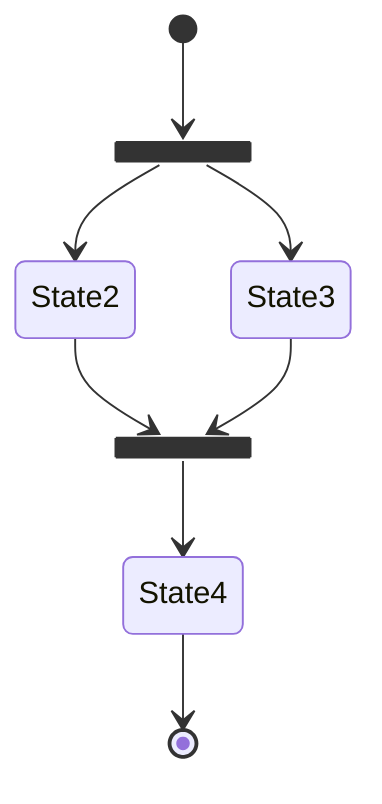

@tab 代码

```
stateDiagram-v2
    state fork_state <<fork>>
    [*] --> fork_state
    fork_state --> State2
    fork_state --> State3

    state join_state <<join>>
    State2 --> join_state
    State3 --> join_state
    join_state --> State4
    State4 --> [*]
```

:::

**关键点**  
- **分支状态**：使用 `state 状态名 <<fork>>` 定义分支状态，表示并行执行的分支。  
- **合并状态**：使用 `state 状态名 <<join>>` 定义合并状态，表示并行分支的合并。  
- **初始状态**：使用 `[*]` 表示初始状态。  
- **结束状态**：使用 `[*]` 表示结束状态。  

:::details 实例说明  
- **初始状态**：`[*]` 表示初始状态，指向分支状态 `fork_state`。  
- **分支状态 `fork_state`**：  
  - 并行执行两个分支，分别指向 `State2` 和 `State3`。  
- **合并状态 `join_state`**：  
  - 将 `State2` 和 `State3` 的并行分支合并，指向 `State4`。  
- **`State4` 状态**：指向结束状态 `[*]`。  
:::

## 注意

有时没有什么比便利贴更能表达这一点。状态图中也是如此。

在这里你可以选择将注释放在节点的右侧或左侧。

  Mermaid 状态图中为状态添加注释：

:::tabs

@tab 状态图示例

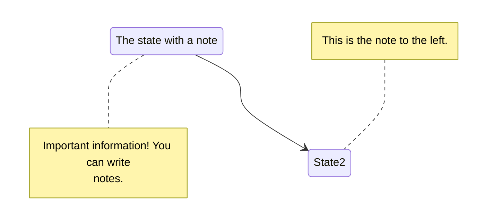

@tab 代码

```
stateDiagram-v2
    State1: The state with a note
    note right of State1
        Important information! You can write
        notes.
    end note
    State1 --> State2
    note left of State2 : This is the note to the left.
```

:::

**关键点**  
- **状态描述**：使用 `状态名 : 描述` 为状态添加描述。  
- **多行注释**：使用 `note right of 状态名` 和 `end note` 包裹多行注释。  
- **单行注释**：使用 `note left of 状态名 : 注释内容` 添加单行注释。  
- **状态转换**：使用 `-->` 表示状态之间的转换。  

:::details 实例说明  
- **`State1` 状态**：  
  - 描述为 `The state with a note`。  
  - 右侧有多行注释，内容为 `Important information! You can write notes.`。  
- **`State2` 状态**：  
  - 左侧有单行注释，内容为 `This is the note to the left.`。  
- **状态转换**：`State1` 可以转换到 `State2`。  
:::

## 并发性

与在 plantUml 中一样，你可以使用 -- 符号指定并发性。

Mermaid 状态图中定义复合状态及其嵌套状态和转换：

:::tabs

@tab 状态图示例

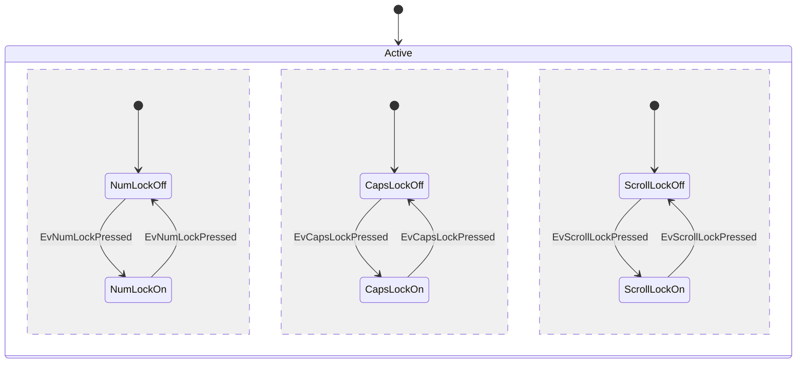

@tab 代码

```
stateDiagram-v2
    [*] --> Active

    state Active {
        [*] --> NumLockOff
        NumLockOff --> NumLockOn : EvNumLockPressed
        NumLockOn --> NumLockOff : EvNumLockPressed
        --
        [*] --> CapsLockOff
        CapsLockOff --> CapsLockOn : EvCapsLockPressed
        CapsLockOn --> CapsLockOff : EvCapsLockPressed
        --
        [*] --> ScrollLockOff
        ScrollLockOff --> ScrollLockOn : EvScrollLockPressed
        ScrollLockOn --> ScrollLockOff : EvScrollLockPressed
    }
```

:::

**关键点**  
- **复合状态**：使用 `state 状态名 { ... }` 定义复合状态，复合状态可以包含嵌套状态和转换。  
- **状态转换**：使用 `-->` 表示状态之间的转换，并可通过 `: 事件` 添加转换标签。  
- **分隔符 `--`**：用于在复合状态中分隔不同的状态组。  
- **初始状态**：使用 `[*]` 表示初始状态。  

:::details 实例说明  
- **`Active` 复合状态**：  
  - 包含三个状态组，分别表示 `NumLock`、`CapsLock` 和 `ScrollLock` 的状态。  
  - **`NumLock` 状态组**：  
    - `NumLockOff` 和 `NumLockOn` 之间通过 `EvNumLockPressed` 事件转换。  
  - **`CapsLock` 状态组**：  
    - `CapsLockOff` 和 `CapsLockOn` 之间通过 `EvCapsLockPressed` 事件转换。  
  - **`ScrollLock` 状态组**：  
    - `ScrollLockOff` 和 `ScrollLockOn` 之间通过 `EvScrollLockPressed` 事件转换。  
    :::

## 设置图表的方向

对于状态图，你可以使用方向语句来设置图渲染的方向，如本例所示。

 Mermaid 状态图中定义状态、嵌套状态和状态转换：

:::tabs

@tab 状态图示例

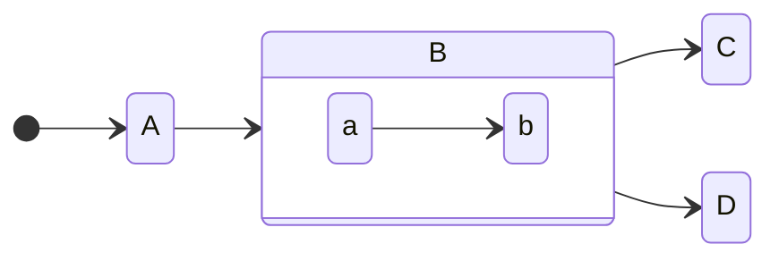

@tab 代码

```
stateDiagram
    direction LR
    [*] --> A
    A --> B
    B --> C
    state B {
      direction LR
      a --> b
    }
    B --> D
```

:::

**关键点**  
- **全局方向**：使用 `direction LR` 设置全局状态图方向为从左到右（Left to Right）。  
- **嵌套状态方向**：在复合状态内部使用 `direction LR` 设置嵌套状态的方向。  
- **初始状态**：使用 `[*]` 表示初始状态。  
- **状态转换**：使用 `-->` 表示状态之间的转换。  
- **复合状态**：使用 `state 状态名 { ... }` 定义复合状态，复合状态可以包含嵌套状态和转换。  

:::details 实例说明  
- **全局状态转换**：  
  - `[*]` 表示初始状态，指向 `A`。  
  - `A` 可以转换到 `B`。  
  - `B` 可以转换到 `C` 或 `D`。  
- **`B` 复合状态**：  
  - 包含嵌套状态 `a` 和 `b`，方向为从左到右。  
  - `a` 可以转换到 `b`。  
  :::

## 注释

可以在状态图表中输入注释，解析器将忽略这些注释。注释需要独占一行，并且必须以 `%%`（双百分号）开头。注释开始后到下一个换行符的任何文本都将被视为注释，包括任何图表语法

Mermaid 状态图中定义状态、状态转换以及添加注释：

:::tabs

@tab 状态图示例


@tab 代码

```
stateDiagram-v2
    [*] --> Still
    Still --> [*]
%% this is a comment
    Still --> Moving
    Moving --> Still %% another comment
    Moving --> Crash
    Crash --> [*]
```

:::

**关键点**  
- **初始状态**：使用 `[*]` 表示初始状态。  
- **结束状态**：使用 `[*]` 表示结束状态。  
- **状态转换**：使用 `-->` 表示状态之间的转换。  
- **注释**：使用 `%%` 添加单行注释，注释内容不会显示在图表中。  

:::details 实例说明  
- **初始状态**：`[*]` 表示初始状态，指向 `Still`。  
- **`Still` 状态**：  
  - 可以转换回 `[*]`，表示结束状态。  
  - 可以转换到 `Moving`。  
- **`Moving` 状态**：  
  - 可以转换回 `Still`。  
  - 可以转换到 `Crash`。  
- **`Crash` 状态**：可以转换回 `[*]`，表示结束状态。  
- **注释**：  
  - `%% this is a comment` 和 `%% another comment` 是注释，不会影响图表显示。  
  :::

## classDefs设置样式

与其他图表（如流程图）一样，你可以在图表本身中定义样式，并将该命名样式应用于图表中的一个或多个状态。

**这些是状态图 classDef 的当前限制：**

1. 不能应用于开始或结束状态
2. 不能应用于复合状态或复合状态内

这些正在开发中，并将在未来版本中提供。

你可以使用 `classDef` 关键字定义样式，该关键字是 "类定义" 的缩写（其中 "class" 表示类似于 CSS 类的内容），后跟样式名称，然后是一个或多个属性值对。每个属性-值对都是 [有效的 CSS 属性名称](https://www.w3.org/TR/CSS/#properties)，后跟冒号 (`:`)，然后是一个值。

下面是只有一个属性-值对的 classDef 的示例：

txt

```
classDef movement font-style:italic;
```

where

- 样式名称是 `movement`
- 唯一的属性是 `font-style`，其值是 `italic`

如果你想要多个属性-值对，则可以在每个属性-值对之间放置一个逗号 (`,`)。

下面是一个包含三个属性-值对的示例：

txt

```
classDef badBadEvent fill:#f00,color:white,font-weight:bold,stroke-width:2px,stroke:yellow
```

where

- 样式名称是 `badBadEvent`
- 第一个属性是 `fill`，其值是 `#f00`
- 第二个属性是 `color`，其值为 `white`
- 第三个属性是 `font-weight`，其值为 `bold`
- 第四个属性是 `stroke-width`，其值为 `2px`
- 第五个属性是 `stroke`，其值为 `yellow`

### classDef样式应用于状态

有两种方法可以将 `classDef` 样式应用于状态：

1. 使用 `class` 关键字将 classDef 样式应用于单个语句中的一个或多个状态，或者
2. 使用 `:::` 运算符将 classDef 样式应用于状态，因为它在转换语句中使用（例如，使用往返另一个状态的箭头）

#### 1. `class` 声明

`class` 语句告诉 Mermaid 将命名的 classDef 应用于一个或多个类。形式为：

txt

```
class [one or more state names, separated by commas] [name of a style defined with classDef]
```

以下是将 `badBadEvent` 样式应用于名为 `Crash` 的状态的示例：

txt

```
class Crash badBadEvent
```

以下是将 `movement` 样式应用于 `Moving` 和 `Crash` 两个状态的示例：

txt

```
class Moving, Crash movement
```

这是显示使用示例的图表。请注意，`Crash` 状态应用了两种 classDef 样式：`movement` 和 `badBadEvent`

Mermaid 状态图中定义状态、状态转换、样式和可访问性描述：

:::tabs

@tab 状态图示例

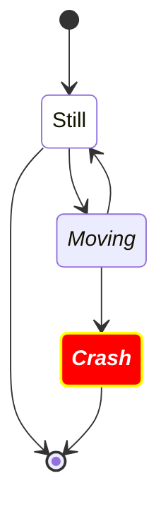

@tab 代码

```
stateDiagram
   direction TB

   accTitle: This is the accessible title
   accDescr: This is an accessible description

   classDef notMoving fill:white
   classDef movement font-style:italic
   classDef badBadEvent fill:#f00,color:white,font-weight:bold,stroke-width:2px,stroke:yellow

   [*]--> Still
   Still --> [*]
   Still --> Moving
   Moving --> Still
   Moving --> Crash
   Crash --> [*]

   class Still notMoving
   class Moving, Crash movement
   class Crash badBadEvent
   class end badBadEvent
```

:::

**关键点**  
- **方向**：使用 `direction TB` 设置状态图方向为从上到下（Top to Bottom）。  
- **可访问性**：  
  - 使用 `accTitle` 为图表添加可访问标题。  
  - 使用 `accDescr` 为图表添加可访问描述。  
- **样式定义**：  
  - 使用 `classDef 样式名 样式规则` 定义样式。  
  - 支持设置填充颜色（`fill`）、文本颜色（`color`）、字体样式（`font-style`）、字体粗细（`font-weight`）、边框宽度（`stroke-width`）、边框颜色（`stroke`）等。  
- **样式应用**：使用 `class 状态名 样式名` 将样式应用到状态。  
- **初始状态**：使用 `[*]` 表示初始状态。  
- **结束状态**：使用 `[*]` 表示结束状态。  
- **状态转换**：使用 `-->` 表示状态之间的转换。  

:::details 实例说明  
- **`Still` 状态**：应用了 `notMoving` 样式，填充颜色为白色。  
- **`Moving` 和 `Crash` 状态**：应用了 `movement` 样式，字体为斜体。  
- **`Crash` 状态**：应用了 `badBadEvent` 样式，填充颜色为红色，文本颜色为白色，字体加粗，边框宽度为 2px，边框颜色为黄色。  
- **`end` 状态**：应用了 `badBadEvent` 样式。  
- **状态转换**：  
  - `[*]` 表示初始状态，指向 `Still`。  
  - `Still` 可以转换回 `[*]`，表示结束状态。  
  - `Still` 可以转换到 `Moving`。  
  - `Moving` 可以转换回 `Still`。  
  - `Moving` 可以转换到 `Crash`。  
  - `Crash` 可以转换回 `[*]`，表示结束状态。  
  :::


#### 2. `:::` 运算符将样式应用于状态

你可以使用 `:::`（三个冒号）运算符将 classDef 样式应用于状态。语法是

txt

```
[state]:::[style name]
```

你可以在使用类的语句内的图表中使用它。这包括开始和结束状态。例如：


Mermaid 状态图中定义状态、状态转换、样式和可访问性描述：

:::tabs

@tab 状态图示例


@tab 代码

```
stateDiagram
   direction TB

   accTitle: This is the accessible title
   accDescr: This is an accessible description

   classDef notMoving fill:white
   classDef movement font-style:italic;
   classDef badBadEvent fill:#f00,color:white,font-weight:bold,stroke-width:2px,stroke:yellow

   [*] --> Still:::notMoving
   Still --> [*]
   Still --> Moving:::movement
   Moving --> Still
   Moving --> Crash:::movement
   Crash:::badBadEvent --> [*]
```

:::

**关键点**  
- **方向**：使用 `direction TB` 设置状态图方向为从上到下（Top to Bottom）。  
- **可访问性**：  
  - 使用 `accTitle` 为图表添加可访问标题。  
  - 使用 `accDescr` 为图表添加可访问描述。  
- **样式定义**：  
  - 使用 `classDef 样式名 样式规则` 定义样式。  
  - 支持设置填充颜色（`fill`）、文本颜色（`color`）、字体样式（`font-style`）、字体粗细（`font-weight`）、边框宽度（`stroke-width`）、边框颜色（`stroke`）等。  
- **样式应用**：使用 `:::样式名` 将样式应用到状态。  
- **初始状态**：使用 `[*]` 表示初始状态。  
- **结束状态**：使用 `[*]` 表示结束状态。  
- **状态转换**：使用 `-->` 表示状态之间的转换。  

:::details 实例说明  
- **`Still` 状态**：应用了 `notMoving` 样式，填充颜色为白色。  
- **`Moving` 状态**：应用了 `movement` 样式，字体为斜体。  
- **`Crash` 状态**：应用了 `movement` 和 `badBadEvent` 样式，填充颜色为红色，文本颜色为白色，字体加粗，边框宽度为 2px，边框颜色为黄色。  
- **状态转换**：  
  - `[*]` 表示初始状态，指向 `Still`。  
  - `Still` 可以转换回 `[*]`，表示结束状态。  
  - `Still` 可以转换到 `Moving`。  
  - `Moving` 可以转换回 `Still`。  
  - `Moving` 可以转换到 `Crash`。  
  - `Crash` 可以转换回 `[*]`，表示结束状态。  
  :::

## 状态名称中的空格

可以通过首先使用 id 定义状态然后稍后引用该 id 来将空格添加到状态中。

在以下示例中，有一个状态，其 ID 为 yswsii，描述为“你的状态”，其中包含空格。定义后，yswsii 在图中的第一个转换 (`[*] --> yswsii`) 以及到 YetAnotherState (`yswsii --> YetAnotherState`) 的转换中使用。（yswsii 的风格与其他状态有所不同。）

Mermaid 状态图中定义状态、状态转换和样式：

:::tabs

@tab 状态图示例

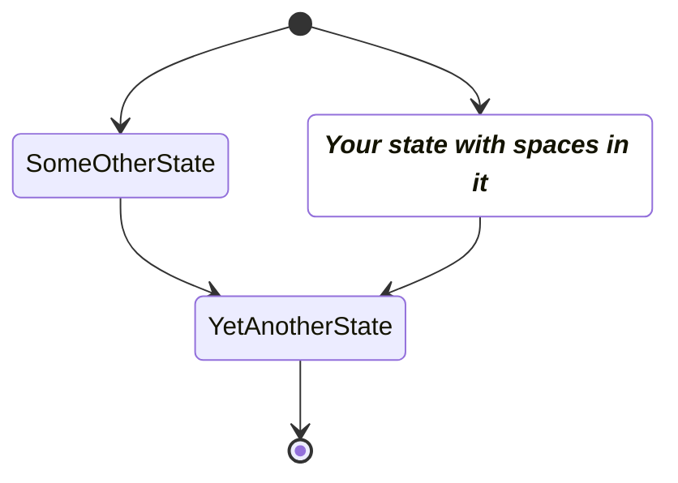

@tab 代码

```
stateDiagram
    classDef yourState font-style:italic,font-weight:bold,fill:white

    yswsii: Your state with spaces in it
    [*] --> yswsii:::yourState
    [*] --> SomeOtherState
    SomeOtherState --> YetAnotherState
    yswsii --> YetAnotherState
    YetAnotherState --> [*]
```

:::

**关键点**  
- **状态定义**：使用 `状态名: 描述` 为状态添加描述。  
- **样式定义**：使用 `classDef 样式名 样式规则` 定义样式。  
  - 支持设置字体样式（`font-style`）、字体粗细（`font-weight`）、填充颜色（`fill`）等。  
- **样式应用**：使用 `:::样式名` 将样式应用到状态。  
- **初始状态**：使用 `[*]` 表示初始状态。  
- **结束状态**：使用 `[*]` 表示结束状态。  
- **状态转换**：使用 `-->` 表示状态之间的转换。  

:::details 实例说明  
- **`yswsii` 状态**：  
  - 描述为 `Your state with spaces in it`。  
  - 应用了 `yourState` 样式，字体为斜体加粗，填充颜色为白色。  
- **`SomeOtherState` 状态**：  
  - 未应用样式，显示为默认样式。  
- **`YetAnotherState` 状态**：  
  - 未应用样式，显示为默认样式。  
- **状态转换**：  
  - `[*]` 表示初始状态，指向 `yswsii` 和 `SomeOtherState`。  
  - `SomeOtherState` 可以转换到 `YetAnotherState`。  
  - `yswsii` 可以转换到 `YetAnotherState`。  
  - `YetAnotherState` 可以转换回 `[*]`，表示结束状态。  
  :::


