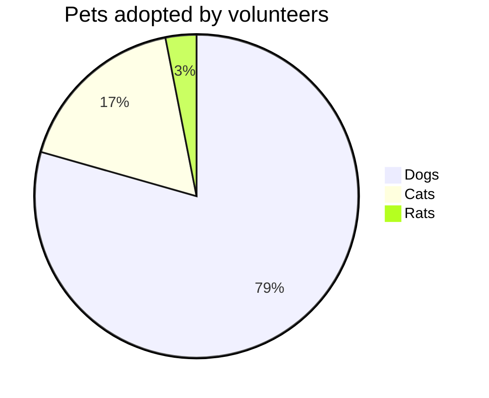
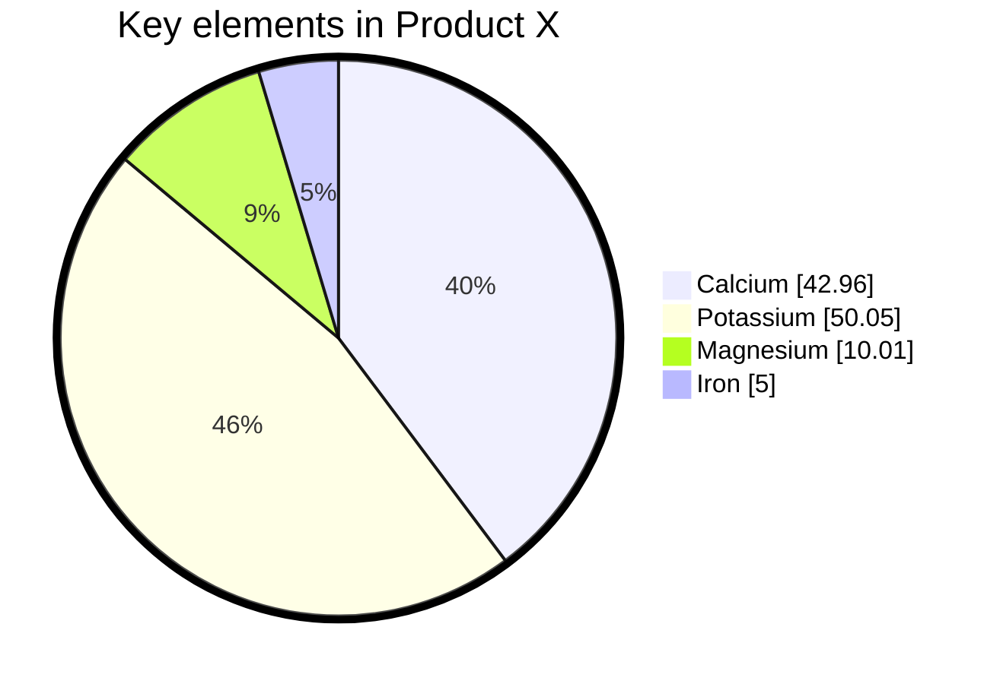

> 饼图（或圆形图）是一种圆形统计图形，将其划分为多个切片以说明数字比例。在饼图中，每个切片的弧长（及其中心角和面积）与其表示的数量成正比。虽然它因其类似于切片的馅饼而得名，但它的渲染方式却有多种变化。已知最早的饼图通常归功于 William Playfair 于 1801 年发布的统计手册 - 维基百科

Mermaid 饼图中定义数据：

:::tabs

@tab 饼图示例



@tab 代码

```
pie title Pets adopted by volunteers
    "Dogs" : 386
    "Cats" : 85
    "Rats" : 15
```

:::

**关键点**  
- **饼图标题**：使用 `pie title 标题` 为饼图添加标题。  
- **数据定义**：使用 `"标签" : 值` 定义饼图的各个部分。  
- **标签**：显示在饼图的对应部分上。  
- **值**：决定饼图部分的大小。  

:::details 实例说明  
- **标题**：`Pets adopted by volunteers`，表示饼图的主题。  
- **数据**：  
  - `Dogs` 被领养的数量为 386。  
  - `Cats` 被领养的数量为 85。  
  - `Rats` 被领养的数量为 15。  
- **饼图**：  
  - `Dogs` 部分占比最大，`Cats` 次之，`Rats` 占比最小。  
  :::

## 语法

在 Mermaid 中绘制饼图非常简单。

```
pie showData
    title 饼图标题
    "标签1": 数值1
    "标签2": 数值2
    "标签3": 数值3
    "标签4": 数值4
```

- 以 `pie` 关键字开始绘制图表
  - `showData` 在图例文本之后渲染实际数据值。这是可选的

> 在 Mermaid 的饼图中，`showData` 是一个可选的设置，用于在饼图的每个部分上显示具体的数值或百分比。默认情况下，Mermaid 饼图只会显示标签，而不会显示数值或百分比。通过启用 `showData`，可以在饼图的每个部分上显示对应的数值或百分比。

- 后面跟着 `title` 关键字及其字符串值，为饼图提供标题。这是可选的
- 接下来是数据集。饼图切片将按与标签相同的顺序顺时针排序。
  - `label` 表示饼图中 `" "` 引号内的部分。
  - 后跟 `:` 冒号作为分隔符
  - 后面跟着 `positive numeric value`（支持最多两位小数）

```
[饼图] [显示数据]（可选）[标题] [标题值]（可选） "[数据键 1]" : [dataValue1] "[数据键 2]" : [dataValue2] "[数据键 3]" : [dataValue3] 。 。
```

Mermaid 饼图中定义数据、标题和自定义配置：

:::tabs

@tab 饼图示例



@tab 代码

```
%%{init: {"pie": {"textPosition": 0.5}, "themeVariables": {"pieOuterStrokeWidth": "5px"}} }%%
pie showData
    title Key elements in Product X
    "Calcium" : 42.96
    "Potassium" : 50.05
    "Magnesium" : 10.01
    "Iron" :  5
```

:::

**关键点**  
- **初始化配置**：  
  - 使用 `%%{init: { ... }}%%` 自定义饼图配置。  
  - `textPosition`：设置文本位置（`0.5` 表示居中）。  
  - `pieOuterStrokeWidth`：设置饼图外边框宽度（`5px`）。  
- **饼图标题**：使用 `title` 为饼图添加标题。  
- **数据定义**：使用 `"标签" : 值` 定义饼图的各个部分。  
- **显示数据**：使用 `showData` 显示具体数值。  

:::details 实例说明  
- **标题**：`Key elements in Product X`，表示饼图的主题。  
- **数据**：  
  - `Calcium` 占比 42.96。  
  - `Potassium` 占比 50.05。  
  - `Magnesium` 占比 10.01。  
  - `Iron` 占比 5。  
- **饼图**：  
  - `Potassium` 部分占比最大，`Calcium` 次之，`Magnesium` 和 `Iron` 占比较小。  
  - 文本居中显示，外边框宽度为 5px。  
  :::

## 配置

| 参数           | 描述                                                    | 默认值 |
| :------------- | :------------------------------------------------------ | :----- |
| `textPosition` | 饼图切片标签的轴向位置，从中心的 0.0 到圆外边缘的 1.0。 | `0.75` |
