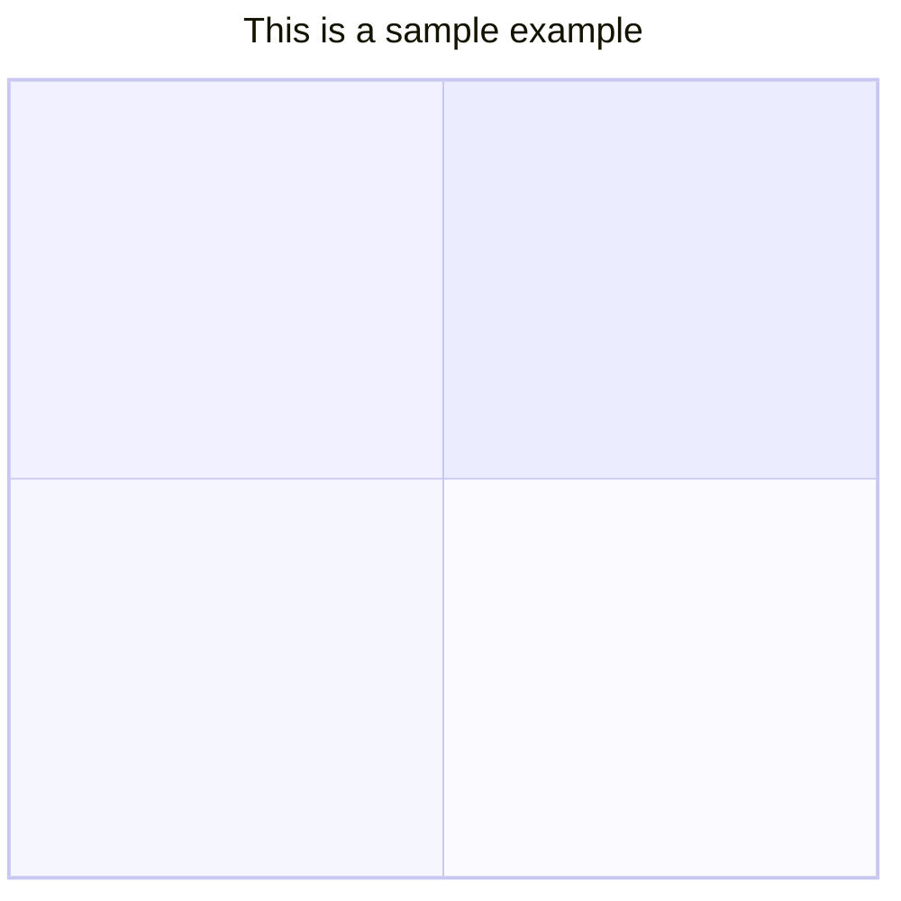
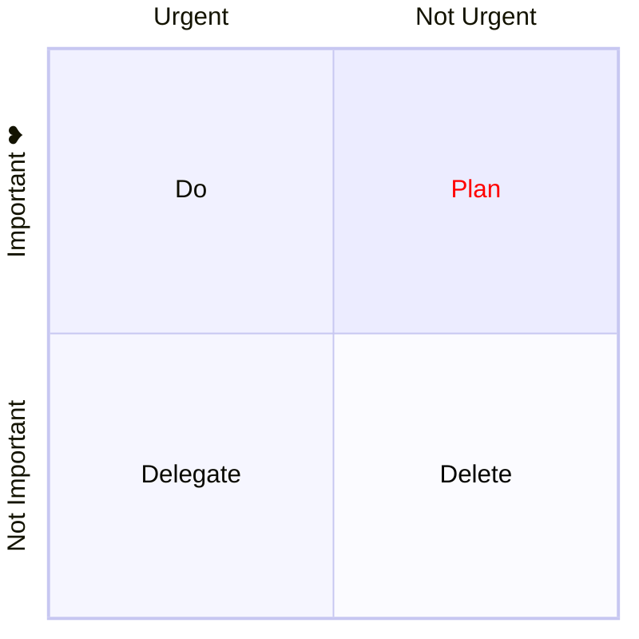
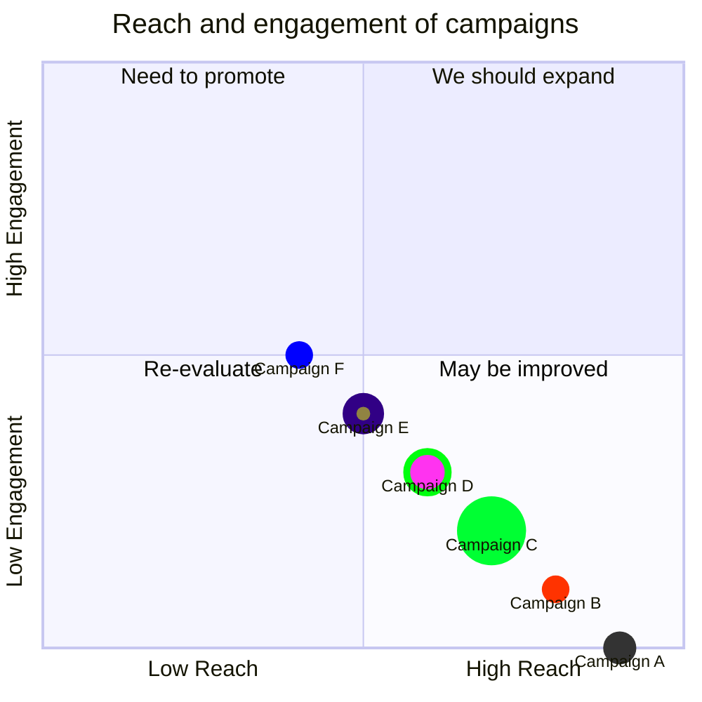

> 象限图是分为四个象限的数据的直观表示。它用于在二维网格上绘制数据点，其中一个变量表示在 x 轴上，另一个变量表示在 y 轴上。象限是通过根据一组特定于所分析数据的标准将图表分为四个相等部分来确定的。象限图通常用于识别数据的模式和趋势，并根据图表中数据点的位置确定操作的优先级。它们通常用于商业、营销和风险管理等字段。

以下是将你提供的文本处理为 `:::tabs` 格式的示例，并解释如何在 Mermaid 象限图中定义标题、轴、象限和数据点：

:::tabs

@tab 象限图示例


@tab 代码

```
quadrantChart
    title Reach and engagement of campaigns
    x-axis Low Reach --> High Reach
    y-axis Low Engagement --> High Engagement
    quadrant-1 We should expand
    quadrant-2 Need to promote
    quadrant-3 Re-evaluate
    quadrant-4 May be improved
    Campaign A: [0.3, 0.6]
    Campaign B: [0.45, 0.23]
    Campaign C: [0.57, 0.69]
    Campaign D: [0.78, 0.34]
    Campaign E: [0.40, 0.34]
    Campaign F: [0.35, 0.78]
```

:::

**关键点**  
- **标题**：使用 `title` 为象限图添加标题。  
- **x 轴**：使用 `x-axis` 定义 x 轴的范围和标签。  
- **y 轴**：使用 `y-axis` 定义 y 轴的范围和标签。  
- **象限**：使用 `quadrant-1` 到 `quadrant-4` 定义每个象限的标签。  
- **数据点**：使用 `标签: [x 值, y 值]` 定义数据点。  

:::details 实例说明  
- **标题**：`Reach and engagement of campaigns`，表示象限图的主题。  
- **x 轴**：`Low Reach --> High Reach`，表示从低到高的覆盖范围。  
- **y 轴**：`Low Engagement --> High Engagement`，表示从低到高的参与度。  
- **象限**：  
  - `quadrant-1`：`We should expand`（高覆盖、高参与）。  
  - `quadrant-2`：`Need to promote`（高覆盖、低参与）。  
  - `quadrant-3`：`Re-evaluate`（低覆盖、低参与）。  
  - `quadrant-4`：`May be improved`（低覆盖、高参与）。  
- **数据点**：  
  - `Campaign A`：`[0.3, 0.6]`。  
  - `Campaign B`：`[0.45, 0.23]`。  
  - `Campaign C`：`[0.57, 0.69]`。  
  - `Campaign D`：`[0.78, 0.34]`。  
  - `Campaign E`：`[0.40, 0.34]`。  
  - `Campaign F`：`[0.35, 0.78]`。  
  :::

如果有其他问题或需要进一步调整，请随时告诉我！

## 语法

::: info

- 如果图表中没有可用的点，则**轴**文本和**象限**都将渲染在相应象限的中心。如果有点，**x 轴**标签将从相应象限的左侧渲染，它们也将显示在图表的底部，**y 轴**标签将渲染在相应象限的底部，象限文本将渲染在相应象限的顶部。

- 对于点 x 和 y 值，最小值为 0，最大值为 1。

:::

### 标题

标题是图表的简短描述，它将始终渲染在图表顶部。

以下是将你提供的文本处理为 `:::tabs` 格式的示例，并解释如何在 Mermaid 象限图中定义标题：

:::tabs

@tab 象限图示例



@tab 代码

```
quadrantChart
    title This is a sample example
```

:::

**关键点**  
- **标题**：使用 `title` 为象限图添加标题。  

:::details 实例说明  
- **标题**：`This is a sample example`，表示象限图的主题。  
- **注意**：此示例仅定义了标题，未定义轴、象限和数据点，因此图表内容为空。  
:::

如果有其他问题或需要进一步调整，请随时告诉我！

### x-axis

x 轴决定 x 轴上显示的文本。在 x 轴上有左右两个部分，你可以同时通过两个部分，也可以仅通过左侧。该语句应以 `x-axis` 开头，然后是 `left axis text`，后跟分隔符 `-->`，然后是 `right axis text`。

示例:

1. `x-axis <text> --> <text>` 左轴和右轴文本都将被渲染。
2. `x-axis <text>` 仅渲染左轴文本。

### y-axis

y 轴确定在 y 轴上显示的文本。在 y 轴上有顶部和底部两部分，你可以通过两者，也可以仅通过底部。该语句应以 `y-axis` 开头，然后是 `bottom axis text`，后跟分隔符 `-->`，然后是 `top axis text`。

示例:

1. `y-axis <text> --> <text>` 底部和顶部轴文本都将被渲染。
2. `y-axis <text>` 仅渲染底部轴文本。

### 象限文本

`quadrant-[1,2,3,4]` 确定象限内显示哪些文本。

示例:

1. `quadrant-1 <text>` 确定将在右上象限内渲染哪些文本。
2. `quadrant-2 <text>` 确定将在左上象限内渲染哪些文本。
3. `quadrant-3 <text>` 确定将在左下象限内渲染哪些文本。
4. `quadrant-4 <text>` 确定右下象限内将渲染哪些文本。

### 积分

点用于在象限图内绘制一个圆。语法为 `<text>: [x, y]`，此处 x 和 y 值在 0 范围内 - 1.

示例:

1. `Point 1: [0.75, 0.80]` 这里，点 1 将绘制在右上象限。
2. `Point 2: [0.35, 0.24]` 这里的点 2 将绘制在左下象限中。

## 图表配置

| 参数                              | 描述                                                      | 默认值 |
| :-------------------------------- | :-------------------------------------------------------- | :----: |
| chartWidth                        | 图表的宽度                                                |  500   |
| chartHeight                       | 图表的高度                                                |  500   |
| titlePadding                      | 标题的顶部和底部填充                                      |   10   |
| titleFontSize                     | 标题字体大小                                              |   20   |
| quadrantPadding                   | 所有象限外的填充                                          |   5    |
| quadrantTextTopPadding            | 当文本绘制在顶部时象限文本顶部填充（那里没有数据点）      |   5    |
| quadrantLabelFontSize             | 象限文本字体大小                                          |   16   |
| quadrantInternalBorderStrokeWidth | 象限内的边框描边宽度                                      |   1    |
| quadrantExternalBorderStrokeWidth | 象限外边框描边宽度                                        |   2    |
| xAxisLabelPadding                 | x 轴文本的顶部和底部填充                                  |   5    |
| xAxisLabelFontSize                | X 轴文本字体大小                                          |   16   |
| xAxisPosition                     | x 轴的位置（顶部、底部）如果有点，则 x 轴将始终渲染在底部 | 'top'  |
| yAxisLabelPadding                 | y 轴文本的左右填充                                        |   5    |
| yAxisLabelFontSize                | Y 轴文本字体大小                                          |   16   |
| yAxisPosition                     | y 轴位置（左、右）                                        | 'left' |
| pointTextPadding                  | 点和下面文本之间的填充                                    |   5    |
| pointLabelFontSize                | 点文本字体大小                                            |   12   |
| pointRadius                       | 要绘制的点的半径                                          |   5    |

## 图表主题变量

| 参数                             | 描述               |
| :------------------------------- | :----------------- |
| quadrant1Fill                    | 右上象限的填充颜色 |
| quadrant2Fill                    | 左上象限的填充颜色 |
| quadrant3Fill                    | 左下象限的填充颜色 |
| quadrant4Fill                    | 右下象限的填充颜色 |
| quadrant1TextFill                | 右上象限的文本颜色 |
| quadrant2TextFill                | 左上象限的文本颜色 |
| quadrant3TextFill                | 左下象限的文本颜色 |
| quadrant4TextFill                | 右下象限的文本颜色 |
| quadrantPointFill                | 点填充颜色         |
| quadrantPointTextFill            | 点文本颜色         |
| quadrantXAxisTextFill            | X 轴文本颜色       |
| quadrantYAxisTextFill            | Y 轴文本颜色       |
| quadrantInternalBorderStrokeFill | 象限内边框颜色     |
| quadrantExternalBorderStrokeFill | 象限外边框颜色     |
| quadrantTitleFill                | 标题颜色           |

## 配置和主题示例

以下是将你提供的文本处理为 `:::tabs` 格式的示例，并解释如何在 Mermaid 象限图中定义标题、轴、象限和自定义配置：

:::tabs

@tab 象限图示例



@tab 代码

```
%%{init: {"quadrantChart": {"chartWidth": 400, "chartHeight": 400}, "themeVariables": {"quadrant1TextFill": "#ff0000"} }}%%
quadrantChart
  x-axis Urgent --> Not Urgent
  y-axis Not Important --> "Important ❤"
  quadrant-1 Plan
  quadrant-2 Do
  quadrant-3 Delegate
  quadrant-4 Delete
```

:::

**关键点**  
- **初始化配置**：  
  - 使用 `%%{init: { ... }}%%` 自定义象限图配置。  
  - `chartWidth` 和 `chartHeight`：设置图表的宽度和高度。  
  - `quadrant1TextFill`：设置第一象限文本的填充颜色（`#ff0000` 表示红色）。  
- **x 轴**：使用 `x-axis` 定义 x 轴的范围和标签。  
- **y 轴**：使用 `y-axis` 定义 y 轴的范围和标签。  
- **象限**：使用 `quadrant-1` 到 `quadrant-4` 定义每个象限的标签。  

:::details 实例说明  
- **x 轴**：`Urgent --> Not Urgent`，表示从紧急到不紧急。  
- **y 轴**：`Not Important --> "Important ❤"`，表示从不重要到重要。  
- **象限**：  
  - `quadrant-1`：`Plan`（紧急且重要）。  
  - `quadrant-2`：`Do`（紧急但不重要）。  
  - `quadrant-3`：`Delegate`（不紧急且不重要）。  
  - `quadrant-4`：`Delete`（不紧急但重要）。  
- **自定义配置**：  
  - 图表宽度和高度为 400px。  
  - 第一象限文本颜色为红色。  
  :::

如果有其他问题或需要进一步调整，请随时告诉我！

## 点样式

点可以直接设置样式，也可以使用定义的共享类设置样式

### 直接样式

```
Point A: [0.9, 0.0] radius: 12
Point B: [0.8, 0.1] color: #ff3300, radius: 10
Point C: [0.7, 0.2] radius: 25, color: #00ff33, stroke-color: #10f0f0  
Point D: [0.6, 0.3] radius: 15, stroke-color: #00ff0f, stroke-width: 5px ,color: #ff33f0
```

### 共享类样式

```
Point A:::class1: [0.9, 0.0]
Point B:::class2: [0.8, 0.1]
Point C:::class3: [0.7, 0.2]
Point D:::class3: [0.7, 0.2]
classDef class1 color: #109060
classDef class2 color: #908342, radius : 10, stroke-color: #310085, stroke-width: 10px
classDef class3 color: #f00fff, radius : 10
```

**可用样式：**

| 参数         | 描述                                 |
| :----------- | :----------------------------------- |
| color        | 点的填充颜色                         |
| radius       | 点的半径                             |
| stroke-width | 点的边框宽度                         |
| stroke-color | 点的边框颜色（未指定描边宽度时无用） |

:::info 信息

优先顺序：1. 直接样式 2. 类样式 3. 主题样式

:::

**样式示例**

以下是将你提供的文本处理为 `:::tabs` 格式的示例，并解释如何在 Mermaid 象限图中定义标题、轴、象限、数据点和样式：

:::tabs

@tab 象限图示例



@tab 代码

```
quadrantChart
  title Reach and engagement of campaigns
  x-axis Low Reach --> High Reach
  y-axis Low Engagement --> High Engagement
  quadrant-1 We should expand
  quadrant-2 Need to promote
  quadrant-3 Re-evaluate
  quadrant-4 May be improved
  Campaign A: [0.9, 0.0] radius: 12
  Campaign B:::class1: [0.8, 0.1] color: #ff3300, radius: 10
  Campaign C: [0.7, 0.2] radius: 25, color: #00ff33, stroke-color: #10f0f0
  Campaign D: [0.6, 0.3] radius: 15, stroke-color: #00ff0f, stroke-width: 5px ,color: #ff33f0
  Campaign E:::class2: [0.5, 0.4]
  Campaign F:::class3: [0.4, 0.5] color: #0000ff
  classDef class1 color: #109060
  classDef class2 color: #908342, radius : 10, stroke-color: #310085, stroke-width: 10px
  classDef class3 color: #f00fff, radius : 10
```

:::

**关键点**  
- **标题**：使用 `title` 为象限图添加标题。  
- **x 轴**：使用 `x-axis` 定义 x 轴的范围和标签。  
- **y 轴**：使用 `y-axis` 定义 y 轴的范围和标签。  
- **象限**：使用 `quadrant-1` 到 `quadrant-4` 定义每个象限的标签。  
- **数据点**：使用 `标签: [x 值, y 值]` 定义数据点，并可通过 `radius`、`color`、`stroke-color`、`stroke-width` 自定义样式。  
- **样式定义**：使用 `classDef 样式名 样式规则` 定义样式。  
- **样式应用**：使用 `:::样式名` 将样式应用到数据点。  

:::details 实例说明  
- **标题**：`Reach and engagement of campaigns`，表示象限图的主题。  
- **x 轴**：`Low Reach --> High Reach`，表示从低到高的覆盖范围。  
- **y 轴**：`Low Engagement --> High Engagement`，表示从低到高的参与度。  
- **象限**：  
  - `quadrant-1`：`We should expand`（高覆盖、高参与）。  
  - `quadrant-2`：`Need to promote`（高覆盖、低参与）。  
  - `quadrant-3`：`Re-evaluate`（低覆盖、低参与）。  
  - `quadrant-4`：`May be improved`（低覆盖、高参与）。  
- **数据点**：  
  - `Campaign A`：`[0.9, 0.0]`，半径为 12。  
  - `Campaign B`：`[0.8, 0.1]`，应用 `class1` 样式，自定义颜色为 `#ff3300`，半径为 10。  
  - `Campaign C`：`[0.7, 0.2]`，半径为 25，颜色为 `#00ff33`，边框颜色为 `#10f0f0`。  
  - `Campaign D`：`[0.6, 0.3]`，半径为 15，边框颜色为 `#00ff0f`，边框宽度为 `5px`，颜色为 `#ff33f0`。  
  - `Campaign E`：`[0.5, 0.4]`，应用 `class2` 样式。  
  - `Campaign F`：`[0.4, 0.5]`，应用 `class3` 样式，自定义颜色为 `#0000ff`。  
- **样式定义**：  
  - `class1`：颜色为 `#109060`。  
  - `class2`：颜色为 `#908342`，半径为 10，边框颜色为 `#310085`，边框宽度为 `10px`。  
  - `class3`：颜色为 `#f00fff`，半径为 10。  
  :::
