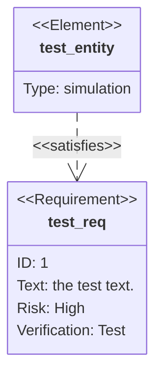
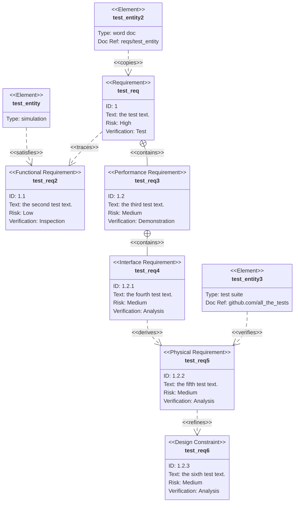

> 需求图提供了需求及其相互之间以及其他记录元素之间的联系的可视化。建模规范遵循 SysML v1.6 定义的规范。

Mermaid 需求图中定义需求、元素和关系：

:::tabs

@tab 需求图示例



@tab 代码

```
requirementDiagram

    requirement test_req {
    id: 1
    text: the test text.
    risk: high
    verifymethod: test
    }

    element test_entity {
    type: simulation
    }

    test_entity - satisfies -> test_req
```

:::

**关键点**  
- **需求**：使用 `requirement 需求名 { ... }` 定义需求，包含 `id`、`text`、`risk`、`verifymethod` 等属性。  
- **元素**：使用 `element 元素名 { ... }` 定义元素，包含 `type` 属性。  
- **关系**：使用 `元素名 - 关系类型 -> 需求名` 定义元素与需求之间的关系。  

:::details 实例说明  
- **需求**：  
  - `test_req`：需求 ID 为 `1`，描述为 `the test text.`，风险为 `high`，验证方法为 `test`。  
- **元素**：  
  - `test_entity`：元素类型为 `simulation`。  
- **关系**：  
  - `test_entity` 满足 `test_req`，表示为 `test_entity - satisfies -> test_req`。  
  :::

## 语法

需求图包含三种类型的组件：`要求`、`要素`和`关系`。

用于定义每个的语法定义如下。尖括号中表示的单词（例如 `<word>`）是枚举关键字，其选项在表格中详细说明。`user_defined_...` 用于任何需要用户输入的地方。

关于用户文本的重要说明：所有输入都可以用引号引起来，也可以不用引号引起来。例如，`Id: "here is an example"` 和 `Id: here is an example` 都有效。但是，用户必须小心未加引号的输入。如果检测到另一个关键字，解析器将失败。

### 要求

需求定义包含需求类型、名称、ID、文本、风险和验证方法。语法如下：

```
<type> user_defined_name {
    id: user_defined_id
    text: user_defined text
    risk: <risk>
    verifymethod: <method>
}
```

类型、风险和方法是 SysML 中定义的枚举。

| 关键词   | 选项                                                   |
| :------- | :----------------------------------------------------- |
| 类型     | 需求、功能需求、接口需求、性能需求、物理需求、设计约束 |
| 风险     | 低中高                                                 |
| 验证方法 | 分析、检验、测试、演示                                 |

### 元素

元素定义包含元素名称、类型和文档引用。这三个都是用户定义的。元素功能旨在轻量级，但允许将需求连接到其他文档的部分。

```
element user_defined_name {
    type: user_defined_type
    docref: user_defined_ref
}
```

### 关系

关系由源节点、目标节点和关系类型组成。

每个都遵循以下定义格式

```
{name of source} - <type> -> {name of destination}
```

or

```
{name of destination} <- <type> - {name of source}
```

"来源名称" 和 "目的地名称" 应该是在其他地方定义的需求或元素节点的名称。

关系类型可以是包含、复制、派生、满足、验证、细化或跟踪之一。

每个关系都在图中进行了标记。

**完整案例：**

此示例使用了该图的所有功能。

 Mermaid 需求图中定义需求、元素和关系：

:::tabs

@tab 需求图示例



@tab 代码

```
requirementDiagram

    requirement test_req {
    id: 1
    text: the test text.
    risk: high
    verifymethod: test
    }

    functionalRequirement test_req2 {
    id: 1.1
    text: the second test text.
    risk: low
    verifymethod: inspection
    }

    performanceRequirement test_req3 {
    id: 1.2
    text: the third test text.
    risk: medium
    verifymethod: demonstration
    }

    interfaceRequirement test_req4 {
    id: 1.2.1
    text: the fourth test text.
    risk: medium
    verifymethod: analysis
    }

    physicalRequirement test_req5 {
    id: 1.2.2
    text: the fifth test text.
    risk: medium
    verifymethod: analysis
    }

    designConstraint test_req6 {
    id: 1.2.3
    text: the sixth test text.
    risk: medium
    verifymethod: analysis
    }

    element test_entity {
    type: simulation
    }

    element test_entity2 {
    type: word doc
    docRef: reqs/test_entity
    }

    element test_entity3 {
    type: "test suite"
    docRef: github.com/all_the_tests
    }


    test_entity - satisfies -> test_req2
    test_req - traces -> test_req2
    test_req - contains -> test_req3
    test_req3 - contains -> test_req4
    test_req4 - derives -> test_req5
    test_req5 - refines -> test_req6
    test_entity3 - verifies -> test_req5
    test_req <- copies - test_entity2
```

:::

**关键点**  
- **需求类型**：  
  - `requirement`：通用需求。  
  - `functionalRequirement`：功能需求。  
  - `performanceRequirement`：性能需求。  
  - `interfaceRequirement`：接口需求。  
  - `physicalRequirement`：物理需求。  
  - `designConstraint`：设计约束。  
- **需求属性**：包含 `id`、`text`、`risk`、`verifymethod` 等。  
- **元素**：使用 `element 元素名 { ... }` 定义元素，包含 `type` 和 `docRef` 属性。  
- **关系**：使用 `需求或元素 - 关系类型 -> 需求或元素` 定义关系，如 `satisfies`、`traces`、`contains`、`derives`、`refines`、`verifies`、`copies` 等。  

:::details 实例说明  
- **需求**：  
  - `test_req`：通用需求，ID 为 `1`，描述为 `the test text.`，风险为 `high`，验证方法为 `test`。  
  - `test_req2`：功能需求，ID 为 `1.1`，描述为 `the second test text.`，风险为 `low`，验证方法为 `inspection`。  
  - `test_req3`：性能需求，ID 为 `1.2`，描述为 `the third test text.`，风险为 `medium`，验证方法为 `demonstration`。  
  - `test_req4`：接口需求，ID 为 `1.2.1`，描述为 `the fourth test text.`，风险为 `medium`，验证方法为 `analysis`。  
  - `test_req5`：物理需求，ID 为 `1.2.2`，描述为 `the fifth test text.`，风险为 `medium`，验证方法为 `analysis`。  
  - `test_req6`：设计约束，ID 为 `1.2.3`，描述为 `the sixth test text.`，风险为 `medium`，验证方法为 `analysis`。  
- **元素**：  
  - `test_entity`：类型为 `simulation`。  
  - `test_entity2`：类型为 `word doc`，文档引用为 `reqs/test_entity`。  
  - `test_entity3`：类型为 `test suite`，文档引用为 `github.com/all_the_tests`。  
- **关系**：  
  - `test_entity` 满足 `test_req2`。  
  - `test_req` 追踪到 `test_req2`。  
  - `test_req` 包含 `test_req3`。  
  - `test_req3` 包含 `test_req4`。  
  - `test_req4` 派生 `test_req5`。  
  - `test_req5` 精炼 `test_req6`。  
  - `test_entity3` 验证 `test_req5`。  
  - `test_entity2` 复制 `test_req`。  
  :::
