> 时序图是一种交互图，显示进程如何彼此运行以及以什么顺序运行。

:::tabs

@tab 第一个案例

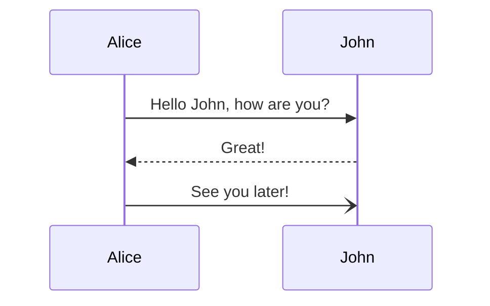
```mermaid
sequenceDiagram
    Alice->>John: Hello John, how are you?
    John-->>Alice: Great!
    Alice-)John: See you later!
```

@tab 代码

```
sequenceDiagram
    Alice->>John: Hello John, how are you?
    John-->>Alice: Great!
    Alice-)John: See you later!
```

:::

:::info

关于节点的说明，由于 Mermaid 语言的编写方式，"end" 一词可能会破坏图表。如果无法避免，则必须使用括号（）、引号 "", or brackets {},[], to enclose the word "end"。即：（end）、[end]、{end}。

:::

## 语法

### 参加者

可以像第一个示例中那样隐式定义参与者。参与者或参与者按照图表源文本中的出现顺序渲染。有时，你可能希望以不同于第一条消息中的顺序显示参与者。可以通过执行以下操作来指定角色的出场顺序：

:::tabs

@tab 参与者

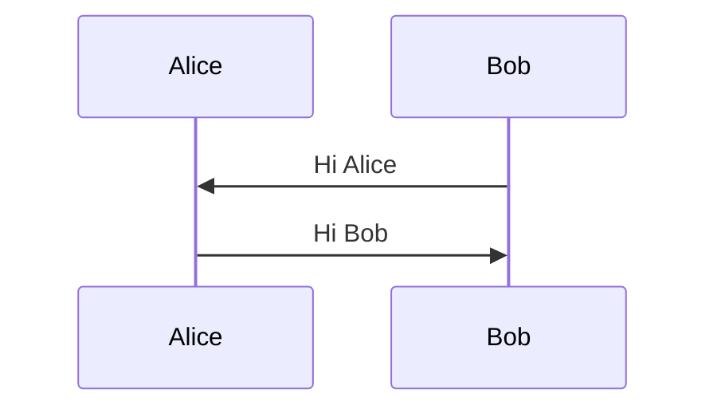
```mermaid
sequenceDiagram
    participant Alice
    participant Bob
    Bob->>Alice: Hi Alice
    Alice->>Bob: Hi Bob
```

@tab 代码

```
sequenceDiagram
    participant Alice
    participant Bob
    Bob->>Alice: Hi Alice
    Alice->>Bob: Hi Bob
```

:::

:::info

- 使用 `sequenceDiagram` 定义序列图。
- `participant` 用于定义参与者。
- `->>` 表示带箭头的消息，适合表示交互的方向。

:::

### 角色

如果你特别想使用角色符号而不是带有文本的矩形，则可以通过使用角色语句来实现

:::tabs

@tab 角色

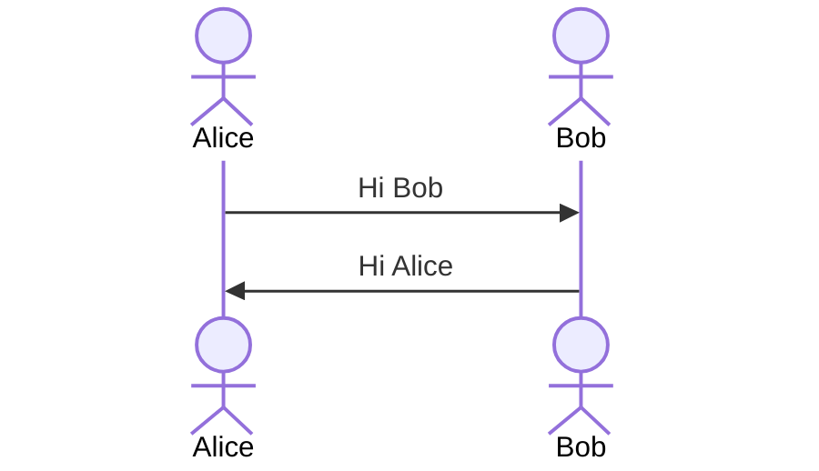
```mermaid
sequenceDiagram
    actor Alice
    actor Bob
    Alice->>Bob: Hi Bob
    Bob->>Alice: Hi Alice
```

@tab 代码

```
sequenceDiagram
    actor Alice
    actor Bob
    Alice->>Bob: Hi Bob
    Bob->>Alice: Hi Alice
```

:::

**语法说明**

- `actor [Name]`：定义参与者（与 `participant` 类似）。
- `[Actor]->>[Actor]: [Message]`：表示参与者之间的消息传递。

**对比 `actor` 和 `participant`**

- `actor` 和 `participant` 在功能上几乎相同，都可以用于定义序列图中的参与者。
- 使用 `actor` 更符合某些场景的语义（如强调角色）。

### 别名

角色可以有一个方便的标识符和描述性标签。

:::tabs

@tab 别名

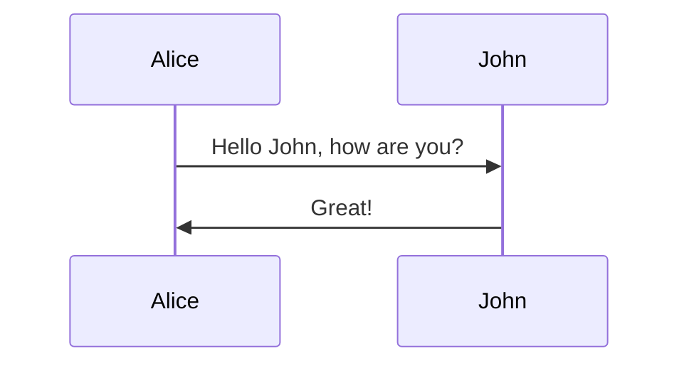
```mermaid
sequenceDiagram
    participant A as Alice
    participant J as John
    A->>J: Hello John, how are you?
    J->>A: Great!
```

@tab 代码

```
sequenceDiagram
    participant A as Alice
    participant J as John
    A->>J: Hello John, how are you?
    J->>A: Great!
```

:::

:::info

- 使用 `sequenceDiagram` 定义序列图。
- `participant [Alias] as [Name]` 用于定义参与者并为其设置别名。
- `->>` 表示带箭头的消息，适合表示交互的方向。

:::

### Actor创建和销毁

 (v10.3.0+)可以通过消息创建和销毁参与者。为此，请在消息之前添加创建或销毁指令。

```
create participant B
A --> B: Hello
```

创建指令支持参与者/参与者区分和别名。消息的发送者或接收者可以被销毁，但只能创建接收者。

:::tabs

@tab Actor创建和销毁

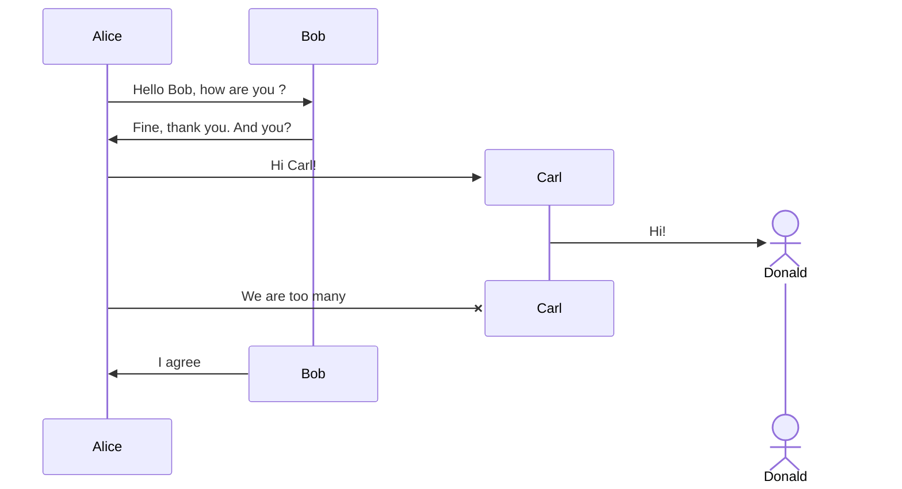
```mermaid
sequenceDiagram
    Alice->>Bob: Hello Bob, how are you ?
    Bob->>Alice: Fine, thank you. And you?
    create participant Carl
    Alice->>Carl: Hi Carl!
    create actor D as Donald
    Carl->>D: Hi!
    destroy Carl
    Alice-xCarl: We are too many
    destroy Bob
    Bob->>Alice: I agree
```

@tab 代码

```
sequenceDiagram
    Alice->>Bob: Hello Bob, how are you ?
    Bob->>Alice: Fine, thank you. And you?
    create participant Carl
    Alice->>Carl: Hi Carl!
    create actor D as Donald
    Carl->>D: Hi!
    destroy Carl
    Alice-xCarl: We are too many
    destroy Bob
    Bob->>Alice: I agree
```

:::

:::info

- 使用 `sequenceDiagram` 定义序列图。
- `create participant` 和 `create actor` 用于动态创建参与者。
- `destroy` 用于销毁参与者。
- `->>` 表示带箭头的消息，`-x` 表示带箭头的终止消息。

:::

 **动态创建与销毁**：

- **动态创建**：可以在序列图运行时创建参与者或角色。
- **销毁**：销毁参与者后，消息传递将失效（如示例中的 `Alice-xCarl` 和 `Bob->>Alice`）。

:::warning 

- 销毁参与者后，向其发送消息将无效。
- 动态创建和销毁功能适合用于表示生命周期较短的参与者。

:::

**如果创建或删除参与者时出现以下类型的错误：**

> 被销毁的参与者参与者名称在其声明后没有关联的销毁消息。请检查顺序图。

修复图表代码并不能消除此错误，并且所有其他图表的渲染都会导致相同的错误，那么你需要将 mermaid 版本更新到（v10.7.0+）。无法修复的参与者/参与者创建/删除错误

### 分组/框

角色可以分组在垂直框中。你可以使用以下符号定义颜色（如果没有，它将是透明的）和/或描述性标签：

```
box Aqua Group Description
... actors ...
end
box Group without description
... actors ...
end
box rgb(33,66,99)
... actors ...
end
box rgba(33,66,99,0.5)
... actors ...
end
```

:::info

如果你的组名是颜色，你可以强制颜色透明：

:::

```
box transparent Aqua
... actors ...
end
```

:::tabs

@tab 分组

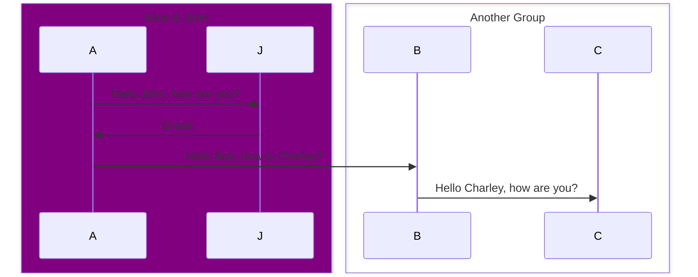
```mermaid
sequenceDiagram
    box Purple Alice & John
    participant A
    participant J
    end
    box Another Group
    participant B
    participant C
    end
    A->>J: Hello John, how are you?
    J->>A: Great!
    A->>B: Hello Bob, how is Charley?
    B->>C: Hello Charley, how are you?
```

@tab 代码

```
sequenceDiagram
    box Purple Alice & John
    participant A
    participant J
    end
    box Another Group
    participant B
    participant C
    end
    A->>J: Hello John, how are you?
    J->>A: Great!
    A->>B: Hello Bob, how is Charley?
    B->>C: Hello Charley, how are you?
```

:::

:::info

- 使用 `sequenceDiagram` 定义序列图。
- `box` 用于将参与者分组，并可以为组设置颜色和名称。
- `participant` 用于定义参与者。
- `->>` 表示带箭头的消息，适合表示交互的方向。

:::

- 分组功能适合用于复杂的序列图，可以提高可读性和组织性。
- 颜色和名称可以根据需要自定义。

### 转义

Mermaid 序列图中使用 Unicode 字符：

:::tabs

@tab 带 Unicode 字符的流程

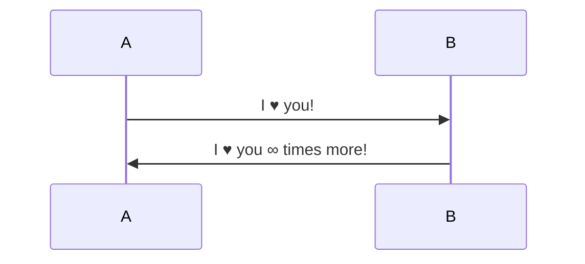
```mermaid
sequenceDiagram
    A->>B: I #9829; you!
    B->>A: I #9829; you #infin; times more!
```

@tab 代码

```
sequenceDiagram
    A->>B: I #9829; you!
    B->>A: I #9829; you #infin; times more!
```

:::

**关键点**  
- **Unicode 字符**：使用 `#` 后跟字符编码（如 `#9829` 表示 ❤️）或名称（如 `#infin` 表示 ∞）插入 Unicode 字符。  
- **消息**：使用 `->>` 表示同步消息。  
- **情感表达**：通过 Unicode 字符增强消息的情感表达。

### 注释

可以在时序图中输入注释，解析器将忽略这些注释。注释需要独占一行，并且必须以 `%%`（双百分号）开头。注释开始后到下一个换行符的任何文本都将被视为注释，包括任何图表语法

以下是将你提供的文本处理为 `:::tabs` 格式的示例，并解释如何在 Mermaid 序列图中添加注释（`%%`）：

:::tabs

@tab 带注释的流程

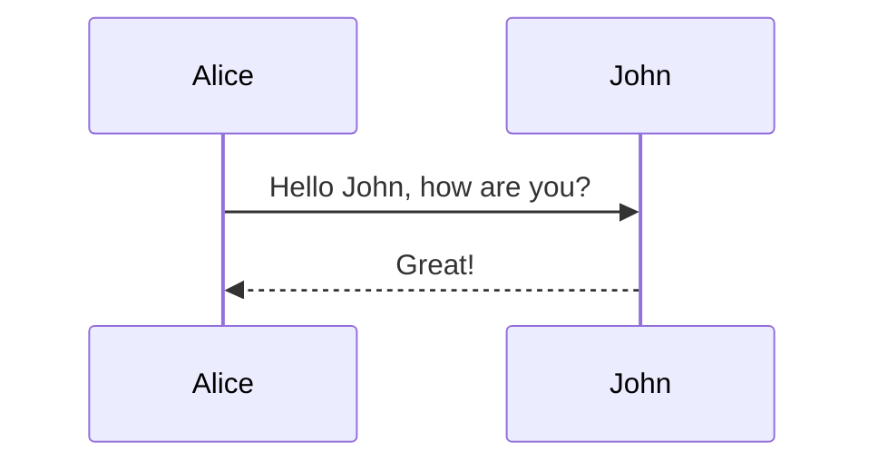
```mermaid
sequenceDiagram
    Alice->>John: Hello John, how are you?
    %% this is a comment
    John-->>Alice: Great!
```

@tab 代码

```
sequenceDiagram
    Alice->>John: Hello John, how are you?
    %% this is a comment
    John-->>Alice: Great!
```

:::

**关键点**  
- **注释（`%%`）**：使用 `%%` 在代码中添加注释，注释内容不会被渲染到图中。  
- **消息**：使用 `->>` 和 `-->>` 表示同步和异步消息。  
- **简单交互**：展示两个参与者之间的基本消息交互。

### 换行符

可以在注释和消息中添加换行符：

:::tabs

@tab 换行符

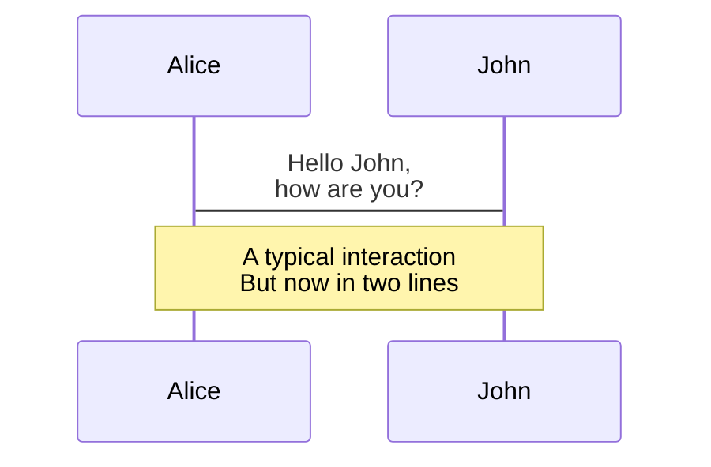
```mermaid
sequenceDiagram
    Alice->John: Hello John,<br/>how are you?
    Note over Alice,John: A typical interaction<br/>But now in two lines
```

@tab 代码

```markdown
sequenceDiagram
    Alice->John: Hello John,<br/>how are you?
    Note over Alice,John: A typical interaction<br/>But now in two lines
```

:::

**解释：**

- 展示一个 Mermaid 序列图，其中 Alice 向 John 发送一条消息，消息内容分为两行。
- 在 Alice 和 John 之间添加了一条覆盖注释，注释内容也分为两行。
- `Alice->John: Hello John,<br/>how are you?`：Alice 向 John 发送消息，使用 `<br/>` 将消息内容分为两行。
- `Note over Alice,John: A typical interaction<br/>But now in two lines`：在 Alice 和 John 之间添加注释，使用 `<br/>` 将注释内容分为两行。

**关键点：**

- **多行文本**：使用 `<br/>` 标签将消息或注释内容分为多行。
- **消息**：使用 `->` 表示消息的发送。
- **覆盖注释**：使用 `Note over` 关键字在多个参与者之间添加注释。

角色名称中的换行符需要别名：

:::tabs

@tab 第一个案例

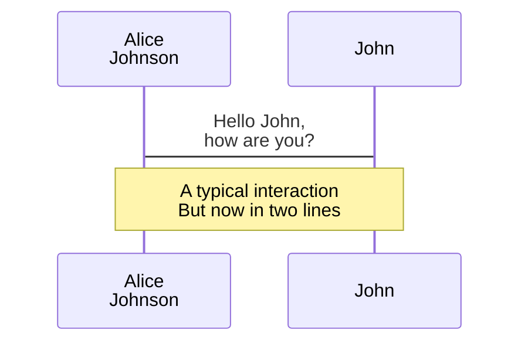
```mermaid
sequenceDiagram
    participant Alice as Alice<br/>Johnson
    Alice->John: Hello John,<br/>how are you?
    Note over Alice,John: A typical interaction<br/>But now in two lines
```

@tab 代码

markdown

```markdown
sequenceDiagram
    participant Alice as Alice<br/>Johnson
    Alice->John: Hello John,<br/>how are you?
    Note over Alice,John: A typical interaction<br/>But now in two lines
```

:::

**解释**：

展示一个 Mermaid 序列图，其中定义了一个参与者 `Alice`，其名称分为两行（`Alice<br/>Johnson`）。

- Alice 向 John 发送一条消息，消息内容分为两行（`Hello John,<br/>how are you?`）。
- 在 Alice 和 John 之间添加了一条覆盖注释，注释内容也分为两行（`A typical interaction<br/>But now in two lines`）。
- `participant Alice as Alice<br/>Johnson`：定义参与者 `Alice`，并使用 `<br/>` 将其名称分为两行。
- `Alice->John: Hello John,<br/>how are you?`：Alice 向 John 发送消息，使用 `<br/>` 将消息内容分为两行。
- `Note over Alice,John: A typical interaction<br/>But now in two lines`：在 Alice 和 John 之间添加注释，使用 `<br/>` 将注释内容分为两行。

**关键点**：

- **多行参与者名称**：使用 `as` 关键字定义参与者的显示名称，并用 `<br/>` 将其分为多行。
- **多行消息**：使用 `<br/>` 将消息内容分为多行。
- **多行注释**：使用 `<br/>` 将注释内容分为多行。


## 信息-连接线

消息可以有两条显示，可以是实线，也可以是虚线。

```
[Actor][Arrow][Actor]:Message text
```

目前支持十种类型的箭头：

| 类型     | 描述                           |
| :------- | :----------------------------- |
| `->`     | 没有箭头的实线                 |
| `-->`    | 没有箭头的虚线                 |
| `->>`    | 带箭头的实线                   |
| `-->>`   | 带箭头的虚线                   |
| `<<->>`  | 带双向箭头的实线 (v11.0.0+)    |
| `<<-->>` | 带双向箭头的虚线 (v11.0.0+)    |
| `-x`     | 末端有十字的实线               |
| `--x`    | 末端带有十字的虚线             |
| `-)`     | 末尾带有空心箭头的实线（异步） |
| `--)`    | 末尾带有空心箭头的虚线（异步） |

## 激活

可以激活和停用角色。(de)activation 可以是专用声明：

- **激活**：表示参与者开始处理消息，通常用于强调参与者的活动状态。
- **失活**：表示参与者完成处理，恢复为默认状态

:::tabs

@tab 序列图

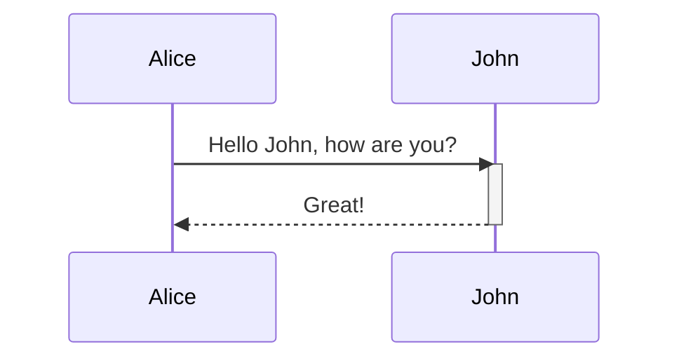
```mermaid
sequenceDiagram
    Alice->>John: Hello John, how are you?
    activate John
    John-->>Alice: Great!
    deactivate John
```

@tab 代码

```
sequenceDiagram
    Alice->>John: Hello John, how are you?
    activate John
    John-->>Alice: Great!
    deactivate John
```

:::

:::info

- 使用 `sequenceDiagram` 定义序列图。
- `activate` 和 `deactivate` 用于表示参与者的激活和失活状态。
- `->>` 表示带箭头的消息，`-->>` 表示带箭头的返回消息。

:::

- 激活和失活功能适合用于强调参与者的活动状态。
- 在复杂的序列图中，激活和失活可以提高流程的清晰度。

**快捷表示法**：即在消息箭头后附加 `+`/`-` 后缀：

:::tabs

@tab 序列图

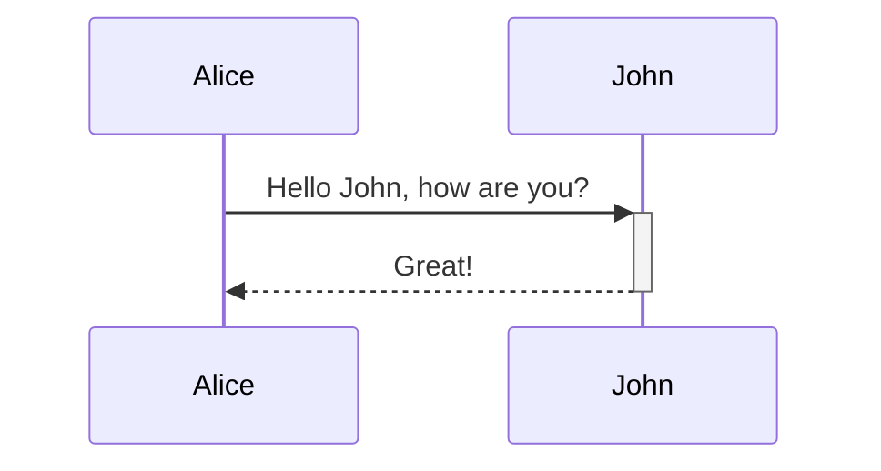
```mermaid
sequenceDiagram
    Alice->>+John: Hello John, how are you?
    John-->>-Alice: Great!
```

@tab 代码

```markdown
sequenceDiagram
    Alice->>+John: Hello John, how are you?
    John-->>-Alice: Great!
```

:::

:::info

- 使用 `sequenceDiagram` 定义序列图。
- `->>+` 表示带箭头的消息并激活参与者。
- `-->>-` 表示带箭头的返回消息并失活参与者。

:::

### 激活叠加

同一角色的激活叠加：

:::tabs

@tab 激活叠加

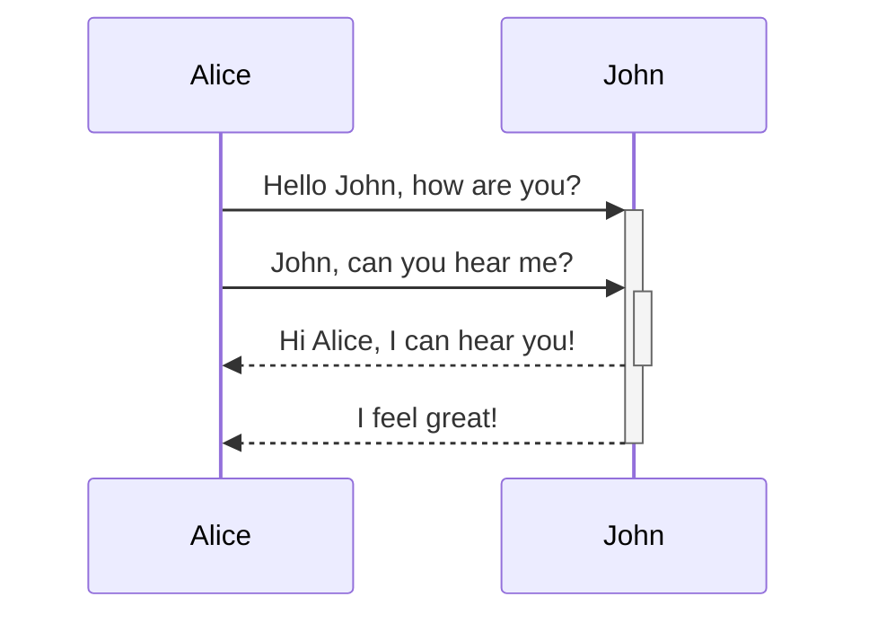
```mermaid
sequenceDiagram
    Alice->>+John: Hello John, how are you?
    Alice->>+John: John, can you hear me?
    John-->>-Alice: Hi Alice, I can hear you!
    John-->>-Alice: I feel great!
```

@tab 代码

markdown

```markdown
sequenceDiagram
    Alice->>+John: Hello John, how are you?
    Alice->>+John: John, can you hear me?
    John-->>-Alice: Hi Alice, I can hear you!
    John-->>-Alice: I feel great!
```

:::

### 注释

可以向时序图添加注释。这是通过符号 Note [ right of | 完成的。 左边| 结束] [角色]：注意内容中的文本

请参阅下面的示例：

:::tabs

@tab 注释

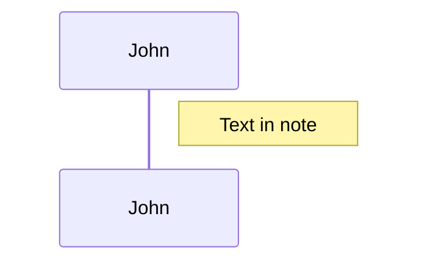
```mermaid
sequenceDiagram
    participant John
    Note right of John: Text in note
```

@tab 代码

```markdown
sequenceDiagram
    participant John
    Note right of John: Text in note
```

**关键点**：

- **参与者**：使用 `participant` 关键字定义参与者。
- **注释**：使用 `Note` 关键字添加注释，并通过 `right of` 或 `left of` 指定注释的位置。

### 跨越参与者

还可以创建跨越两个参与者的注意：

:::tabs

@tab 跨参与者

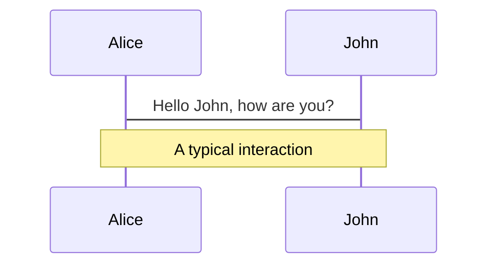
```mermaid
sequenceDiagram
    Alice->John: Hello John, how are you?
    Note over Alice,John: A typical interaction
```

@tab 代码

```markdown
sequenceDiagram
    Alice->John: Hello John, how are you?
    Note over Alice,John: A typical interaction
```

:::

**流程：**

- 展示一个 Mermaid 序列图，其中 Alice 向 John 发送一条消息，并在 Alice 和 John 之间添加了一条覆盖注释。
- `Alice->John: Hello John, how are you?`：Alice 向 John 发送消息。
- `Note over Alice,John: A typical interaction`：在 Alice 和 John 之间添加注释，内容为 `A typical interaction`。

**关键点**：

- **消息**：使用 `->` 表示消息的发送。
- **覆盖注释**：使用 `Note over` 关键字在多个参与者之间添加注释。

## 循环

可以在时序图中表达循环。这是通过符号完成的

```
loop Loop text
... statements ...
end
```

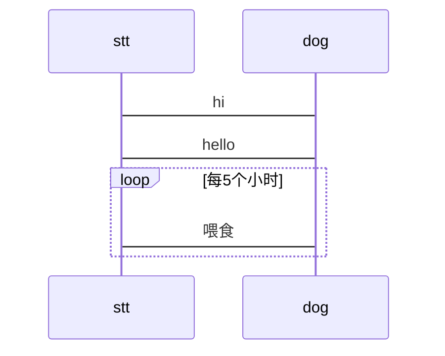
```mermaid
sequenceDiagram
	stt->dog:hi
	dog->stt:hello
	loop 每5个小时
		stt->dog:喂食
	end
```

@tab 循环

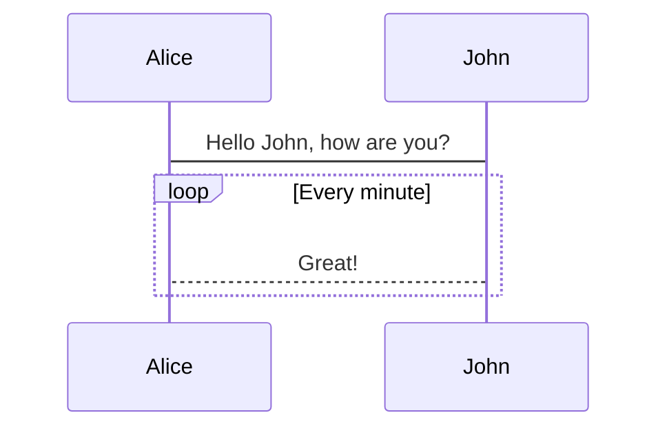
```mermaid
sequenceDiagram
    Alice->John: Hello John, how are you?
    loop Every minute
        John-->Alice: Great!
    end
```

@tab 代码

markdown

```markdown
sequenceDiagram
    Alice->John: Hello John, how are you?
    loop Every minute
        John-->Alice: Great!
    end
```

:::

**解释**：

- 展示一个 Mermaid 序列图，其中 Alice 向 John 发送一条消息，并包含一个循环结构。
- `Alice->John: Hello John, how are you?`：Alice 向 John 发送消息。
- `loop Every minute`：定义一个循环结构，标签为 `Every minute`。
- `John-->Alice: Great!`：John 回复 Alice，此消息会在循环中重复。
- `end`：结束循环。

关键点：

- **循环结构**：使用 `loop` 关键字定义循环，并指定循环的标签（如 `Every minute`）。
- **消息**：在循环内部的消息会重复执行。
- **结束循环**：使用 `end` 关键字结束循环。

## 替代

可以在时序图中表达替代路径。这是通过符号完成的

```
alt Describing text
... statements ...
else
... statements ...
end
```

或者如果有可选的序列（如果没有其他）。

```
opt Describing text
... statements ...
end
```

## 平行线

可以显示并行发生的动作。

这是通过符号完成的


```
par [Action 1]
... statements ...
and [Action 2]
... statements ...
and [Action N]
... statements ...
end
```

:::tabs 

@tab 并行（`par`）结构

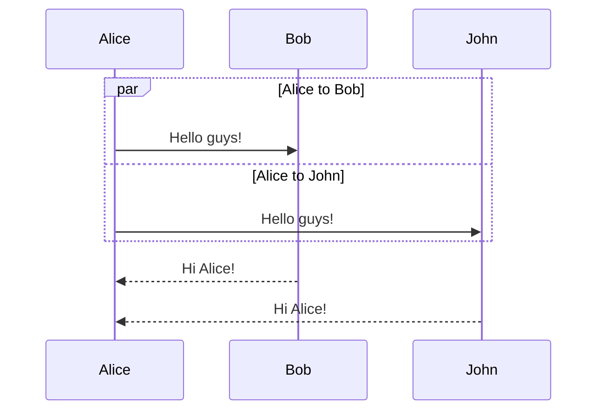
```mermaid
sequenceDiagram
    par Alice to Bob
        Alice->>Bob: Hello guys!
    and Alice to John
        Alice->>John: Hello guys!
    end
    Bob-->>Alice: Hi Alice!
    John-->>Alice: Hi Alice!
```

@tab 代码

```markdown
sequenceDiagram
    par Alice to Bob
        Alice->>Bob: Hello guys!
    and Alice to John
        Alice->>John: Hello guys!
    end
    Bob-->>Alice: Hi Alice!
    John-->>Alice: Hi Alice!
```

:::

**关键点**：

- **并行结构（`par`）**：使用 `par` 关键字定义并行分支，并通过 `and` 定义其他并行分支。
- **消息**：在并行分支内部的消息会同时执行。
- **结束并行分支**：使用 `end` 关键字结束并行分支。

也可以嵌套并行块。

::tabs

@tab 并行嵌套

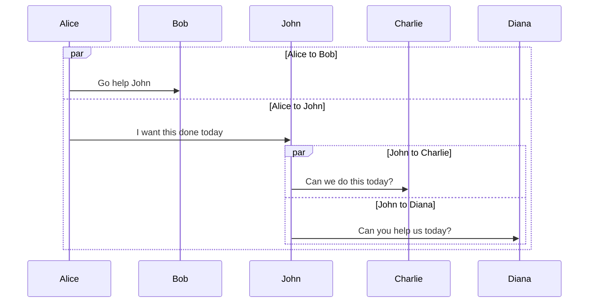
```mermaid
sequenceDiagram
    par Alice to Bob
        Alice->>Bob: Go help John
    and Alice to John
        Alice->>John: I want this done today
        par John to Charlie
            John->>Charlie: Can we do this today?
        and John to Diana
            John->>Diana: Can you help us today?
        end
    end
```

@tab 代码

markdown

```markdown
sequenceDiagram
    par Alice to Bob
        Alice->>Bob: Go help John
    and Alice to John
        Alice->>John: I want this done today
        par John to Charlie
            John->>Charlie: Can we do this today?
        and John to Diana
            John->>Diana: Can you help us today?
        end
    end
```

:::

**关键点**：

- **并行结构（`par`）**：使用 `par` 关键字定义并行分支，并通过 `and` 定义其他并行分支。
- **嵌套并行结构**：在并行分支内部可以嵌套另一个并行分支。
- **消息**：在并行分支内部的消息会同时执行。
- **结束并行分支**：使用 `end` 关键字结束并行分支。

## 临界区

可以通过对情况进行条件处理来显示必须自动发生的操作。

这是通过符号完成的

```
critical [Action that must be performed]
... statements ...
option [Circumstance A]
... statements ...
option [Circumstance B]
... statements ...
end
```

:::tabs

@tab 临界区

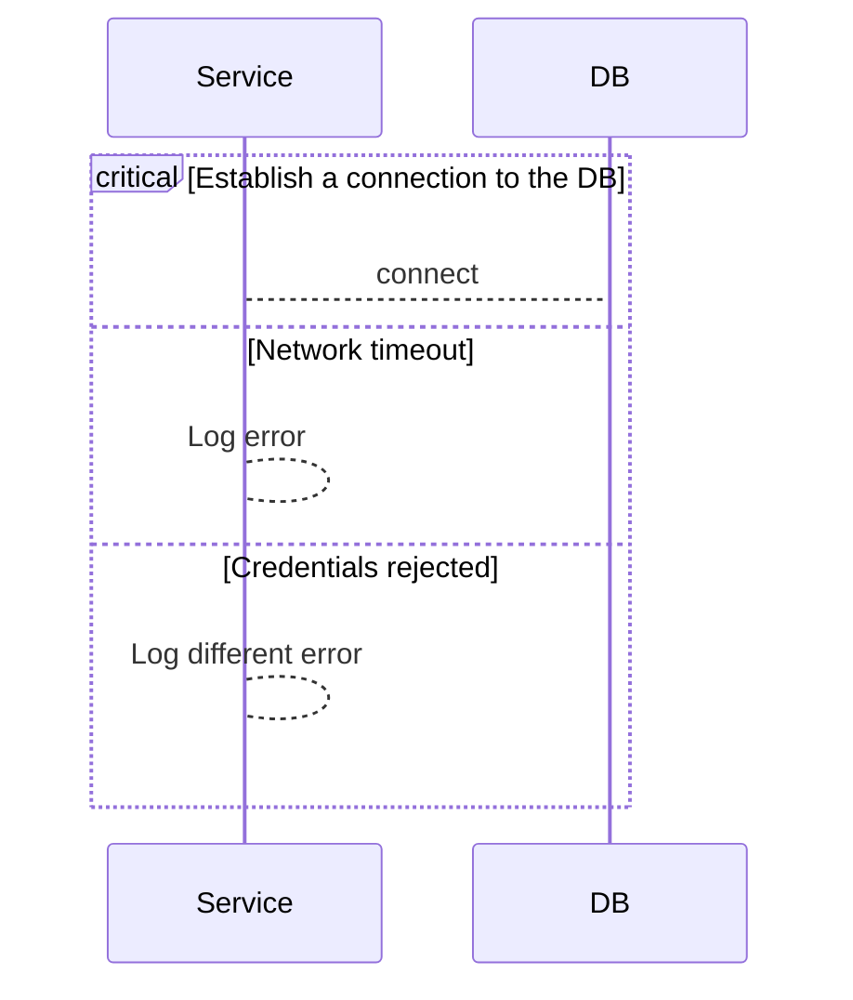
```mermaid
sequenceDiagram
    critical Establish a connection to the DB
        Service-->DB: connect
    option Network timeout
        Service-->Service: Log error
    option Credentials rejected
        Service-->Service: Log different error
    end
```

@tab 代码

```
sequenceDiagram
    critical Establish a connection to the DB
        Service-->DB: connect
    option Network timeout
        Service-->Service: Log error
    option Credentials rejected
        Service-->Service: Log different error
    end
```

:::

**关键点**

- **关键路径（`critical`）**：使用 `critical` 关键字定义关键路径，表示必须成功执行的部分。
- **选项（`option`）**：使用 `option` 关键字定义可能的错误或异常情况，并指定相应的处理逻辑。
- **消息**：在关键路径和选项内部的消息会根据条件执行。
- **结束关键路径**：使用 `end` 关键字结束关键路径。

也有可能根本没有选项

以下是将你提供的文本处理为 `:::tabs` 格式的示例，并解释如何在 Mermaid 序列图中添加关键路径（`critical`）结构：

:::tabs

@tab 关键路径

```mermaid
sequenceDiagram
    critical Establish a connection to the DB
        Service-->DB: connect
    end
```

@tab 代码

```
sequenceDiagram
    critical Establish a connection to the DB
        Service-->DB: connect
    end
```

:::

**关键点：**

- **关键路径（`critical`）**：使用 `critical` 关键字定义关键路径，表示必须成功执行的部分。
- **消息**：在关键路径内部的消息会按顺序执行。
- **结束关键路径**：使用 `end` 关键字结束关键路径。

这个关键块也可以嵌套，相当于上面看到的 `par` 语句。

## 中断

可以指示流内序列的停止（通常用于对异常进行建模）。这是通过符号完成的

```
break [something happened]
... statements ...
end
```

序列图中添加中断（`break`）结构：

:::tabs

@tab 中断

```mermaid
sequenceDiagram
    Consumer-->API: Book something
    API-->BookingService: Start booking process
    break when the booking process fails
        API-->Consumer: show failure
    end
    API-->BillingService: Start billing process
```

@tab 代码

```
sequenceDiagram
    Consumer-->API: Book something
    API-->BookingService: Start booking process
    break when the booking process fails
        API-->Consumer: show failure
    end
    API-->BillingService: Start billing process
```

:::

**关键点**  

- **中断（`break`）**：使用 `break` 关键字定义中断条件，表示在特定情况下执行额外逻辑。  
- **消息**：在中断内部的消息会在条件满足时执行。  
- **结束中断**：使用 `end` 关键字结束中断。  
- **流程继续**：中断结束后，流程会继续执行后续消息。

## 背景高亮

可以通过提供彩色背景矩形来高亮流。这是通过符号完成的

```
rect COLOR
... content ...
end
```

颜色是使用 rgb 和 rgba 语法定义的。


```
rect rgb(0, 255, 0)
... content ...
end
```


```
rect rgba(0, 0, 255, .1)
... content ...
end
```


以下是将你提供的文本处理为 `:::tabs` 格式的示例，并解释如何在 Mermaid 序列图中添加矩形背景色（`rect`）和注释（`note`）：

:::tabs

@tab 带背景色的流程

```mermaid
sequenceDiagram
    participant Alice
    participant John

    rect rgb(191, 223, 255)
    note right of Alice: Alice calls John.
    Alice->>+John: Hello John, how are you?
    rect rgb(200, 150, 255)
    Alice->>+John: John, can you hear me?
    John-->>-Alice: Hi Alice, I can hear you!
    end
    John-->>-Alice: I feel great!
    end
    Alice ->>+ John: Did you want to go to the game tonight?
    John -->>- Alice: Yeah! See you there.
```

@tab 代码

```
sequenceDiagram
    participant Alice
    participant John

    rect rgb(191, 223, 255)
    note right of Alice: Alice calls John.
    Alice->>+John: Hello John, how are you?
    rect rgb(200, 150, 255)
    Alice->>+John: John, can you hear me?
    John-->>-Alice: Hi Alice, I can hear you!
    end
    John-->>-Alice: I feel great!
    end
    Alice ->>+ John: Did you want to go to the game tonight?
    John -->>- Alice: Yeah! See you there.
```

:::

**关键点**  
- **矩形背景色（`rect`）**：使用 `rect` 关键字定义矩形区域，并通过 `rgb` 指定背景色。  
- **注释（`note`）**：使用 `note` 关键字在参与者右侧或左侧添加注释。  
- **消息**：使用 `->>` 和 `-->>` 表示同步和异步消息，`+` 和 `-` 表示激活和结束激活。  
- **嵌套矩形**：矩形区域可以嵌套，形成分层的背景色效果。

## sequenceNumbers

可以在时序图中的每个箭头上附加一个序列号。可以在向网站添加 Mermaid 时进行配置，如下所示：

```html
<script>
  mermaid.initialize({ sequence: { showSequenceNumbers: true } });
</script>
```

也可以通过图表代码打开它，

Mermaid 序列图中使用自动编号（`autonumber`）、循环（`loop`）和注释（`note`）：

:::tabs

@tab 自动编号与循环

```mermaid
sequenceDiagram
    autonumber
    Alice->>John: Hello John, how are you?
    loop HealthCheck
        John->>John: Fight against hypochondria
    end
    Note right of John: Rational thoughts!
    John-->>Alice: Great!
    John->>Bob: How about you?
    Bob-->>John: Jolly good!
```

@tab 代码

```
sequenceDiagram
    autonumber
    Alice->>John: Hello John, how are you?
    loop HealthCheck
        John->>John: Fight against hypochondria
    end
    Note right of John: Rational thoughts!
    John-->>Alice: Great!
    John->>Bob: How about you?
    Bob-->>John: Jolly good!
```

:::

**关键点**  
- **自动编号（`autonumber`）**：使用 `autonumber` 自动为消息添加编号，方便跟踪流程顺序。  
- **循环（`loop`）**：使用 `loop` 关键字定义循环结构，表示重复执行的消息。  
- **注释（`note`）**：使用 `note` 关键字在参与者右侧或左侧添加注释。  
- **消息**：使用 `->>` 和 `-->>` 表示同步和异步消息。  
- **多参与者交互**：展示多个参与者之间的消息交互。

## 角色菜单

参与者可以拥有包含指向外部页面的个性化链接的弹出菜单。例如，如果参与者代表 Web 服务，则有用的链接可能包括指向服务运行状况仪表板的链接、包含服务代码的存储库或描述服务的 wiki 页面。

这可以通过添加一条或多条链接线来配置，格式如下：

```
link <actor>: <link-label> @ <link-url>
```

以下是将你提供的文本处理为 `:::tabs` 格式的示例，并解释如何在 Mermaid 序列图中添加参与者链接（`link`）：

:::tabs

@tab 带参与者链接的流程

```mermaid
sequenceDiagram
    participant Alice
    participant John
    link Alice: Dashboard @ https://dashboard.contoso.com/alice
    link Alice: Wiki @ https://wiki.contoso.com/alice
    link John: Dashboard @ https://dashboard.contoso.com/john
    link John: Wiki @ https://wiki.contoso.com/john
    Alice->>John: Hello John, how are you?
    John-->>Alice: Great!
    Alice-)John: See you later!
```

@tab 代码

```
sequenceDiagram
    participant Alice
    participant John
    link Alice: Dashboard @ https://dashboard.contoso.com/alice
    link Alice: Wiki @ https://wiki.contoso.com/alice
    link John: Dashboard @ https://dashboard.contoso.com/john
    link John: Wiki @ https://wiki.contoso.com/john
    Alice->>John: Hello John, how are you?
    John-->>Alice: Great!
    Alice-)John: See you later!
```

:::

**关键点**  
- **参与者链接（`link`）**：使用 `link` 关键字为参与者添加链接，格式为 `link 参与者: 标签 @ URL`。  
- **消息**：使用 `->>` 和 `-->>` 表示同步和异步消息，`-)` 表示异步消息的结束。  
- **参与者定义**：使用 `participant` 关键字定义参与者。  
- **交互流程**：展示参与者之间的消息交互，并通过链接提供更多信息。

## 高级菜单语法

有一种依赖于 JSON 格式的高级语法。如果你对 JSON 格式感到满意，那么这也存在。

可以通过添加以下格式的链接行来配置：

```
links <actor>: <json-formatted link-name link-url pairs>
```

以下是将你提供的文本处理为 `:::tabs` 格式的示例，并解释如何在 Mermaid 序列图中使用 JSON 格式的参与者链接（`links`）：

:::tabs

@tab 带 JSON 链接的流程

```mermaid
sequenceDiagram
    participant Alice
    participant John
    links Alice: {"Dashboard": "https://dashboard.contoso.com/alice", "Wiki": "https://wiki.contoso.com/alice"}
    links John: {"Dashboard": "https://dashboard.contoso.com/john", "Wiki": "https://wiki.contoso.com/john"}
    Alice->>John: Hello John, how are you?
    John-->>Alice: Great!
    Alice-)John: See you later!
```

@tab 代码

```
sequenceDiagram
    participant Alice
    participant John
    links Alice: {"Dashboard": "https://dashboard.contoso.com/alice", "Wiki": "https://wiki.contoso.com/alice"}
    links John: {"Dashboard": "https://dashboard.contoso.com/john", "Wiki": "https://wiki.contoso.com/john"}
    Alice->>John: Hello John, how are you?
    John-->>Alice: Great!
    Alice-)John: See you later!
```

:::

**关键点**  
- **JSON 格式链接（`links`）**：使用 `links` 关键字为参与者添加多个链接，格式为 JSON 对象，键为标签，值为 URL。  
- **消息**：使用 `->>` 和 `-->>` 表示同步和异步消息，`-)` 表示异步消息的结束。  
- **参与者定义**：使用 `participant` 关键字定义参与者。  
- **交互流程**：展示参与者之间的消息交互，并通过 JSON 链接提供更多信息。

## 样式

时序图的样式是通过定义许多 CSS 类来完成的。在渲染期间，从位于 src/themes/sequence.scss 的文件中提取这些类

**使用的类**:

| 类             | 描述                          |
| :------------- | :---------------------------- |
| 角色           | 角色框的样式。                |
| actor-top      | 图表顶部的角色人物/框的样式。 |
| actor-bottom   | 图表底部的角色人物/框的样式。 |
| text.actor     | 所有角色的文本样式。          |
| text.actor-box | 角色框的文本样式。            |
| text.actor-man | 角色人物的文本样式。          |
| 角色线         | 角色的垂直线。                |
| messageLine0   | 实心消息行的样式。            |
| messageLine1   | 虚线消息行的样式。            |
| messageText    | 定义消息箭头上的文本样式。    |
| labelBox       | 定义循环左侧的样式标签。      |
| labelText      | 循环标签中文本的样式。        |
| loopText       | 循环框中文本的样式。          |
| loopLine       | 定义循环框中线条的样式。      |
| note           | 注释框的样式。                |
| noteText       | 注释框中文本的样式。          |

样式表示例:

```css
body {
  background: white;
}

.actor {
  stroke: #ccccff;
  fill: #ececff;
}
text.actor {
  fill: black;
  stroke: none;
  font-family: Helvetica;
}

.actor-line {
  stroke: grey;
}

.messageLine0 {
  stroke-width: 1.5;
  stroke-dasharray: '2 2';
  marker-end: 'url(#arrowhead)';
  stroke: black;
}

.messageLine1 {
  stroke-width: 1.5;
  stroke-dasharray: '2 2';
  stroke: black;
}

#arrowhead {
  fill: black;
}

.messageText {
  fill: black;
  stroke: none;
  font-family: 'trebuchet ms', verdana, arial;
  font-size: 14px;
}

.labelBox {
  stroke: #ccccff;
  fill: #ececff;
}

.labelText {
  fill: black;
  stroke: none;
  font-family: 'trebuchet ms', verdana, arial;
}

.loopText {
  fill: black;
  stroke: none;
  font-family: 'trebuchet ms', verdana, arial;
}

.loopLine {
  stroke-width: 2;
  stroke-dasharray: '2 2';
  marker-end: 'url(#arrowhead)';
  stroke: #ccccff;
}

.note {
  stroke: #decc93;
  fill: #fff5ad;
}

.noteText {
  fill: black;
  stroke: none;
  font-family: 'trebuchet ms', verdana, arial;
  font-size: 14px;
}
```

## 配置

可以调整渲染时序图的边距。

这是通过定义 `mermaid.sequenceConfig` 或通过 CLI 使用带有配置的 json 文件来完成的。[mermaidCLI](https://mermaid.nodejs.cn/config/mermaidCLI.html) 页描述了如何使用 CLI。`mermaid.sequenceConfig` 可以设置为带有配置参数的 JSON 字符串或相应的对象。

```javascript
mermaid.sequenceConfig = {
  diagramMarginX: 50,
  diagramMarginY: 10,
  boxTextMargin: 5,
  noteMargin: 10,
  messageMargin: 35,
  mirrorActors: true,
};
```

可能的配置参数：

| 参数              | 描述                                                         | 默认值                      |
| :---------------- | :----------------------------------------------------------- | :-------------------------- |
| mirrorActors      | 打开/关闭图表下方和上方参与者的渲染                          | false                       |
| 底部边距调整      | 调整图表结束的距离。使用 css 的宽边框样式可能会产生不需要的剪裁，这就是此配置参数存在的原因。 | 1                           |
| 角色字体大小      | 设置角色描述的字体大小                                       | 14                          |
| 角色字体家族      | 设置角色描述的字体系列                                       | "打开无字体"，无衬线字体    |
| 角色字体粗细      | 设置角色描述的字体粗细                                       | "打开无字体"，无衬线字体    |
| noteFontSize      | 设置角色附加注释的字体大小                                   | 14                          |
| noteFontFamily    | 设置角色附加注释的字体系列                                   | "投石机女士"、verdana、宋体 |
| noteFontWeight    | 设置角色附加注释的字体粗细                                   | "投石机女士"、verdana、宋体 |
| noteAlign         | 设置角色附加注释中文本的文本对齐方式                         | center                      |
| messageFontSize   | 设置角色<->角色消息的字体大小                                | 16                          |
| messageFontFamily | 设置 actor<->actor 消息的字体系列                            | "投石机女士"、verdana、宋体 |
| messageFontWeight | 设置角色<->角色消息的字体粗细                                | "投石机女士"、verdana、宋体 |
