> 时间线：这是目前的实验图。语法和属性可能会在未来版本中更改。除了图标集成是实验部分之外，语法是稳定的。

“时间线是一种图表，用于说明事件、日期或时间段的年表。它通常以图形方式渲染以指示时间的流逝，并且通常按时间顺序组织。基本时间线按时间顺序渲染事件列表，通常使用日期作为标记。时间线还可以用来展示事件之间的关系，比如一个人一生中的事件之间的关系”.

时间线的示例

Mermaid 时间线图中定义标题和事件：

:::tabs

@tab 时间线图示例

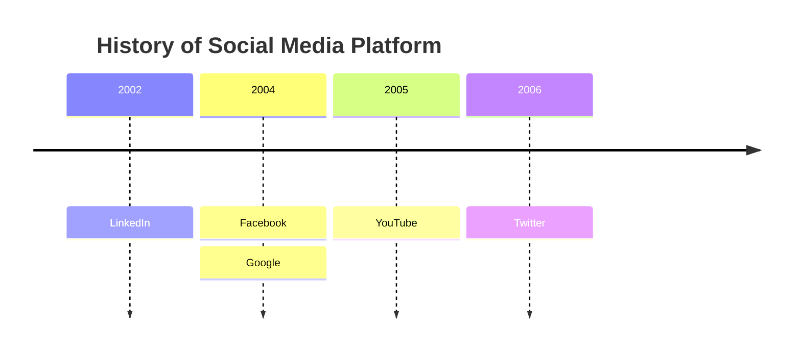

@tab 代码

```
timeline
    title History of Social Media Platform
    2002 : LinkedIn
    2004 : Facebook
         : Google
    2005 : YouTube
    2006 : Twitter
```

:::

**关键点**  
- **标题**：使用 `title` 为时间线图添加标题。  
- **事件**：使用 `年份 : 事件` 定义时间线中的事件。  
- **多事件**：同一年份的多个事件可以换行定义，省略年份即可。  

:::details 实例说明  
- **标题**：`History of Social Media Platform`，表示时间线图的主题。  
- **事件**：  
  - `2002`：`LinkedIn` 成立。  
  - `2004`：`Facebook` 和 `Google` 成立。  
  - `2005`：`YouTube` 成立。  
  - `2006`：`Twitter` 成立。  
  :::

## 语法

创建时间线图的语法很简单。你始终以 `timeline` 关键字开头，让 mermaid 知道你想要创建时间线图。

之后，可以向时间线添加标题。这是通过添加一行带有关键字 `title` 后跟标题文本来完成的。

然后添加时间线数据，其中始终以时间段开头，后跟冒号，然后是事件的文本。你可以选择添加第二个冒号，然后添加事件的文本。因此，你可以在每个时间段内拥有一个或多个事件。

```json
{time period} : {event}
```

or

```json
{time period} : {event} : {event}
```

or

```json
{time period} : {event}
              : {event}
              : {event}
```

:::warning

时间段和事件都是简单的文本，不限于数字。

:::

Mermaid 时间线图中定义标题和事件：

:::tabs

@tab 时间线图示例


@tab 代码

```
timeline
    title History of Social Media Platform
    2002 : LinkedIn
    2004 : Facebook : Google
    2005 : YouTube
    2006 : Twitter
```

:::

> 这样我们就可以利用文本大纲来生成时间线图。时间段和事件的顺序很重要，因为它将用于绘制时间线。第一个时间段将放置在时间线的左侧，最后一个时间段将放置在时间线的右侧。
>
> 同样，该特定时间段的第一个事件将放置在顶部，最后一个事件将放置在底部。


## 分组

你可以按部分/年龄对时间段进行分组。这是通过添加一行包含关键字 `section` 和后跟部分名称来完成的。

所有后续时间段都将放置在此部分中，直到定义新部分。

如果未定义任何部分，则所有时间段都将放置在默认部分中。

让我们看一个示例，其中我们将时间段分组。

Mermaid 时间线图中定义标题、分段和事件：

:::tabs

@tab 时间线图示例

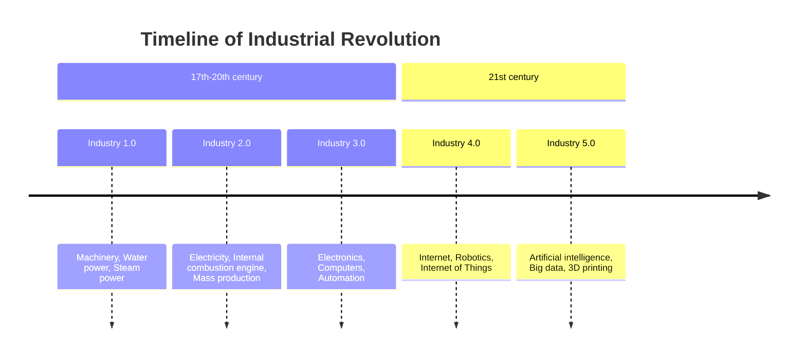

@tab 代码

```
timeline
    title Timeline of Industrial Revolution
    section 17th-20th century
        Industry 1.0 : Machinery, Water power, Steam <br>power
        Industry 2.0 : Electricity, Internal combustion engine, Mass production
        Industry 3.0 : Electronics, Computers, Automation
    section 21st century
        Industry 4.0 : Internet, Robotics, Internet of Things
        Industry 5.0 : Artificial intelligence, Big data, 3D printing
```

:::

**关键点**  
- **标题**：使用 `title` 为时间线图添加标题。  
- **分段**：使用 `section` 定义时间线的分段。  
- **事件**：使用 `事件名 : 描述` 定义事件，支持换行（`<br>`）。  

:::details 实例说明  
- **标题**：`Timeline of Industrial Revolution`，表示时间线图的主题。  
- **分段**：  
  - `17th-20th century`：17 世纪到 20 世纪的工业革命。  
  - `21st century`：21 世纪的工业革命。  
- **事件**：  
  - `Industry 1.0`：`Machinery, Water power, Steam power`。  
  - `Industry 2.0`：`Electricity, Internal combustion engine, Mass production`。  
  - `Industry 3.0`：`Electronics, Computers, Automation`。  
  - `Industry 4.0`：`Internet, Robotics, Internet of Things`。  
  - `Industry 5.0`：`Artificial intelligence, Big data, 3D printing`。  
  :::

给定部分下的所有时间段和事件都遵循类似的配色方案。这样做是为了更容易看到时间段和事件之间的关系。

## 长文本

> 默认情况下，如果时间段和事件的文本太长，则会换行。这样做是为了避免文本绘制在图表之外。

你还可以使用 `<br>` 强制换行。

让我们看另一个例子，其中我们有很长的时间段和很长的事件。

Mermaid 时间线图中定义标题、分段和事件：

:::tabs

@tab 时间线图示例

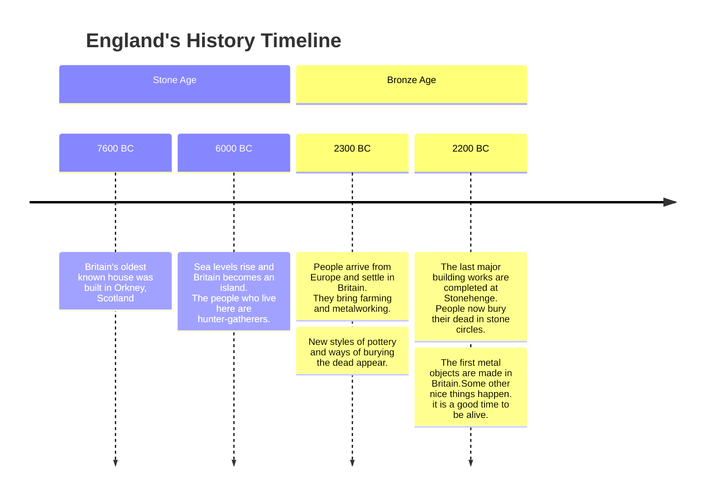

@tab 代码

```
timeline
    title England's History Timeline
    section Stone Age
      7600 BC : Britain's oldest known house was built in Orkney, Scotland
      6000 BC : Sea levels rise and Britain becomes an island.<br> The people who live here are hunter-gatherers.
    section Bronze Age
      2300 BC : People arrive from Europe and settle in Britain. <br>They bring farming and metalworking.
              : New styles of pottery and ways of burying the dead appear.
      2200 BC : The last major building works are completed at Stonehenge.<br> People now bury their dead in stone circles.
              : The first metal objects are made in Britain.Some other nice things happen. it is a good time to be alive.
```

:::

**关键点**  
- **标题**：使用 `title` 为时间线图添加标题。  
- **分段**：使用 `section` 定义时间线的分段。  
- **事件**：使用 `年份 : 描述` 定义事件，支持换行（`<br>`）。  
- **多事件**：同一年份的多个事件可以换行定义，省略年份即可。  

:::details 实例说明  
- **标题**：`England's History Timeline`，表示时间线图的主题。  
- **分段**：  
  - `Stone Age`：石器时代。  
  - `Bronze Age`：青铜时代。  
- **事件**：  
  - **Stone Age**：  
    - `7600 BC`：`Britain's oldest known house was built in Orkney, Scotland`。  
    - `6000 BC`：`Sea levels rise and Britain becomes an island. The people who live here are hunter-gatherers`。  
  - **Bronze Age**：  
    - `2300 BC`：`People arrive from Europe and settle in Britain. They bring farming and metalworking`。  
    - 同一年份：`New styles of pottery and ways of burying the dead appear`。  
    - `2200 BC`：`The last major building works are completed at Stonehenge. People now bury their dead in stone circles`。  
    - 同一年份：`The first metal objects are made in Britain. Some other nice things happen. It is a good time to be alive`。  
    :::


Mermaid 时间线图中定义标题、分段和事件：

:::tabs

@tab 时间线图示例

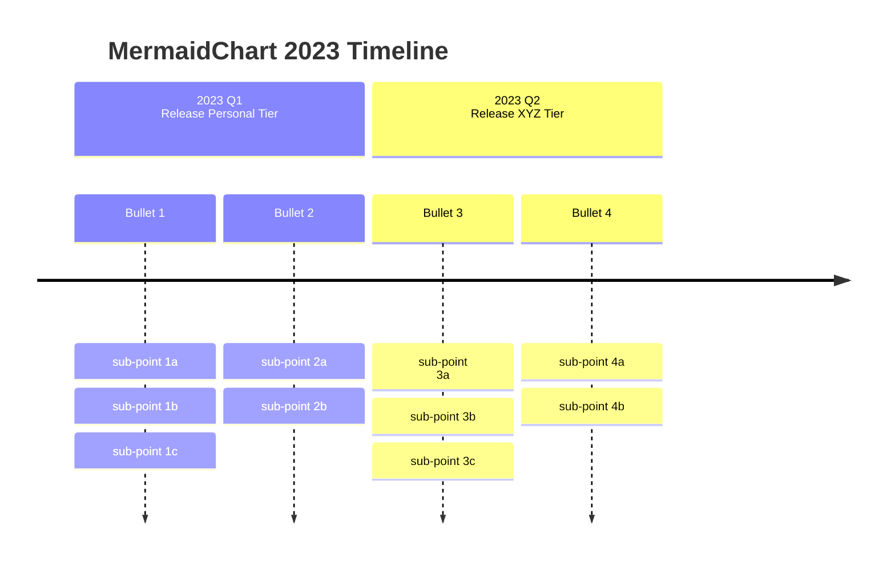

@tab 代码

```
timeline
    title MermaidChart 2023 Timeline
    section 2023 Q1 <br> Release Personal Tier
      Bullet 1 : sub-point 1a : sub-point 1b
           : sub-point 1c
      Bullet 2 : sub-point 2a : sub-point 2b
    section 2023 Q2 <br> Release XYZ Tier
      Bullet 3 : sub-point <br> 3a : sub-point 3b
           : sub-point 3c
      Bullet 4 : sub-point 4a : sub-point 4b
```

:::

**关键点**  
- **标题**：使用 `title` 为时间线图添加标题。  
- **分段**：使用 `section` 定义时间线的分段，支持换行（`<br>`）。  
- **事件**：使用 `事件名 : 子事件` 定义事件，支持多级子事件和换行（`<br>`）。  
- **多子事件**：同一事件的多个子事件可以换行定义，省略事件名即可。  

:::details 实例说明  
- **标题**：`MermaidChart 2023 Timeline`，表示时间线图的主题。  
- **分段**：  
  - `2023 Q1 <br> Release Personal Tier`：2023 年第一季度，发布 Personal Tier。  
  - `2023 Q2 <br> Release XYZ Tier`：2023 年第二季度，发布 XYZ Tier。  
- **事件**：  
  - **2023 Q1**：  
    - `Bullet 1`：`sub-point 1a : sub-point 1b`。  
    - 同事件：`sub-point 1c`。  
    - `Bullet 2`：`sub-point 2a : sub-point 2b`。  
  - **2023 Q2**：  
    - `Bullet 3`：`sub-point <br> 3a : sub-point 3b`。  
    - 同事件：`sub-point 3c`。  
    - `Bullet 4`：`sub-point 4a : sub-point 4b`。  
    :::


## 样式

时间和事件的样式。

如前所述，每个部分都有一个配色方案，并且该部分下的每个时间段和事件都遵循相似的配色方案。但是，如果没有定义部分，那么我们有两种可能性：

### 1.单独样式

单独设置时间段的样式，即每个时间段（及其相应的事件）都有自己的配色方案。这是默认行为。

Mermaid 时间线图中定义标题和事件：

:::tabs

@tab 时间线图示例


@tab 代码

```
timeline
    title History of Social Media Platform
    2002 : LinkedIn
    2004 : Facebook : Google
    2005 : YouTube
    2006 : Twitter
```

:::

**关键点**  
- **标题**：使用 `title` 为时间线图添加标题。  
- **事件**：使用 `年份 : 事件` 定义时间线中的事件。  
- **多事件**：同一年份的多个事件可以在同一行用 `:` 分隔定义。  

:::details 实例说明  
- **标题**：`History of Social Media Platform`，表示时间线图的主题。  
- **事件**：  
  - `2002`：`LinkedIn` 成立。  
  - `2004`：`Facebook` 和 `Google` 成立。  
  - `2005`：`YouTube` 成立。  
  - `2006`：`Twitter` 成立。  
  :::


::: warning

注意：没有定义任何部分，每个时间段及其相应的事件都有自己的配色方案。

:::

### 2.统一样式

使用 `disableMultiColor` 选项禁用多色选项。这将使所有时间段和事件遵循相同的配色方案。

你需要通过 mermaid.initialize 函数或指令添加此选项。


```javascript
mermaid.initialize({
        theme: 'base',
        startOnLoad: true,
        logLevel: 0,
        timeline: {
          disableMulticolor: false,
        },
        ...
        ...
```

让我们看一下同一个示例，其中我们禁用了多色选项。

Mermaid 时间线图中定义标题、事件和自定义配置：

:::tabs

@tab 时间线图示例

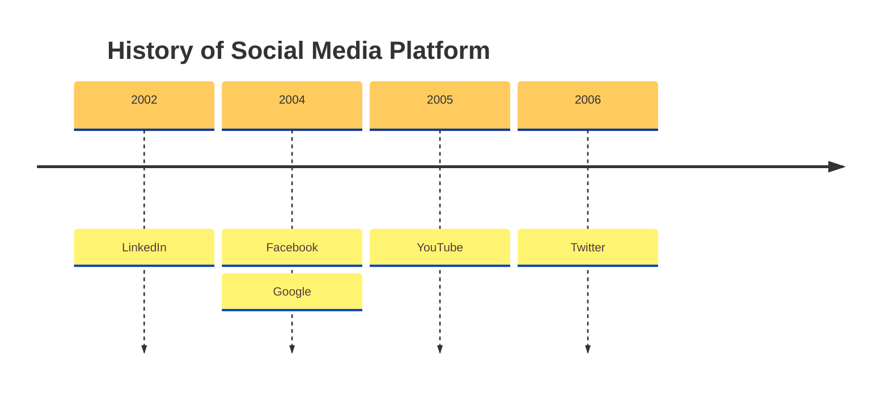

@tab 代码

```
%%{init: { 'logLevel': 'debug', 'theme': 'base', 'timeline': {'disableMulticolor': true}}}%%
timeline
    title History of Social Media Platform
    2002 : LinkedIn
    2004 : Facebook : Google
    2005 : YouTube
    2006 : Twitter
```

:::

**关键点**  
- **初始化配置**：  
  - 使用 `%%{init: { ... }}%%` 自定义时间线图配置。  
  - `logLevel`：设置日志级别为 `debug`。  
  - `theme`：设置主题为 `base`。  
  - `timeline`：禁用多色显示（`disableMulticolor: true`）。  
- **标题**：使用 `title` 为时间线图添加标题。  
- **事件**：使用 `年份 : 事件` 定义时间线中的事件。  
- **多事件**：同一年份的多个事件可以在同一行用 `:` 分隔定义。  

:::details 实例说明  
- **标题**：`History of Social Media Platform`，表示时间线图的主题。  
- **事件**：  
  - `2002`：`LinkedIn` 成立。  
  - `2004`：`Facebook` 和 `Google` 成立。  
  - `2005`：`YouTube` 成立。  
  - `2006`：`Twitter` 成立。  
- **自定义配置**：  
  - 日志级别为 `debug`，便于调试。  
  - 主题为 `base`，使用基础样式。  
  - 禁用多色显示，所有事件使用单一颜色。  
  :::


### 3.自定义配色方案

你可以使用 `cScale0` 到 `cScale11` 主题变量自定义配色方案，这将更改背景颜色。Mermaid 允许你为最多 12 个部分设置独特的颜色，其中 `cScale0` 变量将驱动第一个部分或时间段的值，`cScale1` 将驱动第二个部分的值，依此类推。如果你的部分超过 12 个，配色方案将开始重复。

如果你还想更改某个部分的前景色，可以使用与 `cScaleLabel0` 到 `cScaleLabel11` 变量相对应的主题变量。

::: warning

这些主题变量的默认值是从选定的主题中选取的。如果你想覆盖默认值，可以使用 `initialize` 调用来添加自定义主题变量值。

:::

示例：

现在让我们覆盖 `cScale0` 到 `cScale2` 变量的默认值：

Mermaid 时间线图中定义标题、事件和自定义配置：

:::tabs

@tab 时间线图示例

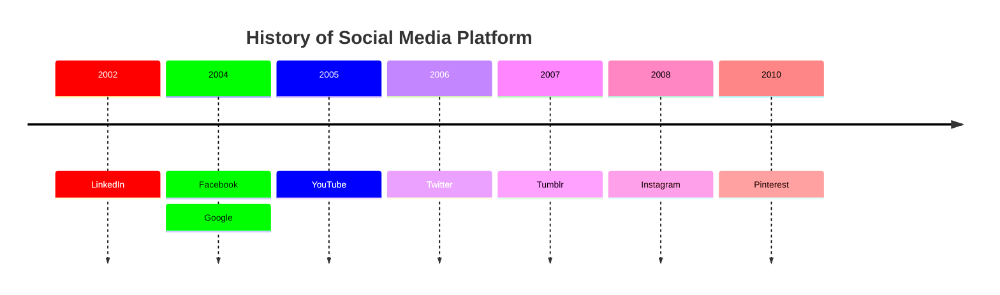

@tab 代码

```
%%{init: { 'logLevel': 'debug', 'theme': 'default' , 'themeVariables': {
              'cScale0': '#ff0000', 'cScaleLabel0': '#ffffff',
              'cScale1': '#00ff00',
              'cScale2': '#0000ff', 'cScaleLabel2': '#ffffff'
       } } }%%
timeline
    title History of Social Media Platform
    2002 : LinkedIn
    2004 : Facebook : Google
    2005 : YouTube
    2006 : Twitter
    2007 : Tumblr
    2008 : Instagram
    2010 : Pinterest
```

:::

**关键点**  
- **初始化配置**：  
  - 使用 `%%{init: { ... }}%%` 自定义时间线图配置。  
  - `logLevel`：设置日志级别为 `debug`，便于调试。  
  - `theme`：设置主题为 `default`。  
  - `themeVariables`：自定义颜色变量：  
    - `cScale0`：红色（`#ff0000`），标签颜色为白色（`#ffffff`）。  
    - `cScale1`：绿色（`#00ff00`）。  
    - `cScale2`：蓝色（`#0000ff`），标签颜色为白色（`#ffffff`）。  
- **标题**：使用 `title` 为时间线图添加标题。  
- **事件**：使用 `年份 : 事件` 定义时间线中的事件。  
- **多事件**：同一年份的多个事件可以在同一行用 `:` 分隔定义。  

:::details 实例说明  
- **标题**：`History of Social Media Platform`，表示时间线图的主题。  
- **事件**：  
  - `2002`：`LinkedIn` 成立。  
  - `2004`：`Facebook` 和 `Google` 成立。  
  - `2005`：`YouTube` 成立。  
  - `2006`：`Twitter` 成立。  
  - `2007`：`Tumblr` 成立。  
  - `2008`：`Instagram` 成立。  
  - `2010`：`Pinterest` 成立。  
- **自定义配置**：  
  - 日志级别为 `debug`，便于调试。  
  - 主题为 `default`，使用默认样式。  
  - 自定义颜色变量：  
    - 第一组事件使用红色背景和白色标签。  
    - 第二组事件使用绿色背景。  
    - 第三组事件使用蓝色背景和白色标签。  
    :::


查看颜色如何更改为主题变量中指定的值。

## 主题

Mermaid 支持一系列预定义的主题，你可以使用它们来找到适合你的主题。附：你实际上可以覆盖现有主题的变量来运行你自己的自定义主题。

以下是不同的预定义主题选项：

- `base`
- `forest`
- `dark`
- `default`
- `neutral`

注意：要更改主题，你可以使用 `initialize` 调用或指令。

### 基础主题

Mermaid 时间线图中定义标题、事件和自定义配置：

:::tabs

@tab 时间线图示例

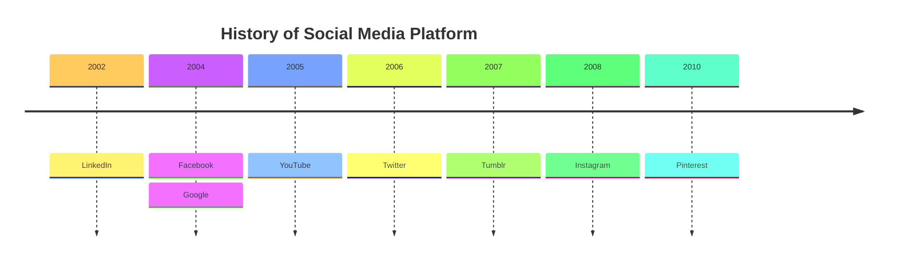

@tab 代码

```
%%{init: { 'logLevel': 'debug', 'theme': 'base' } }%%
timeline
    title History of Social Media Platform
    2002 : LinkedIn
    2004 : Facebook : Google
    2005 : YouTube
    2006 : Twitter
    2007 : Tumblr
    2008 : Instagram
    2010 : Pinterest
```

:::

**关键点**  
- **初始化配置**：  
  - 使用 `%%{init: { ... }}%%` 自定义时间线图配置。  
  - `logLevel`：设置日志级别为 `debug`，便于调试。  
  - `theme`：设置主题为 `base`，使用基础样式。  
- **标题**：使用 `title` 为时间线图添加标题。  
- **事件**：使用 `年份 : 事件` 定义时间线中的事件。  
- **多事件**：同一年份的多个事件可以在同一行用 `:` 分隔定义。  

:::details 实例说明  
- **标题**：`History of Social Media Platform`，表示时间线图的主题。  
- **事件**：  
  - `2002`：`LinkedIn` 成立。  
  - `2004`：`Facebook` 和 `Google` 成立。  
  - `2005`：`YouTube` 成立。  
  - `2006`：`Twitter` 成立。  
  - `2007`：`Tumblr` 成立。  
  - `2008`：`Instagram` 成立。  
  - `2010`：`Pinterest` 成立。  
- **自定义配置**：  
  - 日志级别为 `debug`，便于调试。  
  - 主题为 `base`，使用基础样式。  
  :::


### 森林主题

Mermaid 时间线图中定义标题、事件和自定义配置：

:::tabs

@tab 时间线图示例

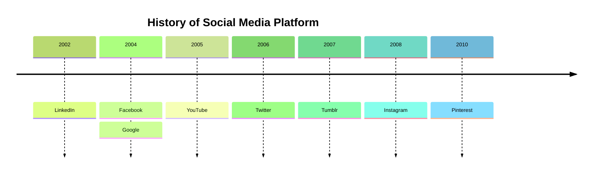

@tab 代码

```
%%{init: { 'logLevel': 'debug', 'theme': 'forest' } }%%
timeline
    title History of Social Media Platform
    2002 : LinkedIn
    2004 : Facebook : Google
    2005 : YouTube
    2006 : Twitter
    2007 : Tumblr
    2008 : Instagram
    2010 : Pinterest
```

:::

**关键点**  
- **初始化配置**：  
  - 使用 `%%{init: { ... }}%%` 自定义时间线图配置。  
  - `logLevel`：设置日志级别为 `debug`，便于调试。  
  - `theme`：设置主题为 `forest`，使用森林主题样式。  
- **标题**：使用 `title` 为时间线图添加标题。  
- **事件**：使用 `年份 : 事件` 定义时间线中的事件。  
- **多事件**：同一年份的多个事件可以在同一行用 `:` 分隔定义。  

:::details 实例说明  
- **标题**：`History of Social Media Platform`，表示时间线图的主题。  
- **事件**：  
  - `2002`：`LinkedIn` 成立。  
  - `2004`：`Facebook` 和 `Google` 成立。  
  - `2005`：`YouTube` 成立。  
  - `2006`：`Twitter` 成立。  
  - `2007`：`Tumblr` 成立。  
  - `2008`：`Instagram` 成立。  
  - `2010`：`Pinterest` 成立。  
- **自定义配置**：  
  - 日志级别为 `debug`，便于调试。  
  - 主题为 `forest`，使用森林主题样式。  
  :::


### 黑暗主题

Mermaid 时间线图中定义标题、事件和自定义配置：

:::tabs

@tab 时间线图示例

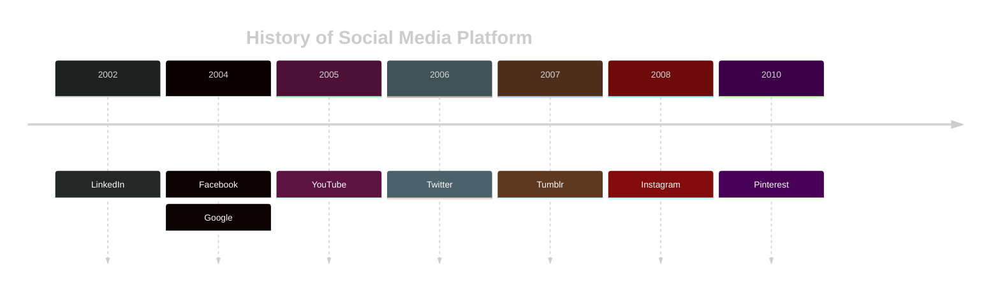

@tab 代码

```
%%{init: { 'logLevel': 'debug', 'theme': 'dark' } }%%
timeline
    title History of Social Media Platform
    2002 : LinkedIn
    2004 : Facebook : Google
    2005 : YouTube
    2006 : Twitter
    2007 : Tumblr
    2008 : Instagram
    2010 : Pinterest
```

:::

**关键点**  
- **初始化配置**：  
  - 使用 `%%{init: { ... }}%%` 自定义时间线图配置。  
  - `logLevel`：设置日志级别为 `debug`，便于调试。  
  - `theme`：设置主题为 `dark`，使用深色主题样式。  
- **标题**：使用 `title` 为时间线图添加标题。  
- **事件**：使用 `年份 : 事件` 定义时间线中的事件。  
- **多事件**：同一年份的多个事件可以在同一行用 `:` 分隔定义。  

:::details 实例说明  
- **标题**：`History of Social Media Platform`，表示时间线图的主题。  
- **事件**：  
  - `2002`：`LinkedIn` 成立。  
  - `2004`：`Facebook` 和 `Google` 成立。  
  - `2005`：`YouTube` 成立。  
  - `2006`：`Twitter` 成立。  
  - `2007`：`Tumblr` 成立。  
  - `2008`：`Instagram` 成立。  
  - `2010`：`Pinterest` 成立。  
- **自定义配置**：  
  - 日志级别为 `debug`，便于调试。  
  - 主题为 `dark`，使用深色主题样式。  
  :::


### 默认主题

Mermaid 时间线图中定义标题、事件和自定义配置：

:::tabs

@tab 时间线图示例

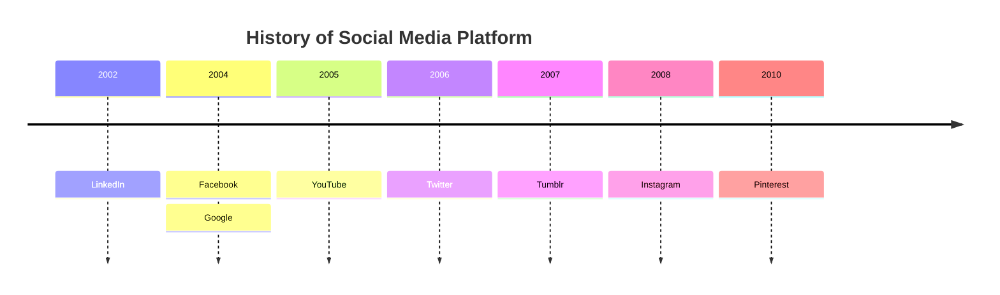

@tab 代码

```
%%{init: { 'logLevel': 'debug', 'theme': 'default' } }%%
timeline
    title History of Social Media Platform
    2002 : LinkedIn
    2004 : Facebook : Google
    2005 : YouTube
    2006 : Twitter
    2007 : Tumblr
    2008 : Instagram
    2010 : Pinterest
```

:::

**关键点**  
- **初始化配置**：  
  - 使用 `%%{init: { ... }}%%` 自定义时间线图配置。  
  - `logLevel`：设置日志级别为 `debug`，便于调试。  
  - `theme`：设置主题为 `default`，使用默认主题样式。  
- **标题**：使用 `title` 为时间线图添加标题。  
- **事件**：使用 `年份 : 事件` 定义时间线中的事件。  
- **多事件**：同一年份的多个事件可以在同一行用 `:` 分隔定义。  

:::details 实例说明  
- **标题**：`History of Social Media Platform`，表示时间线图的主题。  
- **事件**：  
  - `2002`：`LinkedIn` 成立。  
  - `2004`：`Facebook` 和 `Google` 成立。  
  - `2005`：`YouTube` 成立。  
  - `2006`：`Twitter` 成立。  
  - `2007`：`Tumblr` 成立。  
  - `2008`：`Instagram` 成立。  
  - `2010`：`Pinterest` 成立。  
- **自定义配置**：  
  - 日志级别为 `debug`，便于调试。  
  - 主题为 `default`，使用默认主题样式。  
  :::


### 中性主题

Mermaid 时间线图中定义标题、事件和自定义配置：

:::tabs

@tab 时间线图示例

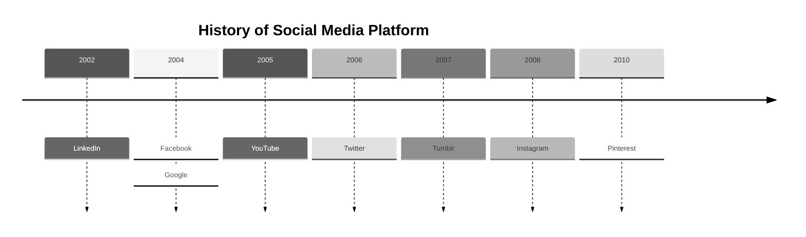

@tab 代码

```
%%{init: { 'logLevel': 'debug', 'theme': 'neutral' } }%%
timeline
    title History of Social Media Platform
    2002 : LinkedIn
    2004 : Facebook : Google
    2005 : YouTube
    2006 : Twitter
    2007 : Tumblr
    2008 : Instagram
    2010 : Pinterest
```

:::

**关键点**  
- **初始化配置**：  
  - 使用 `%%{init: { ... }}%%` 自定义时间线图配置。  
  - `logLevel`：设置日志级别为 `debug`，便于调试。  
  - `theme`：设置主题为 `neutral`，使用中性主题样式。  
- **标题**：使用 `title` 为时间线图添加标题。  
- **事件**：使用 `年份 : 事件` 定义时间线中的事件。  
- **多事件**：同一年份的多个事件可以在同一行用 `:` 分隔定义。  

:::details 实例说明  
- **标题**：`History of Social Media Platform`，表示时间线图的主题。  
- **事件**：  
  - `2002`：`LinkedIn` 成立。  
  - `2004`：`Facebook` 和 `Google` 成立。  
  - `2005`：`YouTube` 成立。  
  - `2006`：`Twitter` 成立。  
  - `2007`：`Tumblr` 成立。  
  - `2008`：`Instagram` 成立。  
  - `2010`：`Pinterest` 成立。  
- **自定义配置**：  
  - 日志级别为 `debug`，便于调试。  
  - 主题为 `neutral`，使用中性主题样式。  
  :::


## 库/网站集成

时间轴使用实验性的延迟加载和异步渲染功能，这些功能将来可能会发生变化。延迟加载非常重要，以便能够添加其他图表。

你可以使用此方法将包括时间线图的 Mermaid 添加到网页中：

```html
<script type="module">
  import mermaid from 'https://cdn.jsdelivr.net/npm/mermaid@11/dist/mermaid.esm.min.mjs';
</script>
```
