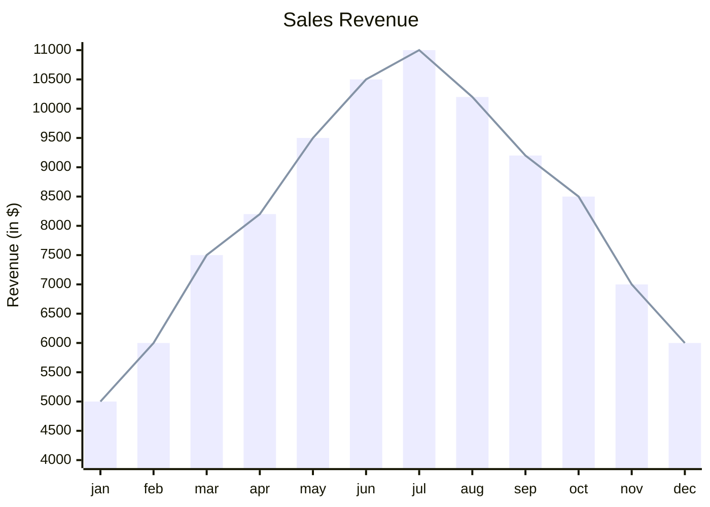
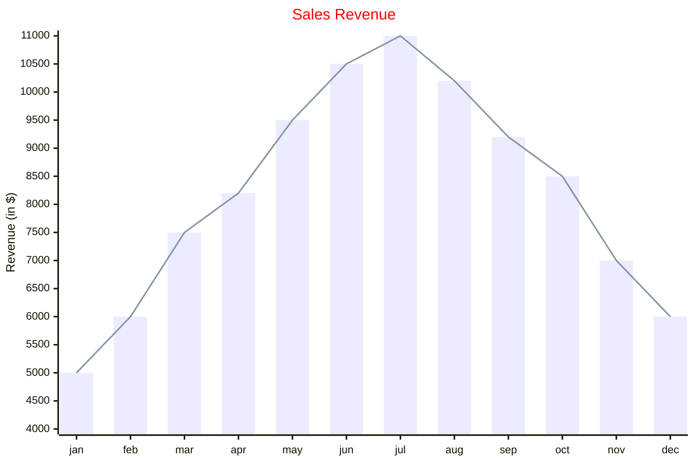

> 在 mermaid-js 的上下文中，XY 图是一个综合图表模块，包含利用 x 轴和 y 轴进行数据表示的各种类型的图表。目前，它包括两种基本图表类型：柱状图和折线图。这些图表旨在直观地显示和分析涉及两个数值变量的数据。

> 值得注意的是，虽然 mermaid-js 当前的实现包含这两种图表类型，但该框架被设计为动态且适应性强的。因此，它具有将来扩展和包含其他图表类型的能力。这意味着用户可以在 XY 图模块中期待一套不断发展的图表选项，以满足随着时间的推移引入新图表类型的各种数据可视化需求。

Mermaid 的 `xychart-beta` 中定义标题、轴、柱状图和折线图：

:::tabs

@tab 图表示例



@tab 代码

```
xychart-beta
    title "Sales Revenue"
    x-axis [jan, feb, mar, apr, may, jun, jul, aug, sep, oct, nov, dec]
    y-axis "Revenue (in $)" 4000 --> 11000
    bar [5000, 6000, 7500, 8200, 9500, 10500, 11000, 10200, 9200, 8500, 7000, 6000]
    line [5000, 6000, 7500, 8200, 9500, 10500, 11000, 10200, 9200, 8500, 7000, 6000]
```

:::

**关键点**  
- **标题**：使用 `title` 为图表添加标题。  
- **x 轴**：使用 `x-axis` 定义 x 轴的标签，支持多个标签。  
- **y 轴**：使用 `y-axis` 定义 y 轴的标题和范围（最小值 `-->` 最大值）。  
- **柱状图**：使用 `bar` 定义柱状图数据。  
- **折线图**：使用 `line` 定义折线图数据。  

:::details 实例说明  
- **标题**：`Sales Revenue`，表示图表的主题为销售收入。  
- **x 轴**：`[jan, feb, mar, apr, may, jun, jul, aug, sep, oct, nov, dec]`，表示 12 个月的标签。  
- **y 轴**：`Revenue (in $)`，表示收入（单位为美元），范围为 `4000 --> 11000`。  
- **柱状图**：`[5000, 6000, 7500, 8200, 9500, 10500, 11000, 10200, 9200, 8500, 7000, 6000]`，表示每个月的收入数据。  
- **折线图**：`[5000, 6000, 7500, 8200, 9500, 10500, 11000, 10200, 9200, 8500, 7000, 6000]`，表示每个月的收入数据。  
:::

## 语法

:::info

所有只包含一个单词的文本值都可以不用 `"` 书写。如果文本值中包含多个单词，特别是包含空格，则将值包含在 `"` 中

:::

### 方向

图表可以水平或垂直绘制，默认值为垂直。

```
xychart-beta horizontal
...
```

### 标题

标题是图表的简短描述，它将始终渲染在图表顶部。

```
xychart-beta
    title "This is a simple example"
    ...
```

::: info

如果标题是单个单词，则无需使用 `"`，但如果有空格，则需要 `"`

:::

### x-axis

x 轴主要用作分类值，但在需要时也可以用作数值范围值。

1. `x-axis title min --> max` x 轴将用作给定范围内的数字
2. `x-axis "title with space" [cat1, "cat2 with space", cat3]` x 轴（如果是分类），类别是文本类型

### y-axis

y 轴用于表示数值范围值，它不能有分类值。

1. `y-axis title min --> max`
2. `y-axis title` 它只会添加标题，范围将根据数据自动生成。

::: info

x 轴和 y 轴都是可选的，如果没有提供，我们将尝试创建范围

:::

### 折线图

折线图提供了以图形方式描绘线条的功能。

- `line [2.3, 45, .98, -3.4]` 它可以具有所有有效的数值。

### 柱状图

柱状图能够以图形方式描绘条形。

- `bar [2.3, 45, .98, -3.4]` 它可以具有所有有效的数值。

唯一需要的两件事是图表名称 (`xychart-beta`) 和一个数据集。因此，你将能够使用简单的配置来绘制图表，例如

```
xychart-beta
    line [+1.3, .6, 2.4, -.34]
```

## 图表配置

| 参数                     | 描述                       |   默认值   |
| :----------------------- | :------------------------- | :--------: |
| width                    | 图表的宽度                 |    700     |
| height                   | 图表的高度                 |    500     |
| titlePadding             | 标题的顶部和底部填充       |     10     |
| titleFontSize            | 标题字体大小               |     20     |
| showTitle                | 标题是否显示               |    true    |
| xAxis                    | x 轴配置                   | AxisConfig |
| yAxis                    | y 轴配置                   | AxisConfig |
| chartOrientation         | 'vertical' 或 'horizontal' | 'vertical' |
| plotReservedSpacePercent | 最小空间图将占据图表内部   |     50     |

### AxisConfig

| 参数          | 描述                   | 默认值 |
| :------------ | :--------------------- | :----: |
| showLabel     | 显示轴标签或刻度值     |  true  |
| labelFontSize | 要绘制的标签的字体大小 |   14   |
| labelPadding  | 标签的顶部和底部填充   |   5    |
| showTitle     | 是否显示轴标题         |  true  |
| titleFontSize | 轴标题字体大小         |   16   |
| titlePadding  | 轴标题的顶部和底部填充 |   5    |
| showTick      | 勾选是否显示           |  true  |
| tickLength    | 刻度线会持续多长时间   |   5    |
| tickWidth     | 刻度线的宽度是多少     |   2    |
| showAxisLine  | 轴线是否显示           |  true  |
| axisLineWidth | 轴线粗细               |   2    |

## 图表主题变量

::: info

xychart 的主题位于 xychart 属性内，因此要设置变量，请使用此语法 %%{init: { "themeVariables": {"xyChart": {"titleColor": "#ff0000"} } }}%%

:::

| 参数             | 描述                                          |
| :--------------- | :-------------------------------------------- |
| backgroundColor  | 整个图表的背景颜色                            |
| titleColor       | 标题文本的颜色                                |
| xAxisLabelColor  | x 轴标签的颜色                                |
| xAxisTitleColor  | x 轴标题的颜色                                |
| xAxisTickColor   | x 轴刻度线的颜色                              |
| xAxisLineColor   | x 轴线的颜色                                  |
| yAxisLabelColor  | y 轴标签的颜色                                |
| yAxisTitleColor  | y 轴标题的颜色                                |
| yAxisTickColor   | y 轴刻度的颜色                                |
| yAxisLineColor   | y 轴线的颜色                                  |
| plotColorPalette | 用逗号分隔的颜色字符串，例如 "#f3456, #43445" |

## 配置和主题示例

 Mermaid 的 `xychart-beta` 中定义标题、轴、柱状图、折线图以及自定义配置：

:::tabs

@tab 图表示例



@tab 代码

```
---
config:
    xyChart:
        width: 900
        height: 600
    themeVariables:
        xyChart:
            titleColor: "#ff0000"
---
xychart-beta
    title "Sales Revenue"
    x-axis [jan, feb, mar, apr, may, jun, jul, aug, sep, oct, nov, dec]
    y-axis "Revenue (in $)" 4000 --> 11000
    bar [5000, 6000, 7500, 8200, 9500, 10500, 11000, 10200, 9200, 8500, 7000, 6000]
    line [5000, 6000, 7500, 8200, 9500, 10500, 11000, 10200, 9200, 8500, 7000, 6000]
```

:::

**关键点**  
- **配置**：  
  - 使用 `---` 包裹 `config` 定义图表的配置。  
  - `xyChart.width` 和 `xyChart.height`：设置图表的宽度和高度。  
  - `themeVariables.xyChart.titleColor`：设置标题颜色为红色（`#ff0000`）。  
- **标题**：使用 `title` 为图表添加标题。  
- **x 轴**：使用 `x-axis` 定义 x 轴的标签，支持多个标签。  
- **y 轴**：使用 `y-axis` 定义 y 轴的标题和范围（最小值 `-->` 最大值）。  
- **柱状图**：使用 `bar` 定义柱状图数据。  
- **折线图**：使用 `line` 定义折线图数据。  

:::details 实例说明  
- **配置**：  
  - 图表宽度为 `900`，高度为 `600`。  
  - 标题颜色为红色（`#ff0000`）。  
- **标题**：`Sales Revenue`，表示图表的主题为销售收入。  
- **x 轴**：`[jan, feb, mar, apr, may, jun, jul, aug, sep, oct, nov, dec]`，表示 12 个月的标签。  
- **y 轴**：`Revenue (in $)`，表示收入（单位为美元），范围为 `4000 --> 11000`。  
- **柱状图**：`[5000, 6000, 7500, 8200, 9500, 10500, 11000, 10200, 9200, 8500, 7000, 6000]`，表示每个月的收入数据。  
- **折线图**：`[5000, 6000, 7500, 8200, 9500, 10500, 11000, 10200, 9200, 8500, 7000, 6000]`，表示每个月的收入数据。  
:::

