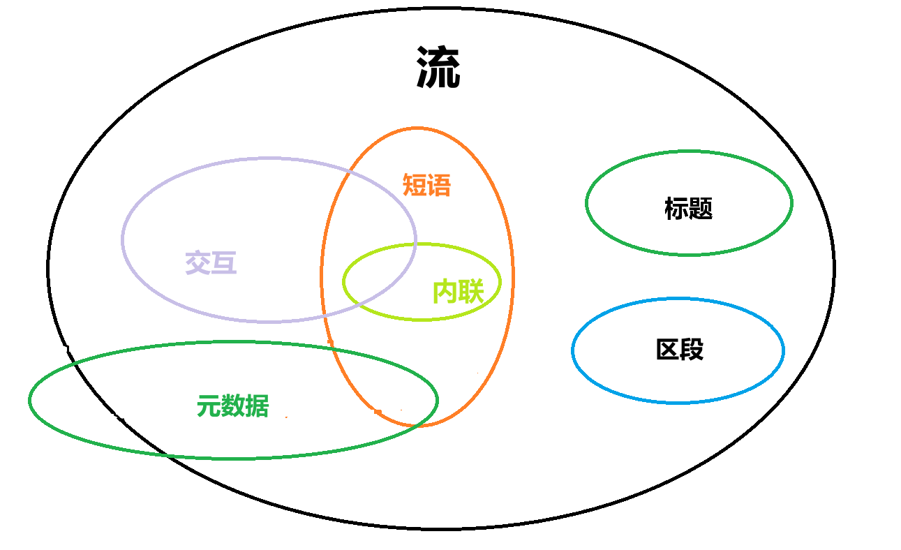

## 分类

大多数HTML元素都属于一个或多个**内容类别**——这些类别对具有共同特征的元素进行分组。这是一个松散的分组（它实际上并没有在这些类别的元素之间建立关系），但它们有助于定义和描述这些类别的共同行为及其相关规则，特别是在你遇到它们的复杂细节时。元素也有可能不属于其中的*任何*类别。

以下是三种类型的内容分类：

- 主内容类，描述了很多元素共享的规则；
- 表单相关的内容类，描述了表单相关元素共有的规则；
- 特殊内容类，描述了仅仅在少数元素（有时仅在特定的上下文中）共享的规则。

## 主内容类

### 元数据（Metadata）

通常在head中。属于*元数据内容*（Metadata content）的元素可以修改文档其余部分的呈现或行为、建立与其他文档的链接，或者传达其他*带外*信息

元素：`<base>`，`<link>`，`<meta>`，`<noscript>`，`<script>`，`<style>`，`<title>`。

### 流式内容(Flow）

流式内容（Flow content）是一个广泛的类别，包括大多数可以包含在 `body`元素之内的元素，包括标题元素、分段元素、短语元素、嵌入元素、交互元素和表单相关元素。它还包括文本节点（但不包括那些只由空白字符组成的节点）。

`<a>`
`<abbr>`

`<address>`
`<article>`
`<aside>`
`<audio>`
`<b>`
`<bdo>`
`<bdi>`
`<blockquote>`
`<br>`
`<button>`
`<canvas>`
`<cite>`
`<code>`
`<data>`
`<datalist>`
`<del>`
`<details>`
`<dfn>`
`<dialog>`
`<div>`
`<dl>`
`<em>`
`<embed>`
`<fieldset>`
`<figure>`
`<footer>`
`<form>`
`<h1>-<h6>`
`<header>`
`<hgroup>`
`<hr>`
`<i>`
`<iframe>`
``
`<input>`
`<ins>`
`<kbd>`
`<label>`
`<main>`
`<map>`
`<mark>`
`<math>`
`<menu>`
`<meter>`
`<nav>`
`<noscript>`
`<object>`
`<ol>`
`<output>`
`<p>`
`<picture>`
`<pre>`
`<progress>`
`<q>`
`<ruby>`
`<s>`
`<samp>`
`<search>`
`<script>`
`<section>`
`<select>`
`<slot>`
`<small>`
`<span>`
`<strong>`
`<sub>`
`<sup>`
`<svg>`
`<table>`
`<template>`
`<textarea>`
`<time>`
`<u>`
`<ul>`
`<var>`
`<video>`
`<wbr>`
`纯文本`
属于此类的少数其他元素，但仅限于以下特殊情况：
`<area>`，当它为 `<map>` 元素的子元素时
`<link>`，若存在 `itemprop` 属性

`<meta>`，若存在 `itemprop` 属性
`<style>`，若存在 `scoped`  属性

### 分段(Sectioning)

分段内容（Sectioning content）是流式内容的一个子集，可以在当前大纲中创建一个分段，它定义了 [`header`](https://developer.mozilla.org/zh-CN/docs/Web/HTML/Element/header) 元素、`footer` 元素和标题内容的范围。有

`article`, `aside`, `nav`, `section`。

### 标题（Heading）

标题内容（Heading content）是流式内容的一个子集，定义了分段的标题，而这个分段可能由一个明确的[分段内容](https://developer.mozilla.org/zh-CN/docs/Web/HTML/Content_categories#分段内容)元素直接标记，也可能由标题本身隐式地定义。

属于此分类的元素有：`<h1>`-`<h6>` 和 `hgroup`。

**备注：** 尽管 `header`可能包含一些标题内容，但其并不是标题内容本身。

**备注：** 已不再推荐使用 `hgroup` 元素，因为它不能与辅助技术一起正常工作。在 HTML 5 最终定稿之前，它已从 W3C 的 HTML 规范中删除，但其仍属于 WHATWG 规范，并且仍被大多数浏览器部分支持。

### 短语（Phrasing）

短语内容（Phrasing content）是流式内容的一个子集，定义了文档中的文本和标记。短语内容的序列构成段落。
`<abbr>`
`<audio>`
`<b>`
`<bdi>`
`<bdo>`
`<br>`
`<button>`
`<canvas>`
`<cite>`
`<code>`
`<data>`
`<datalist>`
`<dfn>`
`<em>`
`<embed>`
`<i>`
`<iframe>`
``
`<input>`
`<kbd>`
`<label>`
`<mark>`
`<math>`
`<meter>`
`<noscript>`
`<object>`
`<output>`
`<picture>`
`<progress>`
`<q>`
`<ruby>`
`<s>`
`<samp>`
`<script>`
`<select>`
`<slot>`
`<small>`
`<span>`
`<strong>`
`<sub>`
`<sup>`
`<svg>`
`<template>`
`<textarea>`
`<time>`
`<u>`
`<var>`
`<video>`
`<wbr>`
纯文本（仅当所包含的内容不完全为空白字符）
一些其他的元素也属于这个分类，但仅限于以下特殊情况：
`<a>`，当它仅包含短语内容时
`<area>`，当它为 `<map>` 元素的子元素时
`<del>`，当它仅包含短语内容时
`<ins>`，当它仅包含短语内容时
`<link>`，若存在 `itemprop` 属性

`<map>`，当它仅包含短语内容时
`<meta>`，若存在 `itemprop` 属性

### 嵌入(Embedded)

（Embedded content）是流式内容的一个子集，它导入另一种资源，或者将来自另一种标记语言或命名空间的内容插入到文档中。属于此类的元素有：

`<audio>`
`<canvas>`
`<embed>`
`<iframe>`
``
`<math>`
`<object>`
`<picture>`
`<svg>`
`<video>`

### 交互（Interactive）

交互内容（Interactive content）是流式内容的一个子集，包含为用户交互而特别设计的元素。属于此类的元素有：

`<button>`
`<details>`
`<embed>`
`<iframe>`
`<label>`
`<select>`
`<textarea>`
一些其他的元素也属于这个分类，但仅限于以下特殊情况：

`<a>`，若存在 `href` 属性
`<audio>`，若存在 `controls` 属性
``，若存在 `usemap` 属性
`<input>`，若 `type` 属性不处于隐藏（hidden）状态
`<object>`，若存在 `usemap` 属性
`<video>`，若存在 `controls` 属性


可感知内容
当内容既不是空的也不是隐藏的时候，它就是可感知`palpable`的；它是被渲染的内容，是实质性的。以流式内容为模型的元素应该至少有一个节点是可感知的。

表单相关内容
表单相关内容`Form-associated content`是流式内容的一个子集，包括有表单所有者（通过 `form` 属性暴露）的元素，可以在预期有流式内容的地方使用。表单所有者要么是容纳这些元素的 `<form>` 元素，要么是在 `form` 属性中指定其 id 的元素。

`<button>`
`<fieldset>`
`<input>`
`<label>`
`<meter>`
`<object>`
`<output>`
`<progress>`
`<select>`
`<textarea>`
此类包含了几个子类：

- 可列举的元素（listed）
  在 `form.elements` 和 `fieldset.elements` 集合中列举出的元素。包括 `<button>`、`<fieldset>`、`<input>`、`<object>`、`<output>`、`<select>` 和 `<textarea>`。

- 可标记的元素（labelable）
  可以与 `<label>` 相关联的元素。包括 `<button>`、`<input>`、`<meter>`、`<output>`、`<progress>`、`<select>` 和 `<textarea>`。

- 可提交的元素（submittable）
  包括当表单提交时可以用来组成表单数据的元素。包括 `<button>`、`<input>`、`<object>`、`<select>` 和 `<textarea>`。

- 可重置的元素（resettable）
  当表单重置时会被重置的元素。包括 `<input>`、`<output>`、`<select>` 和 `<textarea>`。


## 二级分类

这里还有一些你需要注意的二级分类元素。

### 支持脚本元素

**支持脚本元素**（Script-supporting element）是不直接影响文档渲染输出的元素。相反，它们的作用是支持脚本，或者直接包含或指定脚本代码，或者指定将被脚本使用的数据。

支持脚本元素有：

- [`script`](https://developer.mozilla.org/zh-CN/docs/Web/HTML/Element/script)
- `template`

## 透明内容模型

如果一个元素拥有透明内容（Transparent content）模型，即使将透明内容移除并使用子元素取代，其内容也必须构成有效的 HTML5。

例如，[`del`](https://developer.mozilla.org/zh-CN/docs/Web/HTML/Element/del) 和 `ins` 是透明的：

```html
<p>
  我们认为以下真理是<del><em>神圣而不可否认</em></del
  ><ins>不言而喻</ins>的。
</p>
```

```html
<p>我们认为以下真理是<em>神圣而不可否认</em>不言而喻的。</p>
```
