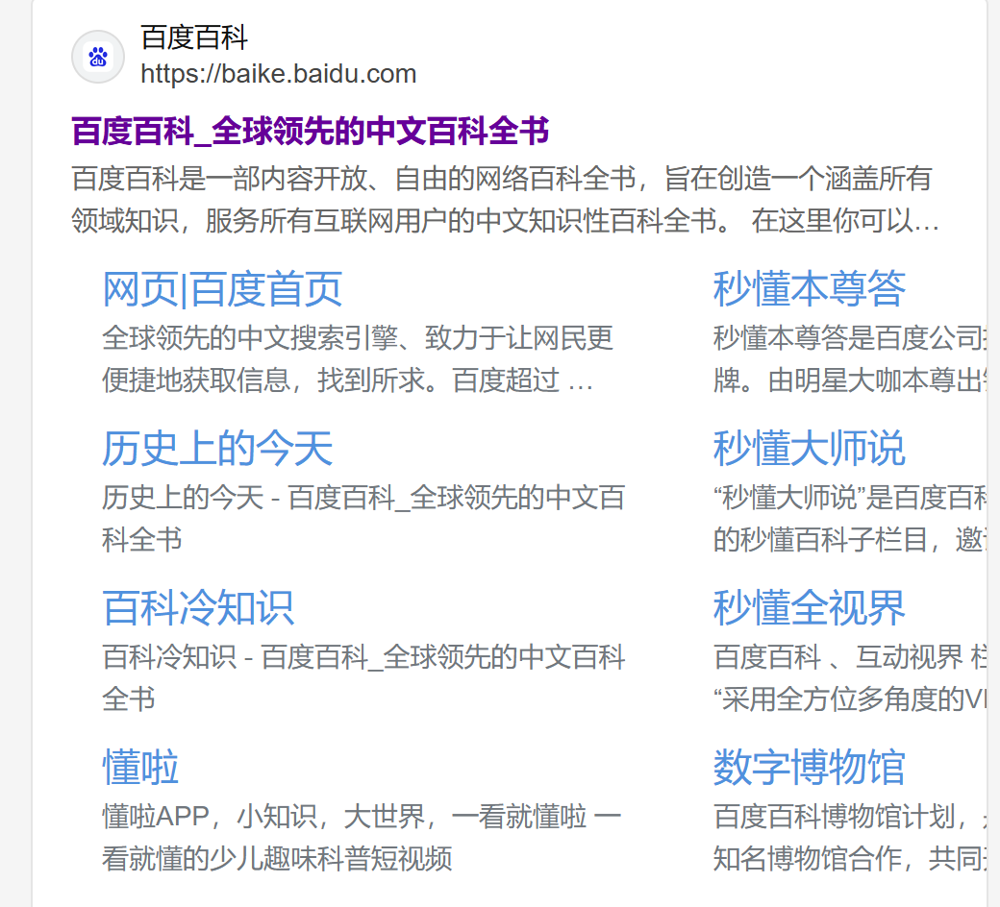

[[toc]]


```html
<!doctype html>
<html lang="zh-CN">
  <head>
    <meta charset="utf-8" />
    <title>我的测试页面</title>
  </head>
  <body>
    <p>这是我的页面</p>
  </body>
</html>
```

HTML 头部包含 HTML 元素内容不同，页面在浏览器加载后它的内容不会在浏览器中显示，它的作用是保存页面的一些**元数据**（即描述数据的数据）

## 网页标题

`<title>` 元素也被以其他的方式使用着。比如说，如果你尝试为某个页面添加书签 `<title>` 的内容被作为建议的书签名。

## 网页元数据meta

### 指定编码

```html
<meta charset="utf-8" />
```

### 添加描述

这两个 meta 元素对于定义你的页面的作者和提供页面的简要描述，可供**SEO**。

```html
<meta name="description" content="百度百科是一部内容开放、自由的网络百科全书，旨在创造一个涵盖所有领域知识，服务所有互联网用户的中文知识性百科全书。在这里你可以参与词条编辑，分享贡献你的知识。">
```

搜索中。你会看到 description `<meta>` 和 `<title>` 元素如何在搜索结果里显示。




**备注：**许多 `<meta>` 特性已经不再使用。例如，keyword `<meta>` 元素（`<meta name="keywords" content="fill, in, your, keywords, here">`，为搜索引擎提供关键词，用于确定该页面与不同搜索词的相关性）已经被搜索引擎忽略了，因为作弊者填充了大量关键词到 keyword，错误地引导搜索结果。

### 其他类型的元数据

当你在网站上查看源码时，你也会发现其他类型的元数据。你在网站上看到的许多功能都是专有创作，旨在向某些网站（如社交网站）提供可使用的特定信息。

例如，Facebook 编写的元数据协议 [Open Graph Data](https://ogp.me/) 为网站提供了更丰富的元数据。在 MDN Web 文档源代码中，

```html
<meta
  property="og:image"
  content="https://developer.mozilla.org/mdn-social-share.png" />
<meta
  property="og:description"
  content="The Mozilla Developer Network (MDN) provides
information about Open Web technologies including HTML, CSS, and APIs for both Web sites
and HTML Apps." />
<meta property="og:title" content="Mozilla Developer Network" />
```

上面代码展现的一个效果就是，当你在 Facebook 上链接到 MDN Web 文档时，该链接将显示一个图像和描述：这为用户提供更丰富的体验。


## favicon

在你的站点增加自定义图标：为了进一步丰富你的网站设计，你可以在元数据中添加对自定义图标的引用，它们会在某些场景下显示。最常见的用例为 **favicon**（为“favorites icon”的缩写，在浏览器的“收藏夹”及“书签”列表中显示）。

页面添加网页图标的方式有：

1. 将其保存在与网站的索引页面相同的目录中，以 `.ico` 格式保存（大多数浏览器支持更通用的格式，如 `.gif` 或 `.png`）

2. HTML的`head`块中以引用：

   ```html
   <link rel="icon" href="favicon.ico" type="image/x-icon" />
   ```

不同的场景使用不同的图标。

```html
<link rel="icon" href="/favicon-48x48.[some hex hash].png" />
<link rel="apple-touch-icon" href="/apple-touch-icon.[some hex hash].png" />
```

这是一种使网站在保存到苹果设备主屏幕时显示图标的方法。

不同的设备提供不同的图标，以确保图标在所有设备上都看起来美观。

```html
<!-- 含有高分辨率 Retina 显示屏的 iPad Pro：-->
<link
  rel="apple-touch-icon"
  sizes="167x167"
  href="/apple-touch-icon-167x167.png" />
<!-- 三倍分辨率的 iPhone：-->
<link
  rel="apple-touch-icon"
  sizes="180x180"
  href="/apple-touch-icon-180x180.png" />
<!-- 没有 Retina 的 iPad、iPad mini 等：-->
<link
  rel="apple-touch-icon"
  sizes="152x152"
  href="/apple-touch-icon-152x152.png" />
<!-- 二倍分辨率的 iPhone 和其他设备：-->
<link rel="apple-touch-icon" href="/apple-touch-icon-120x120.png" />
<!-- 基本图标 -->
<link rel="icon" href="/favicon.ico" />
```

**备注：**如果你的网站使用了内容安全策略（Content Security Policy，CSP）来增加安全性，这个策略会应用在 favicon 图标上。如果你遇到了图标没有被加载的问题，你需要确认 [`Content-Security-Policy`](https://developer.mozilla.org/zh-CN/docs/Web/HTTP/Headers/Content-Security-Policy) 响应头的 img-src` 指令没有阻止访问图标。

## 使用CSS和JavaScript

使用CSS 来让网页更加炫酷，并使用JavaScript 来让网页有交互功能，比如视频播放器、地图、游戏以及更多功能。这些应用在网页中很常见，它们分别使用 `link` 元素以及 `script`]元素。

- [`link`](https://developer.mozilla.org/zh-CN/docs/Web/HTML/Element/link) 元素经常位于文档的头部，它有 2 个属性，`rel="stylesheet"` 表明这是文档的样式表，而 `href` 包含了样式表文件的路径：

  ```html
  <link rel="stylesheet" href="my-css-file.css" />
  ```

- [`script`](https://developer.mozilla.org/zh-CN/docs/Web/HTML/Element/script) 元素也应当放在文档的头部，并包含 

  - `src` 属性来指向需要加载的 JavaScript 文件路径，同时最好加上  
  
  - `defer` 以告诉浏览器在解析完成 HTML 后再加载 JavaScript。这样可以确保在加载脚本之前浏览器已经解析了所有的 HTML 内容。这样你就不会因为 JavaScript 试图访问页面上不存在的 HTML 元素而产生错误。实际上有很多方法来处理在你的页面上加载 JavaScript，但对于现代浏览器来说，这是最可靠的方法。
  
  ```html
  <script src="my-js-file.js" defer></script>
  ```
  

**备注：** `<script>` 元素看起来像一个，但它并不是，因此需要一个结束标记。还可以选择将脚本放入 `<script>` 元素中，而不是指向外部脚本文件。

## 为文档设定主语言

最后，值得一提的是可以（而且有必要）为站点设定语言

```html
<html lang="zh-CN">
  …
</html>
```

这在很多方面都很有用。如果你的 HTML 文档的语言设置好了，那么你的 HTML 文档就会被搜索引擎更有效地索引（例如，允许它在特定于语言的结果中正确显示）。

你还可以将文档的**分段**设置为不同的语言。例如，我们可以把日语部分设置为日语，如下所示：

```html
<p>Japanese example: <span lang="ja">ご飯が熱い。</span>.</p>
```

