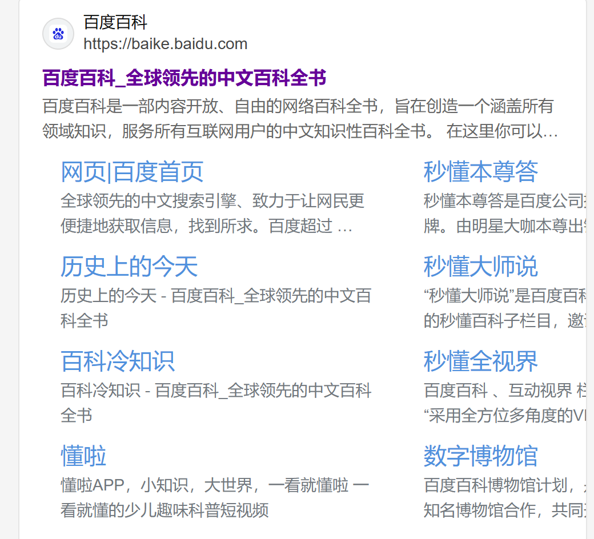

## HTML头部

```html
<!doctype html>
<html lang="zh-CN">
  <head>
    <meta charset="utf-8" />
    <title>我的测试页面</title>
  </head>
  <body>
    <p>这是我的页面</p>
  </body>
</html>
```

HTML 头部包含 HTML 元素内容不同，页面在浏览器加载后它的内容不会在浏览器中显示，它的作用是保存页面的一些**元数据**（即描述数据的数据）

### title

`<title>` 元素也被以其他的方式使用着。比如说，如果你尝试为某个页面添加书签 `<title>` 的内容被作为建议的书签名。

### meta

**`<meta>`** 元素表示那些不能由其他 HTML 元相关（meta-related）元素表示的元数据信息。`<base>`、`<link>`、`<script>`、`<style>` 或 `<title>`。

| [内容分类](https://developer.mozilla.org/zh-CN/docs/Web/HTML/Content_categories) | [元数据内容](https://developer.mozilla.org/zh-CN/docs/Web/HTML/Content_categories#元数据内容)。如果 [`itemprop`](https://developer.mozilla.org/zh-CN/docs/Web/HTML/Global_attributes/itemprop) 属性存在：[流式内容](https://developer.mozilla.org/zh-CN/docs/Web/HTML/Content_categories#流式内容)、[分段内容](https://developer.mozilla.org/zh-CN/docs/Web/HTML/Content_categories#分段内容) |
| :----------------------------------------------------------- | ------------------------------------------------------------ |
| 允许的内容                                                   | 无；这是一个[空元素](https://developer.mozilla.org/zh-CN/docs/Glossary/Void_element)。 |
| 标签省略                                                     | 由于这是一个空元素，所以必须有开始标签并且不能有结束标签。   |
| 允许的父元素                                                 | `<meta charset>`、`<meta http-equiv>`：[`head`](https://developer.mozilla.org/zh-CN/docs/Web/HTML/Element/head) 元素。如果 [`http-equiv`](https://developer.mozilla.org/zh-CN/docs/Web/HTML/Element/meta#http-equiv) 不是编码声明，它也可以放在 [`noscript`](https://developer.mozilla.org/zh-CN/docs/Web/HTML/Element/noscript) 元素中，它本身在一个 `<head>` 元素内部。`<meta name>`：任何可以接受[元数据内容](https://developer.mozilla.org/zh-CN/docs/Web/HTML/Content_categories#元数据内容)的元素。`<meta itemprop>`：任何可以接受[元数据内容](https://developer.mozilla.org/zh-CN/docs/Web/HTML/Content_categories#元数据内容)或[流式内容](https://developer.mozilla.org/zh-CN/docs/Web/HTML/Content_categories#流式内容)。 |
| 默认的无障碍角色                                             | [没有相应的角色](https://www.w3.org/TR/html-aria/#dfn-no-corresponding-role) |
| 允许的无障碍角色                                             | 没有允许的`角色（role）`                                     |
| DOM 接口                                                     | [`HTMLMetaElement`](https://developer.mozilla.org/zh-CN/docs/Web/API/HTMLMetaElement) |

<meta> 元素定义的元数据的类型包括以下几种：

- 如果设置了 [`name`](https://developer.mozilla.org/zh-CN/docs/Web/HTML/Element/meta#name) 属性，`<meta>` 元素提供的是文档级别（*document-level*）的元数据，应用于整个页面。
- 如果设置了 [`http-equiv`](https://developer.mozilla.org/zh-CN/docs/Web/HTML/Element/meta#http-equiv) 属性，`<meta>` 元素则是编译指令，提供的信息与类似命名的 HTTP 头部相同。
- 如果设置了 [`charset`](https://developer.mozilla.org/zh-CN/docs/Web/HTML/Element/meta#charset) 属性，`<meta>` 元素是一个字符集声明，告诉文档使用哪种字符编码。
- 如果设置了 [`itemprop`](https://developer.mozilla.org/zh-CN/docs/Web/HTML/Global_attributes#itemprop) 属性，`<meta>` 元素提供用户定义的元数据。

## [属性](https://developer.mozilla.org/zh-CN/docs/Web/HTML/Element/meta#属性)

此元素包括[全局属性](https://developer.mozilla.org/zh-CN/docs/Web/HTML/Global_attributes)。

**备注：** [`name`](https://developer.mozilla.org/zh-CN/docs/Web/HTML/Element/meta#name) 属性在 `<meta>` 元素中具有特殊的语义；另外，当一个 `<meta>` 标签中，有 [`name`](https://developer.mozilla.org/zh-CN/docs/Web/HTML/Element/meta#name)、[`http-equiv`](https://developer.mozilla.org/zh-CN/docs/Web/HTML/Element/meta#http-equiv) 或者 [`charset`](https://developer.mozilla.org/zh-CN/docs/Web/HTML/Element/meta#charset) 三者中任何一个属性时，[`itemprop`](https://developer.mozilla.org/zh-CN/docs/Web/HTML/Element/meta#itemprop) 属性不能被使用。

- [`charset`](https://developer.mozilla.org/zh-CN/docs/Web/HTML/Element/meta#charset)

  该属性声明了文档的字符编码。如果存在该属性，则其值必须是字符串 `"utf-8"` 的不区分 ASCII 大小写的匹配，因为 UTF-8 是 HTML5 文档的唯一有效编码。声明字符编码的 `<meta>` 元素必须完全位于文档的前 1024 个字节内。

- [`content`](https://developer.mozilla.org/zh-CN/docs/Web/HTML/Element/meta#content)

  此属性包含 [`http-equiv`](https://developer.mozilla.org/zh-CN/docs/Web/HTML/Element/meta#http-equiv) 或 [`name`](https://developer.mozilla.org/zh-CN/docs/Web/HTML/Element/meta#name) 属性的值，具体取决于所使用的值。

- [`http-equiv`](https://developer.mozilla.org/zh-CN/docs/Web/HTML/Element/meta#http-equiv)

  属性定义了一个编译指示指令。这个属性叫做 `http-equiv(alent)` 是因为所有允许的值都是特定 HTTP 标头的名称，如下：`content-security-policy` 允许页面作者定义当前页面的[内容策略](https://developer.mozilla.org/zh-CN/docs/Web/HTTP/Headers/Content-Security-Policy)。内容策略常用来指定允许的服务器源和脚本端点，这有助于防止跨站点脚本攻击。`content-type` 声明 [MIME 类型](https://developer.mozilla.org/zh-CN/docs/Web/HTTP/MIME_types)和文档的字符编码。如果使用 `content-type` 属性，与之在同一个 `<meta>` 元素中使用的 [`content`](https://developer.mozilla.org/zh-CN/docs/Web/HTML/Element/meta#content) 属性的值必须是 `"text/html; charset=utf-8"`。这相当于一个具有指定 `charset` 属性的 `<meta>` 元素，并对其在文档中的放置位置有相同的限制。**注意**：该属性只能用于 MIME 类型为 `text/html` 的文档，不能用于 MIME 类型为 XML 的文档。`default-style`设置默认 [CSS 样式表](https://developer.mozilla.org/zh-CN/docs/Web/CSS)组的名称。`x-ua-compatible` 如果指定，则 `content` 属性必须具有值 `"IE=edge"`。用户代理必须忽略此指示。`refresh` 这个属性指定：页面重新加载的秒数——仅当 [`content`](https://developer.mozilla.org/zh-CN/docs/Web/HTML/Element/meta#content) 属性包含非负整数时。页面重定向到指定链接的秒数——仅当 content 属性包含非负整数后跟字符串“`;url=`”和有效的 URL 时。**警告：**设置了 `refresh` 值的页面存在时间间隔过短的风险。借助屏幕阅读器等辅助技术进行导航的用户可能无法在自动重定向之前通读和理解页面内容。突然的、未通知的页面内容更新也可能会让视力低下的人迷失方向。

  `name` 和 `content` 属性可以一起使用，以名 - 值对的方式给文档提供元数据，其中 name 作为元数据的名称，content 作为元数据的值。 在[标准元数据名称](https://developer.mozilla.org/zh-CN/docs/Web/HTML/Element/meta/name)中查看 HTML 规范等规范中定义的标准元数据名称。

许多 `<meta>` 元素包含了 `name` 和 `content` 属性：

- `name` 指定了 meta 元素的类型；说明该元素包含了什么类型的信息。
- `content` 指定了实际的元数据内容。

这两个 meta 元素对于定义你的页面的作者和提供页面的简要描述是很有用的。让我们看一个例子：

```html
<meta name="description" content="百度百科是一部内容开放、自由的网络百科全书，旨在创造一个涵盖所有领域知识，服务所有互联网用户的中文知识性百科全书。在这里你可以参与词条编辑，分享贡献你的知识。">
```

指定作者在某些情况下是很有用的：如果你需要联系页面的作者，问一些关于页面内容的问题。一些内容管理系统能够自动获取页面作者的信息，然后用于某些用途。

指定一个包括与你的页面内容有关的关键词的描述是有用的，因为它有可能使你的页面在搜索引擎进行的相关搜索中出现得更多（这些行为在术语上被称为：[搜索引擎优化](https://developer.mozilla.org/zh-CN/docs/Glossary/SEO) 或 [SEO](https://developer.mozilla.org/zh-CN/docs/Glossary/SEO)）。

description 也被使用在搜索引擎显示的结果页中。

```html
<meta name="description" content="百度百科是一部内容开放、自由的网络百科全书，旨在创造一个涵盖所有领域知识，服务所有互联网用户的中文知识性百科全书。在这里你可以参与词条编辑，分享贡献你的知识。">
```

搜索中。你会看到 description `<meta>` 和 `<title>` 元素如何在搜索结果里显示——很值得这样做哦！



**备注：**在谷歌搜索里，在主页面链接下面，你将看到一些相关子页面——这些是站点链接，可以在 [Google's webmaster tools](https://search.google.com/search-console/about) 配置——这是一种可以使你的站点对搜索引擎更友好的方式。

**备注：**许多 `<meta>` 特性已经不再使用。例如，keyword `<meta>` 元素（`<meta name="keywords" content="fill, in, your, keywords, here">`，为搜索引擎提供关键词，用于确定该页面与不同搜索词的相关性）已经被搜索引擎忽略了，因为作弊者填充了大量关键词到 keyword，错误地引导搜索结果。

### [其他类型的元数据](https://developer.mozilla.org/zh-CN/docs/Learn/HTML/Introduction_to_HTML/The_head_metadata_in_HTML#其他类型的元数据)

当你在网站上查看源码时，你也会发现其他类型的元数据。你在网站上看到的许多功能都是专有创作，旨在向某些网站（如社交网站）提供可使用的特定信息。

例如，Facebook 编写的元数据协议 [Open Graph Data](https://ogp.me/) 为网站提供了更丰富的元数据。在 MDN Web 文档源代码中，你会发现：

htmlCopy to Clipboard

```html
<meta
  property="og:image"
  content="https://developer.mozilla.org/mdn-social-share.png" />
<meta
  property="og:description"
  content="The Mozilla Developer Network (MDN) provides
information about Open Web technologies including HTML, CSS, and APIs for both Web sites
and HTML Apps." />
<meta property="og:title" content="Mozilla Developer Network" />
```

上面代码展现的一个效果就是，当你在 Facebook 上链接到 MDN Web 文档时，该链接将显示一个图像和描述：这为用户提供更丰富的体验。


## [在你的站点增加自定义图标](https://developer.mozilla.org/zh-CN/docs/Learn/HTML/Introduction_to_HTML/The_head_metadata_in_HTML#在你的站点增加自定义图标)

为了进一步丰富你的网站设计，你可以在元数据中添加对自定义图标的引用，它们会在某些场景下显示。最常见的用例为 **favicon**（为“favorites icon”的缩写，在浏览器的“收藏夹”及“书签”列表中显示）。

这个不起眼的图标已经存在很多年了，16 像素的方形图标是第一种类型。你可以看见（取决于浏览器）这些图标出现在浏览器每一个打开的标签页中以及书签面板中的书签页面旁边。

页面添加网页图标的方式有：

1. 将其保存在与网站的索引页面相同的目录中，以 `.ico` 格式保存（大多数浏览器支持更通用的格式，如 `.gif` 或 `.png`）

2. 将以下行添加到 HTML 的 [`head`](https://developer.mozilla.org/zh-CN/docs/Web/HTML/Element/head) 块中以引用它：

   ```html
   <link rel="icon" href="favicon.ico" type="image/x-icon" />
   ```

你可能还需要在不同的场景使用不同的图标。例如，你可以在 MDN Web 文档的源代码中找到它：

```html
<link rel="icon" href="/favicon-48x48.[some hex hash].png" />
<link rel="apple-touch-icon" href="/apple-touch-icon.[some hex hash].png" />
```

这是一种使网站在保存到苹果设备主屏幕时显示图标的方法。你甚至可以为不同的设备提供不同的图标，以确保图标在所有设备上都看起来美观。例如：

```html
<!-- 含有高分辨率 Retina 显示屏的 iPad Pro：-->
<link
  rel="apple-touch-icon"
  sizes="167x167"
  href="/apple-touch-icon-167x167.png" />
<!-- 三倍分辨率的 iPhone：-->
<link
  rel="apple-touch-icon"
  sizes="180x180"
  href="/apple-touch-icon-180x180.png" />
<!-- 没有 Retina 的 iPad、iPad mini 等：-->
<link
  rel="apple-touch-icon"
  sizes="152x152"
  href="/apple-touch-icon-152x152.png" />
<!-- 二倍分辨率的 iPhone 和其他设备：-->
<link rel="apple-touch-icon" href="/apple-touch-icon-120x120.png" />
<!-- 基本图标 -->
<link rel="icon" href="/favicon.ico" />
```

这些注释解释了每个图标的用途——这些元素涵盖的东西提供一个高分辨率图标，这些高分辨率图标当网站保存到 iPad 的主屏幕时使用。

不用担心现在实现所有这些类型的图标——这是一个相当先进的特性，不要求你有这方面的知识来通过课程的进展。这里的主要目的是让你提前了解有这一样东西，以防当你浏览其他网站的源代码时不理解源代码的含义。如果你确实想了解更多关于所有这些值以及如何选择它们，请阅读 [`link`](https://developer.mozilla.org/zh-CN/docs/Web/HTML/Element/link) 元素的参考页面。

**备注：**如果你的网站使用了内容安全策略（Content Security Policy，CSP）来增加安全性，这个策略会应用在 favicon 图标上。如果你遇到了图标没有被加载的问题，你需要确认 [`Content-Security-Policy`](https://developer.mozilla.org/zh-CN/docs/Web/HTTP/Headers/Content-Security-Policy) 响应头的 [`img-src` 指令](https://developer.mozilla.org/en-US/docs/Web/HTTP/Headers/Content-Security-Policy/img-src) 没有阻止访问图标。

## 在 HTML 中应用 CSS 和 JavaScript

如今，几乎你使用的所有网站都会使用 [CSS](https://developer.mozilla.org/zh-CN/docs/Glossary/CSS) 来让网页更加炫酷，并使用 [JavaScript](https://developer.mozilla.org/zh-CN/docs/Glossary/JavaScript) 来让网页有交互功能，比如视频播放器、地图、游戏以及更多功能。这些应用在网页中很常见，它们分别使用 [`link`](https://developer.mozilla.org/zh-CN/docs/Web/HTML/Element/link) 元素以及 [`script`](https://developer.mozilla.org/zh-CN/docs/Web/HTML/Element/script) 元素。

- [`link`](https://developer.mozilla.org/zh-CN/docs/Web/HTML/Element/link) 元素经常位于文档的头部，它有 2 个属性，`rel="stylesheet"` 表明这是文档的样式表，而 `href` 包含了样式表文件的路径：

  ```html
  <link rel="stylesheet" href="my-css-file.css" />
  ```

- [`script`](https://developer.mozilla.org/zh-CN/docs/Web/HTML/Element/script) 元素也应当放在文档的头部，并包含 `src` 属性来指向需要加载的 JavaScript 文件路径，同时最好加上 `defer` 以告诉浏览器在解析完成 HTML 后再加载 JavaScript。这样可以确保在加载脚本之前浏览器已经解析了所有的 HTML 内容。这样你就不会因为 JavaScript 试图访问页面上不存在的 HTML 元素而产生错误。实际上有很多方法来处理在你的页面上加载 JavaScript，但对于现代浏览器来说，这是最可靠的方法（对于其他方法，请阅读[脚本加载策略](https://developer.mozilla.org/zh-CN/docs/Learn/JavaScript/First_steps/What_is_JavaScript#脚本调用策略)）。

  ```html
  <script src="my-js-file.js" defer></script>
  ```

**备注：** `<script>` 元素看起来像一个[空元素](https://developer.mozilla.org/zh-CN/docs/Glossary/Void_element)，但它并不是，因此需要一个结束标记。还可以选择将脚本放入 `<script>` 元素中，而不是指向外部脚本文件。

## [为文档设定主语言](https://developer.mozilla.org/zh-CN/docs/Learn/HTML/Introduction_to_HTML/The_head_metadata_in_HTML#为文档设定主语言)

最后，值得一提的是可以（而且有必要）为站点设定语言，这个可以通过添加 [lang 属性](https://developer.mozilla.org/zh-CN/docs/Web/HTML/Global_attributes/lang)到 HTML 开始的标签中来实现（就像 [meta-example.html](https://github.com/mdn/learning-area/blob/main/html/introduction-to-html/the-html-head/meta-example.html) 那样），如下所示：

```html
<html lang="zh-CN">
  …
</html>
```

这在很多方面都很有用。如果你的 HTML 文档的语言设置好了，那么你的 HTML 文档就会被搜索引擎更有效地索引（例如，允许它在特定于语言的结果中正确显示），对于那些使用屏幕阅读器的视障人士也很有用（例如，法语和英语中都有“six”这个单词，但是发音却完全不同）。

你还可以将文档的分段设置为不同的语言。例如，我们可以把日语部分设置为日语，如下所示：

```html
<p>Japanese example: <span lang="ja">ご飯が熱い。</span>.</p>
```

这些代码是根据 [ISO 639-1](https://zh.wikipedia.org/wiki/ISO_639-1) 标准定义的。你可以在 [HTML 和 XML 的语言标签](https://www.w3.org/International/articles/language-tags/)找到更多相关内容。

## 空元素

**空元素**（void element）是 HTML 中**不能**存在子节点（例如内嵌的元素或者文本节点）的[元素](https://developer.mozilla.org/zh-CN/docs/Glossary/Element)。空元素只有开始标签且不能指定结束标签。

在 HTML 中，空元素不能有结束标签。例如，`<input type="text"></input>` 是无效的 HTML。相反，不能有任何子节点的 SVG 或 MathML 元素可以使用结束标签来代替 XML 开始标签中的自闭合标签语法。

[HTML](https://html.spec.whatwg.org/multipage/)、[SVG](https://www.w3.org/TR/SVG2/) 和 [MathML](https://www.w3.org/TR/MathML3/) 的规范都详细定义了每个元素能包含的具体内容。所以一些标签的组合是没有任何语义的。

尽管无法使用具有子元素的空元素标记，但可以使用 JavaScript 在这些元素的 DOM 中添加子节点。但这并不是一个被推荐的做法，因为其结果不可靠。

- [`area`](https://developer.mozilla.org/zh-CN/docs/Web/HTML/Element/area)
- [`base`](https://developer.mozilla.org/zh-CN/docs/Web/HTML/Element/base)
- [`br`](https://developer.mozilla.org/zh-CN/docs/Web/HTML/Element/br)
- `col`
- [`embed`](https://developer.mozilla.org/zh-CN/docs/Web/HTML/Element/embed)
- [`hr`](https://developer.mozilla.org/zh-CN/docs/Web/HTML/Element/hr)
- [`img`](https://developer.mozilla.org/zh-CN/docs/Web/HTML/Element/img)
- [`input`](https://developer.mozilla.org/zh-CN/docs/Web/HTML/Element/input)
- [`link`](https://developer.mozilla.org/zh-CN/docs/Web/HTML/Element/link)
- [`meta`](https://developer.mozilla.org/zh-CN/docs/Web/HTML/Element/meta)
- [`param`](https://developer.mozilla.org/zh-CN/docs/Web/HTML/Element/param) 已弃用
- [`source`](https://developer.mozilla.org/zh-CN/docs/Web/HTML/Element/source)
- [`track`](https://developer.mozilla.org/zh-CN/docs/Web/HTML/Element/track)
- [`wbr`](https://developer.mozilla.org/zh-CN/docs/Web/HTML/Element/wbr)

## [自闭合标签](https://developer.mozilla.org/zh-CN/docs/Glossary/Void_element#自闭合标签)

**HTML 中不存在自闭合标签（`<tag />`）。**

如果一个 HTML 元素的开始标签中存在尾随的 `/`（斜杠）字符，HTML 解析器会忽略该斜杠字符。请记住一些元素（例如 [`script`](https://developer.mozilla.org/zh-CN/docs/Web/HTML/Element/script) 或 [`ul`](https://developer.mozilla.org/zh-CN/docs/Web/HTML/Element/ul)）的确需要结束标签。在这种情况下，在开始标签中添加尾随斜杠不会闭合元素。

但是，某些代码格式化工具会在空元素的开始标签中添加尾随斜杠字符，以使其兼容 XHTML 并更易读。例如，某些代码格式化工具会将 `<input type="text">` 转换为 `<input type="text" />`。

[XML](https://developer.mozilla.org/zh-CN/docs/Glossary/XML)、[XHTML](https://developer.mozilla.org/zh-CN/docs/Glossary/XHTML) 和 [SVG](https://developer.mozilla.org/zh-CN/docs/Glossary/SVG) 的空元素则必须使用自闭合标签（例如 `<circle cx="50" cy="50" r="50" />`）。

在 SVG 和 MathML 中，有任何子节点的元素不允许使用自闭合标签。在这种情况下，如果元素的开始标签被标记为自闭合，则该元素不能有结束标签。

**备注：**如果开始标签中的尾随 `/`（斜杠）字符直接位于未使用引号包裹的属性值之后（两者之间没有空格），则该斜杠字符将成为属性值的一部分，而不是被解析器丢弃。例如，标记 `` 会导致 `src` 属性的值为 `http://www.example.com/logo.svg/`——这会导致 URL 错误。
