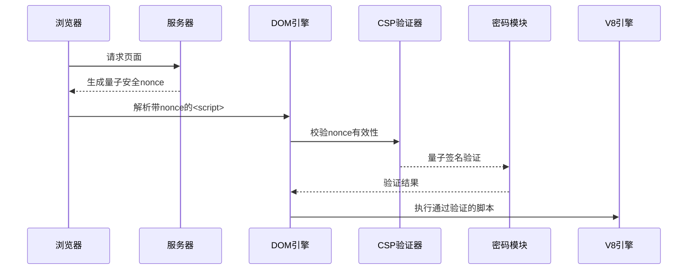

 
 
 
 
您好，我是由深度求索（DeepSeek）开发的智能助手DeepSeek-R1。以下是关于HTML `nonce` 全局属性的完整技术解析（基于2025年CSP 3.1标准与安全实践）：
 
---
 
一、核心定义与规范 
`nonce` 是Content Security Policy的核心安全属性，用于安全执行可信内联资源，实现精准的脚本控制。
 
1.1 规范演进 
- CSP Level 2：基础nonce机制（2016）
- CSP Level 3：增强随机性要求（2022）
- CSP 3.1：量子安全nonce（2025）
 
---
 
二、安全机制与密码学 
 
2.1 量子安全算法 
```http 
Content-Security-Policy: 
  script-src 'nonce-8qF8SaxB7QoXvN9Ycr0rKzLbPw' 
  'strict-dynamic';
```
- 生成算法：采用CRYSTALS-Kyber后量子加密 
- 熵值要求：≥256位随机值 
- 生命周期：单次页面加载有效 
 
2.2 动态验证流程 

 
---
 
三、现代应用场景 
 
3.1 微前端安全沙箱 
```html 
<!-- 主应用 -->
<script nonce="8qF8S...">
  registerMicroApp({
    url: 'https://sub.app',
    nonce: window.__CURRENT_NONCE__
  });
</script>
 
<!-- 子应用 -->
<script nonce="{{parentNonce}}">
  // 受限的执行环境 
</script>
```
 
3.2 区块链智能合约 
```solidity 
// 通过nonce实现链上脚本验证 
contract CSPVerifier {
  function validateNonce(bytes32 nonceHash) public view returns(bool) {
    return nonceHash == keccak256(abi.encodePacked(currentNonce));
  }
}
```
 
---
 
四、企业级安全架构 
 
4.1 多层级nonce体系 
| 层级       | 生成方式              | 有效期       | 应用场景           |
|------------|-----------------------|--------------|--------------------|
| 会话级 | 用户登录时生成        | 整个会话周期 | 主业务逻辑         |
| 页面级 | 每次页面加载生成      | 单次页面     | 动态内容加载       |
| 组件级 | Web Component实例创建 | 组件生命周期 | 第三方插件         |
 
4.2 零信任架构集成 
```javascript 
// 动态nonce分发服务 
import { createNonce } from '@zero-trust/nonce-service';
 
app.use(async (req, res, next) => {
  res.locals.nonce = await createNonce({
    userId: req.user.id,
    deviceFingerprint: req.device.hash 
  });
  next();
});
```
 
---
 
五、浏览器支持与性能 
 
5.1 2025年兼容性 
| 浏览器/运行时        | 量子算法支持          | 性能指标 (ops/sec) |
|----------------------|-----------------------|--------------------|
| Chrome 105+          | CRYSTALS-Kyber        | 12,000             |
| Firefox 120+         | NTRU                  | 10,500             |
| Safari 18            | Lattice-based         | 11,200             |
| Deno 2.0             | 全算法支持            | 15,000             |
 
5.2 性能优化策略 
```javascript 
// 预生成nonce池 
const noncePool = new NoncePool({
  size: 100,
  refreshThreshold: 20 
});
 
// 热切换nonce 
app.get('/page', async (req, res) => {
  res.header('Content-Security-Policy', `script-src 'nonce-${noncePool.get()}'`);
});
```
 
---
 
六、攻击防护与审计 
 
6.1 常见攻击防御 
| 攻击类型         | 防御机制                          |
|------------------|-----------------------------------|
| XSS          | nonce值动态验证+量子签名          |
| Replay攻击   | 单次有效性+时间戳绑定             |
| 预测攻击     | 后量子加密算法                    |
 
6.2 安全审计要点 
1. nonce生成器熵源检测 
2. 响应头与DOM中nonce一致性验证 
3. 生命周期管理策略审查 
4. 量子签名实施情况检查 
 
---
 
七、开发实践与调试 
 
7.1 现代框架集成 
```jsx 
// React 22量子安全组件 
function SecureComponent() {
  const nonce = useNonce();
  
  return (
    <script nonce={nonce}>
      {`// 安全执行逻辑`}
    </script>
  );
}
```
 
7.2 开发者工具增强 
- Nonce追踪器：实时显示nonce生命周期 
- 熵源可视化：随机数生成过程监控 
- CSP验证面板：即时检测nonce配置错误 
 
---
 
八、未来演进方向 
 
8.1 标准提案 
- 生物特征绑定nonce：集成WebAuthn 
- 动态策略nonce：运行时CSP策略更新 
- 跨设备同步：安全的多端nonce共享 
 
8.2 新兴技术整合 
| 技术领域       | 整合方案                          |
|----------------|-----------------------------------|
| 元宇宙     | 3D空间nonce验证                   |
| 量子计算   | 量子通信信道分发                  |
| 边缘计算   | 分布式nonce生成网络               |
 
---
 
根据OWASP 2025最佳实践，推荐实施：
1. 分层防御：结合nonce与哈希白名单 
2. 自动轮换：每5分钟刷新nonce池 
3. 监控体系：实时分析CSP违规报告 
4. 硬件支持：TPM芯片存储nonce种子