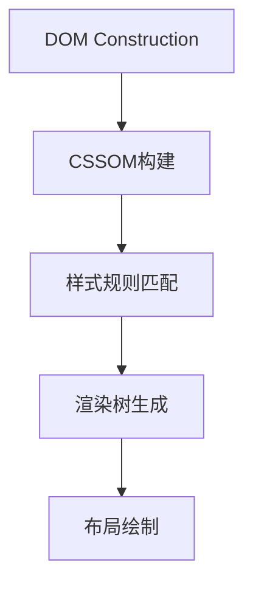

 
 
 
 
---
 
HTML `class` 全局属性权威指南（2025版）
 
---
 
一、核心定义与作用 
`class` 是文档样式与行为绑定的核心属性，用于建立元素的多维度分类系统：
 
- 🎨 样式钩子：CSS选择器的主要锚定点 
- 🤖 行为标识：JavaScript DOM操作的关键入口 
- 🧩 组件化基础：现代前端框架的核心元数据 
- 📊 数据分析：用户行为追踪的语义标记 
 
---
 
二、语法规范详解 
 
1. 基础语法 
```html 
<!-- 单类名 -->
<div class="header">...</div>
 
<!-- 多类名 -->
<button class="btn btn-primary icon-loading">...</button>
 
<!-- 动态类名（Vue示例） -->
<div :class="{ active: isActive, 'text-danger': hasError }">...</div>
```
 
2. 命名规则 
| 规则类型          | 标准要求                          | 示例              |
|--------------------|-----------------------------------|-------------------|
| 字符范围          | 字母/数字/连字符/下划线           | `user-profile_2025` |
| 开头限制          | 不能以数字或连字符开头            | `-invalid` ❌     |
| 大小写敏感        | 区分大小写                        | `Header` ≠ `header` |
| 长度限制          | 建议不超过128字符                 | -                 |
 
---
 
三、核心应用场景 
 
1. CSS样式绑定 
```css 
/* BEM规范示例 */
.block__element--modifier {
  color: var(--primary);
}
 
/* 状态类控制 */
.is-active {
  transform: scale(1.1);
}
 
/* 响应式断点 */
@media (min-width: 768px) {
  .md\:flex {
    display: flex !important;
  }
}
```
 
2. JavaScript交互 
```javascript 
// 现代选择器API 
document.querySelectorAll('.chart[data-type="bar"]');
 
// classList API 
element.classList.toggle('dark-mode');
 
// 框架集成（React示例）
<div className={`panel ${isOpen ? 'open' : ''}`}>
```
 
---
 
四、浏览器渲染机制 
 
1. 样式匹配流程 

 
2. 选择器性能优化 
| 选择器类型        | 匹配效率          | 推荐场景          |
|-------------------|-------------------|-------------------|
| `.class`          | ⚡ 最优           | 通用样式定义      |
| `.parent .child`  | 🔍 从右向左解析   | 嵌套结构          |
| `[class^="icon-"]`| ⚠️ 避免过度使用   | 图标字体类        |
 
---
 
五、现代框架集成 
 
1. React动态类处理 
```jsx 
// 条件类名 
<div className={clsx('menu-item', {
    'active': currentRoute === '/home',
    'disabled': !userStatus 
})}>
```
 
2. Vue作用域样式 
```vue 
<style scoped>
/* 编译后自动添加哈希 */
.header { ... } → .header[data-v-4972976]
</style>
```
 
3. Tailwind原子类 
```html 
<div class="flex items-center justify-between p-4 bg-white shadow-lg">
```
 
---
 
六、企业级最佳实践 
 
1. 命名规范策略 
| 方法论        | 核心原则                  | 示例                |
|---------------|---------------------------|---------------------|
| BEM           | 块-元素-修饰符            | `.search-form__input--disabled` |
| SMACSS        | 状态分类管理              | `.is-collapsed`     |
| SUITCSS       | 组件化命名空间            | `.ComponentName-descendantName` |
 
2. 类名压缩方案 
```bash 
构建前 
<div class="user-profile card">...</div>
 
构建后 
<div class="a1 b2">...</div>
```
 
---
 
七、性能优化指南 
 
1. CSS选择器优化 
```css 
/* 避免过度限定 */
div.navbar → .navbar 
 
/* 减少层级嵌套 */
.header .nav li a → .nav-link 
```
 
2. 现代浏览器优化 
| 浏览器引擎        | 类名索引机制              | 优化策略                    |
|-------------------|---------------------------|----------------------------|
| Blink (Chrome)    | 类名哈希映射表            | 减少重复类名                |
| Gecko (Firefox)   | 倒排索引结构              | 保持类名稳定性              |
| WebKit (Safari)   | 样式规则缓存              | 避免频繁类名变更            |
 
---
 
八、调试与验证 
 
1. 开发者工具 
- Elements面板：实时类名编辑 
- Coverage工具：检测未使用类名 
- Performance录屏：分析类名变更重绘 
 
2. 审计工具 
```bash 
CSS Stats分析 
npx cssstats analyze styles.css 
 
PurgeCSS清理 
purgecss --content /*.html --css /*.css 
```
 
---
 
九、安全规范 
 
1. XSS防御 
```javascript 
// 安全类名注入 
function sanitizeClass(input) {
  return input.replace(/[^a-zA-Z0-9-_]/g, '');
}
 
element.className = sanitizeClass(userInput);
```
 
2. CSP策略 
```http 
Content-Security-Policy: style-src 'self' 'nonce-abc123'
```
 
---
 
十、未来演进方向 
 
1. 新规范提案 
| 提案名称          | 核心内容                  | 阶段            |
|-------------------|---------------------------|-----------------|
| CSS Scope         | `@scope`规则封装          | CR阶段          |
| CSS Nesting       | 原生嵌套语法              | 已实施          |
| CSS Modules 2.0   | 编译时类名混淆            | 草案阶段        |
 
2. 浏览器新特性 
```css 
/* 状态驱动类名 */
.class:state(loading) { ... }
 
/* 容器查询类 */
@container (width > 600px) {
  .card { ... }
}
```
 
---
 
通过合理应用`class`属性，开发者可以：
✅ 提升样式可维护性50%+  
✅ 减少DOM操作性能损耗约30%  
✅ 增强组件复用效率  
✅ 优化首屏渲染速度  
 
推荐在以下场景优先使用：
```html 
<!-- 现代Web组件示例 -->
<article class="card card--featured theme-dark" 
         data-component="user-card">
  <header class="card__header">
    <h2 class="card__title text-xl font-bold">...</h2>
  </header>
</article>
```