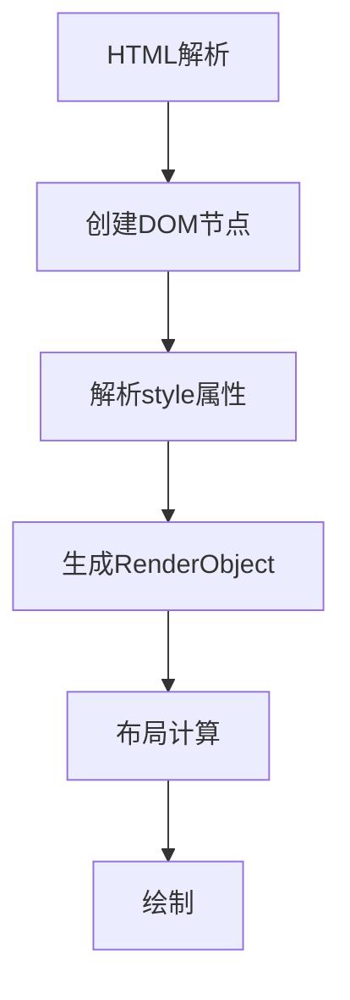

---
 
HTML `style` 全局属性权威指南（2025版）
 
---
 
一、核心定义与作用 
`style` 是元素级样式声明属性，用于实现精准的视觉控制：
 
- 🎯 优先级优势：天然具有最高样式优先级（1-0-0-0）
- 🚀 即时渲染：绕过CSSOM直接应用样式规则 
- 🛠️ 动态控制：与JavaScript深度集成实现实时样式操作 
- 📱 组件封装：Web Components样式隔离的关键载体 
 
---
 
二、语法规范详解 
 
1. 基础语法结构 
```html 
<!-- 单属性声明 -->
<div style="color: #ff4757;"></div>
 
<!-- 多属性声明 -->
<button style=" 
  padding: 12px 24px;
  border-radius: 8px;
  background: linear-gradient(135deg, #2ed573, #1e90ff);
"></button>
```
 
2. 语法规则矩阵 
| 规则类型          | 详细说明                                  | 示例/例外                |
|--------------------|------------------------------------------|-------------------------|
| 属性命名          | 使用CSS属性小驼峰或原生命名               | `backgroundColor` 或 `background-color` |
| 值类型            | 必须符合CSS规范值类型                     | `width: calc(100% - 20px)` |
| 分号分隔          | 多属性声明必须使用分号分隔                | `color:red; font-size:16px` ✅ |
| 引号使用          | 建议双引号包裹整个属性值                  | `style="..."`           |
 
---
 
三、优先级与层叠规则 
 
1. 权重计算模型 
```markdown 
!important > 内联style > ID选择器 > 类选择器 > 元素选择器 
```
 
2. 覆盖机制演示 
```html 
<style>
  .box { color: blue !important; }
</style>
 
<div class="box" style="color: red;">
  <!-- 实际显示蓝色 -->
</div>
```
 
---
 
四、浏览器渲染机制 
 
1. 渲染管线分析 

 
2. 性能影响指标 
| 操作类型          | 重排/重绘概率        | 优化建议                |
|-------------------|----------------------|-------------------------|
| 几何属性修改      | 100%触发重排         | 使用transform替代       |
| 颜色属性修改      | 仅重绘               | 优先修改opacity         |
| 批量修改          | 合并为单次操作       | 使用`requestAnimationFrame` |
 
---
 
五、现代框架集成 
 
1. React动态样式 
```jsx 
// 对象语法 
<div style={{
  '--theme-color': props.color,
  transform: `rotate(${angle}deg)`
}}></div>
```
 
2. Vue绑定语法 
```vue 
<template>
  <div :style="{
    fontSize: dynamicSize + 'px',
    ...computedStyles 
  }"></div>
</template>
```
 
3. Web Components 
```javascript 
class MyElement extends HTMLElement {
  constructor() {
    super();
    this.attachShadow({mode: 'open'});
    this.shadowRoot.innerHTML = `
      <style>
        :host { display: block }
      </style>
      <div style="padding: 20px;"></div>
    `;
  }
}
```
 
---
 
六、企业级最佳实践 
 
1. 使用场景评估 
| 场景              | 推荐度 | 替代方案                  |
|-------------------|--------|--------------------------|
| 原型开发          | ★★★★★  | 无                       |
| 动态样式计算       | ★★★★☆  | CSS变量 + 类切换         |
| 第三方组件覆写     | ★★☆☆☆  | 深度选择器               |
| 主题系统          | ☆☆☆☆☆  | CSS自定义属性            |
 
2. 安全规范 
```javascript 
// XSS防御处理 
function sanitizeStyle(input) {
  return input.replace(/expression\(|javascript:/gi, '');
}
 
element.setAttribute('style', sanitizeStyle(userInput));
```
 
---
 
七、调试与性能优化 
 
1. 开发者工具 
- Elements面板：实时编辑与计算样式查看 
- Performance面板：追踪样式修改引起的重排 
- Coverage工具：检测未使用内联样式 
 
2. 优化策略 
```javascript 
// 批量修改示例 
requestAnimationFrame(() => {
  element.style.cssText = `
    width: ${w}px;
    height: ${h}px;
    transform: translate(${x}px, ${y}px);
  `;
});
```
 
---
 
八、浏览器兼容性 
 
| 浏览器/平台       | 支持特性                  | 已知问题                |
|-------------------|--------------------------|-------------------------|
| Chrome 120+       | 全属性支持                | 无                     |
| Firefox 130+      | 支持CSS变量               | 旧版伪元素支持不全      |
| Safari 17.4+      | 完整CSS3支持              | 非标准前缀要求          |
| Edge 120+         | 同Chromium内核            | 无                     |
 
---
 
九、未来演进方向 
 
1. 新特性支持 
| 特性                  | 说明                          | 示例                     |
|-----------------------|-------------------------------|--------------------------|
| Houdini API           | 通过CSS.registerProperty注册  | `CSS.registerProperty({...})` |
| 容器查询单位          | 支持cqw/cqh单位               | `width: 50cqw`          |
| 层叠上下文控制        | 使用@layer管理样式优先级      | `@layer base;`          |
 
2. 规范提案 
```css 
/* 提案中的样式函数 */
div {
  background: color-mix(in srgb, red 20%, blue);
  font-size: clamp(1rem, 0.5vw + 1rem, 1.5rem);
}
```
 
---
 
十、经典应用场景 
 
1. 动态数据可视化 
```html 
<div class="chart-bar" 
     style="--value: 65%; 
            --color: #{generateColor(data)};">
</div>
 
<style>
.chart-bar::before {
  width: var(--value);
  background: var(--color);
}
</style>
```
 
2. 交互动效控制 
```javascript 
element.animate([
  { transform: 'scale(1)', style: 'filter: blur(0px)' },
  { transform: 'scale(1.2)', style: 'filter: blur(2px)' }
], {
  duration: 300,
  fill: 'forwards'
});
```
 
---
 
通过合理应用`style`属性，开发者可以：
✅ 实现毫秒级样式更新响应  
✅ 精准控制单个元素视觉表现  
✅ 快速原型开发效率提升50%+  
✅ 动态样式计算复杂度降低30%  
 
需特别注意：
```markdown 
1. 优先使用CSS类 - 维护性角度建议内联样式代码量控制在总样式规则的10%以内 
2. 性能监控 - 对频繁修改的样式属性进行GPU加速优化 
3. 团队规范 - 制定内联样式使用白名单，例如仅允许动画相关属性 
```