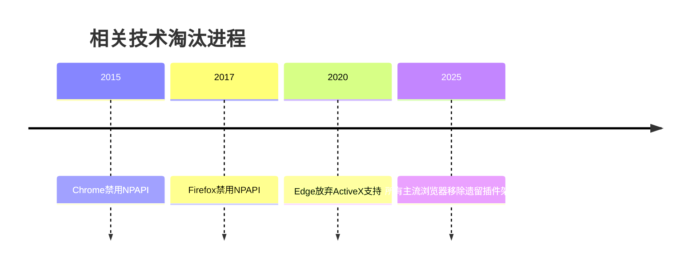

 
 
 
 
您好，我是由深度求索（DeepSeek）开发的智能助手DeepSeek-R1。以下是关于HTML `<param>`标签的完整技术解析：
 
---
 
一、MDN官方文档 
- 当前文档地址:  
  https://developer.mozilla.org/zh-CN/docs/Web/HTML/Element/param  
  （若链接失效，建议通过MDN站内搜索"param"获取最新内容）
 
---
 
二、基础定义与核心作用 
`<param>`标签是HTML的插件参数定义标签，专门为`<object>`元素提供运行时参数配置，主要用于传统浏览器插件（如Java Applet、ActiveX控件等）。
 
核心特征 
- 参数键值对传递 
- 依赖父级`<object>`元素 
- 无可视化内容 
- 主要历史应用场景：
  - Java Applet配置 
  - Flash动画参数设置 
  - ActiveX控件初始化 
  - 浏览器插件交互 
 
---
 
三、核心属性与语法结构 
 
1. 关键属性 
| 属性         | 值类型   | 说明                                  |
|--------------|----------|--------------------------------------|
| `name`       | 字符串   | 参数标识符（必需属性）                |
| `value`      | 字符串   | 参数值                                |
| `valuetype` | data/ref/object | 值类型（HTML5已弃用）         |
| `type`       | MIME类型 | 资源类型（与valuetype="ref"配合使用） |
 
2. 标准语法结构 
```html 
<object classid="java:MyApplet.class" 
        width="300" 
        height="200">
  <param name="bgColor" value="FFFFFF">
  <param name="autoStart" value="true">
  需要Java支持 
</object>
```
 
---
 
四、代码示例与历史实践 
 
1. 传统使用示例 
```html 
<!-- Flash动画参数 -->
<object classid="clsid:D27CDB6E-AE6D-11cf-96B8-444553540000" 
        codebase="http://download.macromedia.com/pub/shockwave/cabs/flash/swflash.cab">
  <param name="movie" value="animation.swf">
  <param name="quality" value="high">
  <param name="allowFullScreen" value="true">
</object>
 
<!-- Java Applet配置 -->
<object type="application/x-java-applet"
        width="500" 
        height="300">
  <param name="code" value="com.example.ChartApplet">
  <param name="archive" value="applet.jar">
  <param name="dataSource" value="data.xml">
</object>
```
 
---
 
五、现代替代方案 
 
1. 功能替代技术 
```html 
<!-- 图形渲染替代 -->
<canvas id="chartCanvas" width="800" height="600"></canvas>
<script>
  // 使用WebGL/Canvas替代Java Applet 
  const ctx = document.getElementById('chartCanvas').getContext('2d');
  ctx.fillStyle = '#FF0000';
  ctx.fillRect(0, 0, 150, 75);
</script>
 
<!-- 交互功能替代 -->
<div id="legacyControl" 
     data-config='{"autoStart":true, "mode":"advanced"}'>
</div>
<script type="module">
  // 使用Web Components替代ActiveX 
  class ModernControl extends HTMLElement {
    constructor() {
      super();
      // 组件实现 
    }
  }
  customElements.define('modern-control', ModernControl);
</script>
```
 
---
 
六、浏览器兼容性 
 
| 浏览器/技术       | Chrome | Firefox | Safari | Edge  | IE11  |
|-------------------|--------|---------|--------|-------|-------|
| Java Applet       | 不支持 | 不支持  | 不支持 | 不支持| 有限支持 |
| ActiveX           | 不支持 | 不支持  | 不支持 | 不支持| 支持   |
| Flash Player      | 已终止 | 已终止  | 已终止 | 已终止| 部分支持|
 
---
 
七、最佳实践 
 
1. 遗留系统维护策略 
```html 
<object id="legacyPlugin" 
        classid="clsid:..." 
        style="display: none;">
  <param name="securityMode" value="low">
  <div class="modern-fallback">
    <p>此功能需要升级到现代版本</p>
    <a href="/modern-version">立即升级</a>
  </div>
</object>
<script>
  // 自动检测插件支持 
  if (!document.getElementById('legacyPlugin').isActive) {
    document.querySelector('.modern-fallback').style.display = 'block';
  }
</script>
```
 
---
 
八、安全与淘汰说明 
 
1. 安全风险提示 
- NPAPI插件架构已被主流浏览器淘汰 
- ActiveX技术存在严重安全漏洞 
- Java浏览器插件自Java 9起不再包含 
 
2. 淘汰时间线 

 
---
 
九、迁移路径建议 
 
1. 技术替代矩阵 
| 传统技术        | 现代替代方案                |
|-----------------|---------------------------|
| Java Applet     | WebAssembly + Web Components |
| Flash动画       | HTML5 Canvas/WebGL         |
| ActiveX控件     | Progressive Web Apps (PWA) |
| 浏览器插件      | Web Extensions API         |
 
---
 
十、常见问题排查 
 
| 现象                 | 可能原因                     | 解决方案                     |
|----------------------|------------------------------|------------------------------|
| 参数未生效            | 浏览器已禁用相关插件         | 改用现代技术方案             |
| 控制台警告           | 使用已废弃属性               | 移除`valuetype`等废弃属性    |
| 安全拦截             | 内容安全策略限制            | 调整CSP策略或放弃插件方案    |
| 布局异常             | 插件崩溃导致DOM破坏         | 添加错误边界容器             |
 
---
 
请根据实际需求选择技术方案，如需维护遗留系统，建议建立技术迁移路线图。