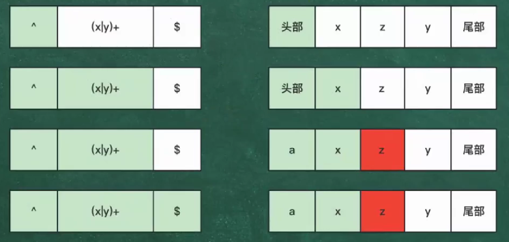

## 修饰符

一般正则表达式放在//中，也可以 /表达式/修饰符 对正则表达式功能扩充。

| **`i`** | **`ignore`** 忽略大小写                                      | **`/表达式/i`** |
| ------- | ------------------------------------------------------------ | --------------- |
| **`g`** | `global` 全局匹配,查找所有的匹配项。                         | **`/表达式/g`** |
| **`m`** | `multi line`多行匹配。通常和^和$匹配中。                     | **`/表达式/m`** |
| `s`     | 默认情况下的圆点 **.** 是匹配除换行符 **`\n`** 之外的任何字符，加上 **`s`** 修饰符之后， **`.`** 中包含换行符 `\n`。 | **`/表达式/s`** |
| `u`     | 使用 unicode 码的模式进行匹配                                |                 |
| `y`     | 执行“粘性 (`sticky`)”搜索，匹配从目标字符串的当前位置开始。  |                 |

## 优先级

- 正则表达式从左到右进行计算，并遵循优先级顺序，这与算术表达式非常类似。
- 相同优先级的从左到右进行运算，不同优先级的运算先高后低

| 优先级 | 元素类型               | 示例符号                                     | 描述                                       | 备注                                               |
| ------ | ---------------------- | -------------------------------------------- | ------------------------------------------ | -------------------------------------------------- |
| 1      | 转义字符               | `\n`, `\t`, `\\`                             | 转义特殊字符或定义特殊序列                 | 转义字符具有最高的优先级                           |
| 2      | 分组                   | `(...)`, `(?:...)`, `(?<name>...)`           | 将多个元素组合在一起，可能捕获内容         | 圆括号用于创建子表达式，具有高于其他运算符的优先级 |
| 3      | 环视断言（Lookaround） | `(?=...)`, `(?!...)`, `(?<=...)`, `(?<!...)` | 检查当前位置前后是否有特定模式而不消耗字符 | 断言是用于检查字符串中特定位置的条件的元素         |
| 4      | 字符集                 | `[abc]`, `[^abc]`, `[a-z]`                   | 匹配集合内的任意一个字符，或否定字符集     | 字符类使用方括号表示，用于匹配括号内的任意字符     |
| 5      | 量词                   | `*`, `+`, `?`, `{n}`, `{n,m}`                | 指定前面元素的数量，贪婪或非贪婪           | 量词指定前面的元素可以重复的次数                   |
| 6      | 锚定                   | `^`, `$`, `\b`                               | 匹配字符串的开头、结尾或单词边界           | 锚定是用于检查字符串中特定位置的条件的元素         |
| 7      | 连接（并置）           | `ab`                                         | 相邻的两个元素按顺序匹配                   | 连接在没有其他运算符的情况下表示字符之间的简单连接 |
| 8      | 选择（逻辑或）         | a\|b                                         | a\|b                                       | 匹配左侧或右侧的任意一个模式                       |

**注意事项**:

- **括号的作用**：使用括号可以改变默认的优先级顺序，使某些部分作为一个整体来处理。
- **量词修饰**：量词总是应用于它前面紧邻的元素，除非通过括号改变了这个默认的行为。
- **贪婪与非贪婪**：量词默认是贪婪的，可以在其后加上`?`来启用非贪婪模式

## 工作原理

正则表达式的工作原理基于模式匹配，它的处理过程主要包括以下几个步骤：

1. 编译
正则表达式首先被编译成一个内部表示形式，这个过程通常会生成一个有限状态机（Finite State Machine, FSM），以提高匹配效率。编译后，正则表达式可以在输入字符串中高效查找匹配项。
1. 匹配
匹配过程包括以下步骤：

- 从输入字符串的起始位置开始。
- 逐字符比较输入字符串与正则表达式定义的模式。
- 根据元字符和数量词的规则进行状态转移。
- 如果找到匹配项，则记录匹配的位置和内容。

3. 捕获
通过分组功能，可以提取匹配的部分。分组用小括号 () 包裹。例如，正则表达式 (abc) 将匹配字符串 abc 并捕获其内容。可以通过后向引用来重复使用已捕获的内容，例如 (\d+)-\1 匹配格式 123-123 的字符串。

