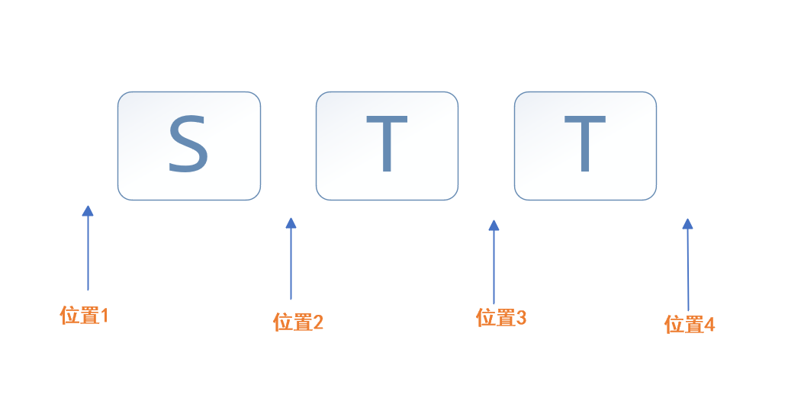

[[toc]]

### 位置特性

正则表达式要目匹配字符，要么匹配位置。匹配位置的正则`^`、`$`、`\b`、`\B`、`(?=p)`、`(?!p)`



## 1.边界`^`、`$` 

```javascript
let result="stt".replace(/^|$/g,"#")

console.log(result)//#stt#*
```


## 2.单词边界

#### 单词字符（Word Character）

- **`\w`**：表示任何单词字符，等价于 `[A-Za-z0-9_]`。即字母、数字和下划线。
- **非单词字符**：所有其他字符，包括空格、标点符号和其他特殊字符。

#### 单词边界（Word Boundary）

单词边界是指单词字符`\w`和`非单词字符`之间的转换点，或者字符串的开始或结束位置。具体来说：

- 在一个`单词字符\w`之前和一个`非单词字符`之后的位置；
- 在一个`非单词字符`之前和一个`单词字符`之后的位置；
- 字符串的起始位置，如果它是一个单词字符；
- 字符串的结束位置，如果它是一个单词字符。


#### `\b`

- **`\b`**：匹配单词边界。它不消耗任何字符，只是检查当前位置是否位于单词字符和非单词字符之间。
- 例如，在字符串 `"hello world"` 中，`\b` 将会匹配 `hello` 和 `world` 的前后位置，因为这些地方是单词字符与空格（非单词字符）的交界处。


#### `\B`

- **\B**：匹配非单词边界。与 `\b` 相反，它匹配的是那些不在单词边界的任何位置。
- 换句话说，`\B` 匹配的位置是在两个单词字符之间或两个非单词字符之间，也包括字符串的开头和结尾如果不是单词边界的情况下。

```js
let result="'stt' is  a 123years old boy!".replace(/\b/g,"#");

console.log(result);

\b :  '#stt#' #is#  #a# #123years# #old# #boy#!
\B :   #'s#t#t'# i#s # a 1#2#3#y#e#a#r#s o#l#d b#o#y!#
```

## 3.断言

```js
(?=p)、(?!p) ：断言  

stt(?=t)  s位置t位置t

(?=\d{3})    :匹配一个位置，后面是连续的3个数字
```

