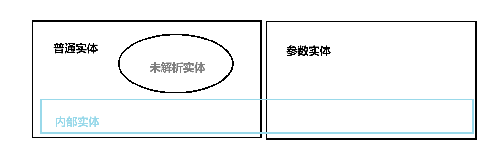

[[toc]]



:::important

> 如果一个实体是普通实体，那这个实体一定不是参数实体。而普通实体和参数实体都可能是内部实体，也可能是外部实体。如果一个实体不是内部实体则一定是外部实体。只有当实体是外部普通实体是，该实体才有可能是未解析的，换而言之，一个实体如果是内部实体，则该实体一定是已解析实体。如果一个实体是参数实体，则该实体一定是已解析实体。

:::

若果一个实体是未解析实体，那它一定不是一个参数实体。以上可组合成多种实体，实际xml常用5种：

- 普通内部解析
- 普通外部解析
- 普通外部未解析
- 参数内部解析
- 参数外部解析

## 普通内部解析实体

- 实体定义：

```
<!ENTITY 实体名称 "实体的值"/?>
```

- 实体引用由三部分构成：一个和号(&)，一个实体名称，以及一个分号(；)。

实例1

```xml
<?xml version="1.0" encoding="UTF-8"?>
<!DOCTYPE author[
    <!ELEMENT author (#PCDATA)>
    <!ENTITY writer "STT">
    <!ENTITY copyright "sttgood">
]>
<author>&writer;&copyright;</author>

```

实例2

```xml
<?xml version="1.0"encoding="utf-8"?>
<!DOCTYPE root[
<!ELEMENT root (shop)+>

<!ELEMENT shop (name,address,size,pic*,remark?)>
<!ELEMENT name (#PCDATA)>
<!ELEMENT address (#PCDATA)>
<!ELEMENT size (#PCDATA)>

<!ELEMENT pic (#PCDATA)>
<!ELEMENT remark (#PCDATA)>

<!ENTITY big "旗舰店">
<!ENTITY medium "中等">
<!ENTITY small "小型">
]>
<root>
    <shop>
        <name>物美</name>
        <address>文-路</address>
        <size>&big;</size>
    </shop>
</root>

```

## 普通外部解析实体

```xml
<?xml version="1.0" encoding="utf-8"?>
<!DOCTYPE root[
<!ELEMENT root (shop)+>
<!ELEMENT shop (name,address,size,pic*,remark?)>
<!ELEMENT name (#PCDATA)>
<!ELEMENT address (#PCDATA)>
<!ELEMENT size (#PCDATA)>
<!ELEMENT pic (#PCDATA)>
<!ELEMENT remark (#PCDATA)>

<!ENTITY big "旗脱店">
<!ENTITY medium "中等">
<!ENTITY small "小型">
<!ENTITY othersize SYSTEM "othersize.txt">
]>

<root>
    <shop>
        <name>物美</name>
        <address>文一路</address>
        <size>&big;</size>
    </shop>
    <shop>
        <name>联华</name>
        <address>文二路</address>
        <size>&othersize;</size>
    </shop>
</root>
```

othersize.txt

```
车载书店
```

## 普通外部未解析实体

普通外部未解析实体只能在外部DTD中定义，该实体只能由定义为ENTITY或ENTITIES类型的属性引用。当引用外部未解析实体时，定义为ENTITY或ENTITIES类型的属性值为实体名称。

通用外部未解析实体与其他的类型很相似，区别是XML处理器**不会去尝试**分析实体的的信息。

```
<!ENTITY 实体名 SYSTEM  二进制数据位置 NDATA 标记名称>
```

```
<!NOTATION 标记名 SYSTEM 标记描述文字>
```

标记描述文字可以是：

- 处理现实二进制数据的应用程序

- 描述格式的网络文件

- 普通的一设描述性语言

```xml
<?xml version="1.0" encoding="UTF-8"?>
<!DOCTYPE root[
<!ELEMENT root (shop)+>
<!ELEMENT shop (name,address)>
<!ELEMENT name (#PCDATA)>
<!ELEMENT address (#PCDATA)>
<!ELEMENT size (#PCDATA)>
<!ENTITY pic1 SYSTEM "pic1.jpg" NDATA msp>
<!ENTITY pic2 SYSTEM "pic2.jpg" NDATA msp>
<!ENTITY pic3 SYSTEM "pic3.jpg" NDATA msp>
<!NOTATION msp SYSTEM "abcd.exe">
<!ATTLIST address bgImage  ENTITY #REQUIRED
                  bgImages ENTITIES #REQUIRED>
]>
```

```xml
<?xml version="1.0" encoding="UTF-8"?>
<!DOCTYPE root SYSTEM "outerunparseentity.dtd">
<root>
    <shop>
        <name>新华书店</name>
        <address bgImage="pic1" bgImages="pic2 pic3">向阳路</address>
    </shop>
</root>
```

注意：普通实体只能在XML文档中应用，如果要在DTD中使用实体必须使用参数实体。

## 参数内部解析实体

**定义：**

```
<!ENTITY % 参数实体名称 "实体内容">
```

- 参数名称必须唯一
- 实体内容是所要表达的文本内容

**引用：**

```
% 实体名称
```

```xml
<?xml version="1.0" encoding="utf-8"?>

<!DOCTYPE root[
<!ENTITY  % shopattr "

<!ELEMENT name (#PCDATA)>
<!ELEMENT address (#PCDATA)>
<!ELEMENT size (#PCDATA)>
<!ELEMENT pic (#PCDATA)>
<!ELEMENT remark (#PCDATA)>">
<!ELEMENT root (shop)+>
<!ELEMENT shop (name,address,size)>
%shopattr;
]>
<root>
    <shop>
        <name>新华书店</name>
        <address>向阳路</address>
        <size>旗舰店</size>
    </shop>
</root>
```

## 参数外部解析实体

由于使用了外部文件，可以实现对DTD文件的复用。

**定义：**

```
<!ENTITY % 参数实体名称 SYSTEM "URI/URL">
```

**引用：**

```
% 实体名称
```

A.dtd

```dtd
<?xml version="1.0" encoding="UTF-8"?>
<!ELEMENT A (NAME_A)>
<!ELEMENT NAME_A (#PCDATA)>
```

B.dtd

```dtd
<?xml version="1.0" encoding="UTF-8"?>
<!ELEMENT B (NAME_B)>
<!ELEMENT NAME_B (#PCDATA)>
```

主体文件

```xml
<?xml version="1.0" encoding="UTF-8"?>
<!DOCTYPE ROOT [
<!ELEMENT ROOT (A|B)*>
<!ENTITY % A_atrr SYSTEM "A.dtd">
<!ENTITY % B_atrr SYSTEM "B.dtd">

%A_atrr;
%B_atrr;
]>

<ROOT>
    <A>
        <NAME_A>I am A!</NAME_A>
    </A>

    <B>
        <NAME_B>I am B;</NAME_B>
    </B>
</ROOT>
```
