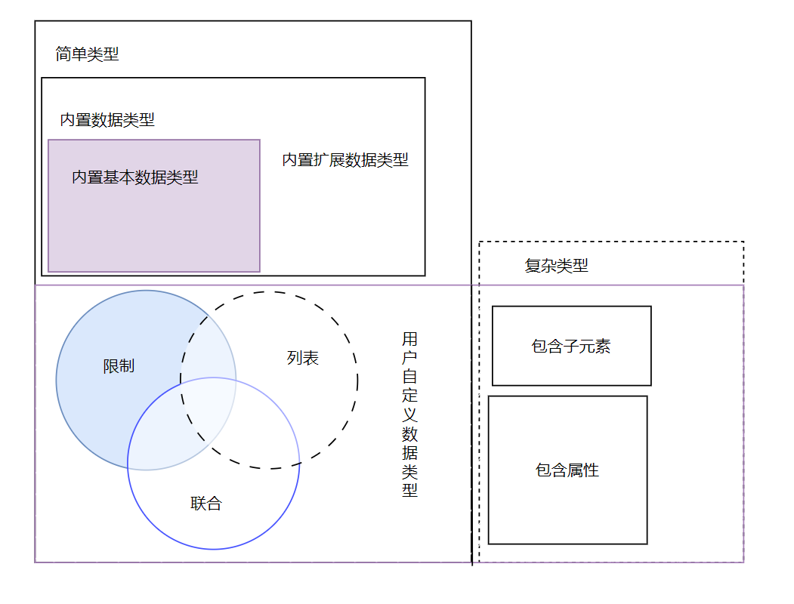

Schema数据类型可以根据元素内容划分为简单类型和复杂类型。

1. 简单类型：不包括子元素也不包括属性

2. 复杂类型：包括子元素或属性，或两者都包括。

Schema允许用户根据实际需要扩展数据类型。因此，按照扩展方式数据类型分为；

1. 内置数据类型：指Schema规范中已经定义好的类型，用户可以直接使用，所有内置类型都是简单类型(用户自定义数据类型则需要用户在使用之前先定义好数据类型才使用，以适应较为复杂的应用场合)。内置数据类型又细分为：

   1. 内置基本数据类型

   2. 内置扩展数据类型 在内置基本数据类型的基础上扩展得到的。

2. 用户自定义数据类型：

   1. 自定义基本数据类型 通过限制、列表、联合得到

   2. 自定义复杂数据类型

