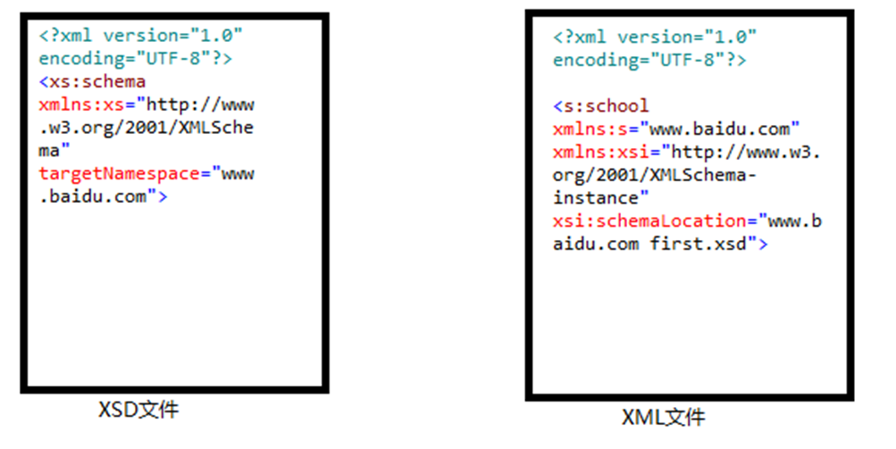

XML引入XML schema时根据XML文档的元素是否属于某个特定的命名空间，分为两种引入方式。

## 无命名空间

- XML文档不属于某个特定的空间按`xsi:noNamespaceSchemaLocation`引入

```xml
<?xml version="1.0" encoding="UTF-8"?>
<school xmlns:xsi="http://www.w3.org/2001/XMLSchema-instance" xsi:noNamespaceSchemaLocation="first.xsd">
    <name>stt</name>
    <major>java</major>
</school>
```


```xml
 
<?xml version="1.0" encoding="UTF-8"?>
<xs:schema xmlns:xs="http://www.w3.org/2001/XMLSchema">
    <xs:element name="college">
        <xs:complexType>
            <xs:sequence>
                <xs:element name="name" type="xs:string"/>
                <xs:element name="majro" type="xs:string" minOccurs="1",maxOccurs="unbounded"/>
            </xs:sequence>
        </xs:complexType>
    </xs:element>
</xs:schema>
xml
```

## 有命名空间

- XML文档属于某个特定的空间按`xsi:schemaLocation`引入


### xml文件结构

```xml
<根元素名称   [xmlns: 命名空间别名="命名空间URI"]+   xmlns:xsi="http://www.w3.org/2001/XMLSchema-instance"  xsi:schemaLocation="[命名空间URI  Schema文件路径]+">
```

其中xsi：schemaLocation="" 可以引入多个schema文件。每一个文件都需要一个命名空间URI和Schema文件路径，多个用空格分开。

```xml
<?xml version="1.0" encoding="UTF-8"?>
<s:school xmlns:s="https://www.baidu.com" xmlns:xsi="http://www.w3.org/2001/XMLSchema-instance" xsi:SchemaLocation="https://www.baidu.com first.xsd">
    <s:name>stt</s:name>
    <s:major>java</s:major>
</s:school>
```

由于`[xmlns:命名空间别名="命名空间URI"]`方式引入的Schema文件需要约束与特定的命名空间的元素，因此需要声明相应的命名空间。当前属性值的命名空间URI与`xsi:SchemaLocation`属性值中的命名空间必须要要保持一一对应。别名自定义，但是必须保持别名唯一。

### schema文件结构

注意：当一追个schema文件用于约束XML文件中属于任何特定命名空间的元素时，该schema文件所定义的元素需要与被约束的XML文件中元素的命名空间一致。



```xml
<?xml version="1.0" encoding="UTF-8"?>
<xs:schema xmlns:xs="http://www.w3.org/2001/XMLSchema" 
targetNamespace="https://www.baidu.com" xmlns:c="https://www.baidu.com">
    <xs:element name="college">
        <xs:complexType>
            <xs:sequence>
                <xs:element name="name" type="xs:string"/>
                <xs:element name="majro" type="xs:string" minOccurs="1",maxOccurs="unbounded"/>
            </xs:sequence>
        </xs:complexType>
    </xs:element>
    <xs:element name="name" type="xs:string"></xs:element>
    <xs:element name="major" type="xs:string"></xs:element>
</xs:schema>
```

targetNamespace属性是目标命名空间，说明Schema定义的元素来自次命名空间URI。也可以理解为理解为引入这个Schema进行有效性验证的XML的元素应该使用该命名空间。

## targetnamespace详解

- 在 XML Schema 中，`targetNamespace`是一个非常重要的属性。它用于指定由该 Schema 定义的元素和类型所属的命名空间（Namespace）。命名空间是一种机制，用于在 XML 文档中区分不同来源或用途的元素和类型，避免名称冲突。

- `targetNamespace`是在`schema`元素中定义的，

  ```xml
  <xsd:schema xmlns:xsd="http://www.w3.org/2001/XMLSchema" targetNamespace="http://example.com/ns">
  ```

  这里`http://example.com/ns`就是`targetNamespace`的值，它定义了该 Schema 中所有全局元素（Global Elements）和全局类型（Global Types）所属的命名空间。

**作用和重要性**

- 避免名称冲突：
  - `targetNamespace`的主要作用是确保不同的 Schema 可以定义相同名称的元素和类型，只要它们属于不同的命名空间。例如，一个公司内部的不同部门可能都定义了名为`document`的元素，但它们的结构和用途不同。通过将这些元素放在不同的命名空间（通过`targetNamespace`来区分），可以在同一个 XML 文档中使用这些不同的`document`元素，而不会产生混淆。
- 模块性和复用性：
  - 它使得 Schema 具有更好的模块性和复用性。可以将一组相关的元素和类型定义在一个具有特定`targetNamespace`的 Schema 中，然后在其他 XML 文档或者 Schema 中方便地引用这个模块。例如，一个行业组织可以定义一个通用的产品信息 Schema，将产品相关的元素和类型放在一个命名空间下，各个企业可以在自己的 XML 文档中引用这个 Schema 来描述产品信息，并且可以与其他企业的产品信息进行整合，只要遵循相同的命名空间和 Schema 定义。
