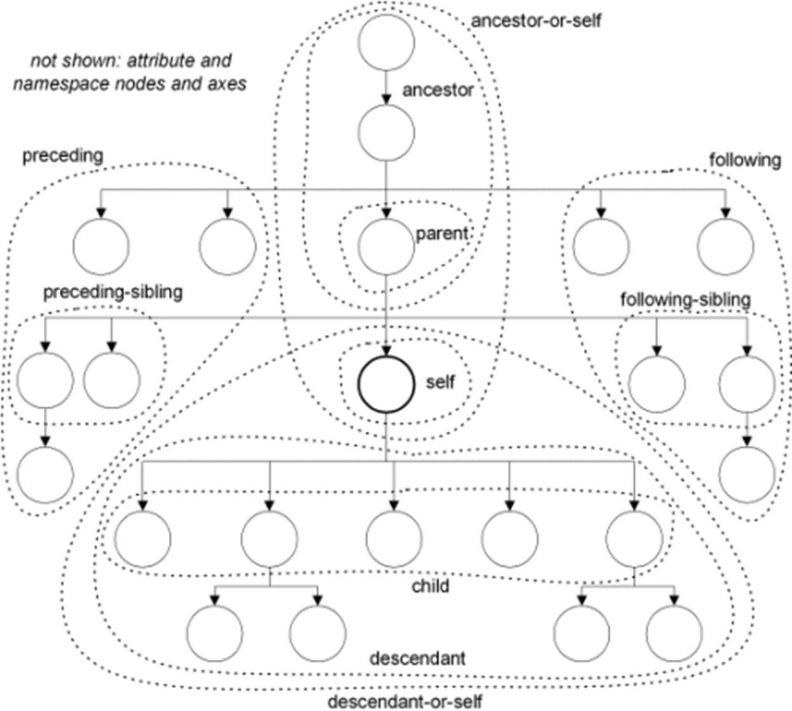

## 轴7+6

​    在一个定位路径中，轴是一种相互关系，是定位步长本身与**上下文节点**之间的关系。轴一般不单独使用。

```xml
 <xsl:template math="/root"/>
```

| **轴名称**             | **缩写**             | **含义**                           |
| ---------------------- | -------------------- | ---------------------------------- |
| **ancestor-or-self**   |                      | self和他所有的上层节点             |
| **ancestor**           |                      | self上一层或更多层节点             |
| **parent**             | `parent::`或 `..`    | self的父节点                       |
| **self**               | `self::`或    `.`    | 上下文节点本身                     |
| **child**              | `chid::`或`直接省略` | self的子节点。定位步长**默认**     |
| **descendant**         |                      | self以下的一层或者更多层的所有节点 |
| **descendant-or-self** | `//`                 | self和他所有的后代节点             |

| **preceding**         |                    | 文档顺序中self之前的节点                       |
| --------------------- | ------------------ | ---------------------------------------------- |
| **preceding-or-self** |                    | 文档顺序中self同一层次向前的节点，并共享父节点 |
| **following**         |                    | 文档顺序中self后面的节点                       |
| **following-sibling** |                    | 文档顺序中self同一层次向后的节点，并共享父节点 |
| **attribute**         | `attribute::`或`@` | 包含self的所有属性节点  @属性名  或 @value     |
| **namespace**         |                    | 包含self的所有命名空间节点                     |


