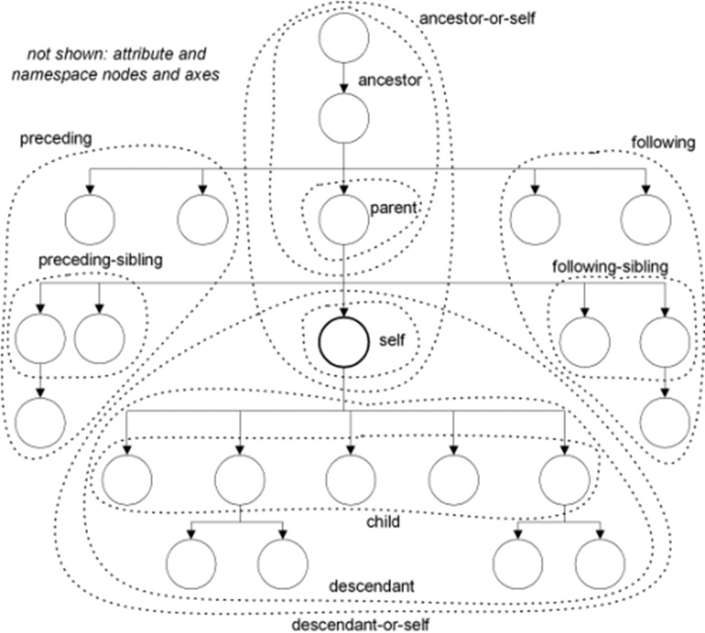

```xml
轴::节点测试[限定谓语]

eg：child::id[text()=100]
```

 

**轴      ：**用与定义**当前节点**和**所选节点**的关系

**节点测试 ：**用与指定**轴内部**的部分节点。

**限定谓语 ：**0个1个或者1个以上的**判断语句**。进行匹配。

 

 

```xml
<xsl:tmplate math="/root" />     当前节点设置为root即self轴

<xsl:value-of select"="Xpath路径" />  显示XPath搜索到的结点集。
```



 

 

### 1.轴7+6

```xml
 <xsl:template math=”/root”/>
```

​     在一个定位路径中，轴是一种相互关系，是定位步长本身与**上下文节点**之间的关系。轴一般不单独使用。

| **轴名称**             | **缩写**          | **含义**                           |
| ---------------------- | ----------------- | ---------------------------------- |
| **ancestor-or-self**   |                   | self和他所有的上层节点             |
| **ancestor**           |                   | self上一层或更多层节点             |
| **parent**             | parent::或 **..** | self的父节点                       |
| **self**               | self::或    **.** | 上下文节点本身                     |
| **child**              | chid:: 直接省略   | self的子节点。定位步长**默认**     |
| **descendant**         |                   | self以下的一层或者更多层的所有节点 |
| **descendant-or-self** | **//**            | self和他所有的后代节点             |

 

| **preceding**         |                | **文档顺序中self之前的节点**                   |
| --------------------- | -------------- | ---------------------------------------------- |
| **preceding-or-self** |                | 文档顺序中self同一层次向前的节点，并共享父节点 |
| **following**         |                | 文档顺序中self后面的节点                       |
| **following-sibling** |                | 文档顺序中self同一层次向后的节点，并共享父节点 |
| **attribute**         | attribute::或@ | 包含self的所有属性节点  @属性名  或 @value     |
| **namespace**         |                | 包含self的所有命名空间节点                     |

### 2.节点测试5个

​        Xpath中，节点测试是对轴的刷选的结果集做**下一步过滤**。

元素名称，元素类型，元素内容，处理指令，注释

| **名称**                | **含义**                                               |
| ----------------------- | ------------------------------------------------------ |
| **nodename**            | 从指定轴匹配的所有节点集中选出**名称**为nodename的节点 |
| **node()**              | 选择与指定轴匹配的所有**类型**的节点                   |
| **text()**              | 选择与指定轴匹配的所有**文本类型**的节点               |
| **comment**             | 选择与指定轴匹配的所有**注释**节点                     |
| **process-instruction** | 选择与指定轴匹配的所有注释处理指令节点                 |
| *****                   | **通配符**，不对轴进行任何过滤                         |

### 3.谓词

谓词本身是一个**布尔表达式**

```xml
[position=1]      简化  [1]       xpath的索引从1开始 

 

<!--谓词筛选所有节点等于100的集合-->

一个谓词：<xsl:value-of select="root/*[text()=100]"></xsl:value-of><p/>

 

<!--多个谓词筛选100或者102-->

多个谓词：<xsl:value-of select="root/*[text()=100 or text()=102]"></xsl:value-of><p/>

 

简化路径：

root:<xsl:value-of select="root" /><p/>

 

<!--简化<xsl:value-of select="child::node()/root"/>-->

./root:<xsl:value-of select="./root"/><p/>

 

root/..:<xsl:value-of select="root/.."/><p/>

//id:<xsl:value-of select="//id"/>
```

