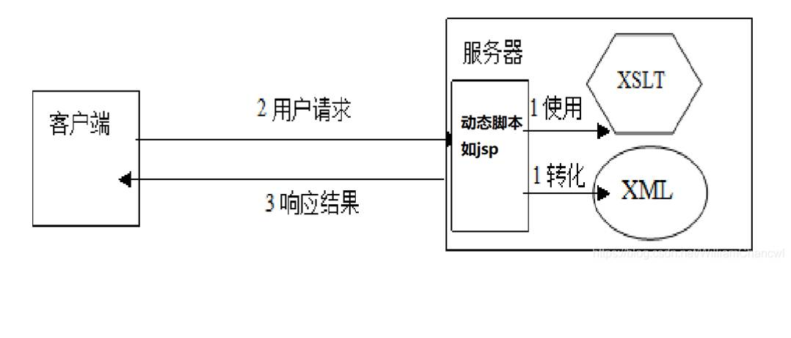
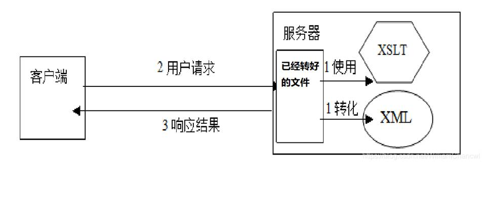
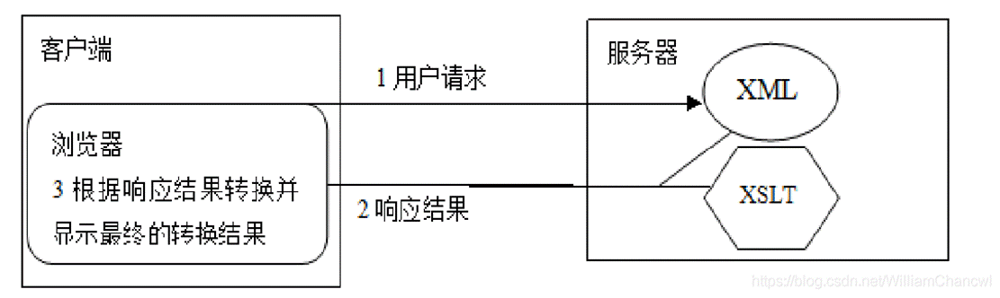

## XSLT概述

可扩展样式表语言XSL由W3C指定的。XSL是通过XML进行定义的，遵循XML的语法规则，可以说XSL本身就是一个XML文档。类似于样式表CSS对HTML的作用，XSL被称为XML的样式表。XSL由XSLT、XPath和XSL-FO 3个分部组成。

`XSLT`它是eXtensible Stylesheet Language Transformation称为可扩展样式表语言转换。XSLT的作用是将一个XML文档转换为另一种类别的文档，包括HTML、XML等类型。 

`XPath`是指定访问XML数据的寻址路径方式。

`XSL-FO` XSL Formattiong Objects的作用是XML的数据进行排版，以显示这些设计美观的的版面，满足打印的要求。


## XML引入XSLT的方式

```xml
<?xml-stylesheet href="mulid.xslt" type="text/xsl"?>
```

## XSLT转换模式

### 服务器端转换模式

#### （1）实时转换

在后端由服务区中的xslt转为xml为通常是html，让回传到浏览器

常见服务区端工具：Saxon，Xalan，微软的msxsl.exe以及自带的XMLSpy工具



借助动态脚本语言，如jsp，适用于**变化频率较高**的情况。效率低。

#### （2）批量转换，

批量根据xslt转换xml为html当需要时，传到浏览器，**适用于不经常变化**的情况。

 



### 客户端转换模式

将XML和XSLT文件都传给客户端，由浏览器进行实时转换。



## xslt文档结构

xslt本身也是xml文件，他的根元素可以使`<stylesheet>`或者`<transform>`使用任何一个都是可以的。

```xml
<stylesheet>
<xsl:stylesheet version="2.0" id="id" xmlns:xsl="http://www.w3.org/1999/XSL/Transform" xmlns:fo="http://www.w3.org/1999/XSL/Format" xmlns:xs="http://www.w3.org/2001/XMLSchema" xmlns:fn="http://www.w3.org/2005/xpath-functions">
</xsl:stylesheet>
```


```xml
<transform>
<xsl:transform version="2.0" id=“id”
xmlns:xsl="http://www.w3.org/1999/XSL/Transform" xmlns:fo="http://www.w3.org/1999/XSL/Format" xmlns:xs="http://www.w3.org/2001/XMLSchema" xmlns:fn="http://www.w3.org/2005/xpath-functions">
</xsl:transform>
```

## 常见XSLT元素

| xslt元素                | **说明**                                     |
| ----------------------- | -------------------------------------------- |
| **xsl:output**          | 控制输出文档类型和格式HTML，XML，Text，XHTML |
| **xsl:template**        | 构建模板                                     |
| **xsl:apply-templates** | 调用其他模板                                 |
| **xsl:call-templates**  | 调用函数                                     |
| **xsl:value-of**        | 取出所选择的ml属性或内容                     |
| **xsl:element**         | 创建xml元素                                  |
| **xsl:attribute**       | 创建属性                                     |
| **xsl:comment**         | 创建注释                                     |
| **xsl:for-each**        | 遍历                                         |
| **xsl:if**              | 判断                                         |
| **xsl:choose**          | 分支                                         |
| **xsl:when**            | 分支                                         |
| **xsl:otherwise**       | 分支                                         |
| **xsl:copy**            | 复制当前节点                                 |
| **xsl:sort**            | 排序输出                                     |
